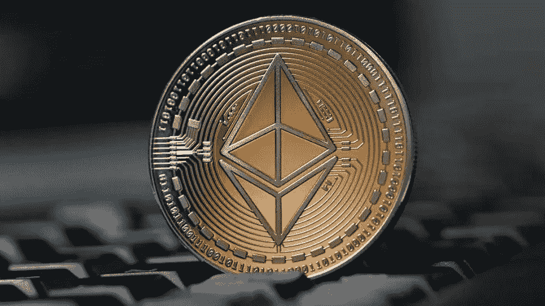
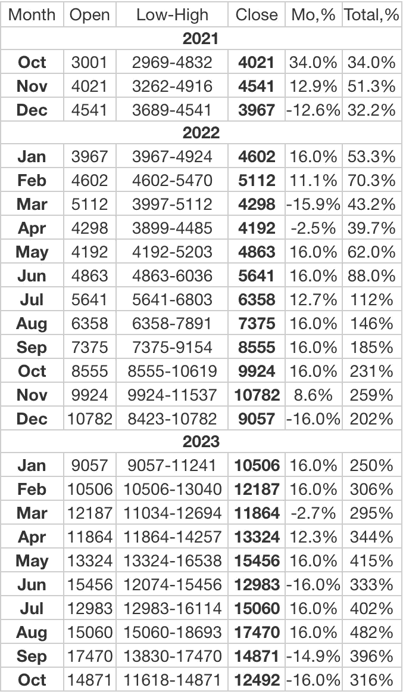
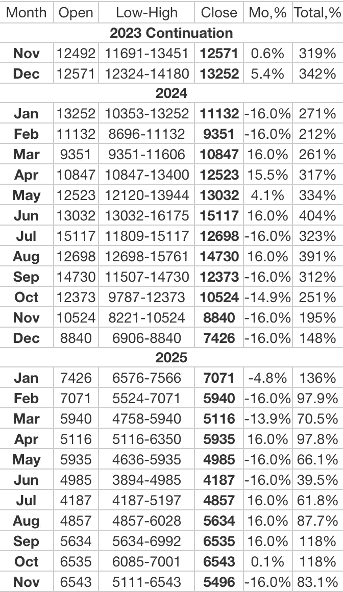

# 忘了比特币吧。购买以太坊

> 原文：<https://medium.com/coinmonks/forget-about-bitcoin-buy-ethereum-d5f633e52c2c?source=collection_archive---------1----------------------->

## 为什么以太坊将长期战胜比特币

[www.epravda.com.ua](https://www.epravda.com.ua/rus/news/2021/05/4/673591/)

# 以太坊价格历史——2021 年至今的故事

如果你想买以太坊，了解什么是数字货币以及价格如何到达当前点是一个好主意。研究这些因素被称为“尽职调查”，在投资过程中至关重要。首先，我将检查以太坊是什么以提供一个广泛的概述，之后我将深入当前以太坊的价格以进行进一步的分析。

首先要注意的是，以太坊(ETH)本身并不是真正的“货币”——事实上，以太坊是一个可以使用以太货币的区块链平台。这可能看起来令人困惑，但大多数时候，这两个术语可以互换使用。以太坊的想法是 Vitalik Buterin 在 2013 年提出的，该平台于 2015 年正式推出。

人们选择投资以太坊而不是[购买比特币](https://www.economywatch.com/cryptocurrency/buy-bitcoin)的原因是因为以太坊的实际用途。该平台允许运行分散的应用程序(dApps ),这提供了进行各种服务的更安全和更匿名的方式。这些 dApps 在分散金融(DeFi)项目中越来越受欢迎，这有助于消除对银行和经纪人等中介的需求。

> 订阅 [**Coinmonks 交易 Youtube 频道**](https://www.youtube.com/channel/UC8Cx_ZS0joebu12YiphyACA/videos) 了解交易和投资。

多年来，随着越来越多的人意识到以太坊平台的潜力，以太坊得到了巨大的发展。然而，ETH price 真正开始腾飞是在 2021 年初，当时围绕 crypto 的炒作达到了白热化。从年初到 2021 年 2 月中旬，以太坊的价格上涨了 166%！

然而，以太坊价格随后暴跌，并持续到 2021 年 3 月下旬，当时以太坊开始了牛市，上涨 180%，达到 4381 美元的历史高点。这意味着自 2021 年初以来增长了 496%。在这一点上，市场分析师乐观地认为以太坊可以走得更远，然而事实并非如此。

以太坊的价格在 2021 年 5 月下降了 60%左右，这实际上并不是因为与它们直接相关的因素。加密市场受到中国加密法规的严重影响，该法规禁止金融和支付公司提供加密服务。这对加密生态系统是一个巨大的冲击，并促使大多数主要的替代硬币大幅下降。

这种下跌一直持续到 2021 年 7 月，当时以太坊开始显示出一些短期内的看涨势头。在 7 月和 8 月期间，价格上涨了约 86%，突显出这种加密资产所显示出的令人难以置信的积极势头。在撰写本文时，以太坊的价格没有停止的迹象，这促使许多人认为，历史高点可能会再次达到。

# 以太坊 2025 年价格预测—长期展望

以太坊的长期预测非常乐观。如果你想知道如何购买加密货币，并考虑投资以太坊，那么现在可能是将这种硬币加入你的投资组合的好时机。市场的发展势头，加上以太坊坚实的使用案例，使这种加密成为未来最令人兴奋的选择之一。

与比特币不同，以太坊有可以帮助世界各地行业的用例。由于以太坊平台的性质，传言主要公司正在考虑与这种加密货币合作。Consensys.net 最近报道称，摩根大通将使用以太坊作为他们自己的数字令牌，这极大地提高了以太坊的可信度。

此外，以太坊可以促成的智能合约(这是 dApps 的重要组成部分)正在促使更多投资者倾向于以太坊，而不是 XRP、卡尔达诺、莱特币或 Dogecoin 等替代品。最后，以太坊 2.0 据传将很快发布，这将极大地提高交易速度。

考虑到这几点，我们的以太坊价格预测 2025 估计这枚硬币将价值 10，000 美元。虽然这似乎是一个巨大的数字，但以太坊的潜力使这枚硬币从许多其他竞争对手中脱颖而出。我觉得以太坊平台在它的能力方面只是触及了表面，它可能会取代比特币成为未来最有价值的货币。

# Longforecast.com 预言

longforecast.com

# 支持我

BTC 钱包:bc1q 078 vwjaf 76 jj 7 vnjte 23 ehkksr 09 tnyy 2 njrqg

ETH 钱包:0x4e 07987 e7bd 858695603 B2 cc 0 dcfa 36 B4 BF 540 a 0

> 加入 Coinmonks [电报频道](https://t.me/coincodecap)和 [Youtube 频道](https://www.youtube.com/c/coinmonks/videos)了解加密交易和投资

*   [尤霍德勒 vs 科恩洛 vs 霍德诺特](/coinmonks/youhodler-vs-coinloan-vs-hodlnaut-b1050acde55a) | [Cryptohopper vs 哈斯博特](https://blog.coincodecap.com/cryptohopper-vs-haasbot)
*   [顶级付费加密货币和区块链课程](https://blog.coincodecap.com/blockchain-courses) | [币安评论](/coinmonks/binance-review-ee10d3bf3b6e)
*   [MXC 交易所评论](/coinmonks/mxc-exchange-review-3af0ec1cba8c) | [Pionex vs 币安](https://blog.coincodecap.com/pionex-vs-binance) | [Pionex 套利机器人](https://blog.coincodecap.com/pionex-arbitrage-bot)
*   [如何在印度购买比特币？](/coinmonks/buy-bitcoin-in-india-feb50ddfef94) | [WazirX 审核](/coinmonks/wazirx-review-5c811b074f5b) | [BitMEX 审核](https://blog.coincodecap.com/bitmex-review)
*   [印度的加密交易所](/coinmonks/bitcoin-exchange-in-india-7f1fe79715c9) | [比特币储蓄账户](/coinmonks/bitcoin-savings-account-e65b13f92451)
*   [币安费用](/coinmonks/binance-fees-8588ec17965) | [僵尸加密审查](/coinmonks/botcrypto-review-2021-build-your-own-trading-bot-coincodecap-6b8332d736c7) | [热点审查](/coinmonks/hotbit-review-cd5bec41dafb)
*   [我的密码交易经验](/coinmonks/my-experience-with-crypto-copy-trading-d6feb2ce3ac5) | [AAX 交易所评论](/coinmonks/aax-exchange-review-2021-67c5ea09330c)
*   [逐位融资融券交易](/coinmonks/bybit-margin-trading-e5071676244e) | [币安融资融券交易](/coinmonks/binance-margin-trading-c9eb5e9d2116) | [超位审核](/coinmonks/overbit-review-9446ed4f2188)
*   [有哪些交易信号？](https://blog.coincodecap.com/trading-signal) | [比特斯坦普 vs 比特币基地](https://blog.coincodecap.com/bitstamp-coinbase)
*   [ProfitFarmers 点评](https://blog.coincodecap.com/profitfarmers-review) | [如何使用 Cornix 交易机器人](https://blog.coincodecap.com/cornix-trading-bot)
*   [如何匿名购买比特币](https://blog.coincodecap.com/buy-bitcoin-anonymously) | [比特币现金钱包](https://blog.coincodecap.com/bitcoin-cash-wallets)