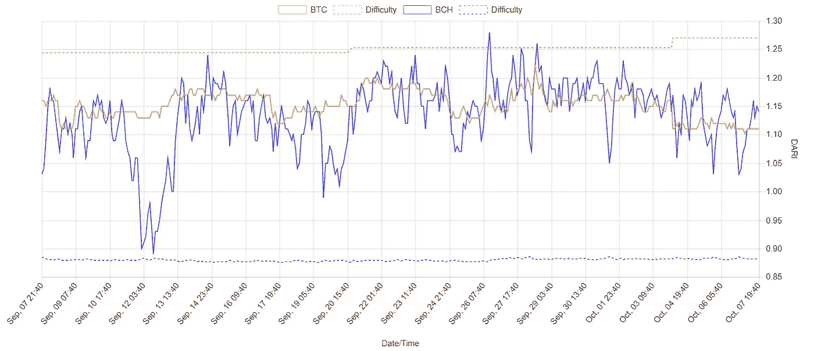

# 分叉——一种社区治理机制

> 原文：<https://medium.com/coinmonks/forking-a-mechanism-for-community-governance-dc6cc300c29a?source=collection_archive---------3----------------------->

比特币诞生时，随之而来的是区块链叉的概念。区块链治理的第一种形式，也是在比特币社区建立共识的一种方式。比特币没有使用任何花哨的手段来进行治理，而是让社区来达成共识和管理冲突，就像他们在现实世界中每天做的一样。矿工们利用他们的散列能力在网络上寻找最符合他们自身利益的区块。这些利益通常是经济利益，但也可能是政治利益或其他利益。自利是经济学的驱动力。

> “我们并不是出于屠夫、酿酒商或面包师的仁慈，而是考虑到他们自己的利益。我们不是针对他们的人性，而是针对他们的自爱，我们从来不跟他们谈论我们自己的需要，而是他们的优点。除了乞丐，没有人选择主要依靠他的同胞的仁慈。”
> 
> —亚当·斯密，现代经济学之父

如果矿工对比特币的路线图有不同意见，采矿社区可以分裂并创建新的软件实现，有效地改变定义有效区块的共识规则。当节点运行具有冲突共识规则的实现时，它可以将区块链分叉成两个或更多链。比特币(BTC)和比特币现金(BCH)实现是 2017 年 8 月 1 日分叉比特币的著名例子，创建了两种独立的加密货币，具有独特的区块链，每种货币从第一个创世纪块到分叉时都有相同的历史。这一天，比特币现金开始接受大于 1mb 的块，比特币通过添加 [SegWit](https://en.wikipedia.org/wiki/SegWit) 改变了其区块链结构。这些规则发生了分歧，不再兼容。分叉是一种管理规则的方式，有时脱离多数提供了一条替代路径，而不是接受新的一致规则变化。它给予矿商和用户选择的自由，以及抵制审查的能力。

政府政治是一个很好的类比。有时候，脱离并创造一个新的法律和价值观体系要比导航并克服从内部改变现有体系的冲突更容易。1776 年的《独立宣言》就是一个很好的例子，当时 13 个美国殖民地切断了与英国的政治联系，给予他们不受干涉的自治权。

# 语音和退出

为了进一步理解路线图的分歧，我想强调发言权和退出的概念。下面是 Earn.com 前首席执行官、比特币基地现任首席技术官 Balaji Srinivasan 关于这个主题的精彩视频。

[巴拉吉·斯里尼瓦桑在 2013 年创业学校——YouTube](https://www.youtube.com/watch?v=cOubCHLXT6A)

# 我们具体要定义什么？

深入下去，你可以进一步定义什么是比特币，将其分解成不同的组成部分，以了解在分叉过程中每个部分会发生什么。

**1)品牌成分**

加密品牌可以被认为是一种产品、群体身份甚至是技术的形象。一种加密货币要想成功并流行起来，就需要一个与众不同的品牌。如果社区内部对用例或技术应该如何发展有不同意见，新的品牌和实现可以出现来满足需求。如果差异变得太大或者兴趣分歧太大，这些团队倾向于通过分叉原始软件实现代码库来创建他们自己的杰出社区，并开发他们自己的具有独特共识规则的替代实现。

**2)客户实施和共识规则组件**

规定哪些区块被接受并附加到区块链的共识规则嵌入在软件实现中，基于矿工的财务和/或个人兴趣来选择。如果多个具有冲突共识规则的客户端实现在同一个网络上，则竞争的实现可以创建两个或多个并行运行的区块链分叉，它们具有自己的共识规则集。

**3)不可变的区块链分量**

使用的区块链是另一个要定义的组件。我提出这个问题是因为如果你关注这些交流渠道或论坛，你有时会看到关于哪个比特币是真正的比特币的争论。如果有人可能使用比特币现金不是比特币的论点，他们仍然在技术上分享相同的创世块，相同的历史和共识规则，直到分叉的时候。在这里，品牌、代码库和软件实现通常被用来识别*最初的比特币区块链*，即使它们都符合这个标准。

**4)路线图/白皮书组件**

加密货币有时会偏离其最初的路线图或白皮书规范。比特币就是一个很好的例子，也是比特币现金出现的原因。比特币现金的支持者认为，坚持最初的大块路线图很重要。最终结果是每个人都得到自己想要的比特币版本。如果你使用路线图/白皮书来定义什么是比特币，其他人可能不会以此作为他们定义的基础，这也是经常出现分歧的地方。

# 叉后估价

分叉发生后，市场能够通过允许人们在交易所交易加密货币来评估加密货币及其效用。在比特币和比特币现金分叉的情况下，两者之间的价格比似乎与支持每个分叉的哈希功率比成比例。这对于以太坊和以太坊经典也很明显，如下图所示。

Ethereum vs Ethereum Classic hash rate and price ratio comparison — vitalik.ca

如果使用量和交易量增加，价格也跟着上涨，可以带来更多的挖掘哈希力，寻求更大的利润。除此之外，比特币的价格和每天交易的平方有很强的相关性。这可以用[梅特卡夫定律](https://www.technologyreview.com/s/610614/how-network-theory-predicts-the-value-of-bitcoin/)进一步解释。

> 梅特卡夫定律指出**电信**网络的价值**与系统连接用户数量**的平方(n2)成正比。一个电话**网络**是说明梅特卡夫定律的绝佳例子。一部手机实际上只是一个叫做节点的网络中的一个端点。

在这里，连接的用户由交易的数量来表示，因为比特币是假名，所以目前没有办法在合理的确定性范围内明确说出哪些地址属于特定用户。尽管对于流行的大容量地址有一些例外。我们第一次能够实时监控资金的流动，并从经济角度观察梅特卡夫定律。

# 难度调整奖励指数

要想知道哪个竞争链更有利可图，你可以看看比特币和比特币现金的[难度调整奖励指数(DARI)](https://fork.lol/reward/dari/btc) 。追求利润的矿工能够在任何给定时间开采产生最大利润的链，这可以使用下面的公式计算。

**达里** = `**(block coinbase + fees in satoshis) / (block difficulty) * (exchange rate in USD)**`

Difficulty Adjusted Reward Index

# 我的硬币会怎么样？不要害怕叉子！

如果你拿着硬币，叉子出现了，不要担心。当这种情况发生时，通常是净收益。问题是你想用你新创造的财富做什么？你可以两个都留着，看看会发生什么，或者通过清算另一个来支持一个链条，如果你愿意的话。这就是终端用户如何影响分叉结果及其价值，如果他们不挖掘。在 forks 期间经常但不总是实施重放保护，以防止事务广播到多个区块链。如果您打算申请这些资金，最好在分叉后发送任何交易之前验证重放保护功能已启用。要做到这一点，你需要找到一个支持新分叉的加密货币的钱包。有时这不是一开始就有的，可能需要一些时间来发展。

# **比特币的诸多分叉**

# 硬分叉 vs 软分叉

硬分叉和软分叉之间的区别可能会变得非常复杂，但是在很高的层次上，您可以根据导致分叉的共识规则进行概括。

**硬叉**可以看作是放松规则。例如通过增加块大小或增加对令牌化资产的支持来增加事务吞吐量。在这一规则改变之后，老客户与新的共识规则不兼容。如果发生这种类型的升级，未升级的节点将分叉它们自己的区块链版本，因为它们拒绝由运行新的共识规则的节点广播的块。

**软分叉**增加了额外的规则，允许未升级节点的向后兼容性。当成功时，这不会像硬叉子一样分开区块链。节点通过软分叉自动选择加入。比特币实现 [SegWit](https://en.wikipedia.org/wiki/SegWit) 升级时就使用了这种方法。

Fork Venn Diagram — vitalik.ca

下面是一个比特币现金硬分叉的例子，成功达成共识增加了区块大小。

Bitcoin Cash Hard Fork increasing blocksize to 32mb — May 15, 2018

# 不成功的共识- Monero 抗 ASIC 分叉

叉子通常是在特殊情况下完成的。没有两把叉子是一样的。2018 年 4 月 6 日，Monero 分叉将 ASIC 矿工从网络中移除，保护 GPU 免受 ASIC 竞争，以实现更好的节点去中心化。不幸的是，这将一个社区分裂为五个不同的区块链和对路线图的各种不同意见。品牌形象无疑受到了损害。

Monero pre & post-fork

甚至一些技术问题也能促使社区达成共识，fork 扭转技术 bug 的不良结果，比如对 [DAO hack](/swlh/the-story-of-the-dao-its-history-and-consequences-71e6a8a551ee) 引起以太坊和以太坊经典 fork 的回应。很难推测这些原因在未来会是什么。但总的来说，分叉是一种变革的治理机制。

> [直接在您的收件箱中获得最佳软件交易](https://coincodecap.com/?utm_source=coinmonks)

