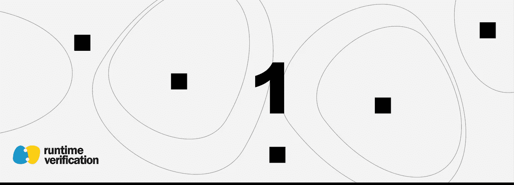
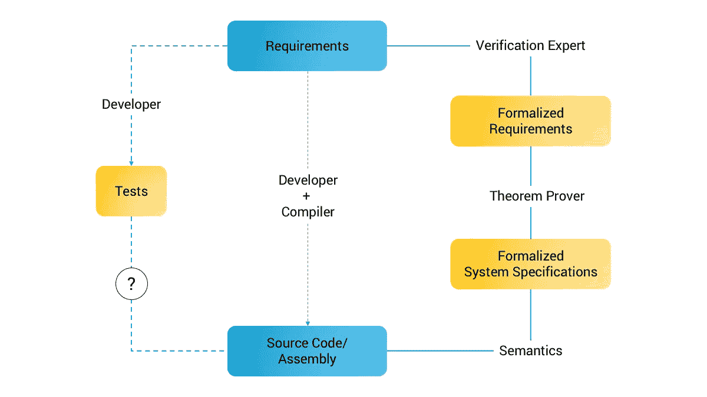

# 区块链系统和智能合约的形式验证 101

> 原文：<https://medium.com/coinmonks/formal-verification-101-for-blockchain-systems-and-smart-contracts-df6c566ec0bb?source=collection_archive---------0----------------------->

## 斯蒂芬·斯凯里克

区块链技术结合智能合约提供了诱人的前景:为金融、安全消息等具有严格安全要求的应用提供分布式、可信和可验证的计算平台。不幸的是，人们不需要很努力就能看到通往这一承诺的道路充满了危险，例如，参见关于 [Mt. Gox](https://en.wikipedia.org/wiki/Mt._Gox) 、 [DAO](https://en.wikipedia.org/wiki/The_DAO_(organization)) 、[这一对以太坊经典的攻击](https://www.coindesk.com/exchange-says-200k-in-ethereum-classic-lost-as-blockchain-attacks-continue)和[一个智能合同 bug](https://runtimeverification.com/blog/how-formal-verification-could-help-to-prevent-gridlock-bug/) 的文章。虽然区块链系统在理论上可能是合理的，但在实践中，区块链系统和智能合约仍然很容易出现开发人员错误。

区块链系统的支持者必须问自己的问题是:我们怎样才能挽回(a)区块链技术在构建新型分布式系统方面的承诺，以及(b)它在谨慎的公众眼中的声誉？显然，这是一个多方面的问题，无法在一篇文章中完全解构。然而，在本系列中，我们将论证形式验证(下面将详细介绍)将在回答这些挑战(a)-(b)中发挥越来越大的作用。

本文是关于应用于区块链系统和智能合同的形式验证的运行时验证系列文章的第一篇。在这第一篇文章中，我们希望对形式验证(没有特别提到区块链或智能合同)以及我们为什么需要它提供一个通用的、温和的介绍。在以后的文章中，我们将更多地关注技术细节。先不说介绍，让我们开始吧！

无论你是在建立一个企业，一个产品，还是一个软件系统，你都必须回答以下问题:我们的*系统*是否满足我们的*基本需求*？这个问题涉及两部分:

1.  待验证的系统，以及
2.  需求列表。

> 我们把回答这个问题的过程叫做验证。完全验证是指通过检查所有可能的情况，检查系统是否满足其所有要求，即，它是否做了所有它应该做的事情，也没有做任何它不应该做的事情。这就引出了一个重要的问题:我们如何验证我们的系统？

如果你问大多数软件开发者这个问题，他们会用一些*测试*的变体来回答。什么是测试？测试是这样一个过程，我们拿一个系统问自己*如果?。*如果我们从一些初始条件开始(例如，我们的 web 服务器有 1gb 的 RAM)，我们会达到我们想要的结果吗？答案当然取决于我们研究的是什么样的系统。不幸的是，通过添加更多的测试用例来扩展测试能力只能确保对最简单的系统进行完整的验证，这些系统的复杂性是固定的。

作为一个简单的例子，考虑一个 web 应用程序，例如一个银行网站，它必须服务于许多用户。理论上有多少组初始条件是可能的？显然，同时服务 5 个用户不同于同时服务 6 个用户。无限地应用这个论点，请注意，我们已经有无限多的场景需要考虑，这些场景源自单个输入变量，即并发用户的数量。

> 这正是验证，特别是正式验证，可以发挥作用的地方。形式验证通常使用符号输入变量，而不是使用显式状态(如上所述)(例如，如果我们的网站同时有 n 个用户会怎样？)加上所讨论系统的精确数学模型。

本质上，我们将验证问题转化为精确的数学命题，然后使用数学证明来证明该命题的正确性。

> 这是形式验证的主要优势:当一个命题被正式证明时，你已经成功地用有限的测试步骤验证了无限的测试用例。

我们将从下图开始调查我们是如何做到这一点的(对于软件系统):

在图中，方框代表了在验证过程中产生的不同工件，而连接线代表了从一种工件到另一种工件的转换。实线表示保留所有基本信息的变换，而虚线是有损变换，其中基本信息可能会丢失。所有行都由执行所需转换所需的实体进行注释。在传统的软件开发中，开发人员(通常还有编译器)一起将系统需求转化为可执行代码。然后，一个(可能不同的)开发人员将采用那些相同的系统需求，并编写与可执行代码挂钩的测试，确保某些代码路径返回期望的结果。这些测试有助于证明我们的代码是正确的，但是我们已经知道测试是不够的。虽然测试可以证明 bug 的存在，但是它们通常无法证明 bug 的不存在。形式验证的美妙之处在于，我们可以证明我们的需求和我们的系统规范之间的对应关系，也就是说，我们可以证明我们的源代码没有错误。

我们在这个过程中使用的一个关键工具是语义。你可以把语义看作是把代码映射成数学意义的编译器。我们使用的另一个关键工具是定理证明器，它只是一个帮助我们证明数学命题和避免粗心错误的计算机程序。由于我们的形式化需求和形式化系统规范都是数学陈述，我们可以使用一个定理证明器来谈论它们是如何相关的。因此，要回答这个问题:

> *我们如何知道我们的系统实现满足我们的系统需求？*

我们将思维转移到正式的数学领域，转而问:

> *我们的定理证明器能证明我们的形式化系统规范满足我们的形式化需求吗？*

在接下来的三篇文章中，您将了解到形式验证是如何将系统正确性的问题从非正式的人类推理转移到正式的数学推理的。因此，您将能够理解并享受在实践中采用正式验证的好处:

*   **精准。**系统化、形式化、数学化的推理给了我们思考系统设计的精确语言；
*   **自动化。许多重要的形式验证任务可由计算机自动完成；这意味着我们可以考虑人类难以解决的非常困难的问题。**
*   **自信。**当使用复杂的遗留系统时，尤其是在不可信的环境中(例如物联网/嵌入式系统等)，正式验证可以提供很高的保证，确保您没有做错事情。
*   **速度。**在设计新系统时，我们相信基于语义的形式验证可以减少代价高昂的设计错误，从而加快系统设计和编写优秀代码的过程。

好了，这就是我们目前所拥有的一切！我们希望您已经喜欢了这个形式验证的简要概述，并且您将加入我们系列的下三篇文章，其中将放大上图中所示的基于语义的形式验证过程的三个阶段，以及它们如何应用于区块链系统:(I)形式化需求，(ii)用于形式验证的定理证明工具，以及(iiI)形式化系统语义。

运行时验证公司提供[区块链咨询](https://runtimeverification.com/blockchain/advisory.php)、[智能合约分析](https://runtimeverification.com/smartcontract/)、[协议验证](https://runtimeverification.com/protocol/)服务。

> [直接在您的收件箱中获得最佳软件交易](https://coincodecap.com/?utm_source=coinmonks)

