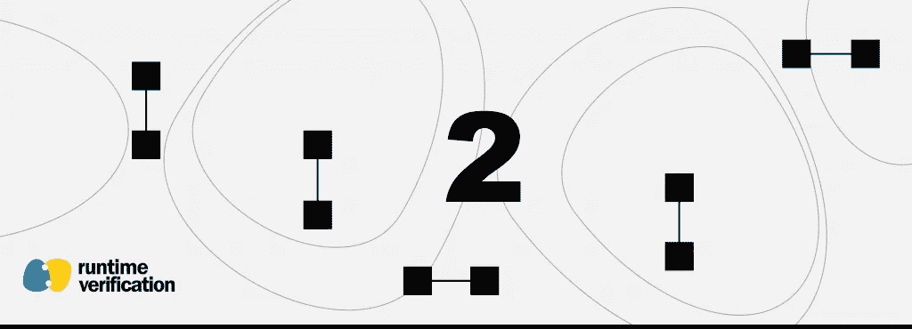
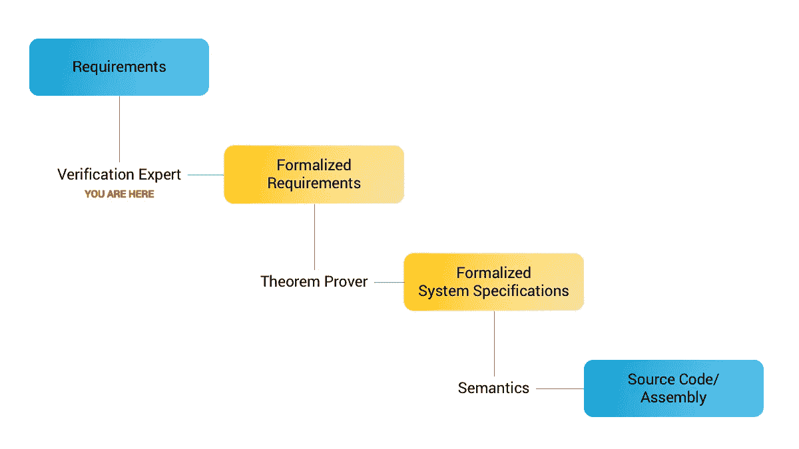

# 区块链系统和智能合约的形式验证 101:形式化需求

> 原文：<https://medium.com/coinmonks/formal-verification-101-for-blockchain-systems-and-smart-contracts-formalizing-requirements-cc7d3a75d87e?source=collection_archive---------4----------------------->

## 斯蒂芬·斯凯里克



在我们的四部分系列的第二部分[中，我们将讨论系统需求的形式化过程，以及它如何适应](https://runtimeverification.com/blog/formal-verification-101-for-blockchain-systems-and-smart-contracts/)[区块链](https://blog.coincodecap.com/tag/blockchain/)系统和智能合同的更大的正式验证环境。

回想一下，正式验证是关于知道我们的系统实现(例如，区块链系统/智能合同)是否满足我们的系统需求。

今天的文章是关于将我们的需求文档转换成等价的正式的、数学的需求规格说明的过程。



# 从英语到逻辑的漫长道路

英语是现代商业的通用语言。因此，毫不奇怪，我们经常将需求写成简单的英文文本文档。不幸的是，出于正式验证的目的，英语文档太不精确，并且通常会掩盖重要的实现细节。出于这个原因(我们将在后面看到)，我们通常希望一个正式的验证专家来帮助我们将英语语言需求文档重写为一个正式的数学需求规格。例如，假设我们正在设计一个实现公开竞价拍卖的智能合约。我们可以将拍卖合同的要求写成如下:

**英语语言要求**

每个拍卖都有一个主持人、一个活跃期、一个最低出价、一个可选的最高出价人(默认为无)以及无限数量的出价人。当拍卖活动时，出价人可以按顺序出价。如果出价高于最低出价，则它被记录为新的最低出价，同时该出价人被记录为最高出价人。否则，该出价将被忽略。当拍卖结束时，从出价人的账户中扣除与最高出价人的出价相等的金额，并将其转移到拍卖主持人，除非没有出价人。

所以，现在我们想把英语描述转换成正式的数学描述。为了做到这一点，我们将选择一个数学逻辑，它适合于表达我们想要的属性。就像英语一样有不同的语言；法语；中文；等等，我们可以使用不同的数学逻辑。一些常见的选择包括:等式逻辑、一阶逻辑、集合论、高阶逻辑/类型理论、重写逻辑或可达性逻辑。我们如何知道使用哪一个？事实证明，在(a)形式化我们的需求，(b)我们的定理证明器，以及(c)我们的形式语义中使用的逻辑都需要结合在一起，所以我们如何为过程的一部分做出选择将影响其他部分。

出于我们的目的，我们将使用可达性逻辑(这也是由 [K 框架](https://github.com/kframework/k/)使用的逻辑),因为它既(1)允许我们非常自然地形式化演进系统的需求，又(2)具有强大的工具支持。这意味着我们将把我们的系统描述为可达性逻辑理论。可达性逻辑理论具有(a)描述我们的系统状态的语法和配置；以及(b)描述我们的系统需求的可达性规则。现在让我们发明一些语法和配置来定义拍卖合同状态。为此，我们将使用 K 语言提供的语法模式。

## 拍卖状态(语法/配置)

```
syntax Address ::= (Letter | Number)* 
syntax MaybeAddress ::= Address | "None" configuration <host> Address </host> 
              <start> Number </start> 
              <end> Number </end> 
              <highestBidder> Address </highestBidder> 
              <minBid> Number </minBid>
```

使用这种语法和配置，我们可以编写具体的拍卖状态，如:

```
<host> ab2r3f <host> 
<start> 10 </start> 
<end> 20 </end> 
<highestBidder> None </highestBidder> 
<minBid> 15 </minBid>
```

希望该配置的含义是清楚的:拍卖在时间单元 10 开始，在时间单元 20 结束，由地址为 ab2r3f 的账户的所有者主持，还没有可行的出价，并且最低出价为 15 个代币。现在，这个简单的语法描述已经有可能帮助我们发现问题——特别是，它帮助我们看到我们的系统状态描述是否不完整。事实上，我们的拍卖配置缺少一个关键元素:当前时间！这个省略是有意义的，因为时间在我们最初的合同描述中从未直接提及，只是间接提及。因此，修订后的拍卖合同状态配置将如下所示:

```
configuration <host> Address </host> 
              <start> Number </start> 
              <end> Number </end>
              <currentTime> Number </currentTime> 
              <highestBidder> Address </highestBidder> 
              <minBid> Number </minBid>
```

现在我们知道拍卖何时开始。例如，拍卖配置:

```
<host> ab2r3f <host> 
<start> 10 </start> 
<end> 20 </end> 
<currentTime> 5 </currentTime> 
<highestBidder> None </highestBidder> 
<minBid> 15 </minBid>
```

描述尚未开始的拍卖。我们可能还需要澄清其他问题，例如，一个数字必须是零或正数，因为我们不想要负数的钱或时间。

## 拍卖合同要求(规则)

可达性逻辑规则具有以下形式:

```
rule Configuration1 => Configuration2 requires A ensures B
```

这可以理解为:处于满足条件 A 的配置 1 所描述的状态中的系统必须演化成确保条件 b 的配置 2 所描述的系统。为了方便起见，我们将假设配置中没有提到的部分不会改变。现在让我们来看一些示例规则。

**格式良好的持续时间**

立刻，一个简单的规则浮现在脑海中:对于任何持续时间，我们需要(a)持续时间是静态的，即不变的；和(b)结束前的开始。这可以用以下形式的规则来描述:

```
rule <start> S </start> 
     <end> E </end> 
   => 
     <start> S </start> 
     <end> E </end> 
   requires S < E
```

要求(a)被该规则不改变开始和结束时间的事实所涵盖；要求(b)包含在要求条款中。

**时间和投标值的单调性**

除了最奇特的物理学研究，时间总是向前移动的。让我们将这个需求编码成一个规则:

```
rule <curTime> C </curTime> 
   => 
     <curTime> C' </curTime> 
   requires C <= C'
```

这条规则是说，当前时间 C 必须演变成某个(可能不同的)时间 C’，使得 C 小于或等于 C’。

我们有一个几乎相同的规则，规定最低出价必须始终增值或保持不变(以防没有新的出价):

```
rule <minBid> M </minBid> 
   => 
     <minBid> M' </minBid> 
   requires M <= M'
```

**拍卖结束**

终结性规则规定拍卖状态在拍卖结束后不得改变。我们可以这样写:

```
rule <end> E </end> 
     <curTime> C </curTime> 
     <highestBidder> B </highestBidder> 
     <minBid> M </minBid> 
   => 
     <end> E </end> 
     <curTime> C' </curTime> 
     <highestBidder> B </highestBidder> 
     <minBid> M </minBid> 
  requires E <= C
```

这条规则准确地编码了我们的需求。

# 拉开窗帘

从上面的描述中，人们可能会误以为智能合同验证并没有那么难。不幸的是，为了简化我们的解释，我们隐藏了验证问题的复杂性。现在让我们拉开帷幕，看看验证真正智能合同的复杂性。实际上:

1.  我们的系统语法/配置实际上描述了一个完整的[区块链](https://blog.coincodecap.com/tag/blockchain/)系统，例如，我们的语法和配置将是[以太坊](https://blog.coincodecap.com/tag/ethereum/)虚拟机(EVM)字节码的语法和配置；
2.  我们的规则将谈论一个特定的 EVM 字节码拍卖智能合同如何演变。该合同将涉及我们上面提到的状态组件的变量，也就是说，它将有一个拍卖主机的变量 host，它是一个地址，拍卖开始时间的变量 start，等等…

(1)-(2)的结果是，实际上，我们推理的源代码程序(无论是智能合同还是区块链系统代码)只是间接描述了我们想要设计的系统，也就是说，我们不能从头开始设计全新的语言来具体描述我们的问题。这意味着从我们的形式化需求的映射必须谈论与我们整体期望的系统行为完全无关的概念，例如，EVM 细节，与拍卖如 EVM 指令和内存位置完全无关。

# 离别赠言

我们已经看到了如何使用 K 将英语语言要求映射为形式化的数学要求的概述，着眼于验证区块链系统和智能合约。此外，我们看到形式验证问题变得更加深入。它要求某人同时是(I)逻辑专家(例如可达性逻辑)和；㈡系统专家(如以太坊)。幸运的是，许多逻辑工具(如 [K 框架](https://github.com/kframework/k/))和教科书可以帮助系统专家更加精通处理形式验证所需的数学逻辑技能。

您的公司或组织是否使用正式的验证来加速您的开发过程并减少潜在的设计风险？你需要一个值得信赖的合作伙伴来帮助你解决围绕你的[区块链](https://blog.coincodecap.com/tag/blockchain/)系统设计、智能合同语言或智能合同实现的问题吗？如果是这样，我们很乐意帮忙。

请[联系我们](https://runtimeverification.com/contact/)取得联系！

> [直接在您的收件箱中获得最佳软件交易](https://coincodecap.com/?utm_source=coinmonks)

[](https://coincodecap.com/?utm_source=coinmonks)[](https://coincodecap.com)