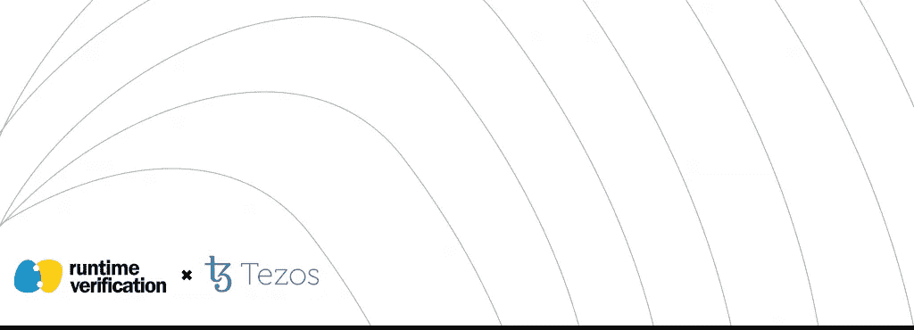
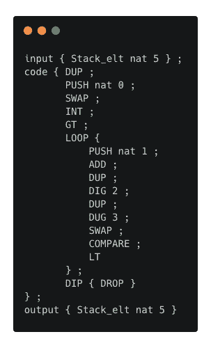
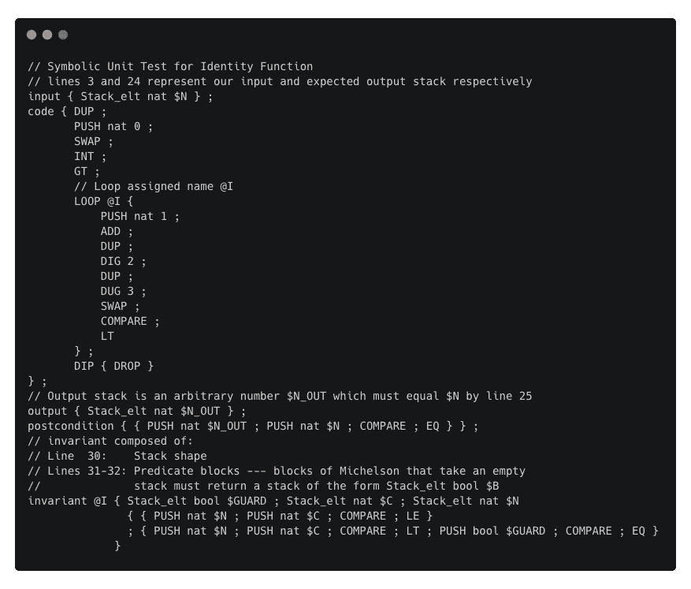

# 迈克尔逊形式化验证框架

> 原文：<https://medium.com/coinmonks/formal-verification-framework-for-michelson-9057202095a4?source=collection_archive---------1----------------------->

## 斯蒂芬·斯凯里克

Runtime Verification Inc. (RV)很高兴地宣布，我们正在通过 [Tezos 生态系统资助](https://tezos.foundation/fourth-cohort-grants/)计划与 [Tezos 基金会](https://tezos.foundation)合作，为迈克尔逊智能合约语言开发一个正式的验证框架！从一开始，Tezos 区块链的设计就考虑到了便利性、安全性和可扩展性。然而，与比特币等前身技术的现状不同，繁荣的 Tezos 生态系统的真实愿景不仅仅是一个安全的数字货币交易所——它是一个使用智能合约语言 Michelson 通过智能合约开发和发布分布式应用的平台。为了完全实现这一愿景，Michelson 智能合约开发人员将需要能够让他们自信地编写和测试智能合约的工具。

这是 RV 进入画面的地方。在过去的十年里，RV 开发了 [K 框架](https://github.com/kframework/k)，这是一个用于设计编程语言和自动生成解释器、静态分析工具、模型检查器和定理证明器的工具包。使用这个工具包，RV 获得了指定、形式化和验证区块链协议、语言和程序的丰富经验。作为 Tezos 基金会前两次资助的一部分，我们[在我们的 K-Michelson 解释器](https://tezos.foundation/announcing-second-cohort-of-tezos-ecosystem-grants/)中形式化了 Michelson 语言，并创建了一个 [Michelson 单元测试框架](https://github.com/runtimeverification/michelson-semantics)。在这笔拨款中，我们将扩展我们现有的迈克尔逊单元测试框架，以支持迈克尔逊智能合约的正式验证！

对于那些不熟悉形式验证的人来说，这个想法很简单:它是一种从数学上证明程序是正确的技术。由于它的数学本质，它为我们提供了*最强可能的*程序正确性保证。传统的软件测试方法只能证明*失败*的存在，即使我们的测试通过了，我们的软件仍然可能有缺陷。另一方面，形式验证给了我们一种方法，一劳永逸地说，我们的程序是没有错误的。

当然，正式验证的能力不是免费的。传统上，公司都聘请正规的验证专家(比如我们自己！)应用我们的专业知识来解决他们的验证问题。该资助的目的是为迈克尔逊智能合同语言创建一个正式的验证框架，使没有专业知识的迈克尔逊开发人员*能够正式验证合同。*

# 内景

这一部分是为那些好奇的、有技术头脑的人准备的，他们想看看这一切是如何工作的。

在我们与 Tezos 基金会共同开发 Michelson 单元测试框架之前，Michelson 开发人员需要编写他们的合同，通常使用`.tz`扩展，以及使用 Tezos 客户端运行测试的定制代码。现在开发人员可以使用`.tzt`格式和 K-Michelson 解释器来编写测试，这些测试可以在本地确定性地运行。下面是一个单元测试文件示例:

测试文件格式声明:给定一个仅包含自然数 5 的输入堆栈，在执行代码块中的代码后，检查我是否获得了一个仅包含自然数 5 的输出堆栈。

对于那些熟悉迈克尔逊语言的人来说，您可能会意识到，这段代码实现了自然数的恒等函数，也就是说，它实现了函数:`identity(n)`其中我们有`identity(n) = n`用于所有自然数`n`(有更简单的方法来编写这个函数——我们使用这个实现是为了演示)。为了更加确信我们的代码是正确的，我们可以编写更多的测试用例，用 6，18，甚至 19，727 来代替数字 5。但是如果我们想证明我们的代码实现了一个标识函数呢？我们如何做到这一点？

涉及的细节太多，在这篇短短的博文中无法描述。重要的一点是:通过对我们的测试文件做一些调整，仅使用类似于迈克尔逊的符号，我们能够将我们的标准单元测试转换成一个符号单元测试，一劳永逸地证明我们的代码实现了真正的身份函数。更新后的测试文件如下:

尽管我们仍然需要了解一些概念，如循环不变量，循环行为的抽象总结(出于好奇，请阅读更多关于循环不变量的内容[这里](https://en.wikipedia.org/wiki/Loop_invariant)和[这里](https://github.com/runtimeverification/michelson-semantics/blob/master/loop-invariants.md))，但令人惊讶的是，我们可以自信而准确地表达自己*，而不需要*学习标准程序验证方法中涉及的复杂数学符号。

# 结论

通过 Tezos 生态系统赠款计划引入运行时验证标志着运行时验证和 Tezos 基金会的共同承诺，即授权迈克尔逊智能合同开发人员更安全有效地编写智能合同，这反过来将有助于实现我们对繁荣的区块链生态系统的愿景。

这个简短的总结和例子只是一个尝试。随着我们继续努力，我们将增加更多的功能，支持更多的迈克尔逊语言，提高性能和用户体验。敬请关注更多更新，或者关注我们在 [GitHub 资源库](https://github.com/runtimeverification/michelson-semantics/)的进展！

*原载于 2020 年 7 月 27 日 https://runtimeverification.com**的* [*。*](https://runtimeverification.com/blog/formal-verification-framework-for-michelson/)

> [*在您的收件箱中直接获得最佳软件交易*](https://coincodecap.com/?utm_source=coinmonks)

