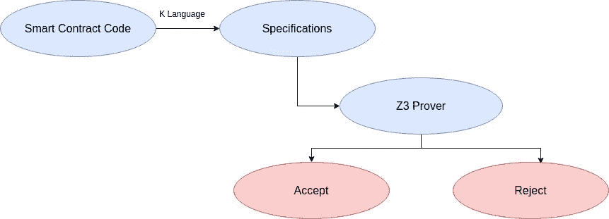

# 形式验证:为什么和如何

> 原文：<https://medium.com/coinmonks/formal-verification-why-and-how-a104cd702c25?source=collection_archive---------1----------------------->

智能合约的安全性仍然是以太坊生态系统中的一个关键挑战。事实上，因为一旦智能合约被利用，代码就是法律，就没有回头路了。这一点非常重要，尤其是如果合同是为了管理大量资本而构建的。我们都记得奇偶校验多签名钱包案件，其中 3 亿美元丢失，因为有人错误地杀死了主要组件之一(图书馆合同)。因此，调试智能合约肯定是一项非常重要的任务，应该非常小心地完成，因此我们需要一种方法来几乎 100%地确保写在 solidity 智能合约中的内容按预期工作。

形式验证是这样发挥作用的:如果我们不使用人类自己的信念来测试我们的智能合约，而是使用数学生成的证据，会怎么样？

# 以下是方法:

形式验证的核心是 K 框架。

K 框架无非是:

> 一个基于重写的可执行语义框架，其中可以使用*配置*、*计算*和*规则*定义编程语言、类型系统和形式分析工具。

用更简单的话来说，K Framework 是一种专门用于定义语义的语言。语义学描述了计算机程序的行为。例如，当我们说 x 的构造 **x++** 是 *uint256* 时，意味着执行它的程序将总是把 x 的值增加 1，除了一个值 x = 2 ⁵⁶–1:

多亏了 K 框架，我们可以为我们的智能合约编写规范。规范是我们的智能契约为了正确运行而必须遵循的一组规则。

在我们的规范完成后，我们使用 Z3 定理证明器来验证它们。Z3 是一个高性能的定理证明器，在这种情况下，它的工作是验证对于任何输入，一个确定的条件是否被遵守。如果我们正确地编写了我们的规范和智能合同，那么验证将会成功，证据将会被接受。

工作流程如下:



但是我们怎样才能做到呢？

为了正式验证一个契约，你必须验证它的语义

让我们考虑下面的合同:

这个契约允许执行`set`来改变`value`,然后通过将`isSet`设置为真来锁定该信息，因此任何执行`set`的尝试都会导致`revert`

Solidity 编译器将变量`value`存储在槽 0 中，将变量`isSet`存储在槽 1 中。如果我们想验证 set 是否按照预期的那样工作(只设置`value`一次),我们必须验证:

*   如果对于任何可能的输入，将`slot 1`设置为 false，那么契约将按照预期修改`value`
*   如果`slot 1`设置为真，对于任何可能的输入，合同总是恢复

这听起来可能很难做到，但实际上非常简单，有多种选择可以开始正式验证您的智能合同，并且有一些工具允许我们在相对较高的级别执行正式验证。在本文中，我将使用`[klab](https://github.com/dapphub/klab)`，这是 DappHub 提供的一种工具，它带有一种高级规范语言。

# **让我们开始写代码**

让我们这样设置我们的环境:

```
├── dapp
│   ├── out
│   │   └── OneWaySetter.sol.json
│   └── src
│       └── OneWaySetter.sol
└── src
    ├── prelude.smt2.md
    ├── specification.act.md
    └── storage.k.md
```

其中:

*   json 是一个文件，它告诉 Klab 在哪里以及应该看什么。
*   OneWaySetter.sol 是我们的 Solidity Smart 合约
*   OneWaySetter.sol.json 是我们编译的 Solidity 智能合约(为了编译您的智能合约，请打开您的终端，转到 dapp 文件夹`cd dapp`并键入

```
solc --combined-json=abi,bin,bin-runtime,srcmap,srcmap-runtime,ast src/OneWaySetter.sol > out/OneWaySetter.sol.json
```

*   specification.act.md 是包含我们的规范的地方(Klab 高级语言)
*   storage.k.md 是用来用一些 K 语言(低级语义)来完成我们的规范(高级语义)。在这种情况下，该文件将为空。
*   prelude.smt2.md 是使用 Z3 定理证明器的低级输入格式编写的，包含我们形式验证的前奏。前奏是可能与我们的智能合同相关的所有事实的集合。

# **我们的规范。**

首先，让我们进行配置:

对于这个例子，我们没有使用任何需要 storage.k.md 的东西，所以我们将保持它为空。

这是我们的前奏(prelude.smt2.md):

最后，让我们定义我们的规范(specification.act.md):

```
```act
behaviour set of OneWaySetterinterface set(uint256 Value)types IsSet : boolstorage 0 |-> _ => Value 1 |-> IsSet => 1iff VCallValue == 0 IsSet == 0```
```

**我们在这里做的是:**

类型序言:

*   在`types preamble`中，我们声明了规范所需的变量

存储序言:

*   在`storage preamble`中，我们指定任何改变契约状态的东西，并将声明的值赋给`types premble`
*   设置 IsSet 表示执行`set`前`slot 1`的值，并指定执行`slot 1`后其值变为 1。
*   指定`slot 0`改变作为输入给定的值。

Iff 序言:

*   在`iff preamble`中我们确定了不引起一个`revert`所需的条件
*   我们说不应该有以太网随事务`VCallValue == 0`一起发送，并且`slot 1`必须在`set`执行之前`0`。

现在我们可以运行`klab prove-all`和:

```
Doing initial spec build, this may take a while...
[ 'src/OneWaySetter.sol' ]
[ 'src/OneWaySetter.sol' ]
3410388bb51887b48311a94d8f63166ba1ad88dd98b988ece7a0e734622b2801 OneWaySetter__exhaustiveness
51c13b8610bad9cbfd805e52e169b639870b3a24860c265cd82fb2aa6e7a3775 OneWaySetter_set_pass_rough
d9f27f2f84fec78589a6c8bd390748a396250bfe5b0195f0bde7daa0f8eda667 OneWaySetter_set_fail_rough
STARTING proof batch 1.
Academic tradition requires you to cite works you base your article on.
When using programs that use GNU Parallel to process data for publication
please cite:O. Tange (2011): GNU Parallel - The Command-Line Power Tool,
  ;login: The USENIX Magazine, February 2011:42-47.This helps funding further development; AND IT WON'T COST YOU A CENT.
If you pay 10000 EUR you should feel free to use GNU Parallel without citing.To silence this citation notice: run 'parallel --citation'.2020-01-11T11:09:38.620Z
2020-01-11T11:09:38.624Z
Using evm-semantics from /home/giulio/klab/evm-semantics/
Proof STARTING: d9f27f2f84fec78589a6c8bd390748a396250bfe5b0195f0bde7daa0f8eda667.k [OneWaySetter_set_fail_rough] (with state logging)
Using evm-semantics from /home/giulio/klab/evm-semantics/
Proof STARTING: 51c13b8610bad9cbfd805e52e169b639870b3a24860c265cd82fb2aa6e7a3775.k [OneWaySetter_set_pass_rough] (with state logging)
Proof **ACCEPT**: 51c13b8610bad9cbfd805e52e169b639870b3a24860c265cd82fb2aa6e7a3775.k [OneWaySetter_set_pass_rough] (with state logging)
2020-01-11T11:10:51.968Z
/home/giulio/klab/bin/klab: riga 2: /home/giulio/klab/bin/../libexec/klab-gas-analyser: File o directory non esistente
2020-01-11T11:10:52.293Z
Using evm-semantics from /home/giulio/klab/evm-semantics/
Proof STARTING: 3410388bb51887b48311a94d8f63166ba1ad88dd98b988ece7a0e734622b2801.k [OneWaySetter__exhaustiveness] (with state logging)
Proof **ACCEPT**: d9f27f2f84fec78589a6c8bd390748a396250bfe5b0195f0bde7daa0f8eda667.k [OneWaySetter_set_fail_rough] (with state logging)
2020-01-11T11:10:54.822Z
Proof **ACCEPT**: 3410388bb51887b48311a94d8f63166ba1ad88dd98b988ece7a0e734622b2801.k [OneWaySetter__exhaustiveness] (with state logging)
2020-01-11T11:11:48.006Z
```

正如我们可以看到的，我们的正式验证是成功的，而且做起来非常简单。这告诉我们什么:

犯错误对人类来说很容易，但对数学来说却不容易，所以我们应该尽可能地信任数学，而不是一个开发者。如果不这样，就会像平价多 sig 钱包一样结束。

~干杯

[](https://github.com/Giulio2002) [## Giulio2002 -概述

github.com](https://github.com/Giulio2002) [](https://coincodecap.com)

> [直接在您的收件箱中获得最佳软件交易](https://coincodecap.com/?utm_source=coinmonks)

[](https://coincodecap.com/?utm_source=coinmonks)