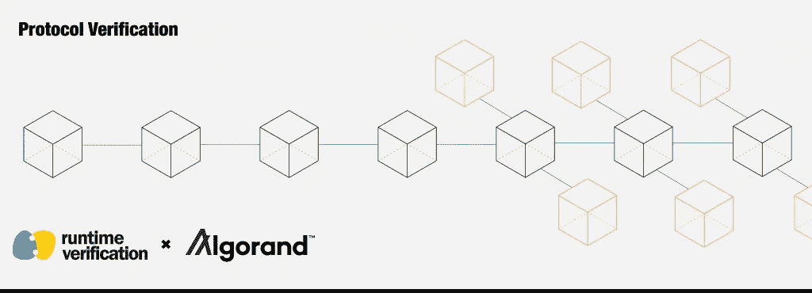

# 正式验证算法:强化钢铁链(建模与安全)

> 原文：<https://medium.com/coinmonks/formally-verifying-algorand-reinforcing-a-chain-of-steel-modeling-and-safety-d379755cd63?source=collection_archive---------2----------------------->

## 作者:Musab A. Alturki、Brandon Moore、Karl Palmskog 和 Lucas Pena

今年早些时候，运行时验证由[algorrand](https://www.algorand.com/)参与，以验证其共识协议。我们很高兴地报告，第一部分的工作，即建模协议和证明其安全性定理，已经成功完成。具体来说，我们使用了一个证明助手( [Coq](https://coq.inria.fr) )来系统地识别在数学上保证协议不会分叉的假设。

在我们深入讨论订婚的简要总结之前，让我们先来简单介绍一下 Algorand。Algorand 由麻省理工学院教授、图灵奖获得者[希尔维奥·米卡利](https://en.wikipedia.org/wiki/Silvio_Micali)创建，是区块链太空中实力最强的团队之一。Algorand 的核心是 Algorand 共识协议，这是一种[纯股权凭证](/algorand/algorands-core-technology-in-a-nutshell-e2b824e03c77)协议，承诺在保持真正分权的同时提供高效、安全和可扩展的运营。纯 PoS 的基本思想是，使系统的安全性只依赖于诚实用户持有的全部股份的绝对多数，而不必依赖任何特定的小节点子集，也不必锁定资产和惩罚用户。Algorand 共识协议的三大亮点是可扩展性、分散性和安全性。鼓励对 algorrand 内部结构感兴趣的读者阅读由 algorrand 团队[在 media](https://medium.com/algorand)上发表的信息性文章。

# 项目总结

在此，我们仅从较高层次概述了该项目。详细信息见
1。本工程随附的延期[技术报告](https://github.com/runtimeverification/algorand-verification/blob/master/report/report.pdf)；
2。项目的 [Github 资源库](https://github.com/runtimeverification/algorand-verification)。

约定的第一步是建立协议的正式模型，并确定协议设计满足其要求的假设。为了达到最高级别的保证，我们选择了演绎验证，在演绎验证中，系统在表达形式的逻辑系统中建模和指定，并以类似于数学家证明定理的方式进行验证。下图描述了系统分析的各种方法，作为所需努力与保证的函数。

阿尔格朗共识协议进行了一系列的回合。每一轮，节点认证一个块以添加到区块链。如果网络被分区，可能需要多次尝试(称为周期)来认证一个块。更多详情，请参见[algrand 区块链特性规范](https://github.com/algorandfoundation/specs/blob/master/overview/Algorand_v1_spec-2.pdf)和[这篇关于 algrand 的期刊论文](https://doi.org/10.1016/j.tcs.2019.02.001)。协议本身包含节点级行为和网络级行为(包括对手的行为)，这意味着必须对大量细节进行建模，以便能够表达和验证协议的相关属性。

我们在 Coq 中开发了 Algorand consensus 协议的模型，并证明了它的一系列属性，然后我们使用这些属性最终展示了异步安全属性:没有两个诚实的节点证明两个不同的块，即使当网络被划分时(即，消息延迟任意大)。该模型的核心是全局状态转换关系。这个关系归纳地定义了协议的全局状态如何在一个步骤中转换到另一个状态。

模型中断言某种事件已经发生的大多数陈述被指定为关于踪迹的命题，可能满足某些条件。踪迹是使用全局转移关系建立的全局状态的非空序列，即，如果状态`g(i)`是序列中的第 I 个状态，并且`g(i+1)`是第(i+1)个状态，则有序对`g(i)`和`g(i+1)`属于全局转移关系。通过将路径属性指定为轨迹上的命题，我们能够一般地定义属性是什么，而不必假定具体的初始状态(或一组初始状态)。保持该属性所需的任何条件都可以被指定为对所考虑的跟踪状态的约束。

# 参与结果

约定的一个主要结果是异步安全定理的严格形式化和证明。定理的[陈述断言，来自同一轮的任意两个证书必定是针对同一个区块的；也就是没有叉子。或者，正式在 Coq 中:](https://github.com/runtimeverification/algorand-verification/blob/bdc561d5197bfc1366e2e8b334c9a26df2f3bac1/theories/safety.v#L2513-L2518)

请注意前提条件`state_before_round r g0`，它表示当没有用户进入第一轮`r`时，跟踪可以追溯到足够长的历史时间，以及`is_trace g0 trace`，它表示跟踪是从`g0`开始的全局状态的有效序列，并且其中每对连续状态都满足全局转换关系。定理的证明被构造成单独的结果，这些结果本身被分解成更小的引理(总共有大约 170 个引理)。

约定的第二个主要结果是所需假设的精确说明，并显示这些假设足以支持安全属性。当部署设计的实现时，以及对于构建在实现之上的系统，假设是非常重要的。假设或者被指定为模型参数，例如消息有效载荷中使用的有限节点集和有限值集，或者被指定为更精细的假设(或公理)，例如关于消息延迟如何被限制的假设和关于持有绝大多数股份的节点的诚实性的假设。

# 走向

作为这项工作的一部分，我们开发的模型是通用的，因为它以一种与我们验证的属性正交的方式捕获了 Algorand 共识协议的动态。这意味着该模型可以容易地用于验证系统的除异步安全性之外的其他属性，包括最重要的活性(即，每一轮都认证一个块)。事实上，我们预期许多关于协议的小结果和用于安全性证明的小结果也将构成活性证明工作的基本成分。

为此，我们非常荣幸地与阿尔格兰德公司的以下专家合作:陈静、尼古拉·泽尔多维奇和维克多·卢昌科。

> [直接在您的收件箱中获得最佳软件交易](https://coincodecap.com/?utm_source=coinmonks)

*原载于 2019 年 6 月 18 日*[*https://runtimeverification.com*](https://runtimeverification.com/blog/formally-verifying-algorand-reinforcing-a-chain-of-steel-modeling-and-safety/)*。*