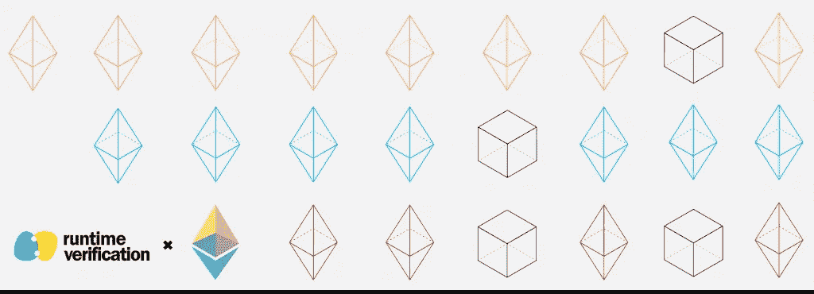
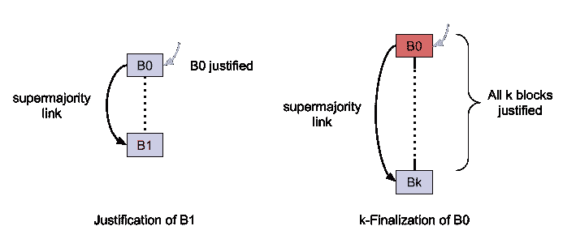
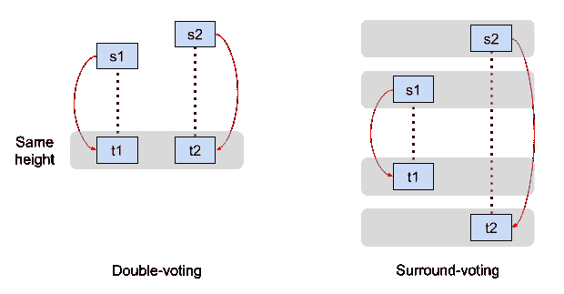
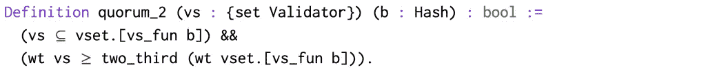
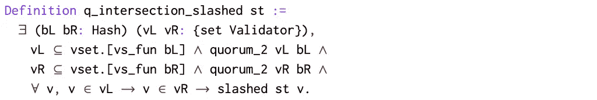
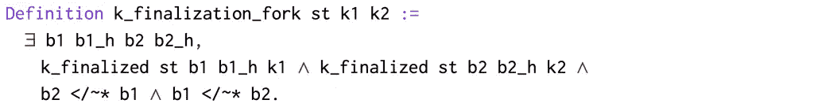
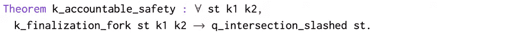

# 在 Gasper 中正式验证终结性:信标链的核心

> 原文：<https://medium.com/coinmonks/formally-verifying-finality-in-gasper-the-core-of-the-beacon-chain-86e0ee40ad49?source=collection_archive---------3----------------------->

## 作者:Musab A. Alturki、Elaine Li 和 Daejun Park

Gasper 是一个抽象的利害关系证明协议层，由信标链协议实现，信标链协议是即将到来的[以太坊 2.0](https://github.com/ethereum/eth2.0-specs) 网络的底层协议。Gasper 的一个关键组件是一个终结机制，它可以确保事务的持久性以及系统在受到攻击时的持续运行。

我们很高兴地报告[运行时验证](https://runtimeverification.com/)和[以太坊基金会](https://ethereum.org/en/foundation/)之间正在进行的合作中的另一个重要里程碑的成功完成，以建立一个用于建模和验证信标链的正式框架。我们已经在 Gasper 中正式证明了终结性的关键正确性属性，并使用这些结果来表明这些属性也适用于 Gasper 在信标链中的实现的抽象。模型和证明脚本都可以在网上[获得](https://github.com/runtimeverification/beacon-chain-verification)。

在本帖中，我们将重点关注这一成果的第一部分，即验证 Gasper 的属性。那么 Gasper 是什么？它的性质是如何被形式化验证的？为什么这很重要？

# 廉价香烟

[信标链](https://github.com/ethereum/eth2.0-specs/blob/dev/specs/phase0/beacon-chain.md)协议是一个新的利益证明协议，是以太坊即将到来的重大升级[以太坊 2.0](https://github.com/ethereum/eth2.0-specs) 的核心。在信标链协议中，参与节点或验证者在系统中有利害关系。验证器通过向网络提交证明来证明一个块的有效性，并对它的几个属性进行投票。信标链协议实现了各种小工具，通过这些小工具，验证者可以就区块链的状态达成共识。

[Gasper](https://arxiv.org/abs/2003.03052) 给出了信标链协议中终结性小工具的高级但精确的描述，它决定哪些块被认为是最终的和不可逆的，此外还定义了链分叉时的规范链(分叉选择规则)。Gasper 中的终结性概括了最初的[卡斯珀友好终结性小工具(卡斯珀 FFG)](https://arxiv.org/abs/1710.09437) 协议，主要是通过允许更通用形式的终结。

# 论证和定稿

终结性只在*检查点块*上运行(或纪元边界块:对应于纪元开始的块)。作为其证明的一部分，验证器进行*证明*表决，将源检查点块与后面的目标检查点块链接起来，直观地表明我们可以从源移动到目标。调整投票主要指定:(1)投票验证器，(2)源检查点块及其调整高度，以及(3)目标检查点块及其调整高度。

目标块 **B1** 被源块 **B0** 调整，如果两个条件都成立:(1)源块 **B0** 已经被调整，以及(2)通过对相同的源-目标对 **B0-B1** 的利害关系投票的绝对多数(即至少 2/3 的验证者)。

如果从 **B0** 到第 k 个下级检查点块 **Bk** 之间存在超级多数链接，并且沿着这条链从 **B0** 到 **Bk** 的所有检查点块都是对齐块，则块 **B0** 是 k 终结的(k > 0)。请注意，genesis 块被假定为对齐和终结的。下图说明了 Gasper 中的对齐和终结概念。

# 苛刻的条件

如果验证者试图偏离协议并提交冲突的投票给块，验证者将受到惩罚，其存放的股份的某个重要部分将被削减。Gasper 定义了两个条件，称为斜线条件，用于描述冲突投票的特征:

1.  双重投票:一个验证器发布两个不同的具有相同目标高度的投票。
2.  环绕投票:验证器在另一个投票的范围内发布一个投票。

下图对此进行了说明。

双重投票的验证器被认为违反了第一个斜线条件，而环绕投票的验证器违反了第二个斜线条件。在任何一种情况下，违规的验证者都会因为这个违规而被削减股份。

# 正确性属性

如同在其他拜占庭容错(BFT)协议中一样，Gasper 中的一个关键的潜在假设是绝大多数(即至少 2/3)的验证者(通过存放的股份)是诚实的并且遵循协议。基于这一假设，Gasper 有两个基本的正确性属性:

*   **负责任的安全:**在区块链，除非至少 1/3 的确认符(按股份)是可划掉的，否则不存在属于两个不同分叉的两个区块都被最终确定。
*   **似是而非的活跃度:**不管过去发生了什么，块终结过程永远不会出现死锁。

此外，在动态验证器集的上下文中，其中活动验证器集可以随时间改变，允许验证器加入和离开网络，第三个属性量化了在违反的情况下的可斜线股份:

动态验证器集(由信标链协议实现)引入了另一个挑战性的问题:系统现在不太可能能够可证明地削减行为不端的验证器，因为它们可能行为不端，然后在它们的存款被实际削减之前离开网络。该属性给出的下限允许调整活动验证器集合中允许的可变性，以便在系统中维持最低可接受的责任级别。

# 在 Gasper 中验证终结性

Gasper 旨在提供一种数学上精确的终结性描述，可用于正式证明其正确性，这对于证明信标链协议的安全性至关重要。以太坊平台越来越多地被用作大型金融交易系统的主干，凸显了确保其安全性的日益重要性。

在与以太坊基金会的合作中，我们已经使用 [Coq](https://coq.inria.fr/) proof assistant 在动态验证器集的一般设置中形式化了 Gasper 的终结性机制。我们陈述并证明了 Gasper 在这个环境中的所有三个关键的[性质:可解释的安全性、似是而非的活性和可割界定理，所有这些都在同一个 Coq 模型中。](https://arxiv.org/abs/2003.03052)

协议的演绎验证对论证的正确性和完整性给出了最大的信心，确保没有未声明的假设或无效的演绎步骤。它明确了支持论点所需的所有假设。形式化也反馈到协议的描述中，使其更加精确和完整。

在这里，我们只给出这一成就的高层次概述。完整的详细信息可在以下位置找到:

1.  伴随项目的[技术报告](https://github.com/runtimeverification/beacon-chain-verification/blob/master/casper/report/report.pdf)；和
2.  项目的 Github 库。

# 建模和验证方法

第一步是建立一个协议模型，使我们能够表达我们想要正式声明和证明的所有关键属性。该模型建立在我们之前在卡斯珀 FFG 验证安全性和活性的工作基础上，该工作定义了 Gasper 终结性机制的早期版本。

该模型有三个主要的结构构件:

**确认人和法定人数。**验证器被抽象地表示为有限类型的成员(可以被枚举的成员数量有限)，写作`Validator : finType`。每个验证器在系统中都有一个股份，这个事实由一个未解释的函数`stake : {fmap Validator -> nat}`建模，该函数将一个验证器映射到它的股份，作为一个自然数。此外，给定一组验证器，其*权重* `wt`定义为该组中所有验证器的赌注金额之和:

`\sum`是求和运算符，`stake.[st_fun v]`给出对应于验证器 v 的赌注金额(`st_fun`是假设赌注函数是总的——即每个验证器在系统中都必须有赌注)。

`wt`函数的几个性质从它的定义而来，例如，空的验证器集的权重必然为零，并且两个不相交集的联合的权重是它们的权重之和。在对可割界定理的论点中的权重进行推理时，需要这些性质。

此外，由于我们打算对动态验证器集建模，其中有效验证器集可能在不同的块中变化，我们声明了一个抽象(有限)映射`vset : {fmap Hash -> {set Validator}}`，它给出了一个块中的有效验证器集。现在，使用`vset`和`wt`，我们可以定义一个集合成为超多数集合意味着什么:

如果一个集合是一个块的有效验证子集合的子集，且其权重至少为总权重的 2/3，那么这个集合就是这个块的超多数集合。

**积木树。**我们通过有限类型的块哈希 Hash : finType 对块建模，用`genesis`表示起源块。我们使用符号`h1 <~ h2`使用父二进制关系来建模检查点块树，这被公理化为意味着`h1`是`h2`的父。

这个定义然后被用来将祖先二元关系`h1 <~* h2`定义为`<~`的自反传递闭包。因此，如果`h1 <~* h2`那么`h1`是`h2`的祖先`h2`是`h1`的后代(并且`h1`和`h2`可能是同一个块)。关于祖先关系的性质，例如块的祖先的祖先也是该块的祖先的性质，从它是父关系的自反传递闭包中得出。

**全球状态。**状态由一组有限的调整投票来表示，这些投票是形式为`(v, s,t, s_h, t_h)`的投票，其中`v`是投票验证器，`s`和`t`是该投票所针对的源和目标块，`s_h`和`t_h`是它们的证明高度。是否已经投票可以由布尔成员谓词来确定:

# 示例规格

基于这些定义及其属性，我们定义了模型中的所有其他结构和属性，包括斜线条件、法定交集属性以及调整和终结。例如，由于违规而削减仲裁的属性是使用抽象成员约束定义的，如下所示:

这是一个命题，说明削减法定人数意味着分别对于一些块`bL`和`bR`存在两个超级多数法定人数`vL`和`vR`，它们的交集完全由削减的确认器(具有双重投票或环绕投票的确认器)组成。请注意，在特殊情况下，活动验证器集在所有块中是固定的，这些绝对多数法定人数的交集的权重至少为总股份的 1/3。

另一个例子是终结分支的定义(违反了安全性):

这个命题陈述了两个冲突的块`b1`和`b2`(即，两个块都不是另一个的祖先)都被完成。这两个块可以使用任意长度和任意对齐高度的终结链来终结。

这些定义和结果最终被用来陈述和证明三个关键定理:可解释的安全性、似是而非的活性和可砍界限。为了说明这一点，我们将负责任的安全定理的陈述复制如下:

该语句只是说，违反安全(任何类型的终结分支)意味着验证器的数量是可削减的。该证明将 Gasper 给出的非正式论证机械化，并展示了一个终结分叉如何意味着两个违规的绝对多数法定人数违反了其中一个削减条件，并因此削减了它们的交互集。我们建议读者参考描述这些属性的形式化和证明的技术报告，并参考项目资源库以获得完整的规范。

# 走向

在这篇文章中，我们描述了与以太坊基金会在当前项目阶段合作完成的运行时验证的第一部分。这第一部分是关于形式化 Gasper 并证明它的三个关键性质:可问责的安全性、似是而非的活性和可割界定理，假设动态验证集。我们的成就的第二部分，我们在这里没有谈到，是展示这些结果如何延续到一个更细粒度的模型(在 [K 框架](http://www.kframework.org)中编写),该模型给出了信标链转换函数的抽象。我们稍后会有另一篇关于这一进展的文章。

这一里程碑的完成标志着朝着实现这一合作的最终目标又迈出了重要一步，即正式证明信标链协议满足所有三个关键属性，并在非常接近协议规范的抽象层次上清楚地陈述了所需的所有假设。

我们期待着继续与以太坊基金会在这项工作上的合作。为此，我们有幸与以太坊基金会的以下专家合作:Danny Ryan、Carl Beekhuizen、Martin Lundfall、Yan Zhang 和 Aditya Asgaonkar。

> 直接在您的收件箱中获得最佳软件交易

*原载于 2020 年 7 月 15 日*[*【https://runtimeverification.com】*](https://runtimeverification.com/blog/formally-verifying-finality-in-gasper-the-core-of-the-beacon-chain/)*。*