# 免费比特币取证-第 3 部分

> 原文：<https://medium.com/coinmonks/free-bitcoin-forensics-part-3-96351bcbff76?source=collection_archive---------2----------------------->

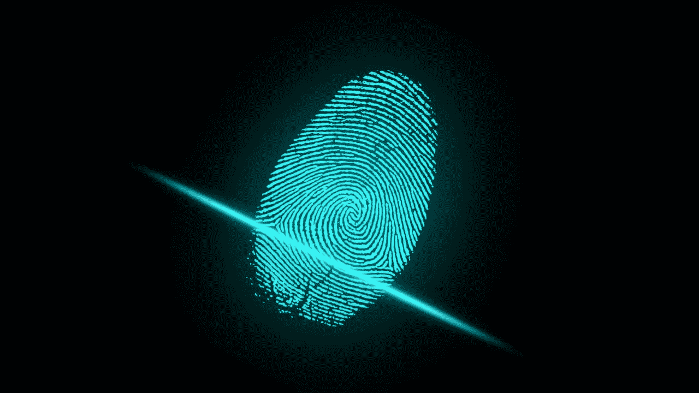

欢迎来到“免费比特币取证”博客系列的第三部分，也是最后一部分。你可以在这里阅读前两部分:

 [## 免费比特币分析-第 1 部分

### 在过去的几年中，比特币取证和隐私在比特币中引起了越来越多的关注和争议…

medium.com](/coinmonks/free-bitcoin-analytics-part-1-6d3452df0b19)  [## 免费比特币取证-第二部分

### 欢迎来到“免费比特币取证”的第 2 部分，你可以在这里找到文章的第一部分。在这一部分，我将…

medium.com](/coinmonks/free-bitcoin-forensics-part-2-51bafd9e032a) 

在这一部分中，我们将前面部分中概述的一些知识应用到实践中，并尝试我们自己的一个小调查。为此，我们将调查相对较新的“Cashaa India”黑客攻击，你可以在这里阅读有关事件:

 [## Cashaa 印度场外比特币黑客更新

### 我们的系统遭到了网络攻击，入侵了“Cashaa India OTC”员工的一台易受攻击的机器…

help.cashaa.com](https://help.cashaa.com/knowledgebase/cashaa-india-otc-bitcoin-hack-update/) 

黑客从 Cashaa 盗取了 335.91312085 英镑，失窃时价值约 1250 万英镑。所有的资金都寄到了地址:14 ryuamw1 shoxcav 4 zneh 64 xnttl 3a 2 ek

这是我们开始调查所需的全部信息。我必须承认，除了阅读前面链接的 Cashaa 页面之外，我没有对这个黑客做更多的研究，所以让我们希望这个信息是准确的。此调查仅用于演示目的。

最初的黑客交易可以在这里看到:

 [## Blockchain.com 探险家| BTC |联邦理工学院| BCH

### 最受欢迎和信任的块浏览器和加密交易搜索引擎。

www.blockchain.com](https://www.blockchain.com/btc/tx/abb197c3dbdec3a0884da38098bc0ef2412b801d55e7287298b0f0082cf86a7e) 

让我们看一下 Cashaa 资金被发送到的地址:

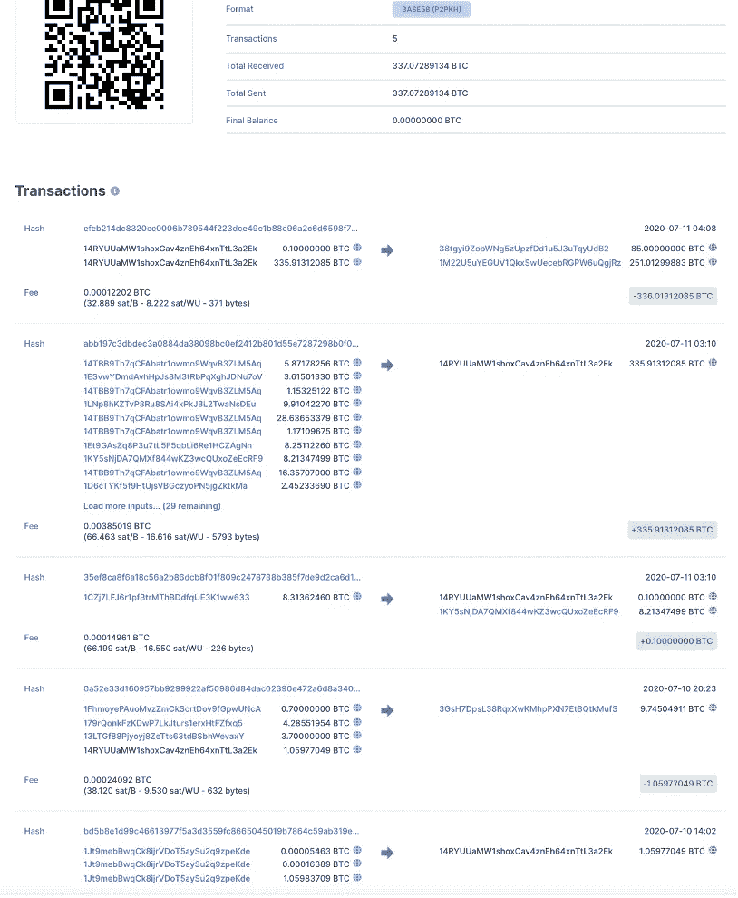

[https://www.blockchain.com/btc/address/14RYUUaMW1shoxCav4znEh64xnTtL3a2Ek](https://www.blockchain.com/btc/address/14RYUUaMW1shoxCav4znEh64xnTtL3a2Ek)

我们可以立即注意到，这个地址在收到 Cashaa 被盗资金存款之前已经有过几次交易。

地址 14 ryuamw1 shoxcav 4 zneh 64 xnttl 3a 2 ek 在初始黑客交易之前参与的 3 次交易分别是:

 [## Blockchain.com 探险家| BTC |联邦理工学院| BCH

### 最受欢迎和信任的块浏览器和加密交易搜索引擎。

www.blockchain.com](https://www.blockchain.com/btc/tx/bd5b8e1d99c46613977f5a3d3559fc8665045019b7864c59ab319e0558576c5d) 

1.05977049 BTC 的存款。

 [## Blockchain.com 探险家| BTC |联邦理工学院| BCH

### 最受欢迎和信任的块浏览器和加密交易搜索引擎。

www.blockchain.com](https://www.blockchain.com/btc/tx/0a52e33d160957bb9299922af50986d84dac02390e472a6d8a34019ee41f5ea5) 

1.05977049 BTC 的提款

 [## Blockchain.com 探险家| BTC |联邦理工学院| BCH

### 最受欢迎和信任的块浏览器和加密交易搜索引擎。

www.blockchain.com](https://www.blockchain.com/btc/tx/35ef8ca8f6a18c56a2b86dcb8f01f809c2478738b385f7de9d2ca6d15dff9162) 

10000000 英镑的存款

取款是我们最感兴趣的交易，因为我们不能确定存款交易中的输入地址是属于目标还是其他人，但是我们可以合理地确定取款交易中的输入地址。取款交易也具有既不 CoinJoin 也不 PayJoin 的特征(因为它只有一个输出)。在取款交易中，我们可以合理确定属于我们的目标的其他 3 个输入地址是:

 [## Blockchain.com 探险家| BTC |联邦理工学院| BCH

### 最受欢迎和信任的块浏览器和加密交易搜索引擎。

www.blockchain.com](https://www.blockchain.com/btc/address/1FhmoyePAuoMvzZmCkSortDov9fGpwUNcA)  [## Blockchain.com 探险家| BTC |联邦理工学院| BCH

### 最受欢迎和信任的块浏览器和加密交易搜索引擎。

www.blockchain.com](https://www.blockchain.com/btc/address/179rQonkFzKDwP7LkJturs1erxHtFZfxq5)  [## Blockchain.com 探险家| BTC |联邦理工学院| BCH

### 最受欢迎和信任的块浏览器和加密交易搜索引擎。

www.blockchain.com](https://www.blockchain.com/btc/address/13LTGf88Pjyoyj8ZeTts63tdBSbhWevaxY) 

所有这些地址与地址 14r yuuamw1 shoxcav 4 zneh 64 xnttl 3 a2 ek 一起构成一个“钱包”,因为它们很可能属于同一实体。这也是由 oxt.me 块浏览器识别的，这个钱包的统计数据可以在这里看到:
[https://oxt.me/entity/tiid/2914263901](https://oxt.me/entity/tiid/2914263901)

遗憾的是，我们没有从探索这个钱包中获得更多信息，因为所有提到的 3 个地址在与我们的主要目标地址一起参与取款之前只收到了 1 次存款 tx。

因此，让我们继续调查，开始追踪主要的被盗资金，首先，由于我们很快获得了越来越多的信息，明智的做法是将其记录在 excel 文件或类似的文件中。以下是我们目前掌握的信息:

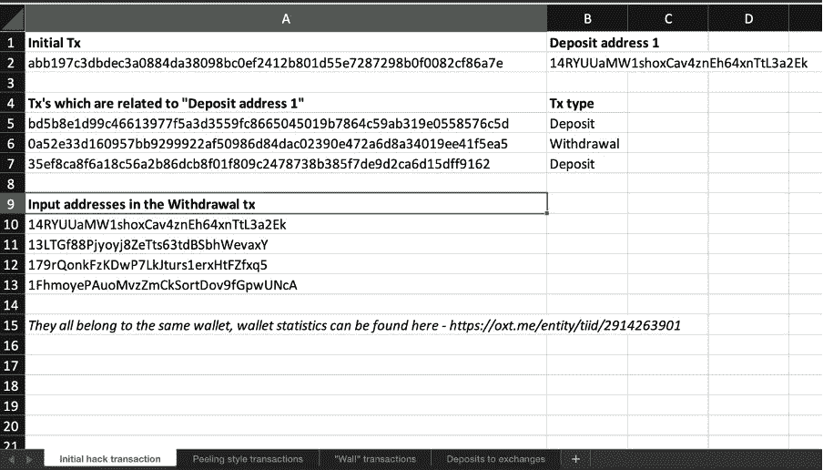

如果你足够勇敢，你可以在这里下载 excel 表格(一般来说从网上下载随机的 excel 文件不是最好的办法):
[https://mega . NZ/file/GgBVRSJL # M5 ynvesojuxl 30s _ 2 htw kb 9 F8 NQ 12 x7 stkk-kqunpn 4](https://mega.nz/file/GgBVRSJL#m5YNVesOJuxl30S_2HtWKB9F8Nq12X7xtKK-KqunpN4)

当我们开始跟踪主要的被盗资金时，我们可以立即注意到，这些资金以“剥离式”交易方式进行，其中每个输入被分成 2 个输出，这 2 个输出参与 2 个单独的交易，资金再次被分成 2 个输出，依此类推。最终，除了一个输出之外，所有输出都以多输入交易结束，其中一些输入无法可靠地追溯到原始被盗资金的交易，让我们将这些交易称为“墙”交易，因为这是我们的小型调查将结束的地方，黑客进行“墙”交易的可能性大大低于剥离交易(剥离交易都只有一个输入，因此它们不可能是传统的共同加入或支付加入，剥离 tx 的量也可以直接追溯到原始黑客 tx)。

我们可以在 oxt.me 的帮助下，通过探索“剥离”事务并在“墙”事务处停止来可视化我们获得的事务图:

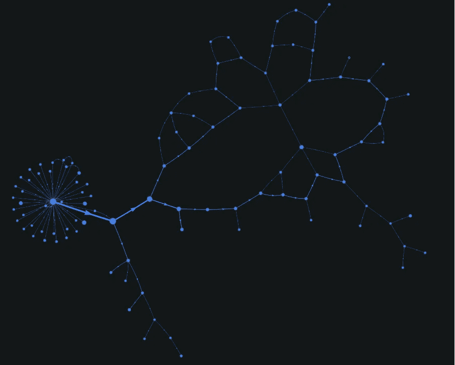

让我们将所有“剥离”事务记录到 excel 文件中，并对它们进行更深入的研究:

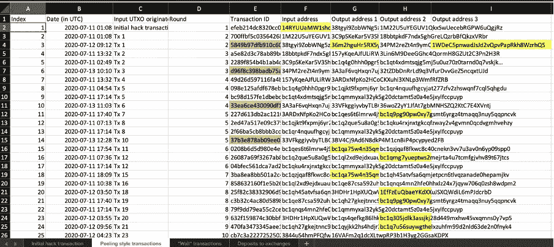

有 39 起剥皮式交易，大部分发生在 2020 年 7 月 11 日至 13 日之间。除了一个事务外，所有这些事务都只有一个或两个输出，唯一的例外是事务 5849 b 97 DFB 910 c 609d 17006 CBE 3d 573 ad 5b 06 ce C7 af 3c 566 BF 910 E6 EB 4256 B2 a，它有 3 个输出，该事务的 tx ID 以及源自它的所有其他事务都用橙色标记。如果我们在 oxt.me explorer 中检查它们，我们可以清楚地看到它们形成了一个独立于其他剥离事务的“分支”:

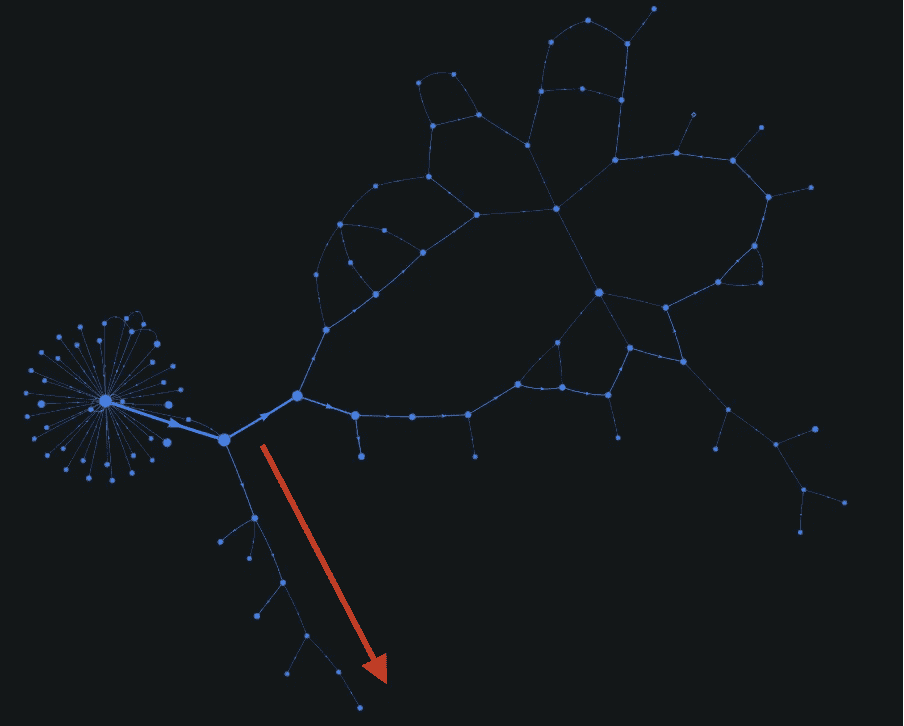

很有可能这些交易是用不同的钱包或由不同的实体进行的。

根据 oxt.me，excel 表中用黄色标记的地址属于一个钱包，这些钱包的说明可在下面的同一个 excel 选项卡中找到:

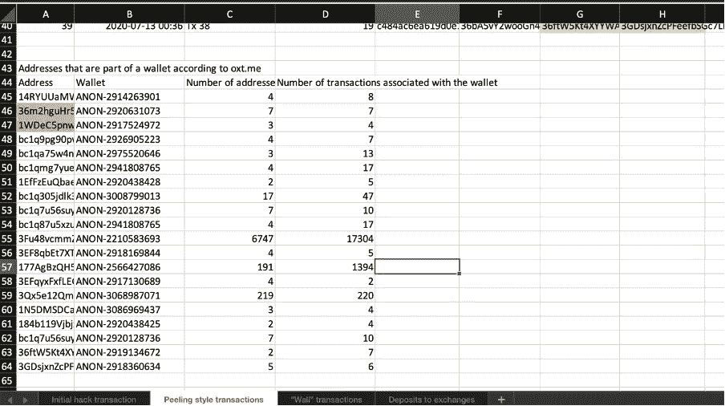

你可能会注意到，这些钱包中有一些有非常多的地址和交易，很可能是由交易所或其他大型实体运营的。

最后，我们可以注意到有一个带下划线的地址。发送到地址 BC 1 qacl 0 kqht 4 yzzcq 5 afu 9 emwu 93 mzwlcx 259 p 5 的 UTXO 至今仍未使用(截至发稿时，2021 年 6 月)。一个专门的调查员可以通过使用 cryptotxalert.com 或类似的工具来跟踪这个地址。

如果我们继续分析“墙”交易，事情开始变得有趣起来:

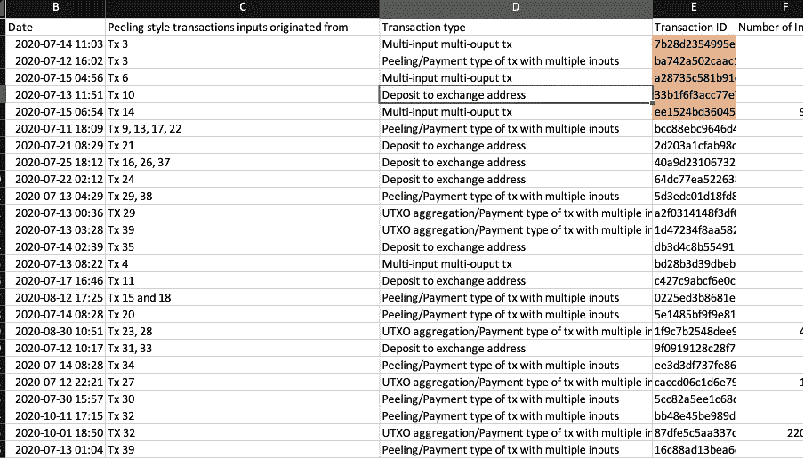

我们可以开始记录各种有趣的信息，例如交易量和可以直接追溯到 Cashaa 的交易量:

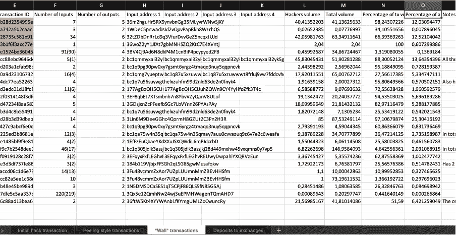

更重要的是，我们可以开始粗略地对这些“墙”交易的类型进行分类:

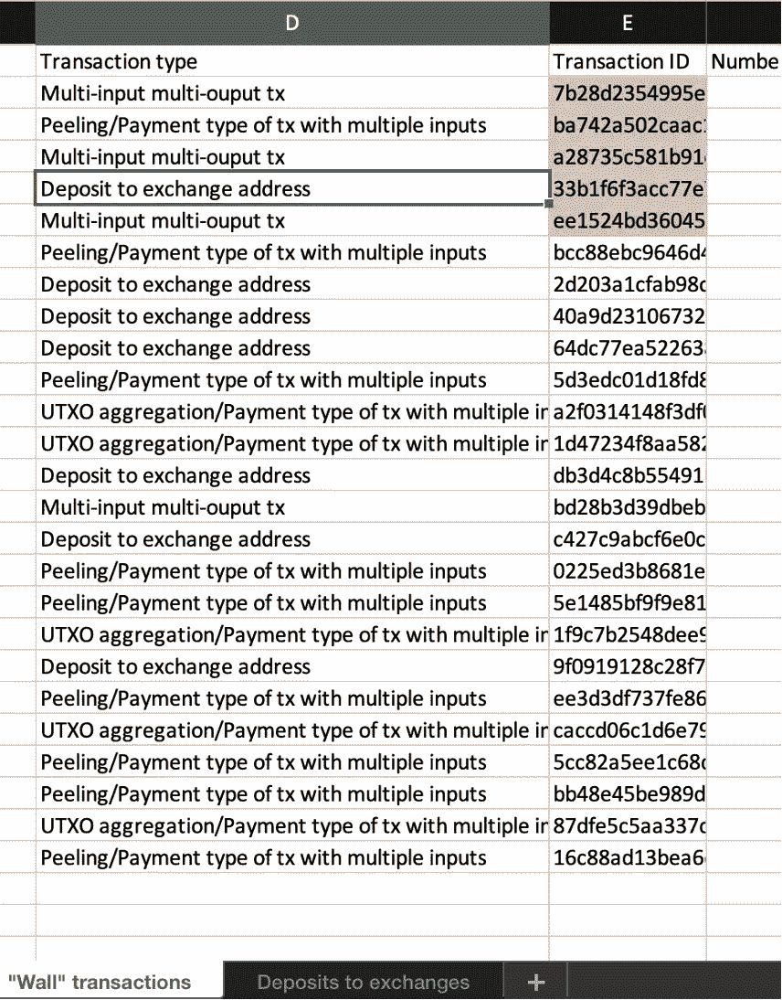

值得更深入地分析所有这些交易，但显然，从取证的角度来看，交易所的存款是最重要的 tx 类型，因为资金被发送到的交易所可能具有黑客的身份。由于本次调查仅用于演示目的，因此我将只仔细研究交易所的存款:

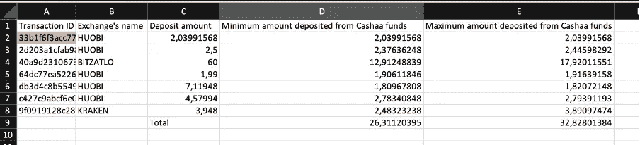

有 7 笔这样的交易，大部分存款流向了火币网，少数存款流向了 Bitzatlo 和北海巨妖交易所。资金被发送到属于这些交易所的地址的事实被 oxt.me 检测到，但是，资金当然也可能被发送到其他交易所的地址，但是 oxt.me 只是不索引那些交易所。

可追溯到 Cashaa hack 的这些交易所的最低存款额为 26，3 BTC，最高为 32 BTC。但是，请注意，这并不意味着这些交易所已经直接从黑客那里收到了资金，资金可能已经离开了目标的手，并被合作伙伴或其他人发送到他们的地址(例如，如果黑客使用掉期交易所或直接向某人出售 BTC)。在任何情况下，这些交流都是调查者所能获得的最佳线索(也是他们所能期望的最佳线索)，因此调查者的下一步将是联系相关的交流，以了解他们拥有哪些信息。如果调查人员与警方合作或者是警方的一部分，他们肯定会收到这些交流所掌握的所有信息。

我将在这里结束调查，它肯定可以延伸得更远，因为我们甚至没有探索在剥离式交易或其他 wall 交易中发现的钱包，我们也没有试图确定目标使用的钱包(或者更实际地，确定不同的钱包用于哪些交易)，我们也没有试图确定目标的大致时区。所有这些事情都可以由一个对调查更认真的真正的调查员来做。尽管如此，我希望它充分证明了比特币取证有时具有的威力，并且这个系列对任何隐私爱好者都是有用的。

## 另外，阅读

*   [什么是融资融券交易](https://blog.coincodecap.com/margin-trading) | [美元成本平均法](https://blog.coincodecap.com/dca)
*   [3 商业评论](/coinmonks/3commas-review-an-excellent-crypto-trading-bot-2020-1313a58bec92) | [Pionex 评论](/coinmonks/pionex-review-exchange-with-crypto-trading-bot-1e459d0191ea) | [Coinrule 评论](/coinmonks/coinrule-review-2021-a-beginner-friendly-crypto-trading-bot-daf0504848ba)
*   [莱杰 vs n rave](/coinmonks/ledger-vs-ngrave-zero-7e40f0c1d694)|[莱杰 nano s vs x](/coinmonks/ledger-nano-s-vs-x-battery-hardware-price-storage-59a6663fe3b0) | [币安评论](/coinmonks/binance-review-ee10d3bf3b6e)
*   最好的比特币[硬件钱包](/coinmonks/the-best-cryptocurrency-hardware-wallets-of-2020-e28b1c124069?source=friends_link&sk=324dd9ff8556ab578d71e7ad7658ad7c) | [BitBox02 回顾](/coinmonks/bitbox02-review-your-swiss-bitcoin-hardware-wallet-c36c88fff29)
*   最好的[加密税务软件](/coinmonks/best-crypto-tax-tool-for-my-money-72d4b430816b) | [硬币追踪评论](/coinmonks/cointracking-review-a-reliable-cryptocurrency-tax-software-5114e3eb5737)
*   最佳[密码借贷平台](/coinmonks/top-5-crypto-lending-platforms-in-2020-that-you-need-to-know-a1b675cec3fa) | [杠杆令牌](/coinmonks/leveraged-token-3f5257808b22)
*   最佳[加密制图工具](/coinmonks/what-are-the-best-charting-platforms-for-cryptocurrency-trading-85aade584d80) | [最佳加密交易所](/coinmonks/crypto-exchange-dd2f9d6f3769)
*   [如何在印度购买比特币？](/coinmonks/buy-bitcoin-in-india-feb50ddfef94) | [WazirX 审查](/coinmonks/wazirx-review-5c811b074f5b)
*   [WazirX vs CoinDCX vs bit bns](/coinmonks/wazirx-vs-coindcx-vs-bitbns-149f4f19a2f1)|[block fi vs coin loan vs Nexo](/coinmonks/blockfi-vs-coinloan-vs-nexo-cb624635230d)
*   [本地比特币评论](/coinmonks/localbitcoins-review-6cc001c6ed56) | [加密货币储蓄账户](https://blog.coincodecap.com/cryptocurrency-savings-accounts)
*   [比特币基地评论](/coinmonks/coinbase-review-6ef4e0f56064) | [德里比特评论](/coinmonks/deribit-review-options-fees-apis-and-testnet-2ca16c4bbdb2) | [FTX 交易所评论](/coinmonks/ftx-crypto-exchange-review-53664ac1198f)
*   [n 零审核](/coinmonks/ngrave-zero-review-c465cf8307fc) | [Phemex 审核](/coinmonks/phemex-review-4cfba0b49e28) | [PrimeXBT 审核](/coinmonks/primexbt-review-88e0815be858)
*   最佳[区块链分析](https://bitquery.io/blog/best-blockchain-analysis-tools-and-software)工具| [赚比特币](/coinmonks/earn-bitcoin-6e8bd3c592d9) | [期货交易机器人](/coinmonks/futures-trading-bots-5a282ccee3f5)
*   [加密套利](/coinmonks/crypto-arbitrage-guide-how-to-make-money-as-a-beginner-62bfe5c868f6)指南| [如何做空比特币](/coinmonks/how-to-short-bitcoin-568a2d0b4ae5) | [Prokey 点评](/coinmonks/prokey-review-26611173c13c)
*   [最佳加密交易信号电报](/coinmonks/best-crypto-signals-telegram-5785cdbc4b2b) | [MoonXBT 评论](/coinmonks/moonxbt-review-6e4ab26d037)
*   [Godex.io 审核](/coinmonks/godex-io-review-7366086519fb) | [邀请审核](/coinmonks/invity-review-70f3030c0502) | [BitForex 审核](/coinmonks/bitforex-review-c4bb28d9e271)