# 8 个最佳免费加密信号 2023 —电报交易信号

> 原文：<https://medium.com/coinmonks/free-crypto-signals-48b25e61a8da?source=collection_archive---------0----------------------->

## 通过从有经验的交易者那里获得信号来赚取利润

各种电报/不和谐频道提供付费加密信号。然而，我们今天将讨论如何免费接收加密信号。

# 总结(TL；博士)

*   加密交易信号让你在了解加密市场的同时获得可观的回报。
*   一个有经验的交易者或一群交易者提供市场机会的进入点和退出点，以换取他们平台的付费订阅。
*   一些平台提供免费的加密交易信号。其他人向你提供信息，你可以利用这些信息自己确定信号。
*   我们还创建了一个名为[***CoinCodeCap Classic***](https://t.me/coincodecap)的频道，在那里我们提供免费的电报加密交易信号。
*   验证加密交易商是一个高级加密交易信号服务，附带期货，现货，白金俱乐部交易和视频。
*   交易视图是搜索交易市场想法的好地方。你可以在创意部分查找编辑们对最佳市场机会的选择。
*   硬币信号是另一个自动加密交易信号提供商。该平台提供了一个[加密交易机器人](/coinmonks/crypto-trading-bot-c2ffce8acb2a)，并使用人工智能和人工智能提供信号。
*   如果您想通过 [**Cornix**](https://coincodecap.com/go/cornix) 实现信号自动化，请使用代码**免费**到**享受 10%的年费优惠**。

> 试试我们的 [**CoinCodeCap 密码信号服务**](https://signals.coincodecap.com/) 。也加入我们的 [**电报**](https://t.me/coincodecap) 进行自由贸易分析。
> 
> 🚨🚨我们现在是 Bybit 的 [**主交易员，现在你可以直接在 Bybit 上关注我们的交易。是的，只剩几个名额了，所以赶快吧。**](https://coincodecap.com/go/coincodecap_page)
> 
> 在[***Bybit***](https://coincodecap.com/go/bybit)*[***Bityard***](https://coincodecap.com/go/bityard)**[***BingX***](https://coincodecap.com/go/bingx)*上报名并获得费用优惠。****
> 
> ***也了解一下* [***复制交易 app***](/coinmonks/top-10-crypto-copy-trading-platforms-for-beginners-d0c37c7d698c)*，它们现在很流行。***
> 
> ***还查看了* [***没有 KYC 的密码往来***](/coinmonks/no-kyc-crypto-exchanges-buy-crypto-without-kyc-3b2eda2b5397)**
> 
> ***对于印度人来说，密码社区检查了* [*最好的印度密码交易所*](/coinmonks/bitcoin-exchange-in-india-7f1fe79715c9) *和* [*的应用程序来购买印度的比特币*](/coinmonks/buy-bitcoin-in-india-feb50ddfef94) *。***
> 
> ***使用* [*最佳加密税务软件*](/coinmonks/best-crypto-tax-tool-for-my-money-72d4b430816b) *支付您的加密税款，使用* [*最佳加密硬件钱包*](/coinmonks/the-best-cryptocurrency-hardware-wallets-of-2020-e28b1c124069) *保护您的加密..***
> 
> **如果你想找一个 [**的免费交易机器人**](/coinmonks/crypto-trading-bot-c2ffce8acb2a) ，试试 [**Poinex**](https://www.pionex.com/offers/#/grid-4?r=BI2UEarX) ，他们只收取交易费，不按月固定定价。**

# **什么是加密交易信号？**

**加密信号根据交易原理和技术分析为你提供进场和出场信息。专业交易者使用复杂的数学和技术指标来预测价格变动。这些交易者向你收取可观的费用，让你在了解市场的同时提供信号和获取回报的机会。**

**阅读我们的指南[什么是加密交易信号](https://coincodecap.com/what-are-crypto-trading-signals)？如果你是加密交易的初学者，你可以通过我们的[指南来投资加密货币](https://coincodecap.com/crypto-investing-guide)。**

**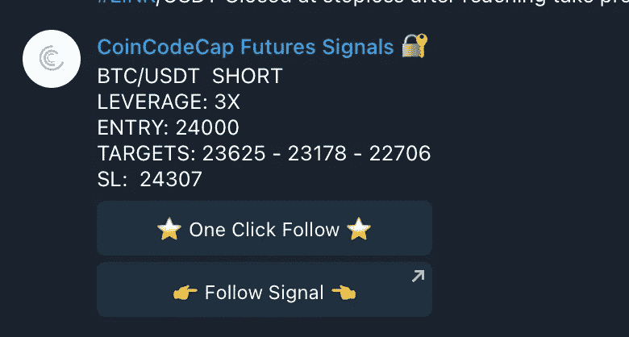**

**Example of Futures Trading Signal**

# **密码信号是如何工作的？**

**大多数加密交易信号提供商通过[电报](https://telegram.org/)或[不一致](https://discord.com/)渠道运作。这些平台使得交易者更容易互动、交易、使用[加密交易机器人](https://blog.coincodecap.com/best-crypto-trading-bots)，以及接收关于价格变动的信号。各个电报频道的管理员发布密码信号，告知具体交易机会的所有细节。**

> **使用 code FREE 在 Cornix 上获得折扣。**

# **什么是免费加密信号？**

**免费的加密交易信号渠道很少，有时甚至可能不准确。你还必须根据你得到的信息来计算交易细节。因此，本文将讨论 4 个最好的免费加密交易信号。**

# **最佳免费加密交易信号**

**我们已经为你策划了 4 个最好的免费加密信号。但是，假设您希望比较免费版本和付费版本的服务。在这种情况下，你可以阅读我们关于[付费加密交易信号](https://coincodecap.com/best-crypto-signals-telegram)的文章。**

# **1- [CoinCodeCap 加密信号](https://signals.coincodecap.com/)【我们自己的频道】**

**CoinCodeCap 是市场上相对较新的信号提供商。**

**然而，我们的专业交易员团队已经在加密市场交易了十多年。**

**作为一个专业的加密教育平台，我们也为您提供与加密货币相关的最新消息。**

**我们得到了一个加密教育门户网站的支持。我们经验丰富的密码交易员团队分析市场，为您提供最佳的密码交易信号和 [NFT 信号](https://signals.coincodecap.com/)。**

## **CoinCodeCap 信号频道提供什么？**

**我们提供基于技术分析的交易机会。你可以加入我们的电报频道，享受付费加密交易信号的所有好处。**

**我们还在 [Coinmonks](https://medium.com/coinmonks) 和 [CoinCodeCap](http://coincodecap.com/) 上发布博客，旨在增加你对加密环境的了解。**

## **CoinCodeCap 信号—特性**

*   **我们为您提供各种市场趋势的图表和解释。**
*   **CoinCodeCap 也开始提供 NFT 信号。**
*   **我们的交易专家提供了当前市场情况的细节，以及结果的可能性。**
*   **我们还为所有选项提供加密交易信号，例如交易中的进场点和出场点。**
*   **由于我们是一个加密教育平台，我们为您提供指南和各种加密教育内容。**

## **NFT 信号**

**我们的 NFT 信号可以识别最有利可图的 NFT 翻转，跟踪最热门的趋势 NFT，并根据这些发现采取行动。**

**我们希望帮助我们的会员成为非常赚钱的交易者，为他们提供 NFT 交易信号，并允许您实时跟踪 NFT 收藏家和影响者正在模仿的项目。**

**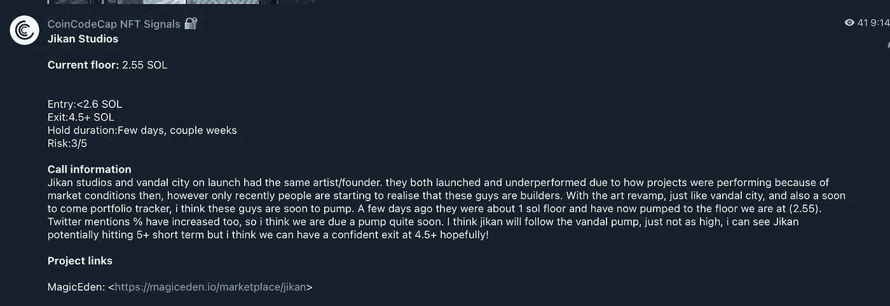**

**Example of NFT Signal**

**此外，我们为您选择合适的 NFT 套装。你唯一要做的就是跟随我们的贸易信号。**

## **CoinCodeCap 信号——利弊**

**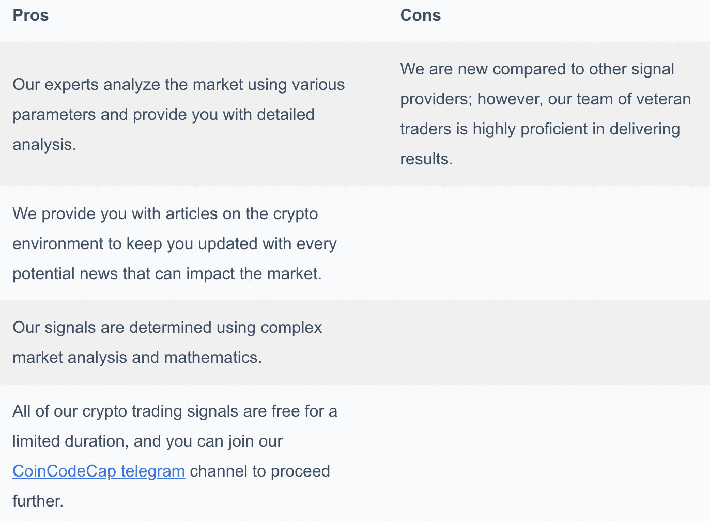**

# **2.经过验证的密码交易商**

**VCT 或[认证加密交易商](https://coincodecap.com/go/verified-crypto-traders)是业内最受欢迎的加密信号提供商之一。他们一直在提供专业的优质分析视频，以及更多业内的良好体验。**

**此外，作为一组在各种市场投资和交易方面拥有丰富专业知识的分析师，他们不断磨练自己的技术分析能力，并对加密资产和加密信号的基本面进行研究。**

**加入官方 [VCT 电报频道](https://coincodecap.com/go/verified-crypto-traders)，获得免费密码分析。**

**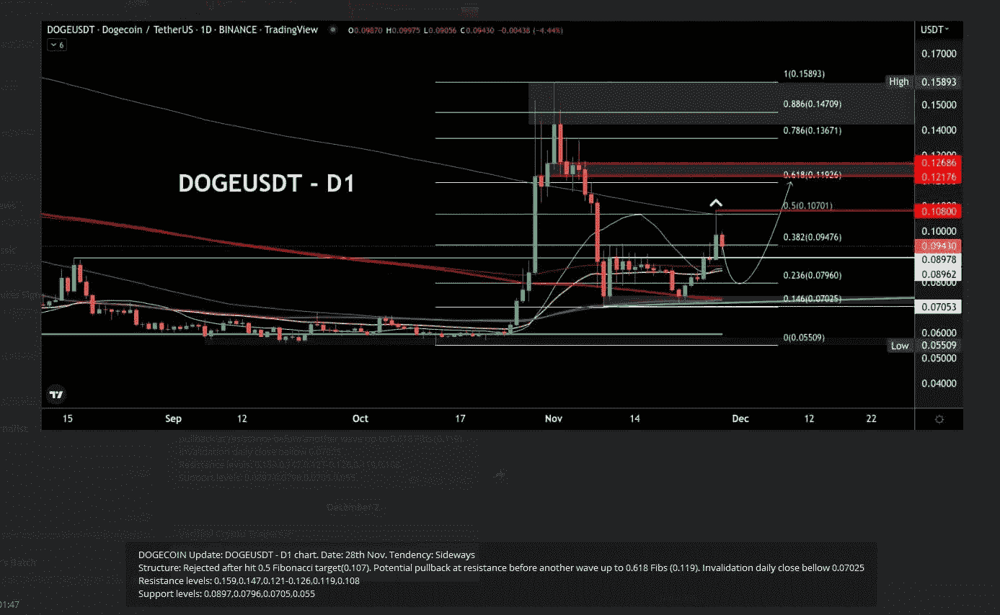**

**Analysis by VCT**

# **3.肥胖信号**

**Fatpigsignals 是世界上最大和最著名的加密信号提供商之一。六年多来，一直在提供一个[免费电报频道](https://t.me/fatpigsignals)和一个 [VIP 团体](https://www.fatpigsignals.com/store/)。非常专业的交易者使用 Fatpigsignals 作为信号提供者，因为他们有超过 80%的获利回吐率。但一如既往，这是一个快照！此外，Fatpigsignals 与 Algo 球配合使用。一个自我编程的[算法](https://www.twitch.tv/fatpigsignals)支持交易者，给你更多的市场机会，并为你的交易提供最好的进场和出场点[。可以随时免费关注](https://www.twitch.tv/fatpigsignals) [Algo Balls](https://www.twitch.tv/fatpigsignals) 直播。你可以在这里获得更多关于 Fatpigsignals 的信息:**

** [## 你应该使用肥猪信号加密信号警报的 5 个理由！

### 如果你想在加密货币交易中取得成功，你需要很好地了解市场。交易决策必须…

medium.com](/@fatpigsignals/5-reasons-why-you-should-use-the-fatpigsignals-crypto-signals-e1c732cb664) 

# 3.火箭钱包信号

加密交易信号通道 [Rocket Wallet Signals](https://t.me/RocketWallet_Official.) 完全基于 Telegram 平台。该频道成立于 2020 年 9 月 1 日，提供完全透明、公开交流的现货和期货信号。在伪装成合法信号提供商的欺诈性媒体的冲击下，Rocket Wallet Signals 专注于其透明和诚实的通信社区。Rocket Wallet Signals 以对市场不动感情而自豪。

随着越来越多的人进入密码行业，对可靠和值得信赖的信息的需求变得越来越大。该团队由两名经验丰富的交易员组成，他们拥有超过 7 年的加密交易经验。他们来自法国，支持法语、英语和西班牙语。

根据我们的信息，火箭钱包信号网站仍在开发中。欲了解更多信息，请加入以下频道

[立即加入火箭钱包频道！](https://t.me/RocketWallet_Official.)

个人关注，联系业主亚当；他很友好，随时准备帮助你！正如我们所说的，信号的质量是好的，并且结果[可以通过这个链接](https://safetrading.today/traders/crypto-rocket-signals/)来检查！请仔细检查渠道 ID，以免上当受骗！

关于加入 VIP 频道的咨询，[访问火箭钱包机器人](https://t.me/RocketWalletBot.)。

# 4 硬币信号

[Coin Signals](https://t.me/coin_signals) 是一家全自动加密信号服务提供商。该平台通过电报运行，自动化基于人工智能(AI)和机器学习(ML)。硬币信号还提供加密信号机器人，以完全自动化加密交易信号提供的交易机会。

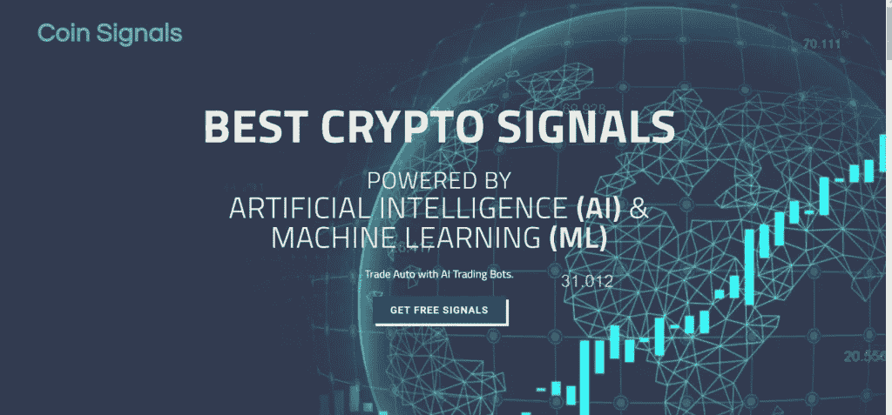

## 硬币信号提供什么？

硬币信号是一个智能系统，建立在许多专业交易者的经验之上。人工智能扫描多个交易所，寻找所有可用的市场机会，并为您提供最佳的交易进场点和出场点。

## CoinSignals —特征

*   该平台提供加密市场的免费新闻和事件更新。
*   Coin Signals 为其用户提供基本的加密交易信号。
*   该平台为[币安](https://blog.coincodecap.com/go/binance)和 [BitMEX](https://blog.coincodecap.com/go/bitmex) 提供信号。
*   电报频道还提供加密市场分析和图表，可以帮助您了解市场状况。
*   Coin Signals 还提供个性化的付费加密交易信号服务，在 BTC 进行支付。

## 硬币信号——利弊

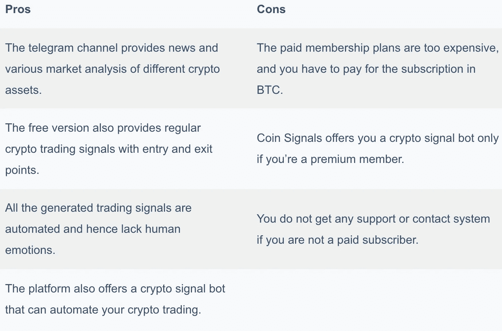

# 5.[交易视图](https://www.tradingview.com/?offer_id=10&aff_id=24152)

TradingView 以其交易图表和工具而闻名，许多交易者免费发布他们的市场分析。你可以在平台的想法部分观察所有的交易想法。你可以用一系列的东西来对想法进行分类，最好的选择是[编辑的精选](https://in.tradingview.com/ideas/editors-picks/)。

因此，TradingView 可以被认为是一个信号来源，因为你可以分析不同交易者的策略，并选择你认为最好的一个。

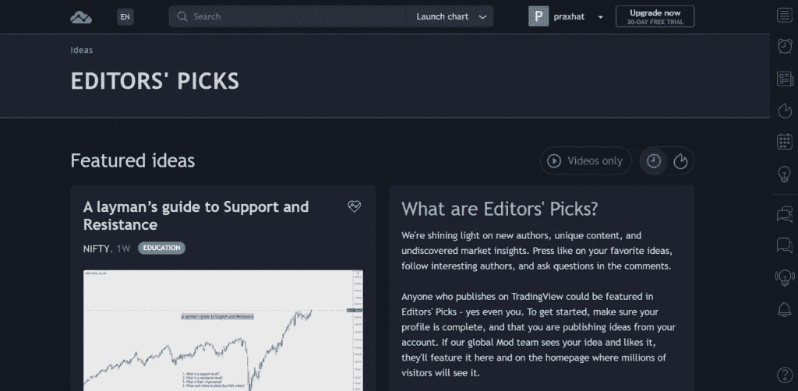

## TradingView 平台提供了什么？

交易者主要使用这个平台来绘制和分析市场。它为用户研究市场运动模式提供了全面的工具。可以画直线，三角形，矩形，使用各种技术指标如 RSI，MA，[布林线](https://en.wikipedia.org/wiki/Bollinger_Bands)等。，并分析市场。

交易者使用这些工具并在 TradingView 上发布他们的分析，其他交易者可以使用这些工具来了解市场。

## 交易视图-功能

TradingView 有很多特性，我们可能无法在这里一一介绍；但是，其中一些功能如下:

*   编辑们挑选的是这个平台上最好的交易想法。
*   你也可以根据他们的趋势分析，技术指标，模式等来分析所有的想法。
*   平台上所有可用的想法都有解释、图表、分析，有时甚至还有进出场价格。
*   TradingView 允许你使用图表和市场上所有可用的工具来测试你的想法。

## 交易观——利弊

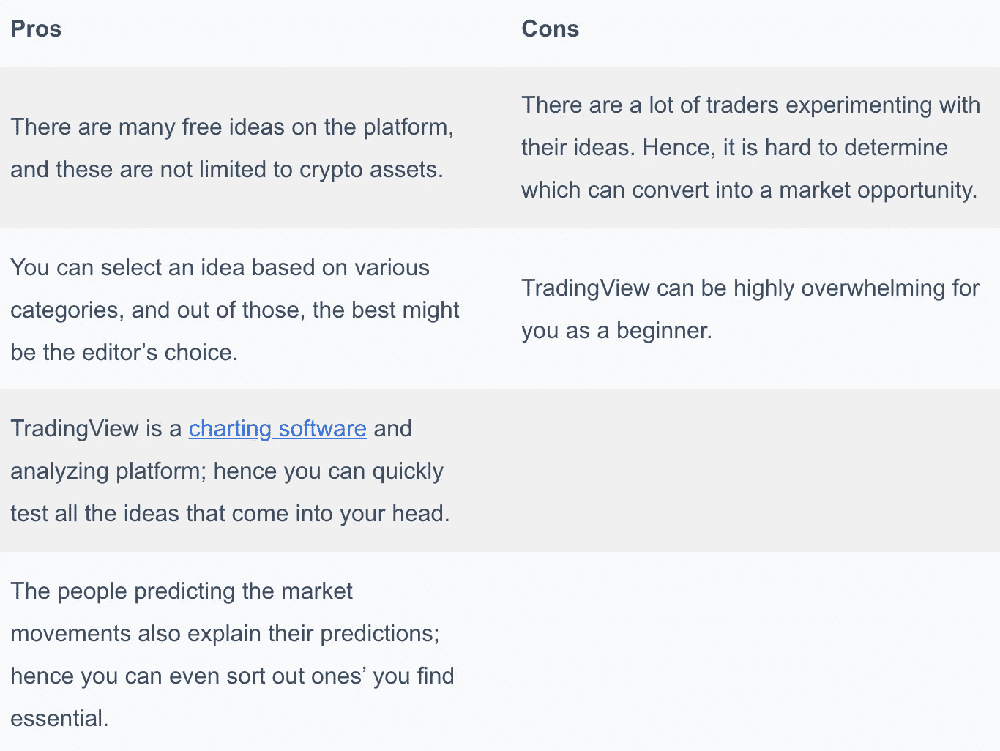

# 6- **币安杀手**

一个名为[币安杀手](https://t.me/binancekillers)的专门的加密货币交易员团体已经聚集在一起，以提高他们的交易技能和成就。作为他们俱乐部的成员，您将获得关于加密货币行业最新发展的深入市场研究和辩论。

币安杀手集团的成员来自不同的背景，有丰富的交易经验。他们一起分享信息和交易策略，帮助彼此做出明智的交易选择。为了改善用户的投资前景，该网站主持关于当前交易机会的辩论，并传播关于潜在交易的信息。

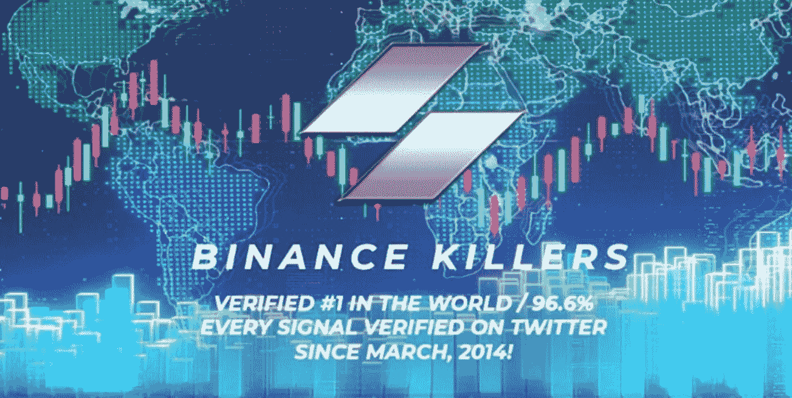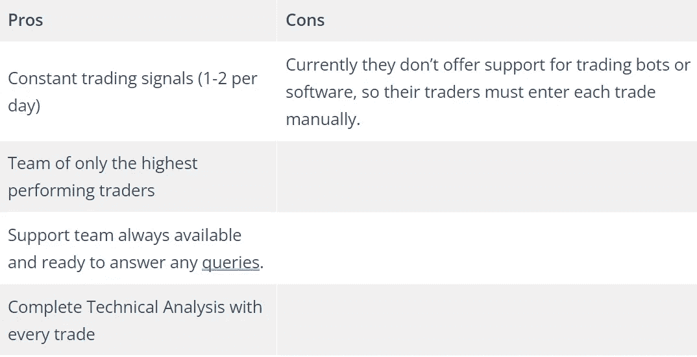

***还有，可以申请 VIP:***

[***https://forms.gle/FHJDfhTd4Kngc6bH9***](https://forms.gle/FHJDfhTd4Kngc6bH9)

# 7- **美联储。俄罗斯内部人士**

[美联储。Russian Insiders](https://t.me/FedRussianInsiders) 是一个由经验丰富的加密货币交易员组成的享有盛誉的团体，他们携手合作，提高交易专业技能，取得成功。作为他们小组的一员，你将从平台的专业交易员那里获得复杂的市场分析和评估。该网站允许用户分享交易和交易方法，并帮助每个人做出明智的交易选择。

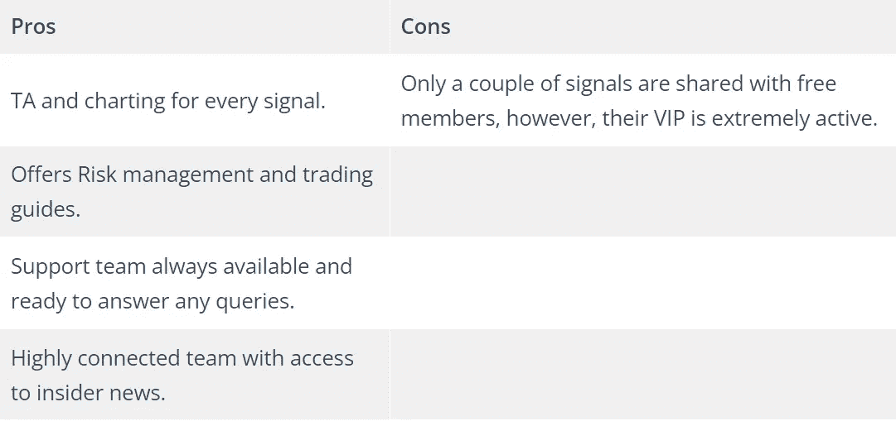

***周五:已注册:VIP:***

# *8- **加密内圈***

*被称为 Crypto Inner Circle 的专业比特币期货交易员团队定期相互分享经验、策略和市场分析，以激励和提升彼此。*

*作为加密核心圈的一员，你可以使用各种工具和资源，这将帮助你提高交易能力。你可以参加由经验丰富的比特币期货交易员主持的对话，并与其他成员讨论最近的市场趋势和交易策略。*

*Crypto Inner Circle 社区的成员是各种各样的人，他们热衷于交易比特币期货，并对加密货币行业有着透彻的了解。此外，该平台诚挚邀请任何想要提高交易技能的人，无论背景或经验水平如何。*

****加入他们的电报通道:***[***https://t.me/cryptoinnercircle***](https://t.me/cryptoinnercircle)*

# *自由加密信号:结论*

*密码交易信号为初学者提供了一个在学习密码市场的同时赢得交易的机会。市场上有很多付费的信号提供商，有些向你收取非常高的费用。*

*此外，许多信号提供商不为您提供了解市场的机会。因此，我们想出了最好的免费加密交易信号给你。所以，现在就加入我们的 [CoinCodeCap 电报频道](https://blog.coincodecap.com/go/coincodecap-channel)。*

# *常见问题*

*最好的加密交易信号是什么？*

*有很多东西，比如成功率，你付出的金额，信号提供者的经验等等。，决定信号的质量。选择具有这些特征的交易信号提供商是一项繁琐的任务；因此，这里列出了最好的加密交易信号:*

*   *[CoinCodeCap](https://blog.coincodecap.com/go/coincodecap-channel)*
*   *[经核实的秘密交易商](https://blog.coincodecap.com/go/verifiedcryptonews) (VCT)*
*   *[公牛](https://blog.coincodecap.com/go/bull-crypto)*

***最好的加密信号机器人有哪些？***

*几个加密信号机器人帮助你自动化你的交易之旅。然而，大多数加密信号提供商使用 [Cornix](https://blog.coincodecap.com/go/cornix) 加密信号机器人通过电报高效工作。你也可以选择其他的[交易机器人](https://blog.coincodecap.com/best-crypto-trading-bots)，根据你的需求进行定制。*

***如何获得高质量的加密信号？***

*优质的加密信号取决于许多因素，如频率、市场分析、止盈、止损、[交易机器人](/coinmonks/crypto-trading-bot-c2ffce8acb2a)、成功率等。寻找一个提供所有这些特征的加密信号提供者是一项单调乏味的任务。因此，您可以阅读我们关于[最佳加密交易信号](https://coincodecap.com/best-crypto-signals-telegram)的文章，选择适合您需求的提供商。*

***什么是加密信号应用？***

*play store 上有许多加密信号应用程序，其中大多数通常是骗局。最好的加密交易信号提供商使用 Telegram 或 Discord 等应用程序，以方便与他们的用户沟通。*

> *加入 Coinmonks [电报频道](https://t.me/coincodecap)和 [Youtube 频道](https://www.youtube.com/c/coinmonks/videos)获取每日[加密新闻](http://coincodecap.com/)*

## *另外，阅读*

*   *[复制交易](/coinmonks/top-10-crypto-copy-trading-platforms-for-beginners-d0c37c7d698c) | [加密税务软件](/coinmonks/crypto-tax-software-ed4b4810e338)*
*   *[网格交易](https://coincodecap.com/grid-trading) | [加密硬件钱包](/coinmonks/the-best-cryptocurrency-hardware-wallets-of-2020-e28b1c124069)*
*   *[密码电报信号](http://Top 4 Telegram Channels for Crypto Traders) | [密码交易机器人](/coinmonks/crypto-trading-bot-c2ffce8acb2a)*
*   *[最佳加密交易所](/coinmonks/crypto-exchange-dd2f9d6f3769) | [印度最佳加密交易所](/coinmonks/bitcoin-exchange-in-india-7f1fe79715c9)*
*   *[面向开发人员的最佳加密 API](/coinmonks/best-crypto-apis-for-developers-5efe3a597a9f)*
*   *最佳[密码借贷平台](/coinmonks/top-5-crypto-lending-platforms-in-2020-that-you-need-to-know-a1b675cec3fa)*
*   *[加密交易机器人](/coinmonks/crypto-trading-bot-c2ffce8acb2a)*
*   *[杠杆代币的终极指南](/coinmonks/leveraged-token-3f5257808b22)*

*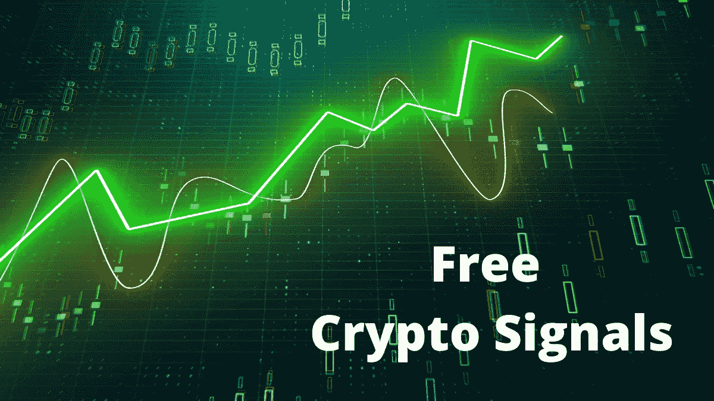***