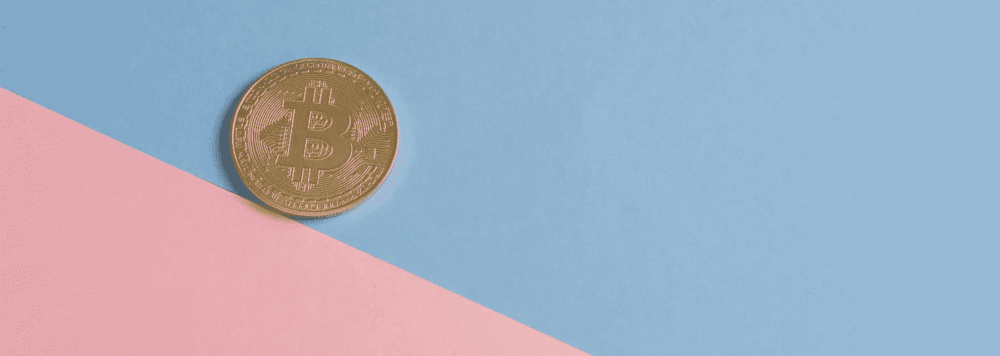
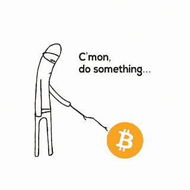
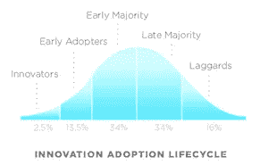

# 非程序员在 6 个月或更短时间内学习区块链理工大学的免费指南

> 原文：<https://medium.com/coinmonks/free-resources-to-get-a-blockchain-job-in-6-months-or-less-for-non-coders-5ddee72fbc7b?source=collection_archive---------0----------------------->

## 你可以在 6 个月内轻松学到足够找工作的知识，而且是免费的。区块链行业不仅仅是程序员的天下。每个职位都有需求:文案、营销人员、项目经理、销售主管等等。

This article was written by the Competitive Intelligence & Data Studio team at [https://www.datastudiopro.com/](https://www.datastudiopro.com/)

## 你想了解区块链吗？

开始的最佳时间是 9 年前。第二好的时间是现在*。*

现在加入这场运动还为时不晚。

[source](https://giphy.com/gifs/bitcoin-siteredditcom-ySj7uxLzEIumQ) — how it felt for those buying crypto in 2018

我们都希望自己能早点参与进来，不想觉得自己错过了机会。

许多人最终只是购买了加密货币，但这些人今年的表现并不太好。

**也许不值得在游戏进行到这么晚的时候拿自己的钱去冒险，除非你碰巧是个专家。**

好消息是，你仍然可以在不进行风险投资的情况下开始……你需要做的只是自学底层技术。这是在区块链行业获得工作的第一步。这是一个火热的就业市场，对那些对区块链理工大学有基本了解的人来说，支付的溢价很高。

> 这需要付出艰苦的努力，但比你想象的要容易。

所以，让我重复我之前说过的:**任何人都可以在区块链行业找到工作，即使他们不会编码。**

问题是，大多数文章和课程对普通人来说都太复杂了。他们假设你是一个计算机科学专业的学生或者经验丰富的程序员…

但是，你知道吗…区块链对其他人也很重要。

> ***我写这篇文章是为了避免你把钱浪费在关于加密货币和区块链*** *的付费课程上。有大量免费资源比付费资源更好。这篇文章有你成为区块链专业人士所需的一切，而且是免费的。你可以在 6 个月内轻松掌握这些材料，并且知道足够多的信息来被雇佣。*

*已经确切知道自己在找什么了吗？跳到“参考资料”部分。*

# 为什么要学习区块链？

*以防你需要一些动力来开始。*

信不信由你，区块链科技仍然处于采用曲线的早期。今天开始学习就像 90 年代末开始学习 web 开发一样。实际上，你可以在几个月内就被雇佣，或者在几年内成为该领域的专家。

> "如果有淘金热，不要做淘金者，要做卖鹤嘴锄和铲子的人."合适的机会并不总是显而易见的。

所以你为什么要抓住这个机会，现在就开始学习呢？

*   **比特币/以太坊等加密货币。是有风险的。他们的价格不稳定。很难预测他们要去哪里。但是，顶级公司对区块链技术公司的招聘是稳定且持续增长的。工作机会比合格的工人多得多。**
*   这是一个非常火爆的就业市场。这些工作也不仅仅是程序员的工作。文案、营销人员、项目经理、销售代表…几乎你能想到的每个部门或职位都非常需要对区块链理工大学有基本工作知识的工人。
*   **待遇确实不错。**说真的……我有没有提到这些工作报酬很高？平均比非区块链同类产品高出 20-30%。我经常看到有区块链工作经验的人会得到 50%的额外报酬。

# 那么，你会学到什么？

你将会学到足够多的区块链技术知识，从而获得一份非技术性的工作。**但是，这是什么意思呢？**

这并不意味着你需要能够编写自己的区块链，或者理解加密背后的高级数学。

这确实意味着你将学会清楚地交流使用区块链的各种技术。你会明白为什么区块链很重要。你将能够描述限制和基本机制。而且，你会明白区块链的大流行语。

归根结底，这更像是学习一门语言，而不是一门科学。

所以，如果你确信，这里是你开始需要的。

# 顶级资源——我找到的最好的区块链课程、文章和书籍的快速总结。

*你不需要知道如何编码就能入门，我保证。*

*   **我的#1 挑:** [**伯克利的区块链课**](https://blockchain.berkeley.edu/decal/sp18/fund/) **。**如果你只想做一件事来了解区块链，那就参加这个免费的在线课程吧。讲座在 YouTube 上[课程在伯克利网站](https://youtu.be/OSriZ_SeTfk)上[。在看讲座前做指定阅读。你可以根据需要反复观看讲座。我故意从头到尾看了一遍。然后我会再看一遍，每当我看到一个令人困惑的部分时就会暂停。光是这门课就足以让你为许多非技术性工作做好准备。](https://blockchain.berkeley.edu/decal/sp18/fund/)
*   [**数字黄金作者纳撒尼尔·波普尔**](https://amzn.to/2Ixr8Bt) ( *付费，但值得* ) 是关于比特币的起步和区块链历史的最好的书。我保证它会让你对在这个行业工作感到兴奋。[https://amzn.to/2Ixr8Bt](https://amzn.to/2Ixr8Bt)*如果你不想付费，可以在亚马逊上免费试用 Audible，免费获得有声读物。*
*   [**《超越区块链》**](https://www.nytimes.com/2018/01/16/magazine/beyond-the-bitcoin-bubble.html) 《纽约时报》的文章和 [**《区块链连线指南》**](https://www.wired.com/story/guide-blockchain/) 是我挑选的最佳文章，可以让你这个非技术读者快速上手。如果《连线》杂志的文章对你来说太过科技术语化，那么试试这些 [**bitdegree 文章**](https://www.bitdegree.org/tutorials/blockchain-explained/) ，它们从简单开始，很好地解释了每个新术语。
*   下次你看 youtube 的时候，试着看几个 [**区块链和比特币介绍视频**](https://www.youtube.com/results?search_query=blockchain%7Cbitcoin+intro) 。一个好的策略是看几部(至少 5 部)。每一个都会给你一个稍微不同的视角。你会发现重复的主题和最常见的区块链流行语。下面是 5 个不同层次的细节: [**在 2 分钟内了解区块链**](https://www.youtube.com/watch?v=r43LhSUUGTQ)**【2 点】 [**一个区块链如何工作**](https://www.youtube.com/watch?t=63s&v=SSo_EIwHSd4)**【5 点 59】[**比特币:加密货币如何工作**](https://www.youtube.com/watch?v=kubGCSj5y3k)**【9 点 25】[**安德里亚斯·安东诺普洛斯比特币简介**](https://www.youtube.com/watch?v=l1si5ZWLgy0)******
*   ******[**傻瓜区块链**](https://www-01.ibm.com/common/ssi/cgi-bin/ssialias?htmlfid=XIM12354USEN) 是一本来自 IBM 的令人惊讶的好书，它首先解释了区块链，然后帮助你判断它是否适合你的业务。它为您提供了了解企业如何考虑使用区块链技术的所有要点。如果你正在考虑行业内的销售/营销，这将让你了解企业级客户的想法。******
*   ********是你想尝试一些编码的最佳选择。我知道我说过这是给非编码人员的…但是如果你想尝试一下，这是一个很好的方法来看看你是否喜欢它。它并不适合所有人，但它会给你一个最快最简单的介绍。********

************

# ******乔希的免费区块链资源的完整列表******

******这是我能为非编码人员找到的所有“好东西”。******

> *********处理该材料的最佳策略****——从列表中选择一门课开始。然后通过阅读至少其中一本书，观看我列出的所有视频，阅读所有文章来为它做准备。用你新发现的区块链知识完成课程。一旦你完成了，选择你最喜欢的区块链项目，阅读白皮书(你现在可以完全理解)并开始与项目社区中的其他人互动。这会让你领先于 99%的其他求职者。*******

## ****班级****

*   ****[**伯克利的区块链课**](https://blockchain.berkeley.edu/decal/sp18/fund/) 我之前说过，但我觉得这是目前最好的免费课了。 [**讲座在这里**](https://youtu.be/OSriZ_SeTfk) 而 [**班的课程表在这里。**](https://blockchain.berkeley.edu/decal/sp18/fund/) 课程深入，逐渐过渡到更多的技术材料。慢慢来，如果遇到问题就重新看一遍讲课内容，并做指定阅读。****
*   ****[**可汗学院比特币课堂**](https://www.khanacademy.org/economics-finance-domain/core-finance/money-and-banking/bitcoin/v/bitcoin-what-is-it) 可汗学院在用清晰易懂的方式解释主题方面做得非常好。这门课更注重功能性，而不是整个行业或历史。你可以以任何速度上课，并在过程中提问。对于那些纠结于技术概念的人来说非常棒。你可以把它和这里列出的任何课程放在一起，帮助你完成技术部分。****
*   ****[**Udemy:加密货币与区块链简介**](https://www.udemy.com/introduction-to-cryptocurrencies/) 在我看来，这是 Udemy 上最好的免费课程。我一般不在这里上课，但是对于那些喜欢 udemy 的人来说，这是我建议的课程。****
*   ****[**普林斯顿比特币课程**](http://bitcoinbook.cs.princeton.edu/) (更技术性)如果你想要更有挑战性的东西，试试这个。网站上有教科书和所有的讲座以及课程材料。它面向那些有技术背景和一些基本计算机科学知识的人。****

## ****书****

*   ****[**数字黄金作者纳撒尼尔·波普尔**](https://amzn.to/2Ixr8Bt) ( *付费，但可获得免费期权*)这本书以一种可以理解和令人兴奋的方式讲述了比特币/区块链的故事。它一定会让你更有动力去学习更多！https://amzn.to/2Ixr8Bt*如果你不想付费，在亚马逊上免费试用 Audible，你就可以免费得到这本有声读物。*****
*   ****[**加密货币的时代**](https://amzn.to/2KWncLg) ( *付费，但可免费选择*)这本书是为非技术读者写的，旨在让你对区块链技术的未来感到兴奋。[https://amzn.to/2KWncLg](https://amzn.to/2KWncLg)*和以前一样，你可以在亚马逊上免费试用 Audible，免费获得有声读物。*****
*   ****[**掌握比特币**](https://amzn.to/2J7HtR2) **安德里亚斯·安东诺普洛斯**。有非技术性介绍的技术书籍。你只需要非技术部分，所以你可以在 O'Reilly 网站上使用免费试用[，悠闲地阅读一个多星期。另外，我注意到这本书的早期版本可以在网上免费获得，只要谷歌一下书名就可以找到。](http://shop.oreilly.com/product/0636920049524.do)****
*   ****[**普林斯顿比特币&加密货币技术**](https://d28rh4a8wq0iu5.cloudfront.net/bitcointech/readings/princeton_bitcoin_book.pdf) 书。这很快就变成了技术，但它是免费的，前几节是非技术人员也能理解。立即下载。一旦你开始对区块链有了更多的了解，当你想对某个话题有更多的了解时，你可以参考这本教科书。****
*   ****来自 IBM 的 [**假人区块链**](https://www-01.ibm.com/common/ssi/cgi-bin/ssialias?htmlfid=XIM12354USEN) 。这给了一个简单易懂的介绍区块链。它还让您从企业层面了解企业如何决定是否使用区块链技术。如果你有兴趣在大公司工作，或者从事销售/市场营销，我建议你读读这个。****
*   ****想了解更多？**看看这张** [**精选免费图书清单**](https://github.com/TechBookHunter/Free-Bitcoin-Books) **。这个 git repo 包含了大量的免费电子书，供那些想要更多信息的人使用。它似乎半定期更新，并有一些像样的非技术内容。******

## ****文章****

*   ****[**超越区块链**](https://www.nytimes.com/2018/01/16/magazine/beyond-the-bitcoin-bubble.html) 《纽约时报》——一篇关于比特币背后的技术以及它如何远远超越加密货币的优秀长篇文章。****
*   ****[**区块链有线指南**](https://www.wired.com/story/guide-blockchain/)**——**对于有点科技背景的人来说。《连线》杂志很好地总结了这项技术的过去、现在和未来。****
*   ****十年过去了，没有人想出区块链 的用处——如果你想进入这个行业，你应该了解最大的批评者。Kai Stinchcombe 对区块链理工大学应用缓慢的批评引起了最多的关注。****
*   ****[**区块链搞什么鬼？**](https://hackernoon.com/wtf-is-the-blockchain-1da89ba19348) —我最喜欢的一篇用 4000 字以内解释技术的文章。****
*   ******B** [**itdegree 文章**](https://www.bitdegree.org/tutorials/blockchain-explained/)**——这些都是我最喜欢的教程式文章。它们涵盖了大多数基本的区块链主题。这些文章是为绝对的初学者而写的，但是有相当的深度。******
*   ******[**为什么大家都错过了加密货币最令人兴奋的功能**](https://hackernoon.com/why-everyone-missed-the-most-mind-blowing-feature-of-cryptocurrency-860c3f25f1fb)**——这是目前科技界非常热门的话题。它涵盖了加密货币提供普遍基本收入的途径。不管你是否支持这个想法，这个想法是流行的，并且很好理解。********

## ******录像******

*   ******没有时间做所有的事情？观看这 5 个介绍视频。他们从两分钟的基本解释开始，以加州大学伯克利分校长达一小时的全面介绍结束。
    —[***2 分钟了解区块链***](https://www.youtube.com/watch?v=r43LhSUUGTQ)**(2:00)
    —*[***一个区块链如何工作***](https://www.youtube.com/watch?t=63s&v=SSo_EIwHSd4)**(5:59)
    —*[***比特币:加密货币如何工作***](https://www.youtube.com/watch?v=kubGCSj5y3k)********
*   ******[**什么是比特币**](https://www.youtube.com/watch?v=Gc2en3nHxA4)**(1:36)**有史以来观看次数最多的比特币视频 V2**********
*   ********Vox 的 [**比特币如何像 80 年代的互联网**](https://youtu.be/W0qn3oPYo5c) (1:55)********
*   ******卫报的 [**比特币制造简单**](https://www.theguardian.com/news/video/2014/apr/30/bitcoin-made-simple-video-animation) (3:17)******
*   ******Vox [**为什么人们在区块链**](https://www.youtube.com/watch?v=jGfvkjzLrNw) (7:34)上购买卡通猫，帮助你了解区块链的各种用途。******
*   ******[**【19】产业区块链将瓦解**](https://www.youtube.com/watch?v=G3psxs3gyf8) (9:57)快速讲解区块链可以瓦解不同产业的各种方式。******
*   ******[**可汗学院简介视频**](https://www.khanacademy.org/economics-finance-domain/core-finance/money-and-banking/bitcoin/v/bitcoin-overview) (11:01)可能有点难以理解，但视频下方的问答部分将真正帮助您浏览材料。******
*   ******TED Talk [**区块链如何改变货币和商业**](https://www.youtube.com/watch?v=Pl8OlkkwRpc) (18:50)******
*   ******TEDxMorrisstown**[**区块链大规模简化**](https://www.youtube.com/watch?v=k53LUZxUF50) (22:55)********
*   ******Alex Tapscott 的 [**Google Talk:比特币革命**](https://www.youtube.com/watch?v=3PdO7zVqOwc) (56:38)******
*   ******上面已经贴出来了，但我想重申一下，这个视频(也是课程的一部分)是我们最好的介绍: [**伯克利区块链简介**](https://www.youtube.com/watch?v=jtznBfOhl3Q) (48:29)******

## ******就是这样。了解区块链技术所需的一切。******

******我计划将它扩展成一系列更详细的课程。这些将展示我学习区块链技术的每一步。您可以在此注册更新:******

******另外，请点击[follow]按钮来获得关于我的非编码人员的区块链课程的通知。******

******如果你有任何问题，尽管问。我很乐意尽我所能帮忙。******

******如果你从这篇文章中得到了一些价值，请随意捐赠给我的钱包。没有压力。但是一点一滴都是鼓励！******

*********比特币****:3c wjtuumpagrvxty 5 qu1p 3 vt LG 8 nak ZP* ***以太坊****:0x 5 e 51 F5 C5 c 06 EBD 40 BCE 325 a 5966 DD 4 bdcc 84 a 4d 1 CB
***lite coin****:mqyfernrozmywrbzac********

******或者，使用我的推荐链接注册 coinbase 或币安:******

***** [## 比特币基地——买卖数字货币

### 比特币基地是一个购买、出售、转移和存储数字货币的安全在线平台。

www.coinbase.com](https://www.coinbase.com/join/59594c35049ddb008cbf2524)  [## 区块链和加密资产交易所-币安

### 币安是一个区块链生态系统，由交易所、实验室、发射台和信息中心组成。币安交易所是…

www.binance.com](https://www.binance.com/?ref=22177905) 

> 加入 Coinmonks [电报频道](https://t.me/coincodecap)和 [Youtube 频道](https://www.youtube.com/c/coinmonks/videos)获取每日[加密新闻](http://coincodecap.com/)

## 另外，阅读

*   [复制交易](/coinmonks/top-10-crypto-copy-trading-platforms-for-beginners-d0c37c7d698c) | [加密税务软件](/coinmonks/crypto-tax-software-ed4b4810e338)
*   [网格交易](https://coincodecap.com/grid-trading) | [加密硬件钱包](/coinmonks/the-best-cryptocurrency-hardware-wallets-of-2020-e28b1c124069)
*   [密码电报信号](http://Top 4 Telegram Channels for Crypto Traders) | [密码交易机器人](/coinmonks/crypto-trading-bot-c2ffce8acb2a)
*   [最佳加密交易所](/coinmonks/crypto-exchange-dd2f9d6f3769) | [印度最佳加密交易所](/coinmonks/bitcoin-exchange-in-india-7f1fe79715c9)
*   开发人员的最佳加密 API
*   最佳[密码借贷平台](/coinmonks/top-5-crypto-lending-platforms-in-2020-that-you-need-to-know-a1b675cec3fa)
*   杠杆代币的终极指南
*   [7 个最佳零费用加密交易平台](https://coincodecap.com/zero-fee-crypto-exchanges)
*   [最佳网上赌场](https://coincodecap.com/best-online-casinos) | [期货交易机器人](/coinmonks/futures-trading-bots-5a282ccee3f5)
*   [分散交易所](https://coincodecap.com/what-are-decentralized-exchanges) | [比特 FIP](https://coincodecap.com/bitbns-fip)
*   [用信用卡购买密码的 10 个最佳地点](https://coincodecap.com/buy-crypto-with-credit-card)
*   [加拿大最佳加密交易机器人](https://coincodecap.com/5-best-crypto-trading-bots-in-canada) | [Bybit vs 币安](https://coincodecap.com/bybit-binance-moonxbt)*****