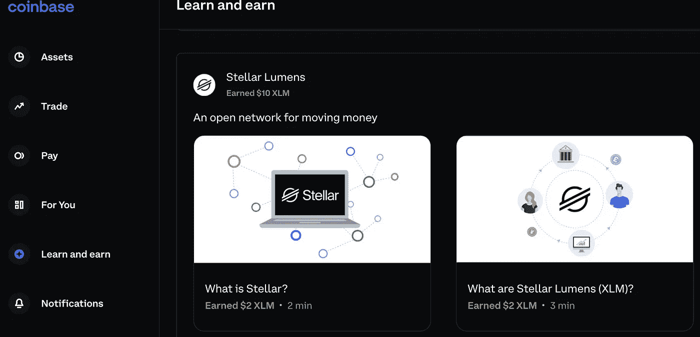
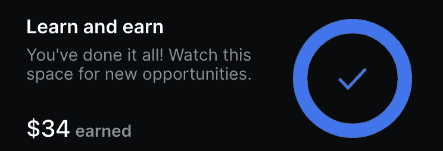

# 从 0 到 40 美元的加密

> 原文：<https://medium.com/coinmonks/from-0-to-26-in-crypto-fbf88a78bc8?source=collection_archive---------2----------------------->

如何在比特币基地上免费获得 40 美元？

> 比特币基地是最大和最受欢迎的加密交易平台之一。这是一个开启您加密货币世界之旅的绝佳平台。

如果你没有**账号，这个网址>>(**)<<会在你购买 **$100** 价值的密码时给你 **$10** 。****

# ****比特币基地挣得的测验答案:****

> ****[1。恒星流明](#c97b)****
> 
> ****[2。复合(COMP)](#626c)****
> 
> ****[3。【图表(GRT)】T19](#fb18)****
> 
> ****[4。【T21 乐队】(乐队)](#7aa7)****
> 
> ****[5。安普尔福思](#7061)****
> 
> ****[6。斯卡莱(SKL)](#3aa4)****
> 
> ****[7。多边形(MATIC)](#ea07)****
> 
> ****8。巴恩布里奇(邦德)****
> 
> ****[9。放大器](#e428)****
> 
> ****[10。三叶草金融(CLV)](#077e)****
> 
> ****[11。](#f46c)拉力赛(RLY)****
> 
> ****[12。Fetch.ai (FET)](#4da1)****
> 
> ****[13。卡特西(CTSI)](#6ea2)****
> 
> ****[14。跳票代币(拍卖)](#7a1b)****
> 
> ****[15。IoTeX](#a84c) (IOTX)****
> 
> ****[16。定量令牌](#164c)****
> 
> ****[17。iExec RLC](#4f45)****
> 
> ****[18。Jasmy 令牌](#efa8)****
> 
> ****19.[密码令牌](#8940)****
> 
> ****20.[渲染令牌](#8495)****

****我不是财务顾问，也不能吹嘘我投资各种风险项目的惊人经历。这只是一本关于如何从**比特币基地**获得**免费的价值 40** 美元的密码的手册。****

********

# ****如何赢得价值 40 美元的免费加密:****

******比特币基地赚**是流行的加密货币交易所，通过学习奖励用户。该平台有教用户各种加密货币的视频，如果你能正确回答这些问题，**比特币基地挣**会送你一些免费的硬币。这是**比特币基地测验**的完整答案列表:****

## ****恒星流明(XLM)测验答案:****

****1.一个将全球金融基础设施联合起来的分散协议。
2。促进低成本的普遍支付。
3。交易快速、便宜且全球化。
4。快速有效地发行、交换和转移代币
5。它依靠可信节点的合作来确认交易。****

> ****回答所有五个问题将在 XLM 赢得 10 美元。****

## ****复合(比较)测验答案:****

****1.赚取你的密码利息。
2。提供加密资产作为担保。
3。红利代币持有者。****

> ****回答所有这三个问题将赢得 9 美元的奖金。****

******图表(GRT)小测验答案:**
1。区块链数据。
2。GRT 代币。
3 .策展人
4 .委托给高质量的索引器。****

> ****回答所有这三个问题会让你在图表中获得 4 美元(GRT)。****

## ****乐队(乐队)测验答案:****

****1.真实世界的数据。
2 .神谕
3 .赚取加密奖励。****

> ****回答所有这三个问题将为你赢得 43 美元。****

## ****Ampleforth(第四次)测验答案:****

****1.Rebase.
2 .AMPL 来来回回。
3。DeFi 构建模块。****

> ****回答所有这三个问题将为你赢得 3 美元的奖金。****

## ****斯卡莱(SKL)测验答案:****

****1.任何以太坊应用。
2。将 SKL 委托给验证程序。
3。区块链的互联网。****

> ****回答所有这三个问题将在 SKL 赢得 3 美元。****

## ****多边形(MATIC)测验答案:****

****1 .以太坊
2 .验证器
3 .以太坊上的区块链互联网。****

> ****回答所有这三个问题将赢得 3 美元的奖励。****

## ****巴恩布里奇(邦德)测验答案:****

****1.去 Fi 风险管理协议。
2。APY 风险管理工具。
3。巴恩布里奇的治理令牌。****

> ****回答所有这三个问题将为你赢得 3 美元的保证金。****

## ****Amp (AMP)测验答案:****

****1.附属令牌。
2。即时结算保证。
3。AMP 奖励。****

> ****回答所有这三个问题将赢得 3 美元的奖金。****

## ****三叶草金融(CLV)测验答案:****

1.  ****具有交叉链相容性的 dApps。****
2.  ****三叶草金融钱包。****
3.  ****挑战****
4.  ****波尔卡多副链****
5.  ****网络钱包****

## ****拉力(RLY)测验答案:****

****1.一个用于发布社交令牌的分散式网络。
2。支付以太坊交易费用。
3。购买比特币。****

## ****Fetch.ai (FET)测验答案:****

****1.自动化任务的软件代理。
2。给 power Fetch.ai 代理。
3。与旅游和医疗保健等行业的自动化交互。****

## ****卡特西(CTSI)测验答案:****

****1.供开发者使用主流软件编写智能合约。
2。乐观汇总。
3。在 Cartesi Explorer 上委托或运行节点。****

## ****跳票(拍卖)测验答案:****

1.  ****一个分散拍卖协议。****
2.  ****创建或参与拍卖****
3.  ****您可以在 app.bounce.finance 使用 Bounce 应用程序。****

## ****IoTeX 令牌测验答案:****

1.  ****350 亿****
2.  ****使用智能设备生成数据****
3.  ****UCam 安全摄像头和 Pebble 数据跟踪器****

## ****Quant Token 测验答案:****

1.  ****总帐操作系统****
2.  ****总账网络****
3.  ****上述全部****

## ****iExec RLC 令牌测试答案:****

1.  ****上述全部****
2.  ****上述全部****
3.  ****一个帮助创建神谕的工具****

## ****Jasmy Token 测验答案:****

1.  ****访问 Jasmy marketplace 上的数据集****
2.  ****保护和掌控他们的数据。****
3.  ****亚洲****

## ****CRYPTEX 令牌测验答案:****

1.  ****一个为加密用户提供分散产品的 DAO****
2.  ****为 Cryptex 协议提供动力和安全的 ERC-20 治理令牌****
3.  ****一整套完全分散的密码令牌，全部由 CTX 管理****

## ****呈现代币测验答案:****

1.  ****一个分散的 GPU 渲染市场。****
2.  ****渲染 3D 作品。****
3.  ****3D 物体和环境的货币化。****

********

****当您完成测验后，您可以简单地将所有的**备用硬币**兑换成您选择的硬币。我已经把所有的硬币转移到 **AVAX，因为我用它来赌时间。******

******恭喜你，你完成了******！********

> ****加入 Coinmonks [电报频道](https://t.me/coincodecap)和 [Youtube 频道](https://www.youtube.com/c/coinmonks/videos)了解加密交易和投资****

## ****也阅读****

**** [## 杠杆代币[多头代币]终极指南

### 杠杆化令牌是具有杠杆化风险敞口的 ERC20 令牌，不考虑保证金、要求、管理…

medium.com](/coinmonks/leveraged-token-3f5257808b22)  [## 最佳加密交易所| 2022 年十大加密货币交易所| CoinCodeCap

### 哪一个是最好的加密交换？在本文中，我们将根据多种加密货币列出 10 大加密货币交易所

coincodecap.com](https://coincodecap.com/crypto-exchange)  [## 2022 年 2 月值得关注的三大游戏代币| CoinCodeCap

### 排名前 3 位的游戏也占交易总量的 85%以上。Defi 王国、Axie Infinity 和 Pegaxy…

coincodecap.com](https://coincodecap.com/top-3-gaming-tokens-to-look-out-for-in-february-2022)  [## 2022 年最佳加密交换平台| CoinCodeCap

### 随着时间的推移，我们大多数人将转向 dex 以获得更好的安全性和隐私。因此。在这里，我们将讨论…

coincodecap.com](https://coincodecap.com/best-swap-platforms)  [## 2022 年最佳加密和比特币赌场(美国批准，存款奖励)

### 接收、支付和赚取加密货币| |有各种各样的最佳在线赌场可供选择，有可能…

coincodecap.com](https://coincodecap.com/best-online-casinos)  [## 2021 年最佳加密借贷平台| 6 大比特币借贷平台

### 获得比特币和其他加密货币的最佳贷款利率

medium.com](/coinmonks/top-5-crypto-lending-platforms-in-2020-that-you-need-to-know-a1b675cec3fa)  [## 2021 年 6 大最佳硬件钱包|顶级加密硬件钱包[更新]

### 最好的加密货币硬件钱包是绝对必要的。我们将在 NGRAVE、Ledger Nano X 和…

medium.com](/coinmonks/the-best-cryptocurrency-hardware-wallets-of-2020-e28b1c124069)****