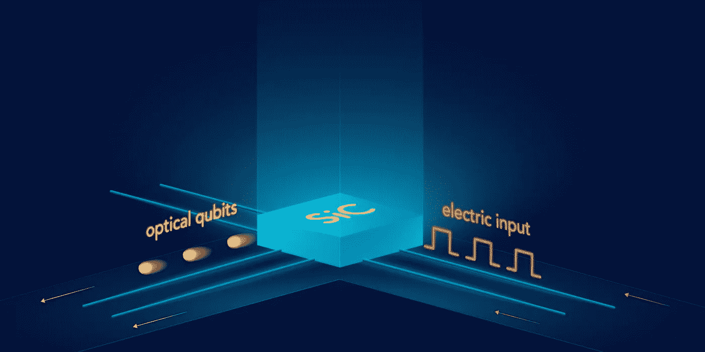

# 从区块链技术到量子计算，两个纠缠的领域

> 原文：<https://medium.com/coinmonks/from-blockchain-technology-to-quantum-computing-two-entangled-fields-f02e8da91c8?source=collection_archive---------3----------------------->

> 如果你允许的话，让我们不要那么技术性，而只是提供信息。

当你认为你理解了区块链技术的工作原理，并了解到它超越了比特币和加密货币，你开始注意到媒体科技文章中包括一个全新的可理解的词，感觉更像《星际迷航》中的形容词“量子”。

但是量子技术不是取自科幻小说系列，而是真实的现实。这方面的好例子是不同的公司正在探索利用量子物理现象来创造新技术和改进现有技术。谷歌、IBM 或阿里巴巴等大型科技公司正沉浸在一场“量子竞赛”中，以开发第一台能够提供比我们当前经典超级计算机更大计算能力的量子计算机(及其对我们社会的相应后果)。我们不需要去谷歌或 IBM 这样的大型科技公司，就能看到量子技术在我们日常生活中的应用。西班牙主要的电信公司 [Telefónica 已经在探索使用**量子技术来增强其商业光纤网络的安全性。**](https://www.telefonica.com/es/web/sala-de-prensa/-/telefonica-huawei-y-la-universidad-politecnica-de-madrid-realizan-una-experiencia-pionera-a-nivel-mundial-de-aplicacion-de-criptografia-cuantica-en-re)

你可能想知道，*这是什么量子物理？我不明白。*量子物理学是“非常微小”的物理学。当我们移动到原子水平时，我们看到“奇怪”的现象开始发生。其中一个现象是量子纠缠，这是电子和光子等基本粒子的一种性质。**当这些粒子中的两个物理上相互作用时，它们变得紧密相连，即使在分离之后**(并且相距数千公里)。它们以一种方式连接在一起，一个粒子的任何改变都会立即反映到它的纠缠对中。这种奇妙的(也是违反直觉的)现象开启了量子互联网等激动人心的工作领域的大门。**通过使用纠缠粒子，我们也许能够(并且，在一些限制下，我们已经能够)在遥远的点之间即时传输信息，**令人印象深刻吧？

[Physicists reveal material for high-speed quantum internet](http://www.opli.net/opli_magazine/eo/2018/physicists-reveal-material-for-high-speed-quantum-internet-march-news/) (source: opli.net)

*区块链科技在整个故事中扮演了什么角色？*区块链技术的基础是密码学。**当前的密码原语是基于使用 NP-hard 数学问题来保护信息，**例如整数的因式分解或与使用离散对数曲线相关的问题。这些问题是“困难的”，使用经典计算基本上无法解决，**但是量子计算机将能够几乎立即解决这些问题，打破当前全球使用的许多加密技术的安全性**(在互联网、银行应用、区块链等方面)。).为了在第一台商用量子计算机出现后免受此事的影响，一些密码学家和区块链平台正在探索使用抗量子攻击的密码原语(不是基于这些可通过量子技术解决的 NP-hard 问题)。

但是商用量子计算机在接下来的几年里还不会准备好，那么，量子技术目前对区块链技术的贡献是什么？区块链生态系统中的许多加密机制依赖于随机数的生成，例如为用户生成身份密钥对。在知道之前，**我们没有办法生成真正的随机数，我们只能依靠使用伪随机生成算法**，虽然概率很小，但可能导致两个用户最终拥有相同的密钥对(因此在网络中共享身份)。这就是量子技术的救援之处。由于**使用了利用量子现象扰动的粒子，我们有了一种方法来生成完全、自然、随机的数字，而不仅仅是伪随机的，**随后增强了区块链技术及其底层加密的安全性。

为了结束这篇简短的文章，让我们转到一个更令人兴奋的例子，量子技术在区块链生态系统中的应用。区块链网络使用区块来构建信息，每个新的区块都与前一个区块加密链接，因此经验证的区块的任何信息变化都会影响前一个区块，从而轻松检测到对存储信息的恶意修改。在这方面，新西兰研究人员在最近的一篇文章中提出了利用量子纠缠来创建一个量子区块链，而不是连接块，粒子被用来存储区块链信息。这些粒子纠缠在时间中，使得伪造信息变得不切实际。这意味着在量子区块链中，信息“天生”是不可变的。符合区块链的每个有效“块”的光子并不存在于当前时刻，而是存在于过去，它们可以通过与当前(块)光子的纠缠来访问。**操纵当前块(或者前一个块，如果我们可以直接访问它们的话)将意味着直接破坏区块链本身。**这类概念是让我爱上量子技术的。

这篇文章的摘要如下:**量子技术正在慢慢成为一个可触知的现实，具有彻底改变各种工作和技术的真正潜力，**量子互联网和区块链技术只是几个快速的例子。还记得几年前我们有一项伟大的颠覆性技术叫做区块链，它有改变事物的潜力，但是我们真的不知道如何正确使用它吗？嗯，我知道现在是我们用量子技术重走老路的时候了。让我们看看它将走向何方。这是创新工作的激动人心的时刻。

*乡亲们就这些！对我最亲爱的技术读者的最后一个评论，如果这是一个对你来说相当肤浅和笼统的帖子，不要担心，在接下来的帖子中，我将尝试分享我通过大量阅读获得的关于密码学、量子计算和量子信息的所有知识。敬请期待！*

👆 **Click to read today’s top story** 👆

> [直接在您的收件箱中获得最佳软件交易](https://coincodecap.com/?utm_source=coinmonks)

