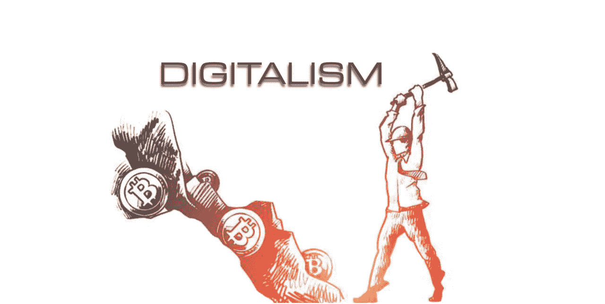

# 从资本主义到“数字主义”

> 原文：<https://medium.com/coinmonks/from-capitalism-to-digitalism-d9b7ea080493?source=collection_archive---------1----------------------->

除其他因素外，人类的进化一直受技术和科学进步的支配，这两者都与现实世界相互作用，并影响经济，从而影响我们的社会和生活。每一个历史时代，因而也是每一个经济和政治时代，都遵循着自己特定的历程，具有产生相对集体范式的特定特征。根据时间段，我们可以发现标志着经济脉络的变化，并与市场的需求和时代的“欲望”和“用途”产生的创新保持一致。由此可以提取出整个社会的大致轮廓，从而使其更加生动。

不同的经济模式导致不同社会阶层的产生(例如，从奴隶、角斗士、骑士和商人到体力劳动者、企业家等等)，每个时代都经过努力，并常常克服或多或少的惰性，制定了一系列规范和社会保护措施，这些规范和措施满足了当时的需要，并构建了一个如何更好地生活的模式。这些规则和保障可以被归类为一个社会赖以存在的“规则”,一种游戏的指导手册，一种人类的游戏，这种游戏是公平和可持续的。这是，或者应该是，每一套规则的“*使命*”，因此，自从有史以来，当——根据拉丁格言“ *Ubi homo，ibi societas。Ubi societas。因此，ubi homo，ibi jus*"——如何促进和平共处的第一个纲要建立了。

今天，我们不能不注意到深刻的变化，这些变化正在席卷我们的社会，并将彻底改变我们的社会。数字技术革命的互动与当前历史时刻的无数方面和领域之间有着明显的联系，特别是在工作领域。这些企业正在经历一场彻底的重组，其连锁效应将对整个集体产生广泛影响。

这并不新鲜:不用追溯历史，工业革命就是如此，今天的数字革命也将如此。事实上，此时此刻，我们发现自己处于与 19 世纪相同的状况，当时由机器引入工厂而引起的创新席卷了之前的世界社会。从那一刻起，改善工作条件和工作场所、生产对环境的影响、环境规范、学习权、福利以及许多其他方面的斗争开始了。从那个阶段开始，我们实际上创造了自由民主的模式和今天的政治和社会结构，这是历史上最好的。

如果第三次工业革命是由蓝领工人支付的，也就是说，那些曾经看到，甚至今天还看到，他们在社会中的角色在倒退的工人，那么等待着我们的新革命，尤其是区块链科技革命，将由白领工人支付，他们对工作的贡献将被大大重新定义。

正在发生的重大变化的迹象已经很明显:有一股反政治的风吹来，这不是偶然的。人们从强人那里寻求的支持多于从政党那里，这也不是偶然的。源于共同价值观的统一体系的公众凝聚力将被瓦解，其另一面是一种深刻的社会孤独感，这种孤独感会引起愤怒和失落感。所有这一切都是大众和全球精英之间差距不断扩大的结果，全球精英受过教育，数字化，在一个相互联系的数字化世界的逆风中顺利航行时，越来越受到限制，越来越强大。另一方面，我们发现中产阶级的扁平化，这是看到昨天的经济现实发生变化，并努力理解发展，并找到解决方案，为自己提供连续性。在新的全球数字世界中，这个群体已经失去了方向和身份。所有这一切都因巨大的隐私问题而变得更加复杂，隐私问题与自由和自决的概念并行不悖。

然而，我们永远也不会到达一个被称为“未来”的时刻，我们也不可能放弃我们在历史上以如此高的代价和通过规则系统所获得的一切，也就是说我们的自由民主、市场经济、不断和永远发展的社会保护的整个机制，以及公民权利和义务的原则。*智人*的真正力量是保持社会和公民凝聚力的线索，同时创造社会缓冲，并在经济和历史变化的基础上，学习如何编织一个系统的*规范*，这是著名的“指导手册”,一旦适应需要，它肯定会设定一个永远更好的社会的未来，但永远不会是一个完全完美的社会。一个古老的圣人的格言浮现在脑海中“无论发生什么，适合聪明的人”，这应该是我们的指南。

活在当下通常意味着生活在一个独特的、排他的时间泡泡中，但是生活在每个时代、每个时间段的人都有同样的感受。现在是什么，已经是什么，就像已经发生了什么，今天我们必须设计我们的未来，理解资本主义时代正在消退，我们正在准备自己生活在一个新的时代:数字化时代。

不管你喜不喜欢，很大一部分曾经是政治特权的权力，或者说是国家的社会和经济组织所固有的权力，如今正转移到数字实体的手中，这些实体甚至可能是私人性质的(想想谷歌、脸书和优步，仅举几例)。因此，*区块链*技术的分量是不可忽视的。从这一角度来看，我认为人们可能会同意，现在被理解为“权力和权利”的信息控制可以，或者说应该被分散并由网络共享，数字技术优势不能最终成为私人的特权，而是集体共享的财富形式。

必须召开政府圆桌会议来分析数字主义的影响程度，这些圆桌会议必须明白，完美风暴必须穿越，而不是屈服。激励竞争性创新，赞助创新性公共项目，包括在源头进行自我监管的可能性，进行立法干预，以建立一个灵活和有用的规则体系，阻止潜在的危险的权力集中，保护隐私权和真正自由的信息:所有这些，以及更多，都是必要的。或许我们已经迟到了。

解决办法和希望在于注重公共利益的法规，因此，对于一个和平和健康的社会来说，这些法规必须捍卫公共利益。Edward W. Younkins 在他的书*资本主义和商业，自由企业的概念基础*中清楚地表达了这一概念:“社会是一个自发的秩序，而国家是一个保护者，具有执行游戏规则的垄断角色。”

> *乔瓦尼·佩拉尼*

特别感谢[区块链 4 创新](https://www.blockchain4innovation.it/esperti/dal-capitalismo-al-digitalismo/)

*最初发表于*[*https://www.linkedin.com*](https://www.linkedin.com/pulse/form-capitalism-digitalism-giovanni-perani/)*。*