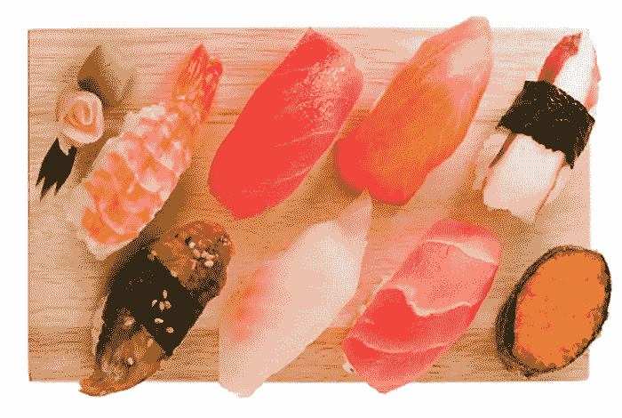
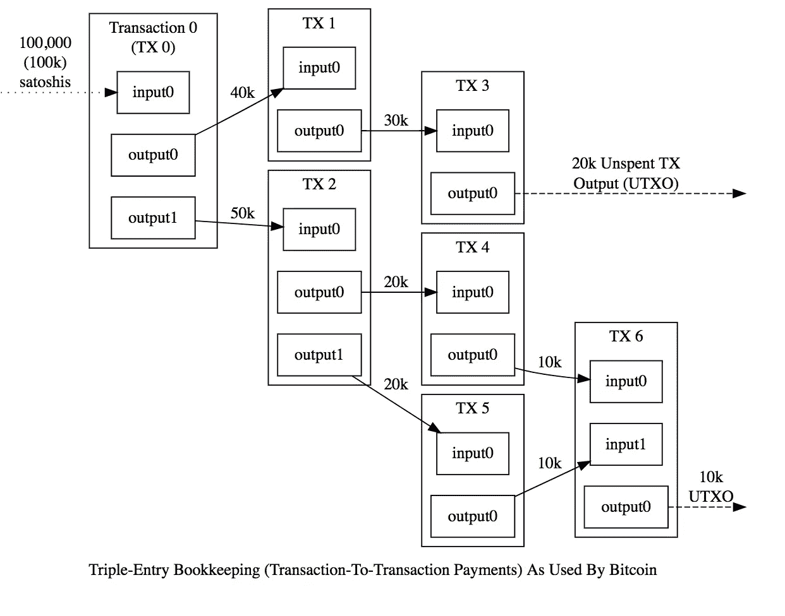
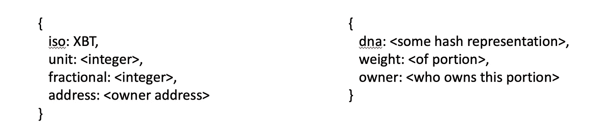
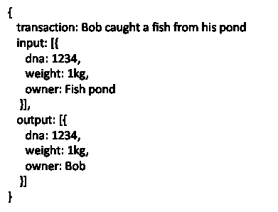
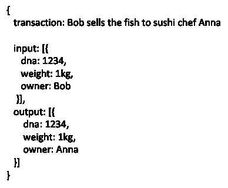
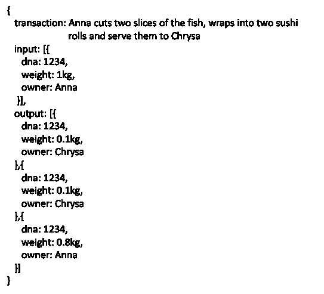
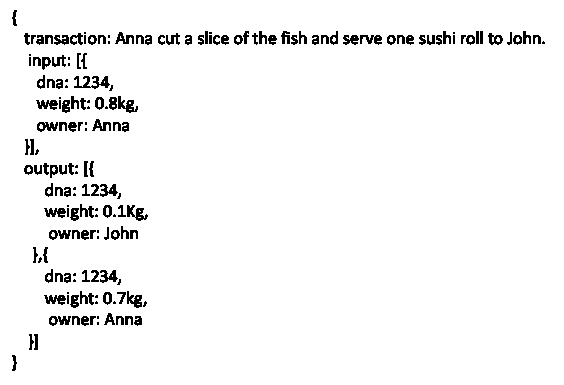
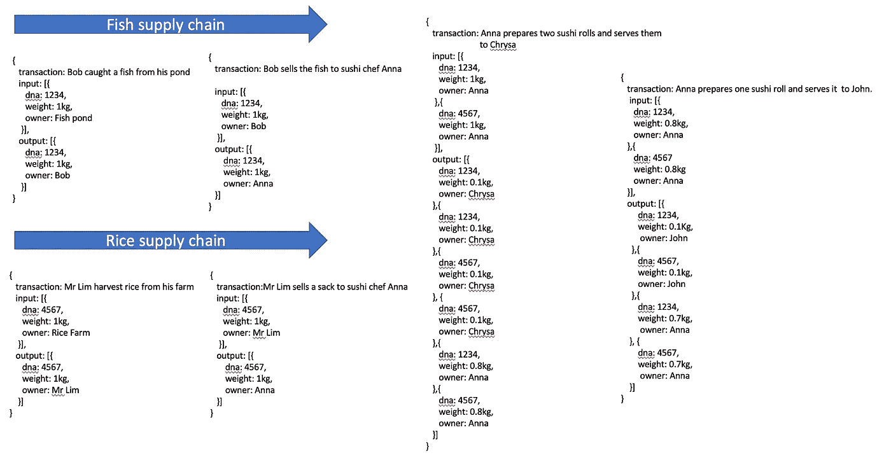

# 从鱼到寿司

> 原文：<https://medium.com/coinmonks/from-fish-to-sushi-in-utxo-20fa95e19a0a?source=collection_archive---------1----------------------->

Image source: [https://www.healthcastle.com/sustainable-sushi-good-ocean/](https://www.healthcastle.com/sustainable-sushi-good-ocean/)

从源头到消费跟踪和记录有价值的东西是任何供应链活动的核心。这项任务的复杂性取决于我们想要跟踪的事物的种类。

如果我们希望跟踪一条鱼，从它被捕获的地方，然后到它被交给鱼贩子的地方，作为一个整体，这个任务是相对简单的。现在，想象一个挑剔的寿司消费者坚持所有的原料都来自可证实的来源。

想象一下一条鱼从被抓住到变成寿司的旅程。这些大致是鱼必须忍受的假设交易:

*   鲍勃从他的池塘里抓了一条鱼；
*   鲍勃把鱼卖给寿司厨师安娜；
*   安娜切了两片鱼，包了两个寿司卷，端给了克丽丝；
*   安娜切了一片鱼，给约翰上了一份寿司卷。

在鱼变成寿司的整个过程中，让我们想象一种手机形式的技术，它能够提取任何形式的鱼的 DNA 散列和重量:整条或切片。Bob、John、Anna 和 Chrysa 收到了一款手机应用程序，他们可以用它给鱼拍照并更新账本。

当鱼经历上面提到的事务时，你如何对它的状态建模？

将它建模为一系列未用完的事务输出(UTXO)怎么样？

**未用交易输出(UTXO)**

UTXO 是比特币中使用的一种分类账形式，用于记录比特币在系统中花费的金额。如下图所示，比特币在系统中的数量及其分布被记录为交易产生的一系列输入和输出。关于比特币和 UTXO 如何工作的详细讨论请参考[https://medium . com/@ sunflora 98/UTXO-vs-account-balance-model-5e 6470 F4 E0 cf](/@sunflora98/utxo-vs-account-balance-model-5e6470f4e0cf)。

Image source: [https://bitcoin.org](https://bitcoin.org)

让我们用鱼来代替比特币，作为我们希望跟踪的东西，我们将以这种方式为我们的可疑资产建模:

Data structure: Left (hypothetical) bitcoin, right (data structure for fish)

接下来，让我们看看这个模型是如何被更新为与上述事务相关的一系列 UTXO 实例的。

**咱们 UTXO 吧！**

假设我们通过散列值为 1234 的 DNA 来跟踪这条鱼。

鱼首先要忍受的是被鲍勃抓住。这条 1 公斤重的鱼在被抓住之前就生活在鲍勃的池塘里。这记录在我们的 UTXO 中，如下所示。

接下来，鲍勃将鱼卖给爱丽丝，记录如下:

然后爱丽丝决定做两个寿司卷给克丽丝。Chrysa 吃掉了 Bob 卖给 Anna 的两个寿司卷，每个卷上有 0.1 千克鱼肉片。这笔交易记录如下。

安娜还剩 0.8 公斤鱼，然后做了一个寿司卷，递给约翰。记录如下所示:

您会注意到，鱼的任何剩余部分也被记录为输出，所有权分配给 Anna。这很有用，因为在鱼的整个生命周期中，我们可以准确地跟踪它在交易前的状态(即所有权)和交易后的状态。

**米饭呢？**

如果 Chrysa 和 John 是挑剔的消费者，并且也要求对大米从源头到寿司进行跟踪，该怎么办？

没问题。UTXO 可以很容易地用于跟踪多个供应链。让我们再次回顾寿司的例子。在本例中，我们通过大米的 DNA 来跟踪大米，其散列值为 4567。跟踪大米和鱼到寿司的 UTXO 模型如下所示。

从例子中可以看出，添加额外的生命周期跟踪是记录一系列输入和输出的简单例子。

**结论**

在这篇博客中，我演示了使用 UTXO 来跟踪寿司中的两种关键成分:米饭和寿司。

在传统的会计复式记账模式中，关注的焦点是价值物的所有者——即鱼和米。以鱼为例，我们将从鱼的所有者的角度记录资产的流动。我们将确定鱼是记入所有者的贷方还是借方。虽然我们可以使用双重会计通过在传统账户中将流动资产(如鱼和大米)记录为货币转移来反映鱼的所有权，但很难准确地追踪资产的来源。

UTXO 的重点是从事务的角度跟踪输入和输出。例如，“爱丽丝切鱼”是我们对鱼执行的一个事务。UTXO 记录事务的输入和输出。不需要复杂的关系机制就可以很容易地确定所有者。

诚然，这个用例有些做作，但是它展示了 UTXO 对复杂产品建模的能力，比如汽车、飞机、轮船等等。

考虑像汽车这样的产品。它由许多部分组成。在汽车的生命周期中，零件会磨损和更换。所以一辆车可能有相同的注册号码，因此法律上是同一辆车，实际上不是同一辆车。当每一个单独的零件都有自己的服务保证时，你就没有必要为整个汽车提供保证。

正如所展示的，UTXO 可以帮助解决供应链问题，包括具有复杂生命周期的事物。

> [直接在您的收件箱中获得最佳软件交易](https://coincodecap.com/?utm_source=coinmonks)

[**Click to read today’s top story**](http://bit.ly/2G71Sp7)