# 从恶性通货膨胀到加密:在资产泡沫和经济瘫痪的时代寻求财富保值

> 原文：<https://medium.com/coinmonks/from-hyperinflation-to-crypto-the-search-for-wealth-preservation-in-an-era-of-asset-bubbles-973ab5a62875?source=collection_archive---------1----------------------->

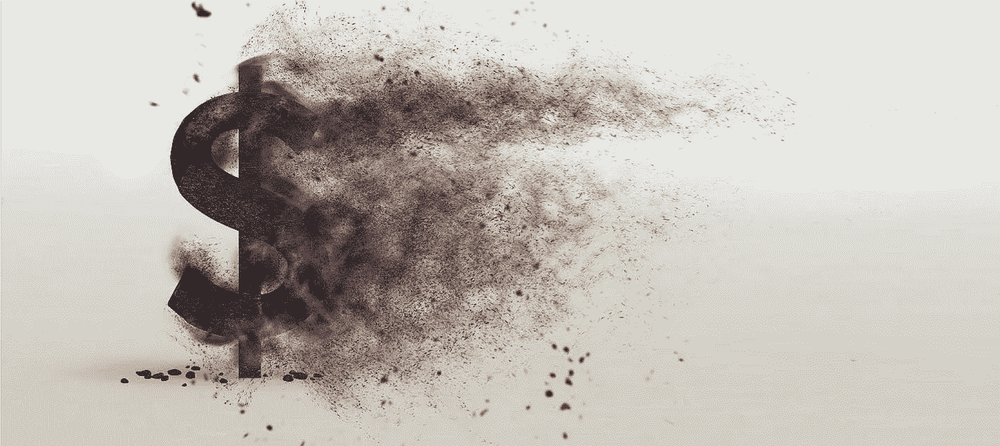

世界上有几个国家正在遭受恶性通货膨胀和/或失业率飙升的折磨。人们别无选择，只能放弃本国的货币，转而寻找其他有助于财富保值的方式、平台和资产。本文认为三种可能的资产类别是潜在的安全港:黄金、股票市场和密码。尽管黄金通常是一种很好的通胀对冲工具，但至少可以说，它在过去十年的投资表现平平。股市指数也处于历史高点，而基础经济体在与新冠肺炎的斗争中面临着几股负面力量。当谈到加密货币和加密世界时，社会上的大多数人都有一个不利的印象:它不安全，不稳定，不可信。关于价格暴跌、财务损失、黑客和犯罪参与的负面新闻是常态而非例外，给 crypto 的声誉蒙上了灰色阴影。然而，高通胀率国家的居民似乎正涌向这一相对较新的资产类别，以寻求财富保值。本文概述了上述国家及其人民面临的一些问题、潜在的避险资产、基于加密货币的解决方案背后的基本原理，以及在考虑加密钱包时需要进行的重要思考。

# **彭博痛苦指数——当恶性通货膨胀和失业率飙升的时候**

2014 年，委内瑞拉通胀率达到 69%，为全球最高。接下来的几年，这个国家不断打破纪录，恶性通货膨胀[年复一年地飙升](https://en.wikipedia.org/wiki/Hyperinflation_in_Venezuela#:~:text=Inflation%20rate,-BCV%20estimates&text=In%202016%2C%20Venezuela%20entered%20hyperinflation,rate%20has%20increased%20to%2053%2C798%2C500%25.)，在 2018 年达到令人震惊的 170 万%。那时，委内瑞拉政府决定停止公布官方通胀率。这使得彭博通过引入“车乐咖啡馆指数”来做出自己的估计，该指数只跟踪一件事:一杯咖啡在委内瑞拉的价格。尽管远不如传统的消费者价格指数复杂，彭博认为它“也有优点:它是有形的；定期跟踪；而且，鉴于它监测委内瑞拉人日常消费的产品，它提供了一个独特的近距离观察该国通货膨胀的机会。”

> “2014 年，委内瑞拉的通胀率达到 69%，为全球最高。接下来的几年，这个国家不断打破纪录，恶性通货膨胀年复一年地飙升，在 2018 年达到了惊人的 170 万%。
> 
> —委内瑞拉中央银行

然后是[彭博痛苦指数](https://www.bloomberg.com/news/articles/2020-08-06/misery-ranking-will-show-u-s-getting-worse-versus-rest-of-world)——亚瑟·奥肯的[痛苦指数](https://en.wikipedia.org/wiki/Misery_index_(economics))的更新版本——根据各国经济的“痛苦”程度对其进行评分，以失业率和通货膨胀率来衡量。委内瑞拉、阿根廷、南非、土耳其和哥伦比亚已经领先该指数好几年了。是的，委内瑞拉在过去的 6 年里一直是无可争议的第一名！

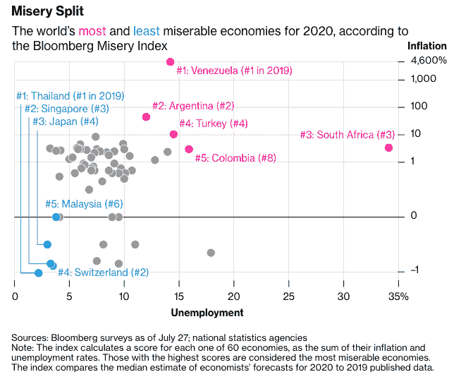

*The Bloomberg Misery Index 2020 featuring the top 5 most and least miserable economies out of 60 countries. Source:* [*Bloomberg*](https://www.bloomberg.com/news/articles/2020-08-06/misery-ranking-will-show-u-s-getting-worse-versus-rest-of-world)*.*

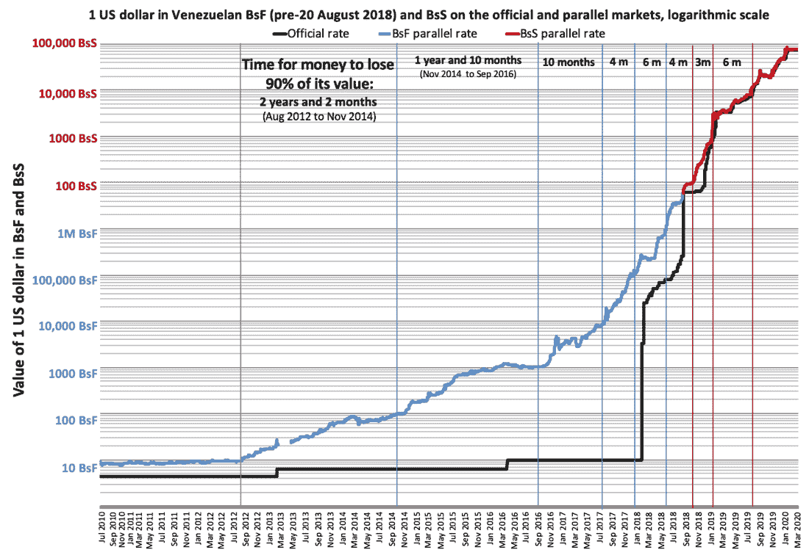

*The value of one U.S. dollar in Venezuelan bolívares fuertes (before 20 August 2018) and bolívares soberanos on the parallel (or black) market through time. Vertical lines represent every time the currency has lost 90% of its value, which has happened eight times since 2012\. The graph shows that as of March 2020, the currency is worth 750 million times less than it was worth in August 2012\. Since the beginning of* [*the presidential crisis in Venezuela*](https://en.wikipedia.org/wiki/Venezuelan_presidential_crisis) *in January 2019, the curve has been less steep than previously, meaning that the rate at which the value is lost,* [*inflation*](https://en.wikipedia.org/wiki/Inflation)*, has slowed down. Source: Wikipedia.*

与委内瑞拉类似，阿根廷比索在过去五年中对美元贬值了 90%。对土耳其里拉的信心也在下降，因为仅 2020 年的通胀率[就达到了 12%](https://www.statista.com/statistics/277044/inflation-rate-in-turkey/) ，而储蓄账户利率[从 8.5%降至 8.25%。新冠肺炎疫情只会让这些经济体雪上加霜，导致全国封锁、旅行限制、大范围失业、消费品需求下降和商业活动最少。由于经济形势依然严峻，这些国家的法定货币继续贬值，公民需要并正在转向其他形式的投资和交易，以保护其资产的内在价值。](https://countryeconomy.com/key-rates/turkey#:~:text=Turkey%20has%20lowered%20its%20interest,Banks%20to%20implement%20monetary%20policy.)

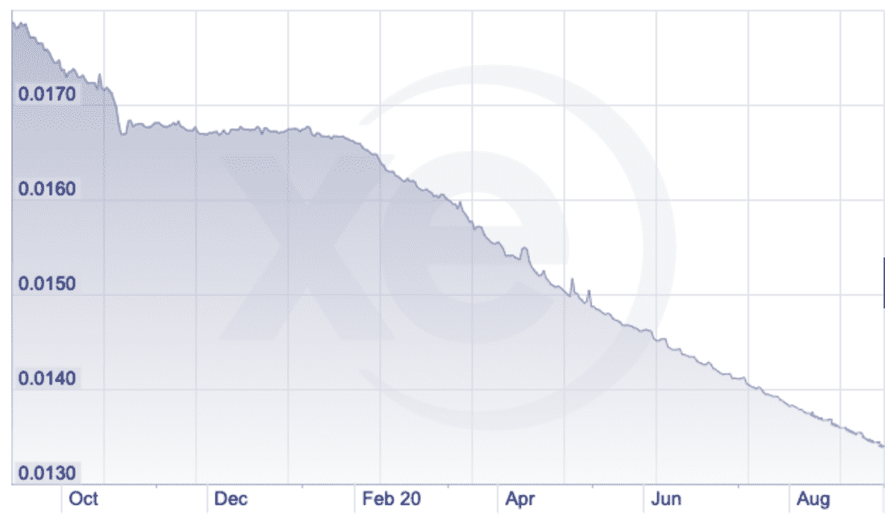

The inflation rate of the Argentine Peso reached over 20% in the last 12 months alone (September 2020 data); Source: XE.com

最后，G8 国家也未能幸免于痛苦阶梯的上升或下降，美国跃升 25 位，排名第 25 位，特朗普政府执政期间美国失业率上升。

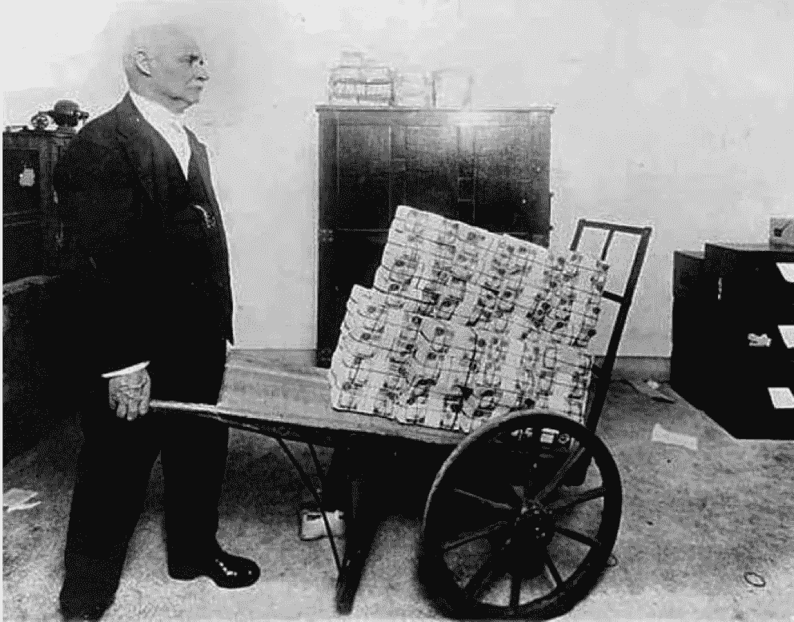

History repeats itself. During the Weimar hyperinflation event of the early 1920s, wheelbarrows replaced wallets….

# **寻找避险资产**

避险资产是[定义](https://www.investopedia.com/terms/s/safe-haven.asp)为*“在市场动荡时期有望保值或增值的投资”*。当考虑价值储存时，这是指长期的财富储存，黄金历来是第一个想到的。然而，尽管黄金往往可以抵御通胀，但在过去十年中，当涉及到实际投资回报时，黄金的表现非常多变。举例来说，如果一个人在 2012 年购买黄金，他们将不得不等到 2020 年年中，才能在 8 年的时间框架内真正获得适度的正回报。只有当着眼于“真正的”长期，即超过过去十年，黄金至少自 70 年代初以来一直呈上升趋势才变得清晰。

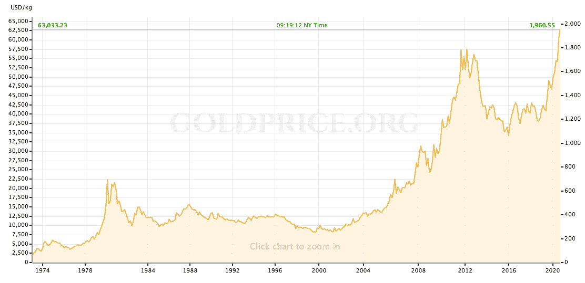

*Price performance of gold over the period 1973–2020\. Source:* [*Goldprice.org*](https://goldprice.org/nl/gold-price-history.html)

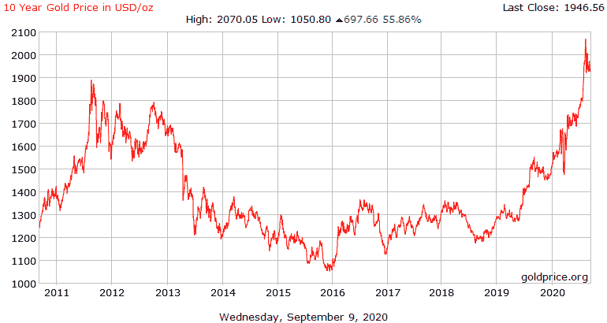

*Zoom in on price-performance of gold over the period 2011–2020\. Gold has only just come out of its bear market since mid 2020\. Source:* [*Goldprice.org*](https://goldprice.org/nl/gold-price-history.html)

在另一个资产类别中，股票市场仍然火热，正在经历我们所见过的最长的历史性牛市，在过去几年中不断达到历史新高。数据显示，股票市场的上涨和刺激支出计划的规模之间有着显著的关联。美国是一个很好的例子，仅在 2020 年就将向其经济注入 6 万亿美元的新刺激支出，超过了前几轮量化宽松(QE)的总和。尽管这些刺激计划可能会推高股价，但其与潜在经济的真正联系已经变得越来越模糊。失业率达到新高，经济显示出放缓甚至瘫痪的迹象，尤其是在当前的新冠肺炎环境下。至少可以说，目前投资股市的风险/回报权衡是有争议的。

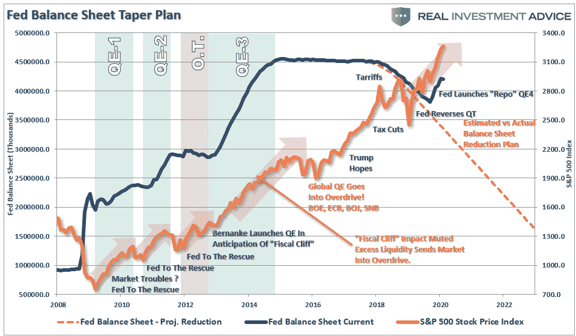

*This graph shows how stock market prices rise when the Fed goes into Quantitative Easing (QE) mode, and how they fall when the program stops or is reversed (Quantitative Tapering /QT). Source: Real Investment Advice.*

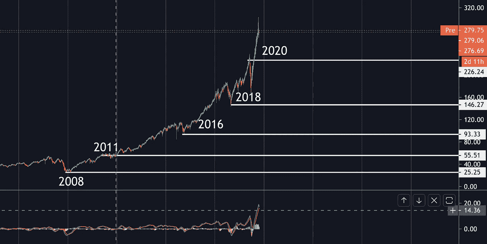

Nasdaq 100 performance since the 2008 market crash looks similar as typical asset bubbles, continuously posting new all time highs since 2011 (performance shown is from a QQQ ETF, which tracks the movements of the Nasdaq100). Source: Tradingview chart analysis.

# **加密货币显示出作为安全避风港的潜力吗？**

那么crypto 呢？嗯，加密货币似乎是从 2018 年初开始的长期熊市中走出来的。比特币在 2018 年 12 月达到 15 个月低点 3300 美元左右，目前处于复苏模式。但最近几周，随着其价格在 10K 附近和上方浮动，它正进入看涨区域——尽管仍比之前的历史高点 19，783.06 美元(2017 年 12 月)低约 50%。与其他资产类别相比，加密市场的规模相对较小(撰写本文时为 3400 亿美元)，这促使顶级“痛苦”国家的人口积极思考比特币和加密领域其他参与者的潜在避险性质。[比特币](https://blog.coincodecap.com/a-candid-explanation-of-bitcoin)引起了特别的兴趣，因为许多人宣称它是一种真正的价值储存手段。如果有什么不同的话，这已经推动了一个[自我实现的预言，如果足够多的投资者相信这个](https://coinfomania.com/coldest-wallet-bitcoin-interview-ruben-merre-ngrave/)。然而，最有趣的因素，尤其是对那些饱受恶性通货膨胀折磨的人来说，是比特币截然相反的性质:它实际上是一种通缩资产。只有 2100 万个比特币能够被挖掘出来，这与那些不停印钞的央行形成了强烈对比。世界上有超过 4500 万名百万富翁，其中不到一半的人可以拥有一个完整的比特币或更多。许多加密货币具有类似的通缩性质。

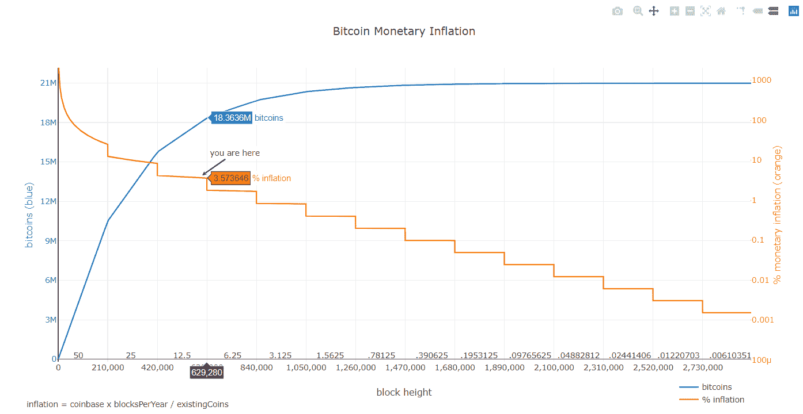

*Bitcoin is a deflationary asset. Total number of minted bitcoins and projected bitcoin inflation rate. Source:* [*github*](https://bashco.github.io/Bitcoin_Monetary_Inflation/)*.*

由于加密货币不是由政府运营的，所以即使一个国家遭遇经济问题和不稳定，加密货币仍然是稳固的。虽然没有政府支持曾经是避免它们的原因之一，但现在却是它们越来越受欢迎的原因之一。政府和个人都无法贬值加密货币，因为他们无法创造更多的加密货币。此外，随着越来越多的人使用加密货币，加密货币的价值会增加并稳定下来。加密货币的国内或国际交易也比传统货币更快、更便宜。付款可以在几秒钟内支付给世界各地的任何人，而不是几个小时或几天，而且成本很低。交易也被加密，个人信息和密码只有所有者才能看到。考虑到这些和其他好处，对加密货币的信任正在上升，因为它们可以帮助人们重新控制自己的财务，为资产提供安全的环境，并抵御通货膨胀。

特别是，生活在面临恶性通货膨胀的国家的人们更早、更愿意转向加密货币，将其作为潜在的稳定资产和价值储存手段。区块链分析公司 chain analysis 在其[研究](https://blog.chainalysis.com/reports/2020-global-cryptocurrency-adoption-index-2020)中指出*“委内瑞拉是推动发展中国家采用加密货币以及公民如何使用加密货币来缓解经济不稳定的一个极好的例子。我们的数据显示，当委内瑞拉本国法定货币因通货膨胀而贬值时，委内瑞拉人更多地使用加密货币，这表明委内瑞拉人转向加密货币来保护他们可能会失去的储蓄。”*和*“我们在其他拉美国家以及非洲、东亚和其他地方也看到了这种模式。”*chain analysis’[2020 年全球加密应用指数](https://go.chainalysis.com/rs/503-FAP-074/images/Index%20list%20of%20countries.pdf)将委内瑞拉、南非和哥伦比亚排在前 10 位，阿根廷排在第 28 位，土耳其排在第 29 位。

> *“委内瑞拉是推动发展中国家采用加密货币以及公民如何使用加密货币来缓解经济不稳定的绝佳范例。我们的数据显示，当委内瑞拉本国法定货币因通货膨胀而贬值时，委内瑞拉人更多地使用加密货币，这表明委内瑞拉人转向加密货币来保护他们可能会失去的储蓄。”*
> 
> *资料来源—*[*chain analysis*](https://blog.chainalysis.com/reports/2020-global-cryptocurrency-adoption-index-2020)*(《2020 年全球加密采用指数:加密货币是一种全球现象》)*

# **稳定收入作为价值储存手段**

S tablecoins 被[定义](https://www.investopedia.com/terms/s/stablecoin.asp)为*“将其市场价值与外部参考挂钩以提供价格稳定的加密货币”*。与比特币和绝大多数替代硬币相比，稳定硬币的波动性较小，因为它们的价格与储备资产挂钩。它们提供了加密支付的即时处理、安全性和隐私性，同时也提供了购买实际物理基础资产的类似投资理由。这消除了那些不熟悉密码世界的人对价值波动性的恐惧和怀疑。成功地将稳定的硬币与实物黄金相匹配的先驱的一个很好的例子是 VeraOne(股票代号 VRO)。

[VeraOne](https://veraone.io/en/home/) 是一种完全基于黄金的 ERC20 令牌，存储在高度安全的区域，由可信的第三方定期审计，具有完全(100%)对应。因此，1 VRO 的价格相当于一克实物黄金(XAUEURG ),并且也受到它的有效支持。总部位于法国的 AuCOFFRE.com[使实际的安全物理存储成为可能，自 2009 年以来，私人公民可以在这个平台上买卖贵金属。黄金的符号化版本(以 VRO 的形式)是 AuCOFFRE.com 在贵金属领域十年的市场知识与直布罗陀经济发展部签署的发行国际公认法定货币硬币的正式协议相结合的结果，也是 VeraOne 作为该平台的子公司处理与区块链有关的问题的结果。VeraOne 的主要目标是提供一种人们可以信任的稳定货币。它为严重依赖有形资产或传统货币(如美元)的现有期权提供了一个稳健、可靠的替代选择。由美元支持的现有稳定债券可能是危险的，因为抵押品不是 100%有保证的。](https://www.aucoffre.com/)

VeraOne 开发了一种外汇货币，可以防止价值过度波动，可以为世界各地的任何人服务，包括银行不足的地区。对于那些经历着可怕的经济环境和恶性通货膨胀的国家的人们来说，像 VeraOne 这样稳定的货币是投资和资产保护的一个有价值的选择。然而，重要的是要注意，虽然实际的黄金储存在一个安全的物理金库，VRO 代币保存在区块链。为了确保令牌的最大安全性，VeraOne 与数字资产安全提供商 [NGRAVE](https://www.ngrave.io/) 合作，后者号称拥有世界上最安全的数字资产和加密钱包。

# **中央银行数字货币(CBDC)**

A 除了个人层面对加密货币越来越感兴趣和采用，政府对央行数字货币(CBDC)的探索和研究也在不断升级。CBDC 是一种取代法定现金的新型数字货币。基于现有私人支付提供商和加密货币的类似技术，CBDCs 有潜力提高支付效率、扩大金融包容性、加快结算流程并降低最终用户成本。

与私人支付提供商相比，CBDCs 可以提供更多的消费者保护、包容性和安全性。与隐私、法律和监管保障、金融稳定和支付生态系统相关的机遇、挑战和其他问题仍处于探索阶段。要让 CBDCs 成为一个有能力的工具，需要有一个经过深思熟虑的全面的数字基础设施、有效的治理和金融技术知识。关于如何在国内法律框架内设计社区发展中心的决定以及对潜在或相关风险的理解仍需要时间来制定和评估。因此，对于在当前经济危机和恶性通货膨胀时期寻求资产稳定和安全的公民来说，中央银行不是一个直接的解决方案。

# 但是持有 crypto 安全吗？

答虽然加密货币的优势和潜力在大众中得到越来越广泛的认可，钱包拥有率也在上升，但加密世界并非没有问题。区块链拥有最先进的先天安全形式之一，比特币采用的加密技术尚未被攻破。其安全性的核心在于所谓的“私人密钥”，即比特币(或者说加密)钱包的访问密钥。一方面，以今天现有的计算机能力，比特币私钥安全牢不可破。不知道密钥的计算机将不得不使用暴力攻击，这意味着它将不得不尝试 10⁸⁰不同的可能值，这在今天可用的计算机上几乎是不可能的。但是，如果挑战从破解私钥转移到找到并窃取它们，那么对黑客来说，一切都变得容易多了。根据定义，加密货币是数字的，数字解决方案在线创建密钥。一旦有哪怕是最轻微的数字痕迹，黑客就可以使用他们的全套工具箱轻松找到私钥，而不必强行破解。

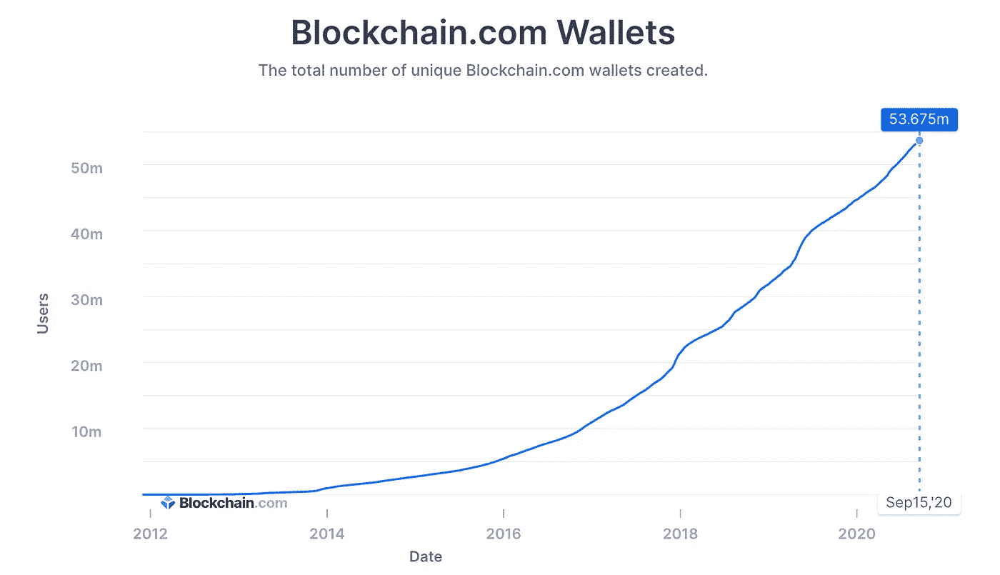

*Growth in the number of unique blockchain portfolios is still growing parabolic in 2020\. Source:* [*blockchain.com*](https://www.blockchain.com/charts/my-wallet-n-users)*.*

由于热(即在线)钱包的公钥和私钥是在线存储的，因此热钱包中的任何内容都比冷(即离线)钱包更容易受到网络攻击。虽然冷钱包离线持有加密货币令牌和私钥，但黑客有时仍然可以访问这些存储工具。冷藏的最基本形式是纸钱包，其中公钥和私钥写在一张纸上。虽然可以防止黑客和在线攻击，但这种方法的缺点是，如果文档被盗、丢失或毁坏，用户将无法获得他们的资金。纸钱包也需要从别处获得私钥，在大多数情况下，来源将是在线密钥生成器。“硬件”钱包是另一种形式的冷钱包。本质上，它们是可以在离线环境下生成私钥并在不在线暴露私钥的情况下签署交易的设备。然而，这些解决方案中的大多数仍然需要通过 USB、蓝牙、NFC 或类似技术进行连接，以例如签署交易。因此，它们可以被视为“半离线”类别，其中仍然存在远程攻击媒介。

另一个需要考虑的问题是，并非所有的钱包都支持所有的加密货币，因此加密货币所有者拥有多个兼容不同加密货币的冷热钱包并不罕见。虽然钱包和私钥管理的复杂性是为了安全地存储和保护用户的加密货币，但往往正是这种复杂性导致了错误，并使加密货币所有者容易受到攻击。在当前加密货币所有权不断增加的背景下，妥善保护和保障私钥(即钱包)至关重要。这就是数字资产领域最先进和最冷门的[硬件钱包【NGRAVE 的](/coinmonks/the-best-cryptocurrency-hardware-wallets-of-2020-e28b1c124069?source=friends_link&sk=324dd9ff8556ab578d71e7ad7658ad7c) [ZERO](https://www.ngrave.io/products/zero) 发挥作用的地方。

# **以正确的方式保护你的密码**

要成功保护用户的加密钱包，一个强大的密钥生成过程应该创建统计上唯一的、随机的(即不可预测的)密钥，并且生成时避开任何窥探的目光。生成密钥后，用户需要能够实时查询他们的帐户，并在不暴露私钥的情况下接收或签署交易。如果用户无法访问他们的设备，需要一种没有任何第三方风险的智能方法来找回他们的钱包。因此，NGRAVE 开发了一个安全且用户友好的端到端解决方案，使最终用户能够完全放心地管理他们的数字资产。该解决方案通过名为 ZERO 的 100%离线硬件钱包、名为 GRAPHENE 的加密备份解决方案和名为 LIQUID 的移动应用程序存在。

NGRAVE 的硬件钱包 ZERO 是与纳米技术、芯片制造、应用工业加密和硬件安全领域的世界顶级公司密切合作开发的。它采用一个安全的操作系统，该操作系统已经获得——市场上唯一获得——通用标准 EAL7 安全认证(世界上可获得的最高安全认证)的产品。从密钥生成到交易签名，ZERO 是 100%离线的。ZERO 与外界的唯一交流是通过不包含任何敏感信息的单向二维码。由于不依赖任何类型的网络连接能力(WiFi/蓝牙/NFC)，也不需要 USB 连接，用户实际上永远不会受到任何在线攻击。此外，ZERO 从一开始就被设计成可以防止任何形式的物理攻击。

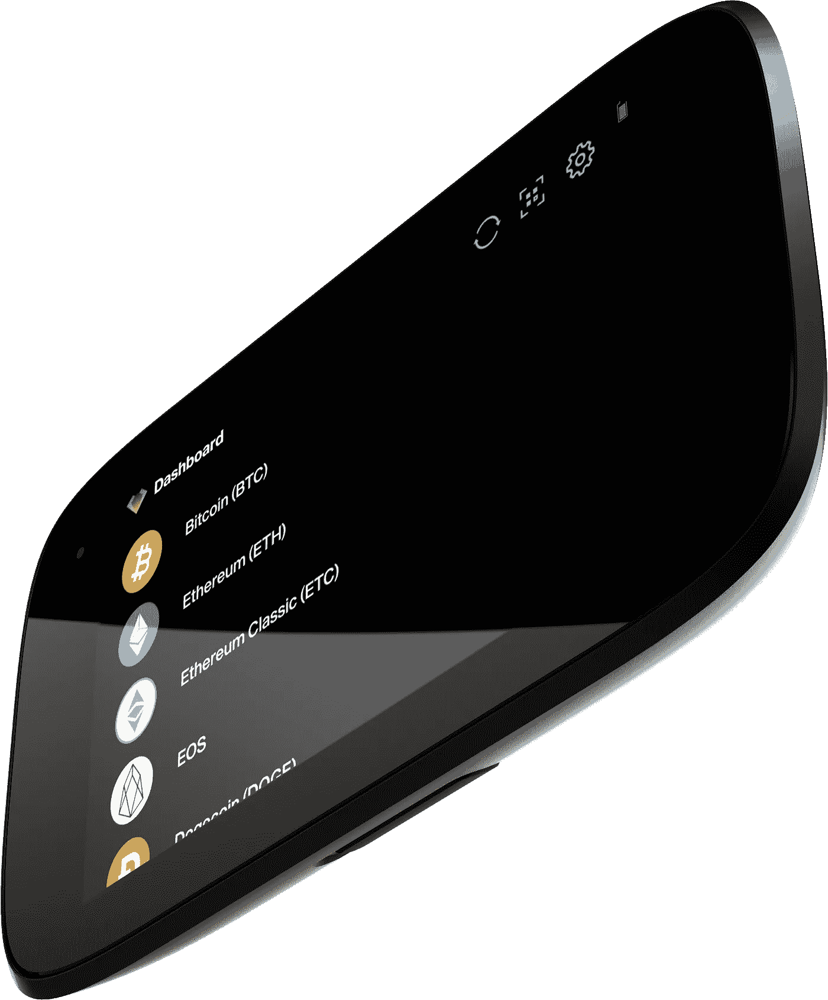

*The NGRAVE ZERO hardware wallet is the most secure digital asset wallet in the world, and the only one to achieve the EAL7 security certification for its secure OS.*

为了创建强密钥，ZERO 拥有世界上最先进的钱包生成过程。私钥是与最终用户一起实时生成的，因此任何第三方(甚至是 NGRAVE)都无法访问或了解私钥。密钥生成过程结合了用户的部分生物特征，以及其他特殊特征，使密钥更加强大。ZERO 是与最终用户团体共同创建和构建的，以使其使用起来无缝，拥有 4 英寸高质量的触摸屏，具有简单的用户交互流程。硬币实际上只需轻轻一击。

NGRAVE 是目前唯一一家提供端到端解决方案的公司，该解决方案考虑并从根本上改善了用户旅程的每一步。除了提供“最寒冷的华尔街”，我们还设计了最冷的关键备份和恢复:n rave[GRAPHENE](https://www.ngrave.io/products/graphene)。石墨烯是由两块防火、防水、防腐蚀和防震的永久不锈钢板制成的密码拼图。它消除了业界在一张纸上写下私钥的传统做法的需要。该产品采用了智能加密方法，使双板设置成为一个难题。这也是市场上唯一的在损失的情况下[可恢复](/ngrave/ngraves-graphene-is-an-encrypted-and-everlasting-backup-for-your-private-keys-1eb3ab281a6c?source=collection_home---4------2-----------------------)的解决方案。

n rave[LIQUID](https://www.ngrave.io/products/liquid)是一款移动应用，它为用户提供了他们投资组合的实时概览，以及在不暴露私钥的情况下接收或发起和签署交易的可能性。ZERO 和 LIQUID 之间的通信仅通过安全的单向 QR 码通信进行。例如，如果用户想要接收交易，只需分享他们的二维码。二维码只包含有限的非敏感信息，因此私钥一直处于离线状态，黑客没有机会访问用户的信息。

NGRAVE 的产品套件旨在让用户真正拥有属于他们的东西，即他们应该是数字资产的真正所有者，也是决定第三方是否应该访问私钥的人。在支持所有代币的过程中，NGRAVE 最近[与 VeraOne 联手](/ngrave/ngrave-veraone-join-forces-to-protect-your-gold-at-maximum-security-bf6585f66cde?source=login--------------------------google_one_tap-)，以便用户可以以最安全、无缝的方式保护、管理和 HODL 他们的黄金支持的稳定币 VRO。该合作伙伴关系旨在鼓励和支持用户投资实物黄金支持的数字货币，使他们摆脱购买和保护实物黄金等非流动性资产的麻烦。

> ***“n grave 的产品套件旨在让用户真正拥有属于他们的东西，也就是说，他们应该是数字资产的真正所有者，也是决定第三方是否应该访问私钥的人。”— Xavier Hendrickx，首席技术官 n rave***

# **结论**

这篇文章概述了高通货膨胀率国家及其人民面临的一些问题，以及为什么这促使他们寻找日常交易中使用的国家货币以外的价值储存手段。

黄金是一个潜在的避风港，因为它具有抗通胀的特性，但它在过去十年中的投资表现非常有限。不断更新和更大的刺激支出计划正在人为地膨胀股市，美国最新的计划向其经济注入了 6 万亿美元——超过了以往所有刺激计划的总和。可以说，这导致一些投资者重新配置黄金作为潜在的避险工具。但对大多数人来说，尤其是恶性通胀的国家，投资加密货币的风险/回报比——大多数加密货币的交易价格仍比历史高点低 50%——似乎是至少考虑将加密作为一种选择的有效理由。本文进一步研究了加密作为财富保值候选的假设，并比较了不同的类别，包括比特币、stablecoins 和 CBDCs。最后，对于那些决定投资于加密空间的人，讨论了重要的考虑因素，例如选择一个好的安全解决方案。

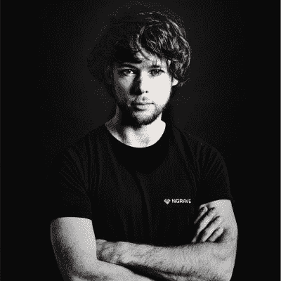

***关于作者:*** *鲁本·梅尔(Ruben Merre)是一位重复的科技企业家，通晓多种语言，终身学习者，也是全球最安全的加密货币钱包“ZERO”背后的数字资产安全公司 NGRAVE 的创始人兼首席执行官。自 2018 年以来，鲁本和他的团队与纳米技术、密码学和硬件安全领域的顶级人士以及思想领袖合作，如著名密码学教授、比特币论文的第二参考文献 Jean-Jacques Quisquater。结果是:一个真正的端到端数字资产管理解决方案，具有最高的安全性(EAL7，世界上最高的安全认证)，以及直观的用户交互。*

喜欢你读的吗？然后看看我之前写的一些文章:

 [## 为什么选择 Stablecoins —对其基础和未来的全面概述

### 深入探讨 Stablecoins 的基本原理、优势、风险、实施和未来潜力。

medium.com](/@ruben.merre/why-stablecoins-a-comprehensive-overview-of-their-foundations-and-future-8b6e6c30054d)  [## 创纪录的刺激支出对通胀以及比特币价格和需求的影响

### 美联储和美国政府最近开始了有史以来最大的刺激支出，让 QE1-QE3 相形见绌，这意味着什么…

medium.com](/the-capital/the-impact-of-record-stimulus-spending-on-inflation-and-on-bitcoin-price-demand-474b87d42d83)  [## NGRAVE |无与伦比的加密安全性和无缝体验

### 第一个端到端的加密管理解决方案。最冷的硬件钱包。最冷的钥匙备份。不…

ngrave.io](https://ngrave.io) 

## 另外，阅读

*   最好的[密码交易机器人](/coinmonks/crypto-trading-bot-c2ffce8acb2a)
*   [密码本交易平台](/coinmonks/top-10-crypto-copy-trading-platforms-for-beginners-d0c37c7d698c)
*   最好的[加密税务软件](/coinmonks/best-crypto-tax-tool-for-my-money-72d4b430816b)
*   [最佳加密交易平台](/coinmonks/the-best-crypto-trading-platforms-in-2020-the-definitive-guide-updated-c72f8b874555)
*   最佳[密码借贷平台](/coinmonks/top-5-crypto-lending-platforms-in-2020-that-you-need-to-know-a1b675cec3fa)
*   [最佳区块链分析工具](https://bitquery.io/blog/best-blockchain-analysis-tools-and-software)
*   [加密套利](/coinmonks/crypto-arbitrage-guide-how-to-make-money-as-a-beginner-62bfe5c868f6)指南:新手如何赚钱
*   最佳[加密制图工具](/coinmonks/what-are-the-best-charting-platforms-for-cryptocurrency-trading-85aade584d80)
*   [莱杰 vs 特雷佐](/coinmonks/ledger-vs-trezor-best-hardware-wallet-to-secure-cryptocurrency-22c7a3fd391e)
*   了解比特币最好的[书籍有哪些？](/coinmonks/what-are-the-best-books-to-learn-bitcoin-409aeb9aff4b)
*   [3 商业评论](/coinmonks/3commas-review-an-excellent-crypto-trading-bot-2020-1313a58bec92)
*   [AAX 交易所评论](/coinmonks/aax-exchange-review-2021-67c5ea09330c) |推荐代码、交易费用、利弊
*   [德里比特评论](/coinmonks/deribit-review-options-fees-apis-and-testnet-2ca16c4bbdb2) |选项、费用、API 和测试网
*   [FTX 密码交易所评论](/coinmonks/ftx-crypto-exchange-review-53664ac1198f)
*   [n 零审核](/coinmonks/ngrave-zero-review-c465cf8307fc)
*   [Bybit 交换评论](/coinmonks/bybit-exchange-review-dbd570019b71)
*   [3Commas vs Cryptohopper](/coinmonks/cryptohopper-vs-3commas-vs-shrimpy-a2c16095b8fe)
*   最好的比特币[硬件钱包](/coinmonks/the-best-cryptocurrency-hardware-wallets-of-2020-e28b1c124069?source=friends_link&sk=324dd9ff8556ab578d71e7ad7658ad7c)
*   最佳 [monero 钱包](https://blog.coincodecap.com/best-monero-wallets)
*   [莱杰 nano s vs x](https://blog.coincodecap.com/ledger-nano-s-vs-x)
*   [bits gap vs 3 commas vs quad ency](https://blog.coincodecap.com/bitsgap-3commas-quadency)
*   [莱杰纳米 S vs 特雷佐 one vs 特雷佐 T vs 莱杰纳米 X](https://blog.coincodecap.com/ledger-nano-s-vs-trezor-one-ledger-nano-x-trezor-t)
*   [block fi vs Celsius](/coinmonks/blockfi-vs-celsius-vs-hodlnaut-8a1cc8c26630)vs Hodlnaut
*   [Bitsgap 评论](/coinmonks/bitsgap-review-a-crypto-trading-bot-that-makes-easy-money-a5d88a336df2)——一个轻松赚钱的加密交易机器人
*   为专业人士设计的加密交易机器人
*   [PrimeXBT 审查](/coinmonks/primexbt-review-88e0815be858) |杠杆交易、费用和交易
*   [埃利帕尔泰坦评论](/coinmonks/ellipal-titan-review-85e9071dd029)
*   [SecuX Stone 评论](https://blog.coincodecap.com/secux-stone-hardware-wallet-review)
*   [BlockFi 评论](/coinmonks/blockfi-review-53096053c097) |从您的密码中赚取高达 8.6%的利息