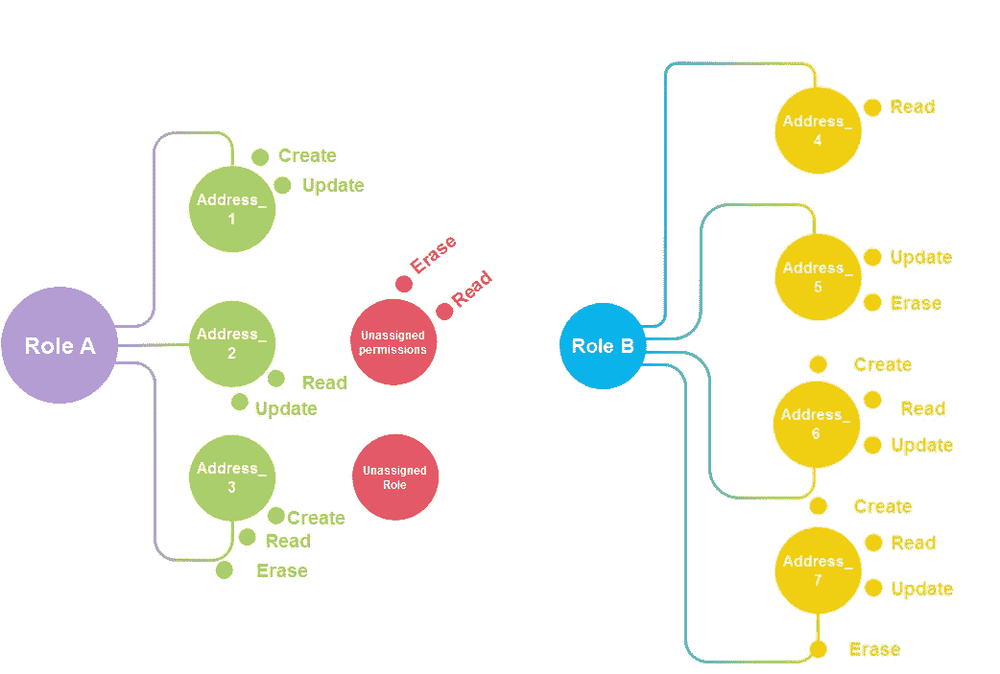
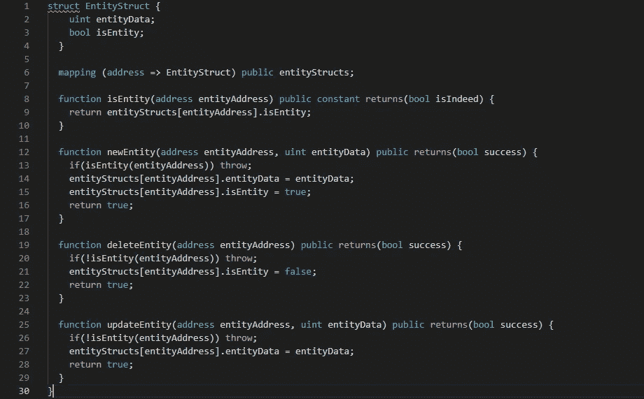
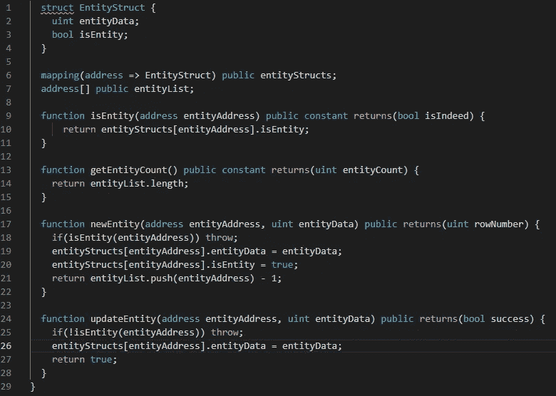
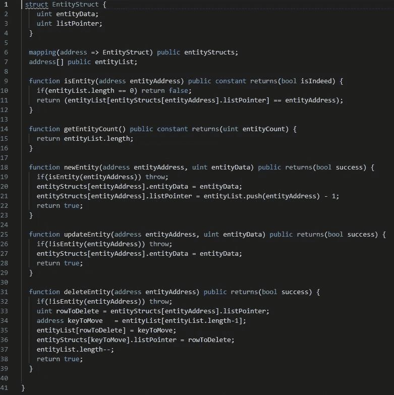
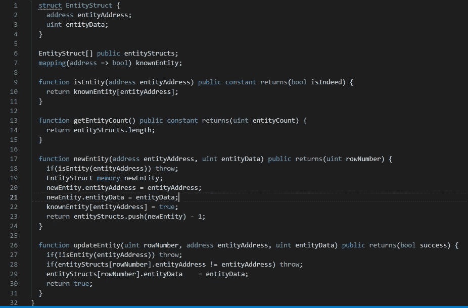
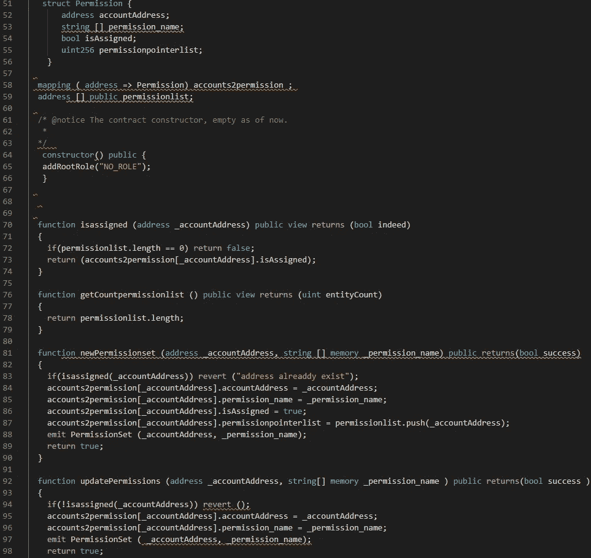
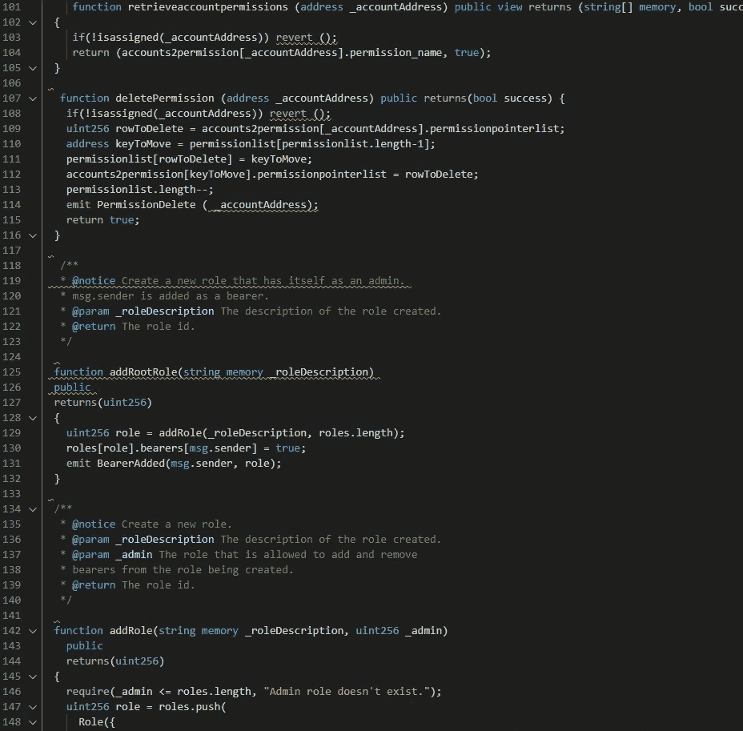
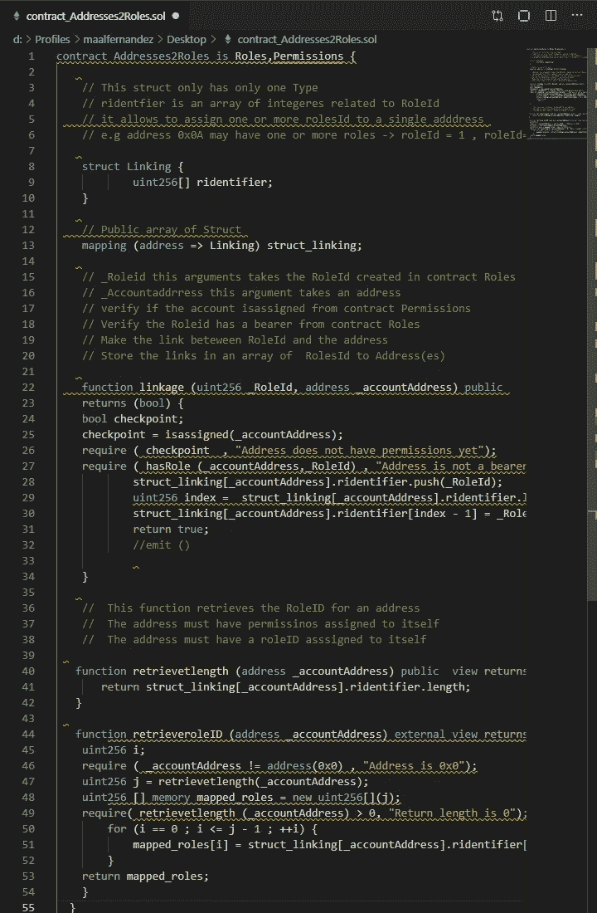

# 从基于角色的访问控制到区块链上的角色和权限访问控制

> 原文：<https://medium.com/coinmonks/from-role-base-access-control-to-a-role-permission-access-control-on-blockchain-be92bb096894?source=collection_archive---------0----------------------->

Role & Permission Access control on a Blockchain

看过**阿尔贝托·单面山·卡尼亚达**在 Hackernoon 发表的一篇很棒的文章“[以太坊区块链的基于角色的访问控制](https://hackernoon.com/role-based-access-control-for-the-ethereum-blockchain-bcc9dfbcfe5c)”。

我决定接受他的建议，在 Alberto 的 RBAC 智能合同实现中扩展功能，这不是一个简单的任务，但进一步了解 solidity 与数据结构(映射、数组、简单列表等)的使用相关的复杂性的更多细节是非常令人高兴的。

我过去曾与 solidity 合作，为我的客户开发概念证明，遭受了语言的缺点，但发现很难找到人以易于理解的方式解释事情；在这方面，Julien Klepatch 和他的 youtube [频道](https://www.youtube.com/channel/UCZM8XQjNOyG2ElPpEUtNasA/channels)对我掌握知识非常有用。

花时间听解释，在视频和阿尔贝托的 RBAC 智能合同代码之间来回切换；很明显，我想开发一些功能，允许为一个地址分配权限，从而扩展对按角色分组的地址的粒度控制。

需要进一步研究众所周知的坚固性[模式](https://ethereum.stackexchange.com/questions/13167/are-there-well-solved-and-simple-storage-patterns-for-solidity)发现以下内容非常有用:

**用结构映射**

Template for a Mappings with Struct and functions.

**优势**

*   通过唯一 Id 随机访问
*   身份唯一性保证
*   在每个“记录”中包含数组、映射、结构

**弱点**

*   无法枚举密钥
*   无法计算键数
*   需要手动检查来区分默认记录和显式“全 0”记录

**带索引的映射结构**

Template for a Mappings with Index and functions.

**优势**

*   通过唯一 Id 或行号随机访问
*   身份唯一性保证
*   在每个“记录”中包含数组、映射和结构
*   列表维护声明的顺序
*   清点记录
*   枚举 id
*   通过设置布尔值来“软”删除项目

**弱点**

*   名单不受控制的增长

**具有启用删除索引的映射结构**

Template for Mapped Structs with Delete-enabled Index and functions.

**优势**

*   通过唯一 Id 或行号随机访问
*   身份唯一性保证
*   在每个“记录”中包含数组、映射和结构
*   清点记录
*   枚举 id
*   用删除功能逻辑控制活动列表的大小

**弱点**

*   略微增加了代码复杂性
*   略高的存储成本
*   密钥列表本质上是无序的

**具有唯一 id 的结构数组**

Template for Array of Struct with unique Id and functions.

**强项**

*   按行号随机存取
*   身份唯一性保证
*   用每个“记录”括起数组、映射和结构

**弱点**

*   没有随机存取的 Id
*   名单不受控制的增长

路径现在很清晰，并且实现了我在阿尔贝托的 RBAC 智能合同中设想的功能；将它放在一个名为 RPAC.sol [link](https://github.com/mauriciomferz/RPAC/blob/master/RPAC.sol) 的新智能合约中

Struct Permission and iassgined, getCounterpermissionlist, newPermissionset, updatePermissions functions.

retrieveaccountpermissions, deletePermission functions.

新的智能合约分为三个合约。

> ***合同角色***
> 
> ***合同权限***
> 
> ***合同地址 2 角色***

Addresses2Roles 继承了契约角色和权限的功能，尽管建议实现您自己的接口来与后者进行交互。

***Contract Addresses2Roles***

结果是将权限扩展到一个地址，并按角色 Id 对它们进行分组。

> [直接在您的收件箱中获得最佳软件交易](https://coincodecap.com/?utm_source=coinmonks)

