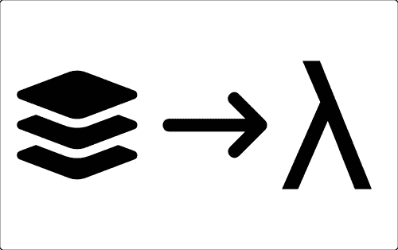
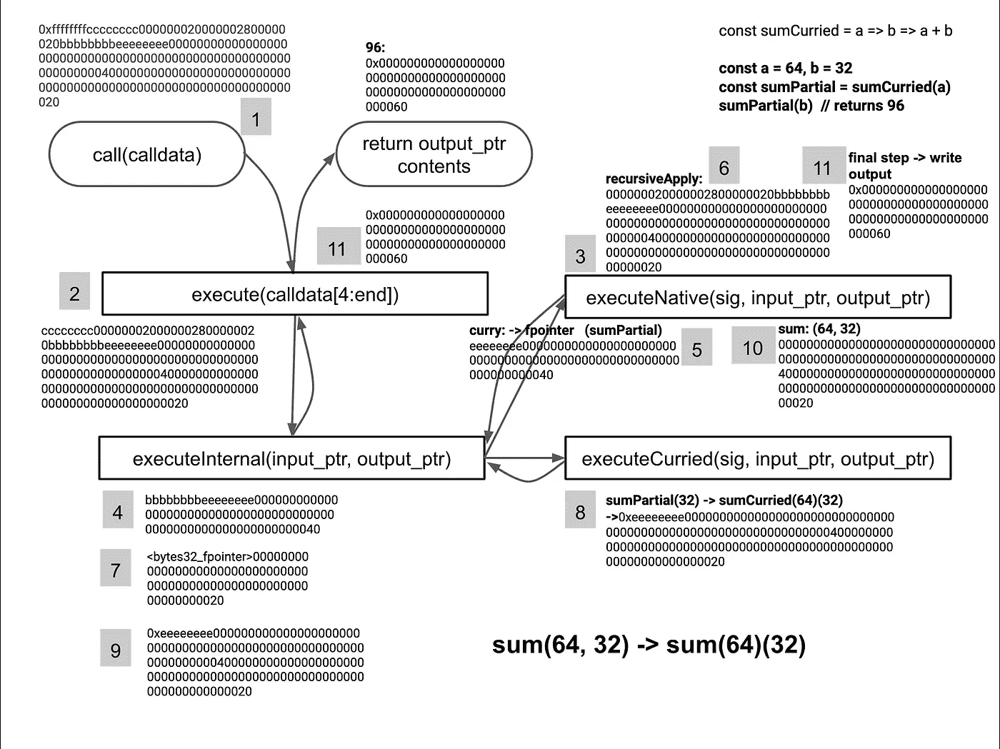

# 从堆叠机器到功能机器:步骤 2—curry

> 原文：<https://medium.com/coinmonks/from-stack-machine-to-functional-machine-step-2-currying-f26c7f8b7220?source=collection_archive---------0----------------------->



[在 Github 上阅读](https://github.com/loredanacirstea/articles/blob/master/articles/FromStackMachineToFunctionalMachine_Step2_Currying.md)。

标签:`Taylor`、`Ethereum`、`Solidity`、`Yul`、`eWasm`、`WebAssembly`

这是我在 CEST 时间 4 月 29 日星期三下午 2:50:00[Solidity Summit](https://solidity-summit.ethereum.org)上的演讲的逐步介绍。[议程](https://docs.google.com/spreadsheets/d/1ylkaTYKx9TbAifCgyH2jN9SKJKrYfzab9zzTZgSL44g/edit#gid=0)。

# 环境

为了说明我们的旅程，我们将使用 [Yul 语言](https://solidity.readthedocs.io/en/v0.6.4/yul.html)(编译成以太坊 1.0 和 Wasm 字节码)。

如果你想运行这些例子，可以用[https://remix.ethereum.org](https://remix.ethereum.org)来完成:

*   选择 Yul 作为编译语言，使用原始的`calldata`输入，使用调试器检查返回值。
*   使用 Yul+插件来编译、部署和交互(您需要注释掉`mslice`助手函数)

下面的代码示例也可以在[https://gist . github . com/loredanacistea/1 aa 18 e 33342 b 862d 8 DC 76 c 01 b 12 b 7 DBC](https://gist.github.com/loredanacirstea/1aa18e33342b862d8dc76c01b12b7dbc)找到。

# 先决条件

阅读上一篇文章[从栈机到功能机:第一步(递归应用)](/@loredana.cirstea/from-stack-machine-to-functional-machine-step-1-fd2f12a372e2)。

# Currying

Currying 是一种将接受多个参数的函数分解成一系列函数的技术，每个函数接受一个或多个参数。

因此，我们可以把`const sum = (a, b) => a + b`写成:

```
const sumCurried = a => b => a + bconst sumPartial = sumCurried(64)
sumPartial(32) // returns 96
```

现在我们可以在代码的其他地方重用`sumPartial`，例如，作为`map`函数的参数:`map(array, sumPartial)`。

在我们的链上解释类型系统 Taylor 中，通过 currying，我们可以定义类型的类。`uint`本身是一个部分应用的函数，现在我们可以像`uint(256)`一样重用这个函数，我们将得到一个具体的类型。

# 弹性系数

curry 和 de-curry 是实现更好的人机交流的重要工具。

如果人类习惯于 arity 2: `sum(a, b)`的和函数，通过 currying，计算机会将其解释为 arity 1: `sum(a)(b)`的函数的组合

如果有一族 arity `n`的函数，arity `n+1`的覆盖函数可以被构造成使得任何一个初始函数都通过进行选择的附加自变量来调用。
拥有动态 arity 可能会使函数更加直观:

```
sum[arity n+1] = sum[arity n](last_argument)sum(2,3,4,5) = sum(2,3,4)(5) = … = sum(2)(3)(4)(5)
```

# 以太坊虚拟机和 WASM 中的 Currying

Yul 允许我们直接使用堆栈和内存，所以我们有足够的自由在运行时实现 currying 系统。

我们所需要做的就是在内存中维护一个空间，我们的 curried 函数就在那里。在下面的代码中，我们将把每个指向一个可定制函数的内存指针视为该可定制函数的签名。

在内存指针处，我们将找到底层函数的签名，以及部分应用的参数。在上面的例子中，这意味着`<sumCurried_signature>0000000000000000000000000000000000000000000000000000000000000040` ( `64 = 0x40`)。

现在，我们可以在其他函数中使用 curried 函数的签名，我们将在我们的 [**第一步**](/@loredana.cirstea/from-stack-machine-to-functional-machine-step-1-fd2f12a372e2) 文章中给出的`recursive apply`代码的基础上进行构建。

下面的代码允许我们递归地应用一系列函数，其中每个函数的输出都作为输入提供给下一个函数。

我们有:

*   `executeNative`中的一些“原生”函数，比如`sum` ( `0xeeeeeeee`)、`recursiveApply` ( `0xcccccccc`)、`curry` ( `0xbbbbbbbb`)。我们会用多个`steps`来调用`recursiveApply`，每个步骤都是一个有一些输入的函数。
*   `executeCurriedFunction`，知道如何处理定制函数
*   `executeInternal`，它知道如何区分一个“原生”和一个 curried 函数。

## Currying 示例:sum(64，32)

`calldata`将是:`0xffffffffcccccccc000000020000002800000020bbbbbbbbeeeeeeee00000000000000000000000000000000000000000000000000000000000000400000000000000000000000000000000000000000000000000000000000000020`

```
ffffffff - the main execute function cccccccc - recursiveApply
00000002 - number of steps for recursiveApply
00000028 - data length in bytes for the first step
00000020 - data length in bytes for the second step
bbbbbbbb - second step starts here, with the signature for the curry function
eeeeeeee - sum function signature 0000000000000000000000000000000000000000000000000000000000000040
   - partially applied argument for sum: 64 0000000000000000000000000000000000000000000000000000000000000020
   - second step, with the second sum argument: 32
```

## 程序流程



**开始呼叫**

*   `execute`函数用`000000020000002800000020bbbbbbbbeeeeeeee00000000000000000000000000000000000000000000000000000000000000400000000000000000000000000000000000000000000000000000000000000020`调用`recursiveApply`
*   `recursiveApply`分解步骤并运行每一步，将每一步的输出输入下一步

**第一步**

*   `recursiveApply`用`bbbbbbbbeeeeeeee0000000000000000000000000000000000000000000000000000000000000040`调用`executeInternal`
*   `executeInternal`看到签名是 4 个字节，调用`executeNative`，转发所有数据
*   `executeNative`解包`0xbbbbbbbb`签名，程序到达`curry`功能。
*   `curry`将虚拟的、简化的函数签名`0xeeeeeeee`和部分应用的参数`0x0000000000000000000000000000000000000000000000000000000000000040` ( `64`)存储在内存指针中，并将该指针写入`output_ptr`
*   程序返回到`recursiveApply`，准备输出作为下一步的输入

**第二步**

*   `recursiveApply`用`<sumPartial_pointer>0000000000000000000000000000000000000000000000000000000000000020`称呼`executeInternal`
*   `executeInternal`看到签名是 32 字节，调用`executeCurried`，转发所有数据
*   `executeCurried`用`0xeeeeeeee0000000000000000000000000000000000000000000000000000000000000040000000000000000000000000000000000000000000000000000000000000020`调用`executeInternal`，将修改后的函数数据与新输入合并
*   `executeInternal`看到签名是 4 个字节并调用`executeNative`
*   `executeNative`解包`0xeeeeeeee`签名，程序到达`sum`功能
*   `sum`将两个自变量相加，并将答案写入`output_ptr`内存指针。
*   程序返回到结果点`recursiveApply`和`output_ptr`

**返回**

*   程序返回到`execute`，并返回来自`output_ptr`的结果

```
object "ContractB" {
  code {
      datacopy(0, dataoffset("Runtime"), datasize("Runtime"))
      return(0, datasize("Runtime"))
  }
  object "Runtime" {
    code {
      let _calldata := 2048
      let _output_pointer := 0 // This is where we keep our virtual functions
      // generated at runtime as partial function applications
      let _virtual_fns := 1024 calldatacopy(_calldata, 0, calldatasize()) let fn_sig := mslice(_calldata, 4) switch fn_sig // execute function
      case 0xffffffff {
        let internal_fn_sig := mslice(add(_calldata, 4), 4)
        let input_pointer := add(_calldata, 8)
        let input_size := sub(calldatasize(), 4) let result_length := executeNative(
            internal_fn_sig,
            input_pointer,
            input_size,
            _output_pointer,
            _virtual_fns
        )
        return (_output_pointer, result_length)
      }
      // other cases/function signatures
      default {
        mslicestore(_output_pointer, 0xeee1, 2)
        revert(_output_pointer, 2)
      } function executeNative(
        fsig,
        input_ptr,
        input_size,
        output_ptr,
        virtual_fns
      ) -> result_length {
        switch fsig // sum: a + b
        case 0xeeeeeeee {
          let a := mload(input_ptr)
          let b := mload(add(input_ptr, 32))
          mstore(output_ptr, add(a, b))
          result_length := 32
        } // recursiveApply
        case 0xcccccccc {
          // e.g. 2 steps:
          // 000000020000002800000020
          // bbbbbbbbeeeeeeee000000000000000000000000000000000000000000000000000000000000004
          // 00000000000000000000000000000000000000000000000000000000000000020 // number of execution steps
          let count := mslice(input_ptr, 4) // offsets/size in bytes for each step
          let offsets_start := add(input_ptr, 4)
          let input_inner := add(offsets_start, mul(count, 4)) let temporary_ptr := 0x80
          let existent_input_size := 0 for { let i := 0 } lt(i, count) { i := add(i, 1) } {
            let step_length := mslice(
                add(offsets_start, mul(i, 4)),
                4
            ) // add current input after previous return value
            mmultistore(
              add(temporary_ptr, existent_input_size),
              input_inner,
              step_length
            ) result_length := executeInternal(
              temporary_ptr,
              add(existent_input_size, step_length),
              output_ptr,
              virtual_fns
            ) // move termporary input after previous data
            temporary_ptr := add(temporary_ptr, step_length) // store output as new input for the next step
            mmultistore(temporary_ptr, output_ptr, result_length)
            existent_input_size := result_length // move input pointer to the next step
            input_inner := add(input_inner, step_length)
          }
        } // curry: fsig, partial application argument
        case 0xbbbbbbbb {
          // first 32 bytes is the next free memory pointer
          let fpointer := mload(virtual_fns)
          if eq(fpointer, 0) {
              fpointer := add(virtual_fns, 32)
          } let internal_fsig := mslice(input_ptr, 4)
          let arg := mload(add(input_ptr, 4)) // virtual function marker
          mslicestore(fpointer, 0xfefe, 2) // add input size (so we know how much to read)
          mstore(add(fpointer, 2), input_size) // store the actual data - partial application argument
          mmultistore(add(fpointer, 34), input_ptr, input_size) // update the free memory pointer for our curried functions references
          mstore(virtual_fns, add(fpointer, 38)) // return the virtual function pointer
          mstore(output_ptr, fpointer)
          result_length := 32
        }
        // other cases/function signatures
        default {
          // revert with error code
          mslicestore(output_ptr, 0xeee2, 2)
          revert(output_ptr, 2)
        }
      } function executeInternal(
        input_ptr,
        input_size,
        output_ptr,
        virtual_fns
      ) -> result_length {
        let fsig, offset := getfSig(input_ptr) switch offset
        case 4 {
          result_length := executeNative(
            fsig,
            add(input_ptr, offset),
            sub(input_size, offset),
            output_ptr,
            virtual_fns
          )
        }
        case 32 {
          result_length := executeCurriedFunction(
            fsig,
            add(input_ptr, offset),
            sub(input_size, offset),
            output_ptr,
            virtual_fns
          )
        }
        default {
          // revert with error code
          mslicestore(output_ptr, 0xeee3, 2)
          revert(output_ptr, 2)
        }
      } function getfSig(input_ptr) -> fsig, offset {
        fsig := mslice(input_ptr, 4)
        offset := 4
        let fpointer := mload(input_ptr) if lt(fpointer, 10000000) {
          // check if the curried function marker exists
          if eq(mslice(fpointer, 2), 0xfefe) {
            fsig := fpointer
            offset := 32
          }
        }
      } function executeCurriedFunction(
        fpointer,
        input_ptr,
        input_size,
        output_ptr,
        virtual_fns
      ) -> result_length {
        // first 32 bytes are the input size
        let new_input_size := mload(add(fpointer, 2)) // exclude input size from input ptr
        let new_input_ptr := add(fpointer, 34) // store the inputs for the curried function after the curried function arguments
        // effectively composing the input for the actual function that we need to run
        mmultistore(add(new_input_ptr, new_input_size), input_ptr, input_size)
        new_input_size := add(new_input_size, input_size) result_length := executeInternal(
          new_input_ptr,
          new_input_size,
          output_ptr,
          virtual_fns
        )
      } function mslice(position, length) -> result {
        result := div(
          mload(position),
          exp(2, sub(256, mul(length, 8)))
        )
      } function mslicestore(_ptr, val, length) {
        let slot := 32
        mstore(_ptr, shl(mul(sub(slot, length), 8), val))
      } function mmultistore(_ptr_target, _ptr_source, sizeBytes) {
        let slot := 32
        let size := div(sizeBytes, slot) for { let i := 0 } lt(i, size)  { i := add(i, 1) } {
          mstore(
            add(_ptr_target, mul(i, slot)),
            mload(add(_ptr_source, mul(i, slot)))
          )
        } let current_length :=  mul(size, slot)
        let remaining := sub(sizeBytes, current_length)
        if gt(remaining, 0) {
          mslicestore(
            add(_ptr_target, current_length),
            mslice(add(_ptr_source, current_length), remaining),
            remaining
          )
        }
      }
    }
  }
}
```

拥有一种处理函数的技术(在运行时)是将堆栈机器转变为功能机器的第二步。

当用作`map`或`reduce`参数时，部分应用的函数可能非常重要，允许您编写可扩展的代码。

# 下一步:第三步

下一步，我们将向您展示如何在这个递归引擎中使用高阶函数。

阅读步骤 3: [**从堆叠机到功能机:步骤 3(高阶功能)**](/@loredana.cirstea/from-stack-machine-to-functional-machine-step-3-higher-order-functions-18fb751066ec)

*原载于*[*https://github.com*](https://github.com/loredanacirstea/articles/blob/master/articles/FromStackMachineToFunctionalMachine_Step2_Currying.md)*。*

> [直接在您的收件箱中获得最佳软件交易](https://coincodecap.com/?utm_source=coinmonks)

[](https://coincodecap.com/?utm_source=coinmonks)