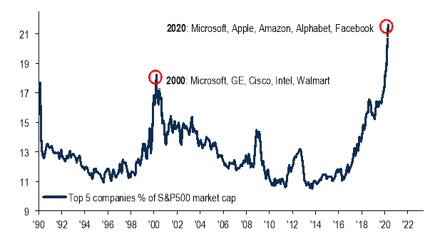
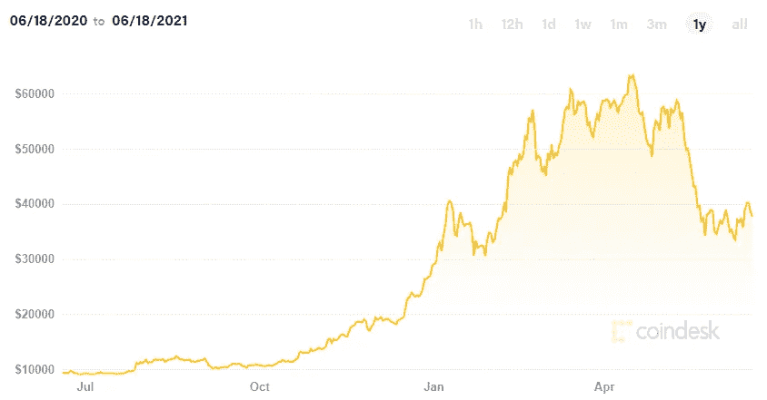

# 从股票到密码:快速指南

> 原文：<https://medium.com/coinmonks/from-stock-to-crypto-a-quick-guide-2eae5c41a020?source=collection_archive---------9----------------------->

在 2021 年之前，我是一个保守的人。除了债券，不要投资任何其他东西，不要参与任何高风险投资。

然后新冠肺炎来了。

新冠肺炎封锁了整个世界。这为在家办公(WFH)的小工具和基于云的产品创造了很高的需求。科技股空前高涨。

Source: [Tech stocks have weathered the coronavirus panic, but some analysts wonder if this resilience can last — MarketWatch](https://www.marketwatch.com/story/tech-stocks-have-weathered-the-coronavirus-panic-but-some-analysts-wonder-if-this-resilience-can-last-2020-04-27)

在疫情之前的我会看到这一点，并将其视为泡沫。全新的我？我匆忙进入股市，就像火灾现场的消防员一样。

很自然，我最终以高价购买。然而，由于我无意出售我持有的任何股票，我的理由过去是，现在也一直是，现在买高价总比几年后买更高的价格好。

在建立我的股票投资组合(由科技公司和金融机构组成)后，我开始寻找镇上的下一个亮点:加密货币(crypto)。

由于新冠肺炎，crypto 也一直很高(显然)。

Source: [Bitcoin Price | BTC Price Index and Live Chart — CoinDesk 20](https://www.coindesk.com/price/bitcoin). Bitcoin’s long-awaited surge followed by sharp dip in the past 12 months

几个月来，受影响者、投资者、热情人群、首次公开募股(比特币基地的一次成功尝试和币安的一次失败尝试)，甚至大型企业(特斯拉)的推动，旗舰加密软件比特币不断创下历史新高。

与此同时，大量的迷因币和屎币涌现出来，经过了漫长的所谓密码寒冬。你问多少？五万并且还在增加。埃隆·马斯克(Elon Musk)本人亲自认可了其中两个，Dogecoin(公开)和 Cumrocket(神秘)，这引发了新一轮的令牌狂潮。

这是我进入加密货币之旅的开始。

 [## 最佳免费加密交易机器人——前 16 名比特币交易机器人[2021]

### 2021 年币安、比特币基地、库币和其他密码交易所的最佳密码交易机器人。四进制，位间隙…

medium.com](/coinmonks/crypto-trading-bot-c2ffce8acb2a) 

理想情况下，最好的选择是投资成熟的加密技术，如比特币、以太坊和莱特币。然而，我个人认为，他们未来的增长轨迹很可能类似于股票市场，这不符合我正在寻找的投资组合。因为我已经有了一个重要的股票投资组合，我想在几个迷因和狗屎硬币上赌一把。

如果不是全部的话，这些硬币中的大部分位于以太坊(ERC-20)和币安(BEP-20 / BSC)区块链网络上。网上有很多比较这两种网络优缺点的资源(这里的，[这里](https://bitcointalk.org/index.php?topic=5318827.0)，这里)。最后，我决定使用 BSC 上的代币，主要是因为它的汽油费或交易费较低。根据 Trust Wallet 的数据，BSC 的平均燃气费为 22.5560 Gwei 或 0.0000462 美元，是业内最低的之一。

通过密友的推荐、Subreddits 的提示和技巧以及 YouTube 上不健康的自助视频，我终于找到了正确的工具来进行加密投资(将信任钱包作为主要钱包，将 Pancakeswap 作为加密货币或代币交换，BscScan 可以了解背景信息，Bogged Finance 可以跟踪实时价格趋势，等等)。).

不久，我意识到这是最容易的部分。确定我要投资的是一个棘手的问题。

所有密码初学者必须阅读丹尼尔杰弗里斯的媒体文章。他的掌握 Shitcoins 系列([第一部分](https://hackernoon.com/mastering-shitcoins-the-poor-mans-guide-to-getting-crypto-rich-2e469b762ba9?source=user_profile---------12----------------)，[第二部分](/@dan.jeffries/mastering-shitcoins-ii-the-poor-mans-guide-to-getting-crypto-rich-72a262365308))非常值得一读。

虽然我是为了高风险高回报类型的个人资料，50k 的货币和代币对我来说太多了。最终，我在 Reddit、Telegram groups 和加密货币网站上花了比我希望的更多的时间。

根据丹尼尔·杰弗里斯的说法，有三种主要类型的硬币——货币、平台和公用事业，我完全同意这种划分。主要的加密货币包括比特币、莱特币、Tether 和 Dogecoin，以分布式方式存储的可编程硬币。为平台目的设计的主要加密令牌包括以太坊，它是 ERC-20 的交易令牌。最后对于 utility，这是指为特定目的设计的令牌，如跨境支付的 XRP，支付平台的 Cryptograph 和以太支付，不可替代令牌的密文和 KnownOrigin(NFT)。

最后，我选择了几个我认为最有潜力的硬币，主要是公用代币。我喜欢具有明确价值主张的代币，并且有机会在几年内被广泛采用。

至于结果，嗯，只能说我是在涨潮的时候进的，而此刻涨潮了…

尽管如此，我相信加密作为一种投资工具的长远未来，并且肯定会继续探索。回到我自己的原则，现在买高价总比几年后买更高的好。

我想以丹尼尔·杰弗里斯的一个可靠建议来结束这篇文章:

> 交易的关键是要有耐心。交易中最难的一课是学会什么都不做(T2)。就等着吧。

> 加入 [Coinmonks 电报频道](https://t.me/coincodecap)，了解加密交易和投资

## 另外，阅读

 [## 最佳 6 个加密交易信号电报通道

### 这是乏味的找到正确的加密交易信号提供商。因此，在本文中，我们将讨论最好的…

medium.com](/coinmonks/best-crypto-signals-telegram-5785cdbc4b2b)  [## BlockFi 评论 2021 —通过您的加密获得 8.6%的利率

### 让你的密码发挥作用，获得比特币和其他加密货币的最佳利率

medium.com](/coinmonks/blockfi-review-53096053c097) 

*   [什么是融资融券交易](https://blog.coincodecap.com/margin-trading) | [成本平均法](https://blog.coincodecap.com/dca)
*   [BigONE 交易所评论](/coinmonks/bigone-exchange-review-64705d85a1d4) | [电网交易机器人](https://blog.coincodecap.com/grid-trading)
*   [3 商业评论](/coinmonks/3commas-review-an-excellent-crypto-trading-bot-2020-1313a58bec92) | [Pionex 评论](/coinmonks/pionex-review-exchange-with-crypto-trading-bot-1e459d0191ea) | [Coinrule 评论](/coinmonks/coinrule-review-2021-a-beginner-friendly-crypto-trading-bot-daf0504848ba)
*   [莱杰 vs n 格拉夫](/coinmonks/ledger-vs-ngrave-zero-7e40f0c1d694) | [莱杰纳诺 s vs x](/coinmonks/ledger-nano-s-vs-x-battery-hardware-price-storage-59a6663fe3b0) | [币安评论](/coinmonks/binance-review-ee10d3bf3b6e)
*   [CoinLoan 评论](/coinmonks/coinloan-review-18128b9badc4) | [YouHodler 评论](/coinmonks/youhodler-4-easy-ways-to-make-money-98969b9689f2) | [BlockFi 评论](/coinmonks/blockfi-review-53096053c097)
*   最好的[加密税务软件](/coinmonks/best-crypto-tax-tool-for-my-money-72d4b430816b) | [硬币追踪评论](/coinmonks/cointracking-review-a-reliable-cryptocurrency-tax-software-5114e3eb5737)
*   [Stackedinvest 审查](https://blog.coincodecap.com/stackedinvest-review) | [北海巨妖审查](/coinmonks/kraken-review-6165fc1056ac) | [期货交易机器人](/coinmonks/futures-trading-bots-5a282ccee3f5)
*   最佳[加密借贷平台](/coinmonks/top-5-crypto-lending-platforms-in-2020-that-you-need-to-know-a1b675cec3fa) | [杠杆令牌](/coinmonks/leveraged-token-3f5257808b22)
*   最佳[加密制图工具](/coinmonks/what-are-the-best-charting-platforms-for-cryptocurrency-trading-85aade584d80) | [最佳加密交易所](/coinmonks/crypto-exchange-dd2f9d6f3769)