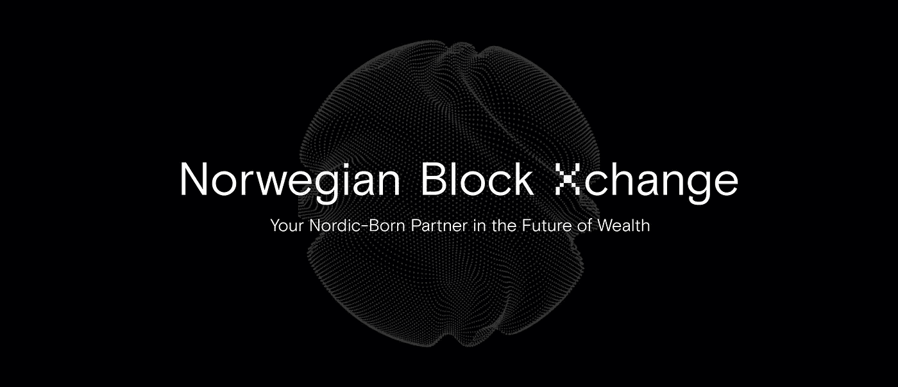
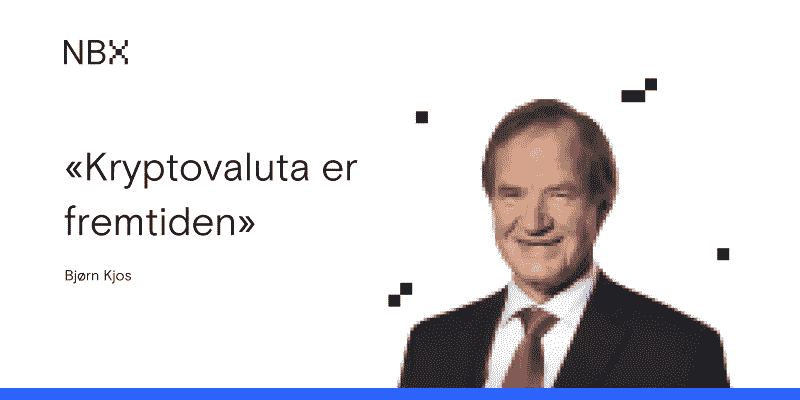
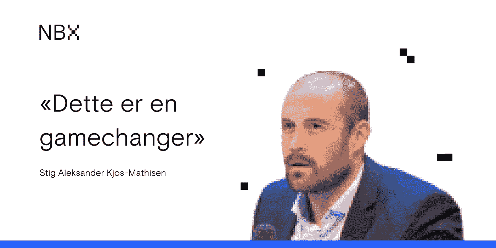

# 从结霜的斜坡到挪威领先的加密货币交易所

> 原文：<https://medium.com/coinmonks/from-the-frosty-slopes-to-norways-leading-cryptocurrency-exchange-5e0863236a53?source=collection_archive---------2----------------------->

## NBX 是你未来财富的北欧伙伴。

Join us at [nbx.com](https://nbx.com/?utm_source=medium_coinmonks&utm_medium=link)

加密货币领域的一切都在继续以光速发展，包括我们。从我们卑微的开始，我们现在已经把我们的目标变成了 NBX 未来的宏伟愿景。

# **我们来自哪里**

最重要的是，我们是真正的挪威企业。

我们来自一个以创新为中心的文化，在变化面前蓬勃发展。因为我们有一颗挪威人的心，我们把所有的客户都当作人，而不仅仅是数字。此外，我们体现了根植于挪威社会的高度信任与合作。

总而言之，没有什么比我们与[比约恩·乔斯](https://en.wikipedia.org/wiki/Bjørn_Kjos)的深厚关系和他的商业成功史更能说明这一切。

比约恩·乔斯是北欧的巨人:飞行员、律师、商业巨头，创办了挪威航空公司和挪威银行。作为一名企业家，他一直质疑现状，展望未来，寻找创新的替代商业模式。

特别是，挪威航空航天公司在实践中展示了这些品质。从竭尽全力节省燃油和空间，到比竞争对手的票价低 20-50 %, NAS 始终站在航空业创新的最前沿。

## 博加塞特:引发这一切的火花

2017 年，这种创新精神在圣诞节假期的布加塞特达到顶峰，比约恩·Kjos 和斯蒂格-亚历山大·Kjos-Mathisen(比约恩的女婿)开始了他们一年一度的滑雪之旅。

What happens in Bøgaset… leads to new business ideas.

一天，在越野滑雪时，他们开始考虑如何将加密支付加入 NAS 的产品中。

从这些简单的开始，NBX 出生了，就在圣诞节假期结束后一周。虽然它最初是 n as 的副产品，专注于创新航空支付，但现在它已经成为一个加密货币交易所、托管人和支付系统。

总体而言，NBX 的目标是成为北欧领先的加密货币交易所，同时以安全监管的方式为其所有客户提供更好的创造和管理财富的方式。

## 我们是家族经营的

NBX 的初始投资来自 Kjos 家族本身，显示了他们对加密货币空间潜力的根深蒂固的信念。

因此，在我们的核心，我们一直是一个家族经营的企业。

Read: Kryptovaluta er fremtiden, [https://e24.no/boers-og-finans/i/EWLlLK/bjoern-kjos-kryptovaluta-er-fremtiden](https://e24.no/boers-og-finans/i/EWLlLK/bjoern-kjos-kryptovaluta-er-fremtiden) (NO)

## 受到挪威银行的信任

去年，当一家在挪威经营了 170 多年的老牌银行收购了 NBX 的股份后，一切都加速了。

这是真正的游戏改变者。

在他们投资之前，挪威银行和世界上大多数其他银行在加密货币方面基本上处于观望状态，或者更糟糕的是，积极抵制加密货币的崛起。Sparebanken 的一名代表表示，成为 NBX 的投资者有助于他们保持相关性，并为金融业不可避免的未来做好准备。

通过 spare banken ST 的例子，现在很明显，他们愿意加入进来并参与其中。据该银行的一名代表称，他们将 NBX 视为一个学习的机会，并在加密货币领域的发展中发挥积极作用。

最重要的是，他们并不孤单！

我们的其他投资者包括:Observatoriet Invest、Dasha Group、Nye KM Aviatrix Invest、Nye GKB Invest、Kei Invest、Snefred Invest、Tom Oil 和 Sam Eiendomspartner，它们都是对加密货币感兴趣的主要挪威投资公司。

Read: [Sparebanken Øst putter penger i Kjos’ kryptoselskap: — Dette er en gamechanger](https://e24.no/boers-og-finans/i/70Q8KW/sparebanken-oest-putter-penger-i-kjos-kryptoselskap-dette-er-en-gamechanger), (NO)

# 前方道路上的北极光

现在，您已经熟悉了我们的发展历程，是时候展望我们正在构建的未来以及您对我们的期望了。

## **我们与他们合作，而不是与他们对抗**

许多加密企业没有意识到，要打造金融的未来，与传统公司合作是非常重要的。这并不意味着牺牲我们的承诺，即让你既是银行又是投资者。

这意味着我们正在与我们的支持者合作，尽快弥合加密货币和传统金融之间的差距。

> ***银行协作意味着可以构建更完整的支付解决方案和新型储蓄产品，****—Stig Aleksander Kjos-Mathisen，联合创始人兼董事总经理@ NBX*

*换句话说，crypto 需要更多消费者现成的产品来实现广泛采用。然而，为了让这些产品获得有意义的吸引力，我们必须从真正的新来者那里建立客户基础，也就是说，那些从未体验过加密货币的人。*

*要做到这一点，我们必须知道传统金融机构在哪里失败了，在哪里成功了。随着时间的推移，我们将继续寻找新的机构合作伙伴，以帮助我们进一步了解这些事实。*

## *我们被规定要和传统机构建立平等的基础*

*仅仅因为基于密码的公司希望改善金融现状，并不意味着他们必须避免监管。*

*NBX 已经得到挪威金融监督局的批准，受到全面监管。此外，我们还接受了 Moore Global 的审计，Moore Global 是 260 多家不同公司的著名审计师。*

*随着我们的成长和变得更加全球化，我们将始终寻求在我们扩张到的任何地方建立与当地监管机构相同的合规水平。*

## *我们永远是透明的*

*总而言之，我们的透明度高于我们的所有努力，是我们区别于所有其他加密货币交易所的品质之一。*

> *从许多方面来看，NBX 将像一家上市公司一样，发布最少的季度报告，提供对我们所持股份和客户存款价值的全面了解。NBX 也计划公开上市，就像挪威航空公司和挪威银行一样，*——Stig Aleksander Kjos-Mathisen，联合创始人@ NBX**

*这意味着，无论我们的未来如何，就透明度而言，你可以将 NBX 视为与任何上市公司处于平等地位。*

## *我们的设计是安全的*

*安全是我们所有工作的核心。*

*从一开始，我们就一直致力于提供最佳的解决方案，在整个 NBX 体验中保护您和您的资金。这使我们能够可靠地吸引和留住机构客户以及具有各种技术和非技术背景的个人。*

## *我们很友好，很容易接近*

*最后，太多的加密货币交易所根本不迎合新人。*

*从历史上看，这让他们感到失落和困惑，并容易犯代价高昂的错误。在 NBX，我们致力于改变这种状况。我们的产品一直在不断发展，教育是我们最关心的问题。*

*与我们一起，每个人都将被覆盖，因为我们的业务重点是那些希望探索数字资产世界并更近距离地了解金钱未来的人，无论他们是新人还是铁杆粉丝。*

*最后，无论你的财务自由之旅带你到哪里，我们都是你值得信赖的向导。在途中，您可以期待我们让您轻松获得 NBX 产品的每一个元素。这意味着我们会一直倾听您的意见，并考虑哪些地方需要做得更好。*

## *我们将引领财富的未来*

*综上所述，我们的目标是成为北欧最值得信赖的领先交易所，然后走向世界。我们对全面法规遵从性的承诺、与机构的合作以及提供尽可能最好的安全性和教育将帮助我们做到这一点。*

*最重要的是，像比约恩·乔斯和他过去的所有公司一样，我们将永远创新。*

*因此，在我们的帮助下，无论您的加密背景如何，您都可以在知情的指导下期待激动人心的新投资机会。事实上，crypto 已经为我们所有人准备好了，我们在这里帮助你理解这一点。*

*不要浪费一秒钟。在未来的财富中，NBX 作为您的北欧伙伴，确保您的领先地位。*

**

*挪威大宗交易(NBX)是一个开拓性、前瞻性和面向客户的挪威加密货币交易、托管和支付系统。在 nbx.com[与我们交易](https://nbx.com/?utm_source=medium&utm_medium=footer)，在[推特](https://twitter.com/nbxcom)或[脸书](https://www.facebook.com/nbxcom/)关注我们📲✔️*

**免责声明:所提供的内容不构成财务建议。**

## *另外，阅读*

*   *最好的[加密交易机器人](/coinmonks/crypto-trading-bot-c2ffce8acb2a)*
*   *[密码本交易平台](/coinmonks/top-10-crypto-copy-trading-platforms-for-beginners-d0c37c7d698c)*
*   *最好的[加密税务软件](/coinmonks/best-crypto-tax-tool-for-my-money-72d4b430816b)*
*   *[最佳加密交易平台](/coinmonks/the-best-crypto-trading-platforms-in-2020-the-definitive-guide-updated-c72f8b874555)*
*   *最佳[加密贷款平台](/coinmonks/top-5-crypto-lending-platforms-in-2020-that-you-need-to-know-a1b675cec3fa)*
*   *[最佳区块链分析工具](https://bitquery.io/blog/best-blockchain-analysis-tools-and-software)*
*   *[加密套利](/coinmonks/crypto-arbitrage-guide-how-to-make-money-as-a-beginner-62bfe5c868f6)指南:新手如何赚钱*
*   *最佳[加密制图工具](/coinmonks/what-are-the-best-charting-platforms-for-cryptocurrency-trading-85aade584d80)*
*   *[莱杰 vs 特雷佐](/coinmonks/ledger-vs-trezor-best-hardware-wallet-to-secure-cryptocurrency-22c7a3fd391e)*
*   *了解比特币的[最佳书籍有哪些？](/coinmonks/what-are-the-best-books-to-learn-bitcoin-409aeb9aff4b)*
*   *[3 商业评论](/coinmonks/3commas-review-an-excellent-crypto-trading-bot-2020-1313a58bec92)*
*   *[AAX 交易所评论](/coinmonks/aax-exchange-review-2021-67c5ea09330c) |推荐代码、交易费用、利弊*
*   *[Deribit 审查](/coinmonks/deribit-review-options-fees-apis-and-testnet-2ca16c4bbdb2) |选项、费用、API 和 Testnet*
*   *[FTX 密码交易所评论](/coinmonks/ftx-crypto-exchange-review-53664ac1198f)*
*   *[n 零审核](/coinmonks/ngrave-zero-review-c465cf8307fc)*
*   *[Bybit 交易所评论](/coinmonks/bybit-exchange-review-dbd570019b71)*
*   *[3Commas vs Cryptohopper](/coinmonks/cryptohopper-vs-3commas-vs-shrimpy-a2c16095b8fe)*
*   *最好的比特币[硬件钱包](/coinmonks/the-best-cryptocurrency-hardware-wallets-of-2020-e28b1c124069?source=friends_link&sk=324dd9ff8556ab578d71e7ad7658ad7c)*
*   *最佳 [monero 钱包](https://blog.coincodecap.com/best-monero-wallets)*
*   *[莱杰 nano s vs x](https://blog.coincodecap.com/ledger-nano-s-vs-x)*
*   *[bits gap vs 3 commas vs quad ency](https://blog.coincodecap.com/bitsgap-3commas-quadency)*
*   *[莱杰纳米 S vs 特雷佐 one vs 特雷佐 T vs 莱杰纳米 X](https://blog.coincodecap.com/ledger-nano-s-vs-trezor-one-ledger-nano-x-trezor-t)*
*   *[block fi vs Celsius](/coinmonks/blockfi-vs-celsius-vs-hodlnaut-8a1cc8c26630)vs Hodlnaut*
*   *[bits gap review](/coinmonks/bitsgap-review-a-crypto-trading-bot-that-makes-easy-money-a5d88a336df2)——一个轻松赚钱的加密交易机器人*
*   *为专业人士设计的加密交易机器人*
*   *[PrimeXBT 审查](/coinmonks/primexbt-review-88e0815be858) |杠杆交易、费用和交易*
*   *[埃利帕尔泰坦评论](/coinmonks/ellipal-titan-review-85e9071dd029)*
*   *[赛克斯石评论](https://blog.coincodecap.com/secux-stone-hardware-wallet-review)*
*   *[BlockFi 评论](/coinmonks/blockfi-review-53096053c097) |赚取高达 8.6%的加密利息*