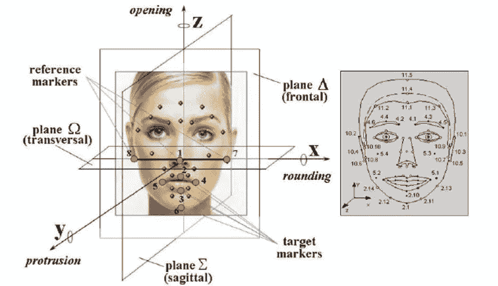

# 基于计算机的面部识别系统的进步

> 原文：<https://medium.com/coinmonks/from-the-rand-tablet-to-differentiating-identical-twins-aa4ba6031bb0?source=collection_archive---------6----------------------->

## 从兰德平板电脑到区分同卵双胞胎！

是的，你猜对了，我们今天要谈论的是"**基于计算机的面部识别系统"**。这是目前移动电话公司试图改进的最热门的技术之一。不仅仅是手机，面部识别也开始在工业领域发挥作用，但所有这些面临的主要挫折是其“**准确性”。**对于用于区分的特征，它们仍然不够准确。所以让我们从面部识别到底是什么开始。

让我们先来看看维基百科的定义:

**面部识别系统是一种能够从******或** [**验证**](https://en.wikipedia.org/wiki/Authentication) **一个人的** [**数字图像**](https://en.wikipedia.org/wiki/Digital_image) **或** [**视频帧**](https://en.wikipedia.org/wiki/Film_frame) **从** [**视频**](https://en.wikipedia.org/wiki/Video) **源面部识别系统有多种工作方法，但一般来说，它们通过将从给定图像中选择的** [**面部特征**](https://en.wikipedia.org/wiki/Face) **与** [**数据库**](https://en.wikipedia.org/wiki/Database_management_system) **中的面部进行比较来工作****

**链接到维基百科页面:[https://en.wikipedia.org/wiki/Facial_recognition_system](https://en.wikipedia.org/wiki/Facial_recognition_system)**

**根据上面的陈述，顾名思义，它只是一个识别人脸的系统。在这篇博客中，我们将以一种分层的方式来讲述这个系统是如何随着时间的推移而发展的。**

**这就是一切开始的地方！**

# **布莱德索的兰德平板电脑(20 世纪 60 年代)**

*****这是第一个半自动面部识别系统！*****

****

**The RAND Tablet**

**很多人会说面部识别之父是伍德罗·威尔逊·布莱索。在 20 世纪 60 年代，Bledsoe 开发了一个系统，可以使用所谓的 RAND tablet 对面部照片进行手动分类，这是一种人们可以使用发射电磁脉冲的手写笔在网格上输入水平和垂直坐标的设备。该系统可用于手动记录各种面部特征的坐标位置，包括眼睛、鼻子、发际线和嘴。**

**然后，可以将这些指标插入到数据库中。然后，当系统得到一个人的新照片时，它能够从数据库中检索出与那个人最相似的图像。当时，人脸识别不幸地受到时代技术和计算机处理能力的严重限制。然而，这是证明人脸识别是可行的生物计量的重要的第一步。**

# **21 种面部标志(20 世纪 70 年代)**

*****使用 21 个主观面部标记进行自动人脸识别*****

****

**Facial Markers Example**

****Goldstein，Harmon 和 Lesk** 使用了 21 种特定的主观标记，如头发颜色和嘴唇厚度，来自动识别。测量和位置需要手动计算，导致程序需要大量的劳动时间。但是与 RAND Tablet 技术相比，它提供了更好的准确性。**

# **特征脸(20 世纪 80 年代末至 90 年代初)**

*****利用线性代数进行面部识别！*****

****

**1988 年，Sirovich 和 Kirby 开始将线性代数应用于面部识别问题。众所周知的特征脸方法是从寻找面部图像的低维表示开始的。Sirovich 和 Kriby 能够证明对一组面部图像进行特征分析可以形成一组基本特征。他们还能够表明，为了准确地对标准化的人脸图像进行编码，需要不到 100 个值。**

**1991 年，Turk 和 Pentland 通过发现如何在图像中检测人脸，扩展了特征脸方法。这导致了自动人脸识别的第一次出现。他们的方法受到技术和环境因素的限制，但在证明自动面部识别的可行性方面，这是一个重大突破。**

# **FERET 计划(1993-2000 年)**

*****打造商用面部识别市场！为了数据。*****

****

**FERET**

**国防高级研究计划局(DARPA)和国家标准与技术研究所在 20 世纪 90 年代开始推出人脸识别技术(FERET)计划，以鼓励商业人脸识别市场。该项目包括创建一个面部图像数据库。该数据库于 2003 年更新，纳入了高分辨率的 24 位彩色图像。测试集中包括代表 856 个人的 2，413 张静态面部图像。希望面部识别测试图像的大型数据库能够激发创新，这可能会产生更强大的面部识别技术。**

# **面部识别供应商测试(2000 年)**

*****商用面部识别系统的评测。*****

****

**美国国家标准与技术研究所(NIST)在 21 世纪初开始了人脸识别供应商测试(FRVT)。FRVTs 建立在 FERET 的基础上，旨在为商业上可用的面部识别系统以及原型技术提供独立的政府评估。这些评估旨在为执法机构和美国政府提供必要的信息，以确定部署面部识别技术的最佳方式。**

# **FRGC (2006 年)**

*****那个时代一些最先进的面部识别算法的展示，全部集中在一个地方！*****

****

**人脸识别大挑战(FRGC)评估了最新的人脸识别算法。测试中使用了高分辨率人脸图像、3D 人脸扫描和虹膜图像。结果表明，新算法比 2002 年的人脸识别算法精确 10 倍，比 1995 年的精确 100 倍。一些算法能够在识别人脸方面胜过人类参与者，并且可以唯一地识别同卵双胞胎。但是这种先进的系统也有很多局限性，并且它们的结果需要很高的成本。**

# **社交媒体(2010 年至今)**

*****脸书推出的著名照片标签功能！*****

****

**photo tagging**

**2010 年标志着全世界社交媒体平台的巨大变化，脸书为其用户推出了照片标签功能。这主要是当一个人给一张照片加标签时，系统会自动识别照片中每个人的脸，但前提是这个人是脸书家族的一员。**

**但是这个特征一点也不准确，而是一个**击中和错过**的成功率。它在识别侧脸、模糊图像等方面有困难。所以，当脸书开始与其他科技巨头如谷歌和 IBM 一起开发这项技术时。**

# **DeepFace (2014 年至 2015 年)**

*****深度倾斜面部识别系统*****

****

**How it works!**

**在其照片标记功能失败后，脸书对这项技术非常重视，并在脸书的人工智能实验室开始了研究，并将它命名为 **DeepFace。****

**这项技术基于名为**深度学习的机器学习子分支。**它识别数字图像中的人脸。它采用了一个九层[神经网络](https://en.wikipedia.org/wiki/Neural_net)，拥有超过 1.2 亿个连接权重，并在脸书用户上传的 400 万张图片上进行[训练](https://en.wikipedia.org/wiki/Machine_learning)。**

**有趣的是，用于训练该系统的 400 万张图片来自 4030 名活跃的脸书用户的个人资料！该系统的准确率为 **97.35%，**仍比人的准确率低 0.28%。**

**是啊！人类赢了。:)**

# **FaceIt ARGUS**

*****利用你的皮肤进行面部识别！*****

****

**FaceIt 使用的技术表明了我们目前使用的面部识别技术是多么多余。**

**它的工作原理是“**表面纹理分析”，**其中它创建用户的皮肤印迹，而不是所有当前系统所做的面部印迹。这是通过皮肤的纹理分析来完成的，像指纹一样，每个人的皮肤都是独一无二的。**

**这项技术非常先进，甚至可以区分同卵双胞胎，而使用人脸打印的系统很难做到这一点。**

**这表明随着技术的进步，面部识别系统也在进步。计算机是如何开始像人类一样学习的，这种技术一直在一天天进步。**

**例如，**万事达卡**目前正在研究如何通过自拍来验证支付！！**

**在不久的将来，我们将在一切事情上使用我们的脸，像你的家庭安全系统，你的支付认证等。**

**“它将是我们使用的所有东西的密码”。**

**我的博客到此结束。如果你喜欢我的内容并想要更多，请关注我来支持我，如果你喜欢这个博客，请留下一些掌声！**