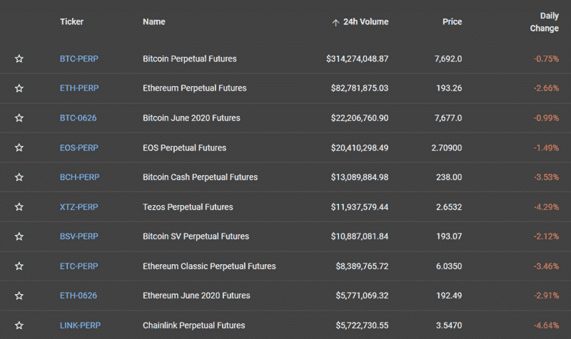

# 《2022 年 FTX 评论》——离开币安？

> 原文：<https://medium.com/coinmonks/ftx-crypto-exchange-review-53664ac1198f?source=collection_archive---------0----------------------->

## FTX 加密货币交易所述评

# 什么是 FTX？

[FTX](https://ftx.com/referrals#a=coinmonks) 是由顶级加密货币流动性提供商[阿拉米达研究](https://www.alameda-research.com/)支持的加密交易所。按交易量计算，它是全球五大衍生品交易所之一。[币安](https://accounts.binance.com/en/register?ref=UARTH1S1)，世界领先的加密货币交易所，于 2019 年 12 月向 [FTX](https://ftx.com/referrals#a=coinmonks) 投入大笔资金。这说明它是一个有前途的值得信赖的平台。

## 你应该从币安搬到 FTX 吗？

我最近想了很多，看到了币安 CEO CZ [攻击 FTX](https://twitter.com/cz_binance/status/1560753868744671232)的活动，以及去年 FTX 的收入有了[的巨大增长；所以，我猜有什么事情发生了，这让币安很焦虑。此外，我想你所有的钱只信任一个交易所不是一个好主意。因此，我相信你应该](https://www.cnbc.com/2022/08/20/ftx-grew-revenue-1000percent-during-the-crypto-craze-leaked-financials.html)[今天就报名参加 FTX](https://ftx.com/referrals#a=coinmonks)。

现在，让我们开始回顾 FTX，从它的产品开始。顺便说一句，你知道 FTX 在他们的交易所内建立了自动化吗？会在文章后面讲到。

# **FTX 产品**

让我们看看 [**FTX**](https://ftx.com/referrals#a=coinmonks) 提供的不同可交易产品。

## **1。期货**

这是一种以预定价格购买或出售资产的协议。支持 BTC、BNB、林克等 20 多种加密货币的永续期货。FTX 密码交易所也提供指数期货，让你更容易交易密码市场的几个部分。它们包括大型，中型和小型硬币。您还可以交易交换令牌、隐私令牌和区域购物篮。有些石油合同以 WTI 石油的现货价格到期。

FTX Trading Products reviews

## **2。FTX 杠杆代币**

这些代币为您提供加密货币市场的杠杆敞口，而无需管理杠杆头寸。 [FTX 交易所](https://ftx.com/referrals#a=coinmonks)提供 45 种不同的杠杆代币。

该平台提供高达 101 倍的杠杆作用。它将 10 倍杠杆作为安全性的默认值。分为三个不同的类别:

*   1x 令牌被称为对冲。如果 ETH 上升 x%，ETHHEDGE 下降相同的百分比。
*   0.5x 长称为一半。如果 ETH 上涨了 2%，它就会上涨 x%。
*   3x 代币被称为多头或空头

公牛代币是 ERC20 代币。如果 ETH 永久期货上涨 x%，那么 ETHBULL 上涨 3%，ETHBEAR 下跌 3%。

牛市和熊市令牌自动重新平衡自己，以维持目标杠杆和防止清算。

## **3。FTX 移动合同**

移动合约允许你根据特定加密货币的价格变动进行交易，只需承担少量风险。运动可以是任意方向的。

它们是根据 BTC 的原始数量到期的期货。它可以是每天、每周、每月或每季度。每周合同不必与日历周相对应。主要决定因素是 BTC 在一段时间内的整体波动性。这个功能吸引了很多用户到交易所。

## **4。选项**

它提供欧式期权合约。它们赋予你在预定的日期和价格出售标的资产的权利，但这不是强制性的。当你开立期权合约时，你可以选择“买入权”或“卖出权”。

你可以利用杠杆做多或做空。此外，你可以设定你的执行价格和到期时间。在输入建立期权合约的所有必要信息后，你从 **FTX** 得到报价，在 10 秒钟内产生一个出价或提供交易。它们是高度可定制的。

> 另外，请阅读我们的 [Deribit 评论](/coinmonks/deribit-review-options-fees-apis-and-testnet-2ca16c4bbdb2):比特币期货和期权交易所

FTX option market reviews

## **5。现货市场**

它使用户能够购买加密货币，然后使用传统技术使用市场匹配的订单进行交易。流行的数字加密货币，如 BTC、ETH、LINK、FTT、BCH、BNB、USDT、BTMX、TRYB、PAXG 和 XAUT 都可以进行现货交易。

## **6。预测市场**

它们使用户能够以更传统的方式进行交易。它类似于传统的赌博。你可以在任何真实事件上下注。你要么赢，合约将 100%结算，要么输，合约将下跌 0%。其中一个著名的例子是，你可以打赌谁会赢得即将到来的选举。每个候选人都会有一份合同。每位候选人的买入价格都不同，这取决于获胜的可能性。他们可以做多或做空每份合约。

# **FTX 场外交易台**

假设你正在购买大量资产。在这种情况下，你可能适合购买“非处方”或“OTC”一般来说，专业交易者选择这个选项，因为订单簿可能很薄，无法执行交易。另一个原因可能是它可能会影响加密货币的价格。

美国和世界其他地区的大多数比特币交易所都提供这种选择，但****对价差外的**不收取任何费用。您可以请求 OTC 报价。它提供优惠价格。你可以通过查看 FTX 的 [OTC 报价门户](https://ftx.com/#a=coinmonks)了解更多。**

# ****如何在**[**FTX**](https://ftx.com/referrals#a=coinmonks)**交易所开户？****

**要在 FTX 创建账户，您必须点击右上角的[注册](https://ftx.com/#a=coinmonks)选项卡。您可以在配置文件设置中使用双因素身份验证来保护您的帐户。接下来，你需要完成你的 KYC。细节将在以下章节中提及。**

****

**How FTX works?**

**在任何时候， [FTX](https://ftx.com/referrals#a=coinmonks) 如果怀疑有任何恶意活动，都可以询问更多细节。您可以在帐户的“验证身份”选项卡下进行 KYC。**

****

**FTX global review — identity verification**

# ****FTT 令牌(FTX 本土令牌)****

**FTT 是 FTX 交易所的本土标志。它给用户一些额外的好处，比如-**

*   **你必须支付较少的 FTX 交易费。**
*   **你从保险基金中获得社会化收益。**
*   **你可以每周购买和刻录你的费用。**
*   **你可以把它作为期货交易的抵押品。**

**可以在交易所现货/期货交易。例如，它也可以在币安交易。**

# **FTX 评论:**加密货币支持****

**FTX 支持 30 多种加密货币。此外，加密交易所还提供几个指数的交易。例如，通过利用 BNB、HT、OKB 和 LEO 价格的加权平均值，EXCH 包括几个交换令牌。**

# ****付款方式****

**它支持以下货币的各种固定存款和取款。它目前不支持 INR，但我们可能很快就会看到整合，因为币安已经投资了 FTX，后者已经收购了[瓦济克斯交易所](https://wazirx.com/invite/ad4e888q)。**

*   **美元**
*   **欧元**
*   **港币**
*   **签名于**
*   **增益带宽乘积（Gain-Bandwidth Product 的缩写）**
*   **充血性心力衰竭(congestive heart failure)**
*   **金**
*   **澳元**
*   **计算机辅助设计**

# ****FTX 交易费用和收费****

**FTX 提供分级收费结构。**

****

**FTX trading fees**

**永久合同也收取融资费。不是交易所拿的。它是给对方合同的持有者的。**

**它向 FTT 持有者提供费用折扣。收取的费用不能低于 0.015%。根据你持有的 FTT 股票，你会得到折扣。**

****

**FTX Trading fee discount**

**杠杆代币的创建和赎回收取 0.10%的费用，每日管理费收取 0.03 %。**

**如果你用的是 50 倍的杠杆，那就增加了 0.02%的交易费用，100 倍或更高，就增加了 0.03%。它支付给保险基金。**

**移动合约的费用取决于基础指数，而不是移动合约的价格。**

**它不收取存款或取款费用。您也不需要为兑换您的交易所钱包或场外交易付费。**

**如果您的法币/稳定币存取额大于交易量， [FTX 密码交易所](https://ftx.com/referrals#a=coinmonks)将向您收取最高 0.10%的取款费。他们会在设置这个之前联系你。**

# **FTX 评论:**语言和支持的国家****

**FTX 支持以下语言-**

*   **英语**
*   **西班牙语**
*   **意大利的**
*   **中国人**
*   **葡萄牙语**
*   **韩国的**
*   **俄语**
*   **德国人**
*   **法语**
*   **土耳其的**
*   **荷兰人**
*   **越南人**

# ****FTX 清算引擎****

**FTX 从零开始建立了自己的清算引擎。它使用智能和高效的价值观来选择清算流程。**

**它向交易者发出合理且数量有限的平仓警告，逐步平仓低于 4.5%维持保证金的头寸。**

**这防止了收回的可能性，即使在市场高度不可预测的情况下，收回仍然是可能的。你应该留意他们的估计清算价格。**

**你可以用较低的杠杆交易来降低平仓的概率，并且总是使用止损！**

****FTX 交易自动化****

# ****FTX 评论:客户支持****

**你可以在 support@ftx.com 的[给他们写信。如果你在朝鲜，你也可以在 support@ftxkr.com 给他们写信。他们还有一个活跃的 T4 电报频道，有十多种语言。网站上有详细的常见问题解答部分。你也可以通过他们的微信群(FTX 官方)联系他们。](mailto:support@ftx.com)**

**他们还有一个 Youtube 频道，在那里他们定期分享如何有效使用该平台的最新信息。**

> **还有，看 [PrimeXBT vs FTX vs 德里比特](/coinmonks/primexbt-vs-ftx-vs-deribit-cb39860f41db)**

# **FTX 交易所评论:**用户体验****

**这个网站有很多特色，而且很方便用户。它还支持黑暗模式。每当您将鼠标悬停在某个按钮上时，就会出现关于该功能的信息。**

**有很多关于如何开始使用 [FTX](https://ftx.com/referrals#a=coinmonks) 的文章、视频和用户手册。它使用来自[交易视图](https://www.tradingview.com/)的标准图表。您可以自定义此图表。订单输入表单、订单簿等的分组可以重新安排。您可以在 Trollbox 聊天窗口中与其他人交谈。**

**你可以从 Playstore 和 iOS 应用商店下载 FTX 应用。此外，FTX 还允许你使用 Rest API 来自动化你的加密交易。**

****

**FTX User Interface review**

# **FTX 评论:**安全****

**根据 Mozilla 的天文台测试，FTX 有 B+安全。这是一个惊人的分数。**

**它还使用双因素身份验证。您可以使用 Authy、Google Authenticator 或 SMS 来实现同样的功能。除此之外，取款也可以使用单独的密码。在“登录”部分，您可以为不同的子帐户添加权限。**

**此外， [FTX 密码交易所](https://ftx.com/referrals#a=coinmonks)拥有一支来自麻省理工学院和柏克莱大学以及谷歌和脸书公司的非常专业的团队。**

**最后，FTX 与加密货币领域的大公司联系在一起。FTX 的合伙人名单中包括 Circle、FBG 资本和 True USD 等公司，这些公司通过支持贸易审查来证明其可靠性。**

# **FTX 保险基金**

**保险基金用于防止客户因突然的大规模市场波动而遭受损失，这可能会迅速清算交易所的许多未平仓头寸。**

**利用 50-100 倍杠杆的交易者支付更高的费用，这直接增加了保险基金，因为他们增加了清算的可能性。如果 FTX 的清算引擎万一失灵，比如比特币价格突然出现不可预见的下跌，保险基金将被用来支付那些被不合理平仓的交易员的损失。**

**大约 5%的非 FTX 所有的 FTT 代币同样被搁置一边，以防万一保险基金没有钱支付给客户。当基础市场在不可预测的情况下大幅波动时， [FTX](https://ftx.com/referrals#a=coinmonks) 保险基金似乎获得了净收益。**

**这些收益的回报在 FTT 代币持有者之间分配，也称为“社会化收益”，为 FTT 代币增加了另一层效用。**

# **FTX 的贸易自动化**

**FTX 有一个 quant 专区，在这里你可以使用简单的功能创建交易规则，并实现交易自动化。这最适合想要创建交易策略和自动化交易的高级用户。**

**要了解更多，请阅读更多关于 FTX 量子区[这里](https://help.ftx.com/hc/en-us/articles/360041683831-Quant-Zone-Rules-FAQ)。**

****

# ****FTX——优势与**劣势**

## **优势**

*   **低费用**
*   **你不需要 KYC 在这个平台上交易，但它可以增加你的限制。**
*   **FTX 允许您使用 simplex 通过信用卡购买加密货币。**
*   **它专门从事衍生品交易。**
*   **FTX 保证流动性。**
*   **您可以生成并与他人共享您的损益报告。**

## ****缺点****

*   **杠杆代币是有风险的。**
*   **这是一个相对较新的平台。**

# **FTX 交易所评论:结论**

**交易者寻找流动性；FTX 是一个拥有大量流动性的加密交易所。此外，FTX 还扩大并允许 S&P500 股票的杠杆交易，如特斯拉和亚马逊。在加密方面，FTX 列出了许多 DeFi 令牌。此外，如果你持有 FTT 代币，你可以享受费用折扣。因此， [FTX](https://ftx.com/referrals#a=coinmonks) 是最好的加密交易交易所之一。**

# **常见问题**

## **什么是 FTX 杠杆代币？**

**[FTX](https://ftx.com/referrals#a=coinmonks) 杠杆代币为您提供加密货币市场的杠杆敞口，无需管理杠杆头寸。FTX 提供 45 种不同的杠杆代币。**

## **什么是 FTT 代币？**

**FTT 是 FTX 交易所的本土标志。它给予用户一定的优惠，如低交易费，FTX 保险基金的收益等。**

## **FTX 受监管吗？**

**是的，FTX 是受监管的，其美国实体[已经在金融犯罪执法网络(FinCEN)注册](https://www.financemagnates.com/cryptocurrency/news/ftx-set-to-launch-us-spot-exchange-gaining-licenses-from-states/)为货币服务企业(MSB ),目前正在从几个州获得货币转移许可证(MTL)。**

## **FTX 交易所合法安全吗？**

**是的， [FTX](https://ftx.com/referrals#a=coinmonks) 密码交易所是合法和安全的(和其他集中交易所一样)。它有一个经验丰富的团队和信誉良好的支持者。**

> **加入 Coinmonks [电报频道](https://t.me/coincodecap)和 [Youtube 频道](https://www.youtube.com/c/coinmonks/videos)了解加密交易和投资**

## **另外，阅读**

*   **[购买比特币印度](/coinmonks/buy-bitcoin-in-india-feb50ddfef94) | [Pionex 评论](/coinmonks/pionex-review-exchange-with-crypto-trading-bot-1e459d0191ea) | [加密交易机器人](/coinmonks/crypto-trading-bot-c2ffce8acb2a)**
*   **[n rave ZERO Review](/coinmonks/ngrave-zero-review-c465cf8307fc)|[phe MEX Review](/coinmonks/phemex-review-4cfba0b49e28)|[PrimeXBT Review](/coinmonks/primexbt-review-88e0815be858)**
*   **最佳[区块链分析](https://bitquery.io/blog/best-blockchain-analysis-tools-and-software)工具| [赚比特币](/coinmonks/earn-bitcoin-6e8bd3c592d9)**
*   **[Cloudbet 赌场评论](https://coincodecap.com/cloudbet-casino-review) | [点火赌场评论](https://coincodecap.com/ignition-casino-review)**
*   **[加密套利](/coinmonks/crypto-arbitrage-guide-how-to-make-money-as-a-beginner-62bfe5c868f6)指南| [如何做空比特币](/coinmonks/how-to-short-bitcoin-568a2d0b4ae5)**
*   **[如何在加拿大购买加密货币？](https://coincodecap.com/how-to-buy-cryptocurrency-in-canada)**
*   **[无聊猿游艇俱乐部(BAYC)回顾](https://coincodecap.com/bored-ape-yacht-club-bayc-review) | [拜比特 vs 比特币基地](https://coincodecap.com/bybit-vs-coinbase)**
*   **[5 款最佳加密交易终端](https://coincodecap.com/crypto-trading-terminals) | [最佳 DeFi 应用](https://coincodecap.com/best-defi-apps)**