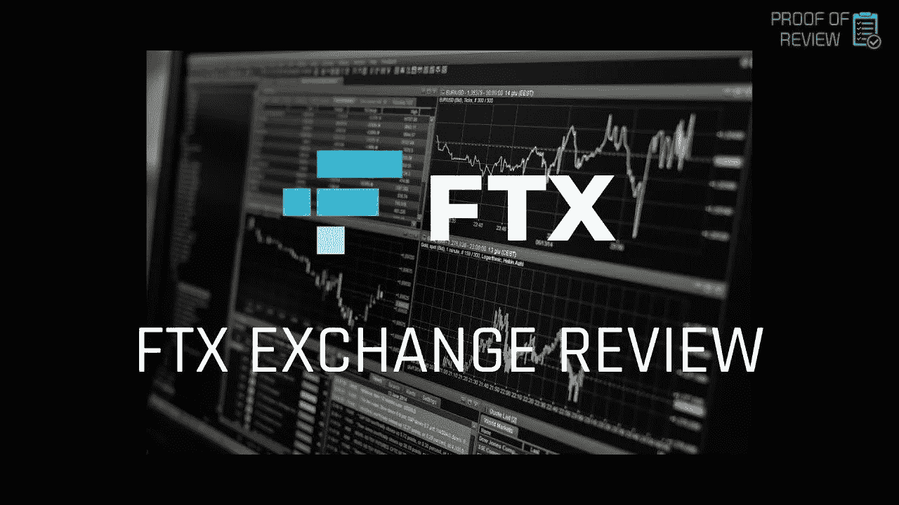
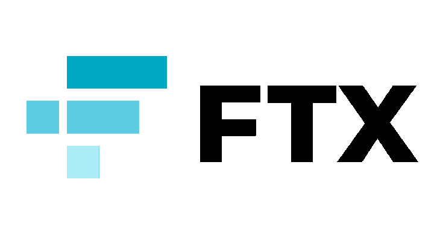
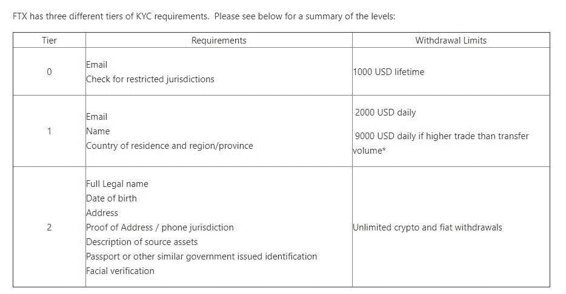
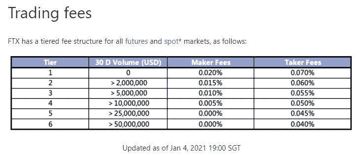
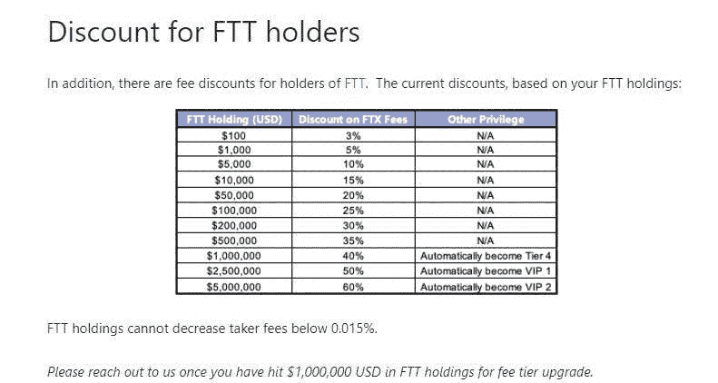
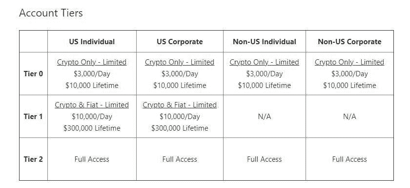
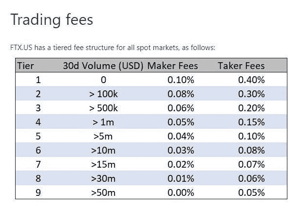

# FTX 评论:发展最快的衍生品交易所

> 原文：<https://medium.com/coinmonks/ftx-the-fastest-moving-derivatives-exchange-hacker-noon-32f4e0296ec8?source=collection_archive---------2----------------------->

FTX 是发展最迅速的交易所之一，通过迅速增加新服务而迅速出名。它开创了新产品，如 T4、预测市场和细分股票交易。不幸的是，美国人不能利用这种交流。

[**阿拉米达研究**](https://www.alameda-research.com/?ref=hackernoon.com) 投资了 [FTX](https://bit.ly/3eYG3Y6) (这两个实体都是由[山姆·班克曼-弗里德](https://twitter.com/SBF_Alameda?ref=hackernoon.com)创立的)。阿拉米达是一家量化加密交易公司，拥有 1 亿美元的 AUM，是 FTX 著名的做市商。

Alameda 在成立后的一年内成为该行业的主要流动性提供商和做市商之一，每天的交易量高达 10 亿美元。 **TUSD 和 USDC 也是早期的流动性合作伙伴。**

而且， **FTX 创造了** [**血清**](https://projectserum.com/?) **(SRM)** ，一个独立于 [FTX](https://bit.ly/3eYG3Y6) 生态系统的去中心化交换。

> 免责声明:在这篇文章中，我使用了推荐链接。如果你使用推荐链接，大多数这些服务会给你额外的折扣。

# FTX 产品和特点

## **1。NFT 市场**

FTX 市场似乎同时运行在区块链以太坊和一个名为 Solana 的网络上，该网络采用了利益相关者共识机制，比以太坊消耗的能量少得多。

**不可替代代币(NFTs)** 是一种加密货币，可以提供任何种类资产的可验证所有权和稀缺性。迄今为止，NFT 已经被广泛用于数字艺术、音乐和迷因，以及其他种类的材料。

FTX 的一些非功能性金融工具与实物挂钩，可以“兑换”成实物等价物。一个 NFT 链接到三个 KAWS 小雕像的图像，应该会产生三个真正的 KAWS 小雕像；同样的道理也适用于与 FTX 品牌避孕套相关的 NFT。FTX 对 NFTs 上的每笔交易或交易向买方和卖方征收 **5%的费用。**

## **2。期货**

[**FTX**](https://bit.ly/3eYG3Y6) 提供超过 **100 种期货配对**，可以使用稳定的货币作为抵押品进行交易，如美元或 USDT。

期货合同使用稳定的货币支付。也就是说，你将拿出**稳定的收入作为抵押品**。当期货以这种方式到期时，你不需要银行账户来支付。而是用稳定的硬币，让进出仓位变得容易。当您存入稳定币时，它们会被兑换成美元以满足您的保证金需求。

[FTX](https://bit.ly/3eYG3Y6) 还包括一个支持流动性提供者的结构，如果[需要收回](https://en.wikipedia.org/wiki/Clawback?ref=hackernoon.com)的话，他们将介入。

> [***在 FTX 上注册&获得交易费用的 5%折扣***](https://bit.ly/3eYG3Y6?ref=hackernoon.com)

## **3。杠杆代币**

杠杆代币是 FTX 开发的加密货币交易者的独特资产。这些是 ERC20 代币，对交易对的杠杆敞口高达 3 倍。要开始交易杠杆硬币，用户的 FTX 账户余额中不需要保证金。还有一些交易所交易基金(ETF)利用杠杆投资于各种现有和流行的加密货币资产。

使用 FTX 杠杆代币可以帮助交易者控制风险。任何交易收益都会立即重新投资到衍生品交易所交易的基础资产中。

这意味着，如果你的杠杆代币投资有利可图，代币将自动增加 3 倍的杠杆持有量。反之，如果头寸为负，[杠杆代币](/coinmonks/leveraged-token-3f5257808b22)将立即降低风险。

## **4。移动合同**

移动合约使您能够根据特定加密货币的价格变动进行交易，同时只承担少量资金的风险。运动可以发生在任何方向。

它们是基于比特币总量而到期的期货合约。可以每天、每周、每月或每季度进行一次。每周合同不必与日历周相匹配。**BTC 在一定时间内的总波动率是主要决定因素**。这一特点吸引了大量用户来到交易所。

## **5。选项**

你也可以在 FTX 交易比特币期权，该期权赋予你在特定日期和价格购买或出售比特币的权利，但没有责任。

你可以利用杠杆做多或做空期权，就像你可以做期货一样。合同到期时，**将以美元结算相当于其到期价格的金额**。

## **6。预测市场**

它们使用户能够以更传统的方式进行交易。可以和传统博彩相媲美。**你可以在任何真实世界发生的事情上下注**。你要么赢，合约将 100%结算，要么输，合约将 0%结算。

一个众所周知的例子是打赌谁将赢得即将到来的选举。每位候选人都会得到一份合同。**每位参赛者的入场费各不相同，取决于他们获胜的几率**。他们可以选择做多或做空每份合约。

> *在我们的总统选举预测市场取得成功后，我们将努力将我们的预测市场服务扩展到* ***包括体育、电子竞技、中期选举等新活动，以及更多*** *。这个过程已经在进行中，超级碗预测市场在平台上直播，更多有趣的市场在路上。*

## 7。令牌化股票

令牌化股票是 FTX 最令人兴奋的产品。给合格的交易者一年 365 天，一周 7 天，一天 24 小时交易股票的机会是 crypto 前所未有的。

这些股票与注册经纪公司持有的股票是 1:1 的比例，交易者有权享受拥有股票的所有经济利益:股息、股票分割等等。

除了股票现货交易，我们还为这些产品实现了期货交易功能，使客户能够以高达 101 倍的杠杆进行交易，就像他们在 FTX 的任何其他市场一样；**同样的抵押品池，同样的保证金要求，同样的一切**。

## 8。现货交易

类似于现货交易交易所，传统交易者可以获得市场上各种流行的数字资产。 **FTX 目前支持 100 多个可兑换美元或 USDT 的交易配对**，包括 BTC、瑞士联邦银行、林克、FTT、PAXG、ADA 和 XRP。

## **9。场外交易柜台**

假设你正在购买大量资产。在这种情况下，你可能被允许“在柜台上”或“场外”购买。专业交易者通常选择这个选项，因为**订单簿可能太薄，无法完成交易**。另一种说法可能是，它会对那枚硬币的价格产生影响。

大多数交易所都提供这种选择，然而 FTX 除了差价之外不收取任何费用。你可以选择要求场外报价。它提供打折的价格。您可以通过访问 [FTX OTC 报价网页](https://otc.ftx.com/?ref=hackernoon.com)了解更多信息。

> [***在 FTX 上注册&获得交易费用的 5%折扣***](https://bit.ly/3eYG3Y6?ref=hackernoon.com)

## **如何开始使用 FTX**

要在 FTX 开户，请转到右上角的[并点击注册选项](https://bit.ly/3eYG3Y6?ref=hackernoon.com)。在个人资料设置中，您可以使用**双因素认证**来保护您的帐户。

接下来，你必须完成你的 KYC。您现在可以存入资金进行交易；但是，在 KYC 验证完成之前，您的帐户总共有 1000 美元的**提款限制**。

[https://help.ftx.com/hc/en-us/articles/360027668192-Individual-Account-KYC](https://help.ftx.com/hc/en-us/articles/360027668192-Individual-Account-KYC?ref=hackernoon.com)

## **FTX 交易费用**

[https://help.ftx.com/hc/en-us/articles/360024479432-Fees](https://help.ftx.com/hc/en-us/articles/360024479432-Fees?ref=hackernoon.com)

## **FTT 令牌**

FTT 是 FTX 交易所的本土标志。它为用户提供了一些好处，如**降低 FTX 交易费用**。它可以在交易所的现货/期货市场上交易。例如，它可以在[币安](https://bit.ly/3hlbBJb?ref=hackernoon.com)上更换。

[https://help.ftx.com/hc/en-us/articles/360024479432-Fees](https://help.ftx.com/hc/en-us/articles/360024479432-Fees?ref=hackernoon.com)

**FTT 股东可获得高达 0.0030%的制造商退款**，没有制造商费用只需 25 FTT。

## **FTX 美国评论**

FTX。美国提供了几个账户层级，每个都有自己的一套标准。如果客户希望扩大其限额或获得其他融资选择，必须对其账户进行验证。个人和公司客户有不同的需求，每一层都需要更多的信息。

[https://help.ftx.us/hc/en-us/articles/360048666713-Account-Tiers-and-Limits](https://help.ftx.us/hc/en-us/articles/360048666713-Account-Tiers-and-Limits?ref=hackernoon.com)

## **FTX 美国交易费用**

[https://help.ftx.us/hc/en-us/articles/360043579273-Fees](https://help.ftx.us/hc/en-us/articles/360043579273-Fees?ref=hackernoon.com)

## **结论**

随着更多创意产品和服务的加入，FTX 正在不断扩张。该交易所已经在**加密货币衍生品市场**声名鹊起。

在 FTX**可获得的无与伦比的加密金融产品种类使其在行业中脱颖而出**。如果你对交易衍生品的复杂性有一个坚实的理解， [**FTX 可以为你提供过多的机会**](https://bit.ly/3eYG3Y6) 。

> [***在 FTX 上注册&获得交易费用的 5%折扣***](https://bit.ly/3eYG3Y6?ref=hackernoon.com)
> 
> **免责声明**:在这篇文章中，我使用了推荐链接。如果你使用推荐链接，大多数这些服务会给你额外的折扣。

***披露:关联链接收录***

> 加入 [Coinmonks 电报频道](https://t.me/coincodecap)，了解加密交易和投资

## 另外，阅读

*   什么是融资融券交易
*   [本地比特币评论](/coinmonks/localbitcoins-review-6cc001c6ed56) | [加密货币储蓄账户](https://blog.coincodecap.com/cryptocurrency-savings-accounts)
*   [比特币基地评论](/coinmonks/coinbase-review-6ef4e0f56064) | [德里比特评论](/coinmonks/deribit-review-options-fees-apis-and-testnet-2ca16c4bbdb2) | [FTX 评论](/coinmonks/ftx-crypto-exchange-review-53664ac1198f)
*   [n 零审核](/coinmonks/ngrave-zero-review-c465cf8307fc) | [Phemex 审核](/coinmonks/phemex-review-4cfba0b49e28) | [PrimeXBT 审核](/coinmonks/primexbt-review-88e0815be858)
*   最佳[区块链分析](https://bitquery.io/blog/best-blockchain-analysis-tools-and-software)工具| [赚比特币](/coinmonks/earn-bitcoin-6e8bd3c592d9)
*   [加密套利](/coinmonks/crypto-arbitrage-guide-how-to-make-money-as-a-beginner-62bfe5c868f6)指南| [如何做空比特币](/coinmonks/how-to-short-bitcoin-568a2d0b4ae5) | [Prokey 点评](/coinmonks/prokey-review-26611173c13c)
*   [币安交易机器人](/coinmonks/binance-trading-bots-d0d57bb62c4c) | [OKEx 评论](/coinmonks/okex-review-6b369304110f) | [Atani 评论](https://blog.coincodecap.com/atani-review)
*   [最佳加密交易信号电报](/coinmonks/best-crypto-signals-telegram-5785cdbc4b2b) | [MoonXBT 评论](/coinmonks/moonxbt-review-6e4ab26d037)
*   [Godex.io 审核](/coinmonks/godex-io-review-7366086519fb) | [邀请审核](/coinmonks/invity-review-70f3030c0502) | [BitForex 审核](/coinmonks/bitforex-review-c4bb28d9e271)

*原载于 2021 年 6 月 8 日*[*https://hackernoon.com*](https://hackernoon.com/ftx-the-fastest-moving-derivatives-exchange-q72z32k3)*。*