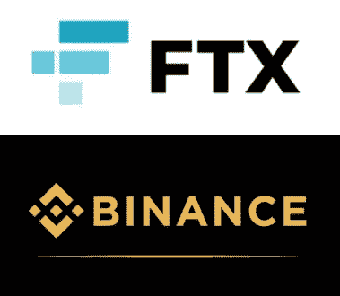

# FTX 对币安

> 原文：<https://medium.com/coinmonks/ftx-vs-binance-431eb71f8341?source=collection_archive---------0----------------------->

## FTX 能从币安过去的错误中吸取教训，证明其 180 亿美元的估值是合理的吗？

**关于你的作者:** CryptoQuestion 是一个为加密货币投资者提供免费资源的独立平台。从按需问答服务到在线课程，从我们每周的 [Moonshot Monday](https://cryptoquestion.tech/weekly-podcast/) 播客到我们每周的打桩和农业评论。请访问我们的网站