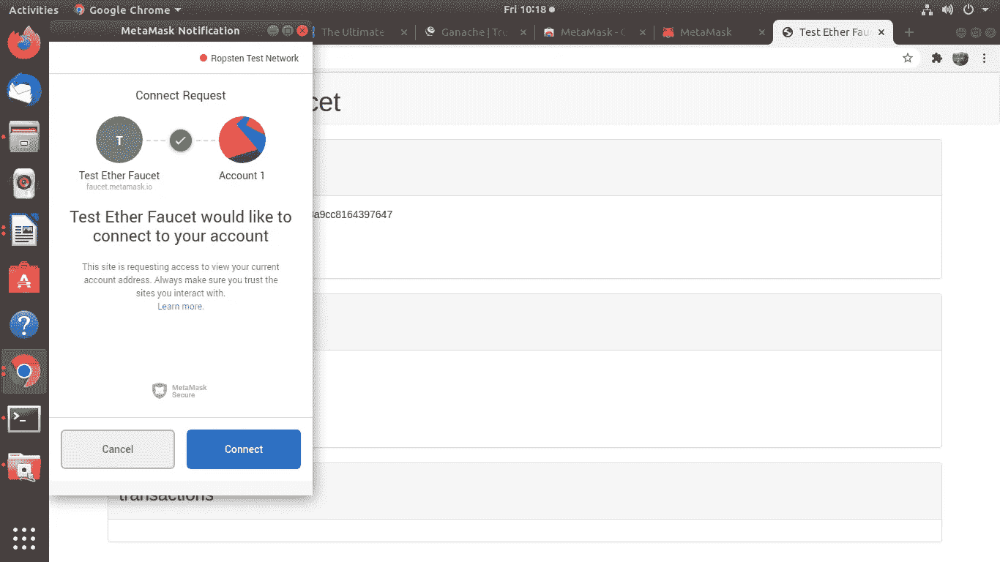
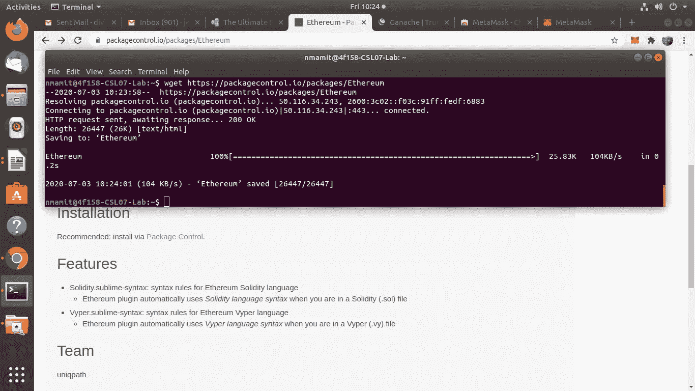
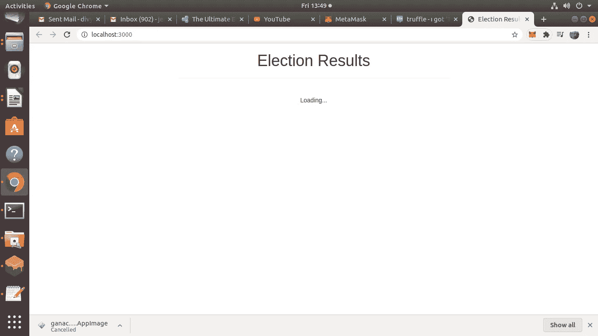
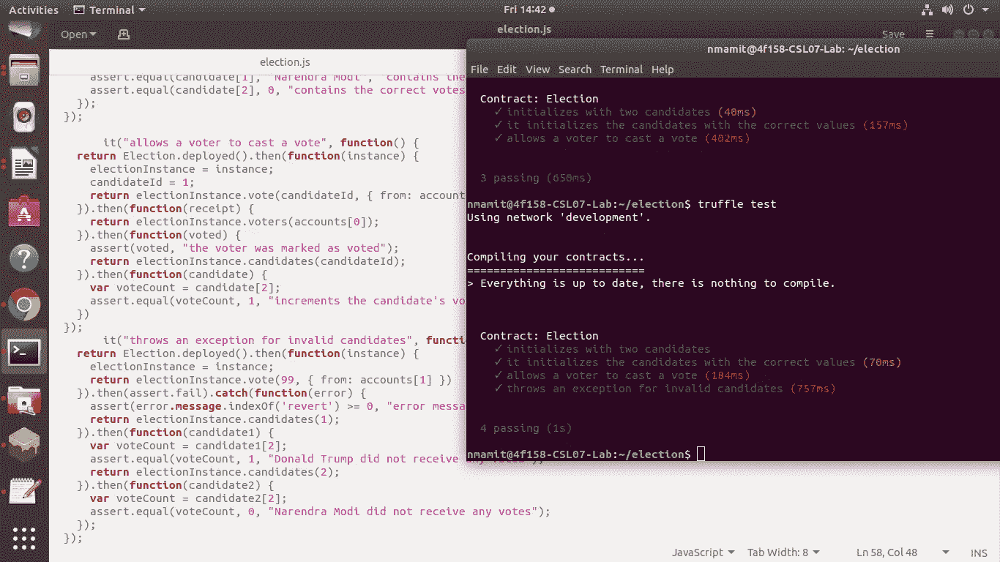

# 使用以太坊的全栈分散投票 App

> 原文：<https://medium.com/coinmonks/full-stack-decentralized-app-using-ethereum-faea85a8e5be?source=collection_archive---------0----------------------->


我叫达薇亚·詹妮弗·杜莎。我现在是印度尼特 NMAM 理工学院的助理教授。在这篇文章中，我想分享区块链的概念，它的工作，用途，并演示如何使用以太坊建立一个完整的堆栈去中心化的应用程序。

我要感谢来自 DLI the([www.dlithe.com](http://www.dlithe.com/))的 Arun Sir 先生进行这次区块链技术实习。我还要感谢 Anubhav Chaturvedi 先生，他是我们的顾问，并尽了最大努力提供和分享他的知识以及网络实践。

我写这篇技术博客是作为区块链初学者的参考。你在与区块链合作时可能会遇到的一些术语用斜体表示，以便你理解其含义。我参考了下面的网站，并试图重现投票场景:

[https://www . dapfuniversity . com/articles/the-ultimate-ether eum-dapp-tutorial](https://www.dappuniversity.com/articles/the-ultimate-ethereum-dapp-tutorial)

**我们开始吧。**

在基本层面上*区块链*可以定义为由存储在公共数据库(链)中的数字数据(块)组成的区块链。这就形成了*总账*。换句话说，public ledger 代表区块链中的所有数据。

使用基于块的方法可以克服传统方法的缺点。以太坊区块链的几个关键因素包括去中心化、不变、透明、负责。

*SmartContract* :执行某些操作的功能。我们可以说它是我们代码的业务逻辑。之所以这么叫，是因为它们代表了某种协议。

用于编写智能合同的编程语言。因此，请确保在编码时在软件工具中安装了这个扩展。坚固性类似于 java-script。

***案例分析* :** 在区块链上构建一个投票应用，任何连接到网络的人都可以参与选举并投票结果。

让我们理解它是如何工作的:

公共分类账中的所有数据都通过*加密哈希*进行保护，并通过共识算法进行验证。网络上的节点参与进来，以确保分布在网络上的所有数据副本都是相同的。这是在区块链上构建投票应用程序的一个非常重要的原因，因为我们希望确保我们的投票被计算在内，并且不会改变。

我们应用程序的用户在区块链上投票会是什么样子？首先，用户需要一个账户，这个账户的钱包地址要有一些以太，以太坊的加密货币。一旦他们连接到网络，他们投下他们的选票，并支付少量交易费，以将此交易写入区块链。这笔交易费被称为*气*。每当投票时，网络上的一些称为矿工的节点竞争完成这一事务。完成这项交易的矿工将获得我们投票购买的乙醚。

让我们有一个用 HTML、CSS 和 Javascript 编写的传统前端客户端。这个客户端将连接到一个本地以太坊区块链，而不是与后端服务器对话。让我们用 Solidity 编程语言在一个选举智能契约中编码关于我们的 dApp 的所有业务逻辑。让我们将这个智能合约部署到我们的本地以太网区块链，并允许帐户开始投票。

我们的最终输出将如下所示:


**DApp 以太坊全栈建筑循序渐进指南。**

**第一步:安装依赖关系**

I)节点包管理器(NPM)

您可以查看是否已经安装了节点，方法是在终端上键入:

```
$ node -v
```

ii)块菌框架

它允许我们在以太坊区块链上构建分散的应用程序。

在命令行中安装带有 NPM 的松露，如下所示:

```
$ npm install -g truffle
```

成功安装后，您将获得以下内容:


三)加纳切

下一个依赖项是 [Ganache](http://truffleframework.com/ganache) ，一个本地内存区块链。你可以从 Truffle 框架网站下载[来安装 Ganache。它会给我们 10 个外部帐户的地址在我们当地的以太坊区块链。每个账户都预装了 100 个假乙醚。](http://truffleframework.com/ganache)

成功安装后，您应该会看到以下内容:


iv)元掩模

下一个依赖项是 Google Chrome 的[元掩码扩展。为了使用区块链，我们必须连接到它。为了使用以太坊区块链，我们必须安装一个特殊的浏览器扩展。这就是 metamask 的用武之地。我们将能够用我们的个人账户连接到我们当地的以太坊区块链，并与我们的智能合约进行交互。](https://chrome.google.com/webstore/detail/metamask/nkbihfbeogaeaoehlefnkodbefgpgknn?hl=en)

安装 Chrome 浏览器后，你会在浏览器的右上角看到狐狸图标。


Browse for Meta Mask and Click Add to Chrome


Create a Wallet if you are using it for the first time if not import Wallet using the Saved Seed


On Completion this is how your wallet would look like!


You can Deposit/Send some ethers using the available Networks


Depositing Ether from a Test Faucet of the Ropsten Network


Requesting 1 Ether from Faucet (Green Highlight)



Connecting to your Account to deposit Ether


Ether Successfully got Deposited.

v)语法突出显示

这种依赖是可选的，但是推荐使用。我们将使用[崇高文本](https://www.sublimetext.com/)，我已经下载了[“以太坊”软件包](https://packagecontrol.io/packages/Ethereum)，它为可靠性提供了很好的语法高亮。



**第二步:冒烟测试**

I)打开 Ganache。现在，Ganache 已经启动，您有一个本地区块链运行。


ii)创建选举文件夹

在命令行中为我们的 dApp 创建一个项目目录，如下所示:

```
$ mkdir election
$ cd election
```


现在我们已经进入了我们的项目，我们可以用一个[块菌盒子](http://truffleframework.com/boxes/)快速启动并运行。在您的项目目录中，从命令行安装 pet shop box，如下所示:

```
$ truffle unbox pet-shop
```

让我们看看宠物店盒子给了我们什么:


检查选举文件夹目录。您可以看到所有文件拆箱，如合同文件夹，迁移文件夹，测试文件夹等。

iii)撰写智能合同

这个智能合同将包含我们 dApp 的所有业务逻辑。它将负责读取和写入以太坊区块链。它将允许我们列出将参加选举的候选人，并跟踪所有的选票和选民。它还将管理选举的所有规则，比如强制帐户只能投票一次。从项目的根目录开始，在 contracts 目录中创建一个新的合同文件，如下所示:

```
$ touch contracts/Election.sol
```

打开文件并键入以下代码:

```
pragma solidity 0.5.16;contract Election {
    // Read/write candidate
    string **public** candidate; // Constructor
    constructor() **public** {
        candidate = "Donald Trump";
    }
}
```

我们从用`pragma solidity`语句声明 solidity 版本开始。接下来，我们用“contract”关键字声明智能合约，后跟合约名称。接下来，我们声明一个状态变量，它将存储候选人姓名的值。状态变量允许我们将数据写入区块链。我们已经声明这个变量将是一个字符串，并且我们已经将它的可见性设置为`public`。因为它是公共的，solidity 将免费给我们一个 getter 函数，允许我们在契约之外访问这个值。

然后，我们创建一个构造函数，每当我们将智能合约部署到区块链时，都会调用这个构造函数。在这里，我们将设置候选状态变量的值，该变量将在迁移时存储到区块链中。

现在，我们已经为智能合约创建了基础，让我们看看是否可以将它部署到区块链。为此，我们需要在迁移目录中创建新文件。从项目根目录中，通过命令行创建一个新文件，如下所示:

```
$ touch migrations/2_deploy_contracts.js
```

请注意，我们用数字给迁移目录中的所有文件编号，这样 Truffle kno

以何种顺序执行它们。让我们创建一个新的迁移来部署合同，如下所示:

```
**var** Election = artifacts.require("./Election.sol");module.exports = **function**(deployer) {
  deployer.deploy(Election);
};
```


首先，我们需要我们已经创建的契约，并将其分配给一个名为“Election”的变量。接下来，我们将它添加到已部署契约的清单中，以确保它在我们运行迁移时得到部署。现在，让我们像这样从命令行运行我们的迁移:

```
$ truffle migrate
```

如果您对代码进行了任何更改，然后想要迁移，请使用

```
$ truffle migrate --reset
```

成功迁移后，您将收到以下消息:


Successful Migration!!

现在我们已经成功地将智能合约迁移到本地以太坊区块链，让我们打开控制台与智能合约进行交互。您可以从命令行打开 truffle 控制台，如下所示:

```
$ truffle console
```

现在我们已经进入了控制台，让我们获取一个已部署的智能契约的实例，看看是否可以从契约中读取候选人的姓名。从控制台中，运行以下代码:

```
Election.deployed().then(**function**(instance) { app = instance })
```

这里的`Election`是我们在迁移文件中创建的变量的名称。我们用`deployed()`函数检索了一个已部署的契约实例，并将其分配给 promise 回调函数中的一个`app`变量。

现在我们可以这样读取候选变量的值:

```
app.candidate()
// => 'Donald Trump'
```


**第三步:创建候选人名单**

现在一切都设置妥当了，让我们继续通过列出将参加选举的候选人来建立聪明的联系。我们需要一种方法来存储多个候选项，并存储每个候选项的多个属性。我们希望跟踪候选人的 id、姓名和票数。以下是我们将如何模拟候选人。

您的完整合同代码应该如下所示:

```
pragma solidity 0.5.16;contract Election {
    // Model a Candidate
    **struct** Candidate {
        **uint** id;
        **string** name;
        **uint** voteCount;
    } // Read/write candidates
    mapping(**uint** => Candidate) **public** candidates; // Store Candidates Count
    **uint** **public** candidatesCount; function **Election** () **public** {
        addCandidate("Donald Trump");
        addCandidate("Narendra Modi");
    } function **addCandidate** (**string** memory _name) **private** {
        candidatesCount ++;
        candidates[candidatesCount] = Candidate(candidatesCount, _name, 0);
    }}
```

现在，让我们像这样迁移我们的合同:

```
$ truffle migrate --reset
```

**第四步:测试**

现在让我们写一些测试。确保首先运行 Ganache。然后，在命令行中从项目的根目录创建一个新的测试文件，如下所示:

```
$ touch test/election.js
```

我们将使用 Javascript 编写所有这些测试来模拟客户端与智能合约的交互，就像我们在控制台中所做的一样。以下是测试的所有代码:

```
**var** Election = artifacts.**require**("./Election.sol");contract("Election", **function**(accounts) {
  **var** electionInstance; it("initializes with two candidates", **function**() {
    **return** Election.deployed().then(**function**(instance) {
      **return** instance.candidatesCount();
    }).then(**function**(count) {
      assert.equal(count, 2);
    });
  }); it("it initializes the candidates with the correct values", **function**() {
    **return** Election.deployed().then(**function**(instance) {
      electionInstance = instance;
      **return** electionInstance.candidates(1);
    }).then(**function**(candidate) {
      assert.equal(candidate[0], 1, "contains the correct id");
      assert.equal(candidate[1], "Donald Trump", "contains the correct name");
      assert.equal(candidate[2], 0, "contains the correct votes count");
      **return** electionInstance.candidates(2);
    }).then(**function**(candidate) {
      assert.equal(candidate[0], 2, "contains the correct id");
      assert.equal(candidate[1], "Narendra Modi", "contains the correct name");
      assert.equal(candidate[2], 0, "contains the correct votes count");
    });
  });
});
```

现在让我们从命令行运行测试，如下所示:

```
$ truffle test
```


Successful passing of 2 tests

第一个测试通过检查候选人计数是否等于 2 来检查合同是否用正确的候选人数量进行了初始化。

下一个测试检查选举中每个候选人的值，确保每个候选人都有正确的 id、姓名和票数。

**第五步:客户端应用**

让我们开始构建将与我们的智能合约对话的客户端应用程序。我们将通过修改上一节中安装的 Truffle Pet Shop box 附带的 HTML 和 Javascript 文件来实现这一点。

用以下代码替换“index.html”文件的所有内容:

```
<!DOCTYPE html>
<**html** lang="en">
  <**head**>
    <**meta** charset="utf-8">
    <**meta** http-equiv="X-UA-Compatible" content="IE=edge">
    <**meta** name="viewport" content="width=device-width, initial-scale=1">
    <**title**>Election Results</**title**> <!-- Bootstrap -->
    <**link** href="css/bootstrap.min.css" rel="stylesheet">
  </**head**>
  <**body**>
    <**div** class="container" style="width: 650px;">
      <**div** class="row">
        <**div** class="col-lg-12">
          <**h1** class="text-center">Election Results</**h1**>
          <**hr**/>
          <**br**/>
          <**div** id="loader">
            <**p** class="text-center">Loading...</**p**>
          </**div**>
          <**div** id="content" style="display: none;">
            <**table** class="table">
              <**thead**>
                <**tr**>
                  <**th** scope="col">#</**th**>
                  <**th** scope="col">Name</**th**>
                  <**th** scope="col">Votes</**th**>
                </**tr**>
              </**thead**>
              <**tbody** id="candidatesResults">
              </**tbody**>
            </**table**>
            <**hr**/>
            <**p** id="accountAddress" class="text-center"></**p**>
          </**div**>
        </**div**>
      </**div**>
    </**div**> <!-- jQuery (necessary for Bootstrap's JavaScript plugins) -->
    <**script** src="https://ajax.googleapis.com/ajax/libs/jquery/1.12.4/jquery.min.js"></**script**>
    <!-- Include all compiled plugins (below), or include individual files as needed -->
    <**script** src="js/bootstrap.min.js"></**script**>
    <**script** src="js/web3.min.js"></**script**>
    <**script** src="js/truffle-contract.js"></**script**>
    <**script** src="js/app.js"></**script**>
  </**body**>
</**html**>
```

接下来，用以下代码替换“app.js”文件的所有内容:

```
App = {
  web3Provider: null,
  contracts: {},
  account: '0x0', init: **function**() {
    **return** App.initWeb3();
  }, initWeb3: **function**() {
    **if** (**typeof** web3 !== 'undefined') {
      // If a web3 instance is already provided by Meta Mask.
      window.ethereum.enable();
      App.web3Provider = web3.currentProvider;
      web3 = **new** Web3(web3.currentProvider);
    } **else** {
      // Specify default instance if no web3 instance provided
      App.web3Provider = **new** Web3.providers.HttpProvider('http://localhost:7545');
      web3 = **new** Web3(App.web3Provider);
    }
    **return** App.initContract();
  }, initContract: **function**() {
    $.getJSON("Election.json", **function**(election) {
      // Instantiate a new truffle contract from the artifact
      App.contracts.Election = TruffleContract(election);
      // Connect provider to interact with contract
      App.contracts.Election.setProvider(App.web3Provider); **return** App.render();
    });
  }, render: **function**() {
    **var** electionInstance;
    **var** loader = $("#loader");
    **var** content = $("#content"); loader.show();
    content.hide(); // Load account data
    web3.eth.getCoinbase(**function**(err, account) {
      **if** (err === null) {
        App.account = account;
        $("#accountAddress").html("Your Account: " + account);
      }
    }); // Load contract data
    App.contracts.Election.deployed().then(**function**(instance) {
      electionInstance = instance;
      **return** electionInstance.candidatesCount();
    }).then(**function**(candidatesCount) {
      **var** candidatesResults = $("#candidatesResults");
      candidatesResults.empty(); **for** (**var** i = 1; i <= candidatesCount; i++) {
        electionInstance.candidates(i).then(**function**(candidate) {
          **var** id = candidate[0];
          **var** name = candidate[1];
          **var** voteCount = candidate[2]; // Render candidate Result
          **var** candidateTemplate = "<tr><th>" + id + "</th><td>" + name + "</td><td>" + voteCount + "</td></tr>"
          candidatesResults.append(candidateTemplate);
        });
      } loader.hide();
      content.show();
    }).catch(**function**(error) {
      console.warn(error);
    });
  }
};$(**function**() {
  $(window).load(**function**() {
    App.init();
  });
});
```

[*web3.js*](https://web3js.readthedocs.io/en/1.0/) 是一个 javascript 库，允许我们的客户端应用程序与区块链对话。它是一个库的集合，允许你使用 HTTP、IPC 或 WebSocket 与本地或远程以太坊节点进行交互。我们在“initWeb3”函数中配置 web3。

App.js 代码执行以下操作:

1.  初始化契约:我们在这个函数中获取智能契约的已部署实例，并分配一些允许我们与之交互的值。
2.  Render 函数:render 函数使用智能合约中的数据来布局页面上的所有内容。现在，我们列出我们在智能合同中创建的候选人。我们通过遍历映射中的每个候选项，并将其呈现到表中来实现这一点。我们还在这个函数中获取连接到区块链的当前帐户，并将其显示在页面上

现在让我们在浏览器中查看客户端应用程序。首先，确保您已经像这样迁移了合同:

```
$ truffle migrate --reset
```

接下来，从命令行启动开发服务器，如下所示:

```
$ npm run dev
```

这应该会自动打开一个包含您的客户端应用程序的新浏览器窗口。



请注意，您的应用程序显示“正在加载…”。那是因为我们还没有登录到区块链！为了连接到区块链，我们需要将其中一个帐户从 Ganache 导入 Metamask。


Connecting to Metamask


Connected to Metamask

为了更新帐号，请确保在其中一个配置文件中将注入的 Web 组件设置为 true。应该通过选择 custom RPC 将网络设置为 localhost:7545，并输入来自 ganache 的任何地址的私钥。

打开 Ganache，点击任意键(图标)选择私钥。将会弹出以下内容。


Click on Import option and paste the private key

**第六步:投票**

现在让我们添加在选举中投票的能力。让我们定义一个映射到智能契约的“选民”来跟踪在选举中投票的帐户。

完整的合同代码应该如下所示:

```
pragma solidity 0.5.16;contract Election {
    // Model a Candidate
    **struct** Candidate {
        **uint** id;
        **string** name;
        **uint** voteCount;
    } // Store accounts that have voted
    mapping(address => **bool**) **public** voters;
    // Read/write candidates
    mapping(**uint** => Candidate) **public** candidates;
    // Store Candidates Count
    **uint** **public** candidatesCount; constructor () **public** {
        addCandidate("Donald Trump");
        addCandidate("Narendra Modi");
    } function **addCandidate** (**string memory** _name) **private** {
        candidatesCount ++;
        candidates[candidatesCount] = Candidate(candidatesCount, _name, 0);
    } function **vote** (**uint** _candidateId) **public** {
        // require that they haven't voted before
        require(!voters[msg.sender]); // require a valid candidate
        require(_candidateId > 0 && _candidateId <= candidatesCount); // record that voter has voted
        voters[msg.sender] = true; // update candidate vote Count
        candidates[_candidateId].voteCount ++;
    }
}
```

**步骤 7:测试投票功能**

让我们向“election.js”测试文件添加一个测试:

我们想在这里测试两件事:

1.  测试该函数是否会增加候选人的投票数。
2.  测试投票人在投票时是否被添加到映射中。


测试以确保我们的 vote 函数对双重投票和无效候选人抛出异常。



所有测试成功通过！！

**步骤 8:客户端投票**

让我们在“index.html”文件中添加一个允许帐户在表格下方投票的表单:

```
<**form** onSubmit="App.castVote(); return false;">
  <**div** class="form-group">
    <**label** for="candidatesSelect">Select Candidate</**label**>
    <**select** class="form-control" id="candidatesSelect">
    </**select**>
  </**div**>
  <**button** type="submit" class="btn btn-primary">Vote</**button**>
  <**hr** />
</**form**>
```


现在让我们更新我们的 app.js 文件来处理这两件事。首先，我们在表单的 select 元素中列出智能合同的所有候选人。然后，一旦帐户投票，我们将隐藏页面上的表单。我们将更新渲染函数，如下所示:

```
render: **function**() {
  **var** electionInstance;
  **var** loader = $("#loader");
  **var** content = $("#content"); loader.show();
  content.hide(); // Load account data
  web3.eth.getCoinbase(**function**(err, account) {
    **if** (err === null) {
      App.account = account;
      $("#accountAddress").html("Your Account: " + account);
    }
  }); // Load contract data
  App.contracts.Election.deployed().then(**function**(instance) {
    electionInstance = instance;
    **return** electionInstance.candidatesCount();
  }).then(**function**(candidatesCount) {
    **var** candidatesResults = $("#candidatesResults");
    candidatesResults.empty(); **var** candidatesSelect = $('#candidatesSelect');
    candidatesSelect.empty(); **for** (**var** i = 1; i <= candidatesCount; i++) {
      electionInstance.candidates(i).then(**function**(candidate) {
        **var** id = candidate[0];
        **var** name = candidate[1];
        **var** voteCount = candidate[2]; // Render candidate Result
        **var** candidateTemplate = "<tr><th>" + id + "</th><td>" + name + "</td><td>" + voteCount + "</td></tr>"
        candidatesResults.append(candidateTemplate); // Render candidate ballot option
        **var** candidateOption = "<option value='" + id + "' >" + name + "</ option>"
        candidatesSelect.append(candidateOption);
      });
    }
    **return** electionInstance.voters(App.account);
  }).then(**function**(hasVoted) {
    // Do not allow a user to vote
    **if**(hasVoted) {
      $('form').hide();
    }
    loader.hide();
    content.show();
  }).catch(**function**(error) {
    console.warn(error);
  });
}
```

接下来，我们想编写一个函数，每当提交表单时都会调用这个函数:

```
castVote: **function**() {
    **var** candidateId = $('#candidatesSelect').val();
    App.contracts.Election.deployed().then(**function**(instance) {
      **return** instance.vote(candidateId, { from: App.account });
    }).then(**function**(result) {
      // Wait for votes to update
      $("#content").hide();
      $("#loader").show();
    }).catch(**function**(err) {
      console.error(err);
    });
  }
```

现在，您的前端应用程序应该如下所示:


Connect to Metamask to update your account number and cast vote

**注意**:对于最新的 Metamask 用户，隐私模式是 Metamask 的默认模式，他们需要在浏览器的控制台中输入 window.ethereum.enable()或者需要包含在代码中。我已经在 app.js 代码中包含了这一行。不包括这行代码将导致帐户为空，如上面的浏览器所示。

让我们看看投票应用程序是如何工作的:


Voting Demo

正如你在上面的 gif 中看到的，按照我们的测试案例，你只能从一个账户投票一次。双重投票导致投票失败。还要注意，一旦你投了票，就会扣除“气”(金额)(100ETH ->99.9987ETH ->99.9982ETH)。从导入的列表中选择其他帐户来投更多的票。

一旦你完成了这一步，你就已经成功地在以太坊区块链上构建了一个完整的分布式应用程序！


> [在您的收件箱中直接获得最佳软件交易](https://coincodecap.com/?utm_source=coinmonks)

[](https://coincodecap.com/?utm_source=coinmonks)