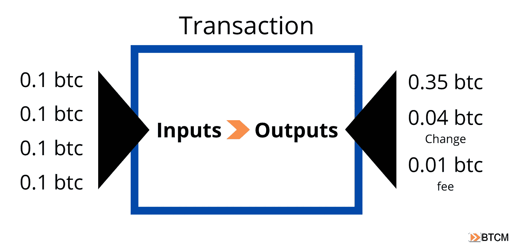

# 比特币的可替代性

> 原文：<https://medium.com/coinmonks/fungibility-of-bitcoin-66ce5803a150?source=collection_archive---------8----------------------->

随着比特币的成熟，它遭遇了越来越多关于其货币属性的争论。当然，最常讨论的是稀缺性，因为比特币最大的特点是供应量固定。紧随其后的第二个最受欢迎的属性是可替代性，以及与之密切相关的隐私话题，这也是本文的主题。

下面，我将证明比特币确实是可替代的，我还将说明反对比特币的常见论点通常是逻辑谬误的结果。

# 货币的特征

首先，让我们列出钱的特征，这样我们就可以从同一页开始。人们往往更熟悉货币的功能(价值储存、交换媒介和记账单位)，但不熟悉使其非常适合作为货币的资产特征。这些特征会因你问的人而略有不同。美联储说，货币必须是:耐用、便携、可分、统一、稀缺和被广泛接受的。[米塞斯研究所称](https://wiki.mises.org/wiki/Money)货币必须是:稀缺、耐用、可分、可识别、时空同质、可塑、美丽。Nick Szabo 在这个定义中加入了“不可伪造的昂贵”,意思是货币必须是一种很难创造，但在真实性方面很容易验证的东西。

上述消息来源都没有直接引用“可替代性”，但美联储说“统一”，这几乎是同一件事，米塞斯研究所撰稿人 jrg Guido hülsmann 使用了“同质性”一词。然而，在比特币内部，人们强烈意识到可替代性是优质货币的必要特征。在[比特币字典](http://bitcoindictionary.cc)中，我列出了货币的特性:

> ***货币的特性*** *用来评定其适合性的特性有稀缺性、持久性、便携性、可替代性、可分性和可识别性。如果一种商品具有相对丰富的这些特征，它将倾向于被用于货币角色。(第 47 页)*

并将可替代性定义如下:

> ***可替换的:*** *一件商品的每一个单元都与该商品的任何其他单元无法区分。*
> 
> 讨论:传统上，可替代性是硬币金属含量的一个问题。货币发行者通常以税收的形式收集旧硬币，并铸造贵金属含量较低的新硬币。剪裁硬币的欺诈行为也很常见，将硬币边缘的一小部分切掉，然后试图将得到的更小的硬币按面值冒充。这造成了一种情况，硬币是根本不同的，不可替代的。
> 
> *一种商品的可替代性越强，它就越能发挥货币的功能。数字货币的好处是每个数字单位都是相同的，然而，对可替代性的担忧现在集中在跟踪货币的使用上。未经批准的交易历史被称为污点。用于未经批准的活动的钱通常会被标记、歧视、冻结或扣押。可替代性已经从由市场评估转变为由国家评估。*
> 
> *就其构成而言，比特币在技术上是可替代的，但比特币可以被追踪，这造成了一种基于污点的可能不可伪造的情况。因此，存在使用隐私增强工具的自然动机。(第 30-31 页)*

广义上，可替代性归结为单元之间的一致性。如果你有一个单位的商品，你可以用另一个单位的商品 1:1 地替换它，每个单位作为另一个单位的替代品。例如,№2 黄玉米的单位是可互换的，也就是说，它们被当作完全相同的单位进行交易。尽管一些单个蒲式耳可能已经腐烂，或者交易的单位可能相距 1000 英里或更远，或者 2 号黄玉米可能还没有种植，但这种可替代性还是会发生。黄金本身是可替代的，尽管一些金条或金币可能是假的或质量不同。

**不可替代商品是指根据定义单位不同的商品。不可替代商品的例子有房地产或自有汽车。**

我们可以这样想。如果我借了一种可替代的物品，比如钱，不管我是归还所借物品的确切单位，比如 satoshis(比特币的最小单位)或美元，还是从其他地方获得 satoshis 或美元，然后归还给借款人。然而，如果我借了一件不可替代的物品，比如我朋友的车，我归还同样数量的物品是有关系的，但是从别处得到的车就不行了。如果我租一辆车，我必须归还完全相同的车(不可替换)，但是，油箱中的汽油肯定会与我最初驶离停车场时油箱中的汽油不同(可替换)。

按照这个简单的逻辑，比特币是可替代的。让我们深入探讨一些反对比特币可替代性的常见理由。

# 反对比特币可替代性的常见理由

## # 1:“UTXO 可以干净或被污染的事实意味着所有比特币都是不可替代的。”

这种说法是无效的，因为它不是在描述比特币，而是在描述特定 UTXOs(未用交易输出)的主观解释(干净或污染)。人们可能会认为你的钱有问题，或者不接受你的付款形式，这有很多主观原因。作为使用美元的例子，虽然不是大多数人会经历的例子，但个人可能更喜欢只接受钞票上没有可卡因或血液痕迹的美元(实物美元确实会随着时间的推移变脏)。也可能是他们对你个人有偏见，或者你的金币有凹痕，但在其他方面基本相同，或者可能是商人不接受来自 X、Y 或 z 国的金币。这些事情影响硬币的流动性，但不影响黄金本身的可替代性。歧视比特币 UTXO 的能力并不意味着比特币的本质是不可替代的。

为了让第一个论点成立，那么区分比特币的能力就不是一个选项，但事实就是如此，因为没有什么是可以替代的。我们毕竟是人。我们可以出于各种原因歧视其他人，例如，一个店主可能因为一个顾客的红帽而不喜欢他，因此，突然之间，他们的钱在那里就没用了。

莫内罗

没有什么是完全不受歧视或流动性差异的，这包括像 Monero 这样的隐私硬币。Monero 的推广者对比特币的透明性叫屈，认为这是比特币可替代性的丧钟，他们没有意识到 Monero 也有同样的问题，只是差别很小。

Monero 和比特币的唯一区别是 Monero 的历史仅限于 Monero 的当前持有者。换句话说，它用于辨别的表面积更小，但什么是无穷的分数呢？人们仍然可以找到无限的理由来歧视某些交易，并给它们贴上污点的标签。目前的消费者可能会受到歧视，即使他们是匿名的，或者特别是*，因为*他们是匿名的。Monero 硬币仍然可能被它们的主人玷污。匿名也可能是歧视的基础，正如我们看到的一些交易所拒绝为 Monero 交易提供服务。

不接受戴红帽顾客的钱并不意味着他的钱是不可替代的。用可替代性来描述流动性是一种**模棱两可的谬误**。

## #2:“每一枚比特币都有自己的出处或历史，它的所有权链，使其成为不可替代的令牌。”

没错，每个比特币记录或 UTXO 的历史都必须有一个公共历史，这就是存储在区块链中的内容，也是实现固定供应的原因。但这也不足以定义*的整个*历史或起源，甚至不一定是那段历史的重要部分。

这种观点试图说明，因为比特币可以被计算，所以它是不可替代的。我的第一个想法是“那又怎样？”历史不是使它们不可替代的有意义的区分因素。黄金来自加利福尼亚还是委内瑞拉的金矿有关系吗？如果黄金在两次交易前通过卡特尔之手呢？不，黄金仍然是可替代的。

**Satoshis 对 UTXOs**

在比特币中，satoshis 是网络关注的单位。数量是以 satoshis 来衡量的，而不是整个比特币。1 btc 的余额记录为 100，000，000 个单位。我们使用术语“污点”是因为它不准确。与某项非法活动相关的一群 satoshis 全都受到了污染，就像“一个坏苹果毁了一群苹果”。可以通过一个称为链分析的过程来跟踪硬币，并可以设计高级算法来跟踪许多交易中的“污染”比特币。但它归结为污点，这又是不准确的。

Coinjoin 技术也可以用来使那些试图追踪硬币的人的事情复杂化。[欧洲刑警组织在调查了一款硬币钱包 Wasabi 后，于 2020 年公布了他们的发现。他们的结论是，如果相关人员明智地使用芥末，他们就不会被追踪到。](https://bitcoinandmarkets.com/e216/)

下面是一个交易示例。注意，我们无法分辨哪个输出来自哪个输入。都是“有污点”的。想象一下，一个复杂的事务有数百个输入和输出，导致多个其他事务专门用来中断跟踪。追踪出处变得非常困难，实际上是不可能的。哪些输入包含该交易中 0.04 btc 输出的历史？

**上链数据不完整且越来越差**

今天，在未来更是如此，我们将不会在链上接收比特币，这意味着我们不会在网络上获得完整的比特币交易。我们将在我们称之为第 2 层的服务层上接收日常付款。这些交易不一定有出处数据。是的，一些交易总是会发生在透明的基础层，具体来说就是那些大资金，他们在单笔交易中发送 1 亿美元，但 99%的人不会。

第 2 层正变得越来越可行。我会把它放在比特币 2013 年的发展和认知水平上。在 5 到 10 年的时间里，第 2 层服务将变得非常强大。如今，比特币可以通过闪电网络交易发送，个人交易不会出现在网络上。随着现代和未来的升级，你将有可能无限期地留在闪电网络中，一天进行多次交易，永远不会在链上留下出处数据。

集中式第 2 层也不会向网络泄漏原始数据。例如，你可以在 Cash App 上保存硬币，并与其他 Cash App 客户进行收发，而不会向 on chain 出处泄露数据。集中的第 2 层也将与分散的版本交互，例如，现在的交易所开始提供闪电网络存款和取款。

最后，也是最容易被忽视的是比特币的硬件，如 [Opendime](https://opendime.com/) 。这些 u 盘可以在没有人知道私钥的地方安全地保存比特币。它们的制造方法是，当芯片的可见和物理部分被破坏时，只显示私钥。这些棍子可以容纳任何数量的钱，并且可以像钞票或硬币一样转手。无重复交易费，无出处数据泄露。也许将来会出现共同的面值，比如 0.001 btc(今天大约 50 美元)。

这第二个论点没有达到我们在可替代性中看到的相同的流动性的模棱两可，以及链上的出处数据足以使 satoshis 不可替代的错误假设。

# 结论

比特币是可替代的。反对其可替代性的常见论点集中在单个单位的流动性与更广泛的资产的可替代性的模棱两可上。我通过使用非特定污点来谴责所有 UTXOs，以及用它来标记所有 satoshis 的不足，展示了这种技术的草率。来自连锁分析的出处数据也被证明是有限的，有用性值得怀疑。

*最初发表于 2021 年 3 月 9 日《比特币与市场研究》。*