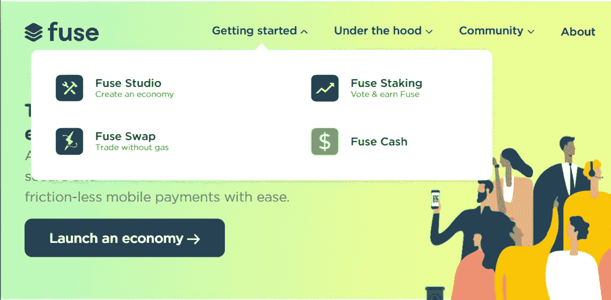
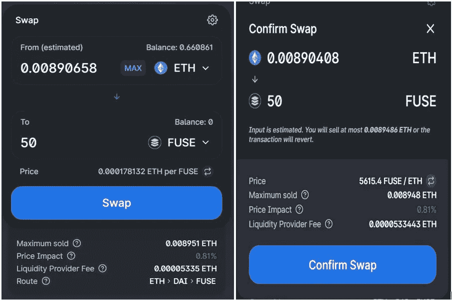
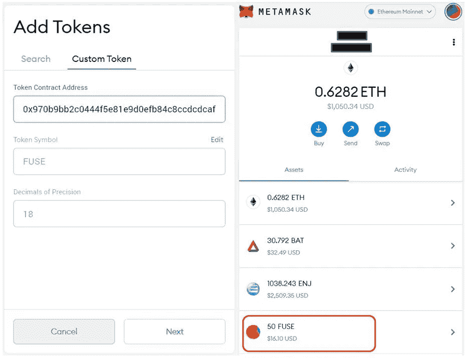
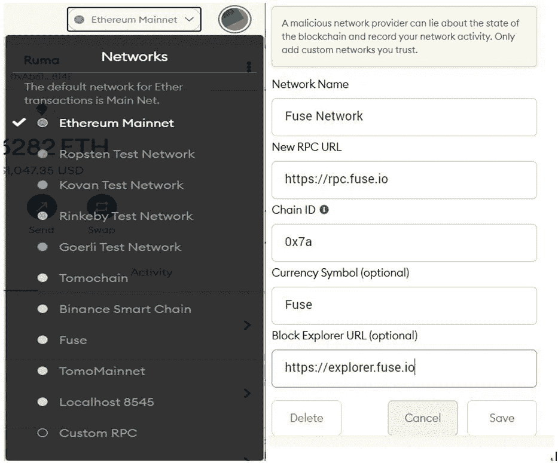
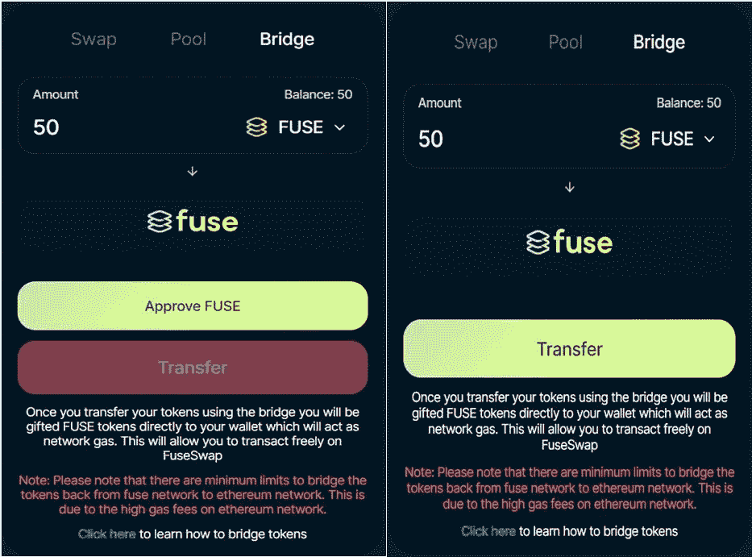
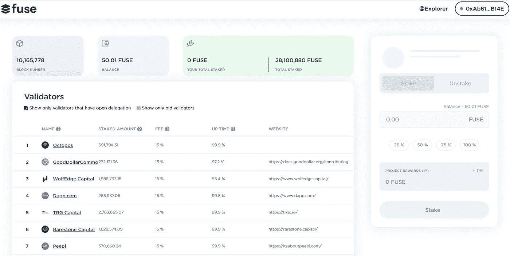
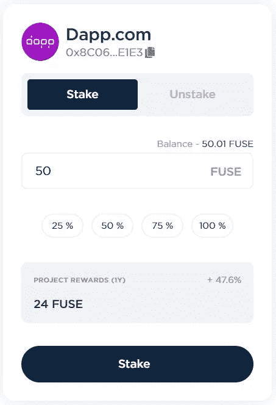
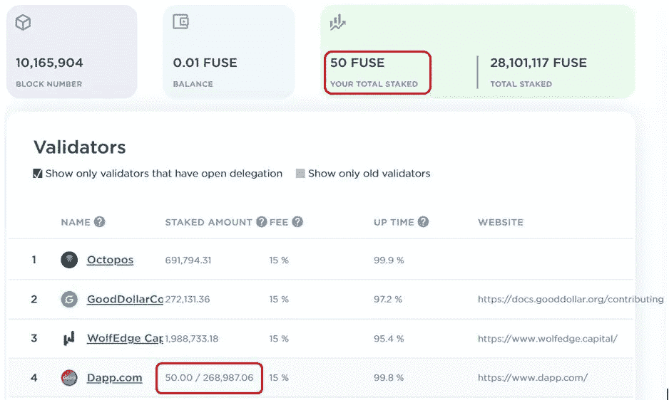
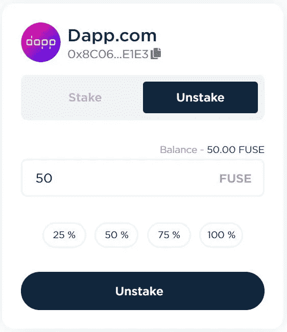

# Fuse 网络:如何标记和委派 FUSE 令牌

> 原文：<https://medium.com/coinmonks/fuse-network-how-to-stake-and-delegate-fuse-tokens-d5d2e4a96468?source=collection_archive---------0----------------------->

[Fuse](https://fuse.io/) chain 是一款[以太坊](https://ethereum.org/en/)侧链，专为复兴区块链的传统交易或支付系统而设计。网络由许多验证者支持，这些验证者有助于网络的平稳运行。验证者可以是运行验证网络交易或执行智能合约的节点的任何组织或公司。作为回报，他们可以得到融合代币。

融合网络使用[委托利益证明](https://en.bitcoinwiki.org/wiki/DPoS) (DPoS)机制来选举验证者。因此，这种对验证器的不断选择使网络免受任何恶意活动的攻击。

要成为验证者，你需要[在相当长的时间内在网络中投入至少 100，000 个熔丝令牌](https://docs.fuse.io/the-fuse-chain/consensus-contracts/stake-delegate-and-withdraw)。该赌注金额(100，000 个熔丝令牌)对在验证器地址上下注和委托的所有熔丝令牌进行计数。网络的其他用户可以将他们的 FUSE 令牌委托给验证者，并参与网络管理活动。

在任何时候，赌注者或验证者都可以撤回他们的 FUSE 令牌。赌注者提取的金额将从验证者的赌注金额中扣除。但是如果其低于最小赌注金额，即 100，000 个熔丝令牌，那么验证者将被从验证者列表中踢出。

在本文中，我们将探讨端到端的赌注程序，即如何获得 Fuse 令牌，如何在您的 [MetaMask](https://metamask.io/) wallet 中设置 Fuse 网络，如何将 ERC 版本的 FUSE 令牌传输到 FUSE 网络中，以及最后，如何对您的 FUSE 令牌进行赌注和委托。

## **使用指南**

进入[熔断网网站](https://fuse.io/)。

在本文中，我们将使用保险丝锁定和保险丝交换功能。现在让我们开始吧。

1.  **从 Uniswap 购买保险丝令牌**

您可以从 Uniswap 获取 Fuse 令牌。

转到 [Uniswap](https://uniswap.org/) 并连接您的 MetaMask 钱包。

仔细检查令牌合同地址。您可以从 [Coingecko](https://www.coingecko.com/en/coins/fuse) 获得令牌地址。

正如您从下面的快照中看到的，我们正在用 FUSE 令牌交换一些 ETH。输入您希望购买的代币数量，并确认**兑换**活动。

触发元掩码事务。一旦交易成功，你就可以在你的 [MetaMask](https://www.altcoinbuzz.io/bitcoin-and-crypto-guide/how-to-use-the-metamask-ethereum-mobile-wallet/) 钱包里看到**熔丝**令牌。

1.  **元掩码中的熔丝令牌(ERC 版本)**

如果您无法在元掩码钱包中看到令牌，那么您必须通过在**自定义令牌**选项卡中给出令牌的合同地址来添加令牌。

见下面的截图，并添加令牌地址。您现在可以在您的钱包中看到**保险丝**令牌。

**令牌合同地址**—0x 970 b 9 bb 2 c 0444 F5 e 81 e9 d 0 efb 84 c8 ccdcdcaf 84d

1.  **在你的 MetaMask 钱包中添加保险丝网络**

现在使用以下详细信息，将 Fuse 设置为您的 [MetaMask](https://www.altcoinbuzz.io/bitcoin-and-crypto-guide/metamask-tips-and-tricks-you-can-use/) 钱包中的新网络。

*   **附加:**[https://RPC . fuse . io](https://rpc.fuse.io)
*   **链号:** 0x7a
*   **Explorer:**[https://Explorer . fuse . io](https://explorer.fuse.io)
*   **符号:**保险丝

转到自定义 RPC 并输入上述详细信息。

即使您现在选择网络作为融合网络，您也无法在元掩码钱包中看到您的融合令牌。

为此，我们还需要几个步骤来让令牌反映到您的钱包中(融合网络)。

1.  **将熔丝令牌从以太坊网络转移到熔丝网络**

FUSE 平台提供了一个桥，用于将 ERC 版本的 Fuse 令牌转换为与 Fuse 网络兼容的令牌。

转到[保险丝桥](https://fuseswap.com/#/bridge)，输入您想要传输到保险丝网络的**保险丝**令牌的数量。该桥看起来类似于 Uniswap 平台。

确认元掩码事务。

一旦交易成功，您可以看到所需的**熔丝**令牌余额反映在您的 MetaMask 钱包的熔丝网络中。

1.  **桩子保险丝令牌**

要下注您的 FUSE token，您需要前往[下注页面](https://staking.fuse.io/)。

连接你的 MetaMask [钱包](https://www.altcoinbuzz.io/tag/wallet/)，选择网络作为**保险丝网络**。

锁定仪表板看起来像这样。您可以看到您的熔丝令牌余额。

该页面列出了许多验证器，您可以将 FUSE 令牌委托给这些验证器。建议只选择那些具有高**运行时间**的验证器。

我们选择了 Dapp.com 作为验证者。

输入您想要下注的 FUSE tokens 数量并确认交易。用户将获得 47.6 %的 APY 作为赌注的奖励。

交易成功后，您可以在仪表板中看到您的下注令牌余额和带有验证器的下注令牌。

**拆垛**

用户可以随时取消他们的 FUSE 令牌。

要拆分，首先，选择您的验证器并转到**拆分**选项卡。输入您希望取消堆叠的令牌数量并确认该过程。

## **结论**

Fuse 是一个非常强大的项目。通过赌注，用户可以获得有吸引力的奖励。对于普通用户，没有这样的最低赌注金额标准。您可以下注任意金额并赢取奖励。网络使用 DPoS 方法来选举验证者，并且他们被要求标上大量的 FUSE 令牌来保持他们的位置。这两种情况都有助于网络的正常运行，同时维护安全免受恶意活动的侵害。

**资源:** [保险丝网络](https://docs.fuse.io/)

**阅读更多:** [Blank:专注隐私的浏览器扩展钱包](/coinmonks/blank-a-privacy-focused-browser-extension-wallet-114c7e4dd816)

***注:*** *本帖首发* [*此处*](https://www.altcoinbuzz.io/bitcoin-and-crypto-guide/fuse-network-how-to-stake-and-delegate-fuse-tokens/) *上*[***altcoinbuzz . io***](http://www.altcoinbuzz.io/)*。*

**通过我的推荐加入**

Crypto.com——[T42](https://platinum.crypto.com/r/sut3pd9bzn)

跟我来

**👉** [推特](https://twitter.com/rumadas123)

**👉** [Linkedin](https://www.linkedin.com/in/ruma-das-a1439320/)