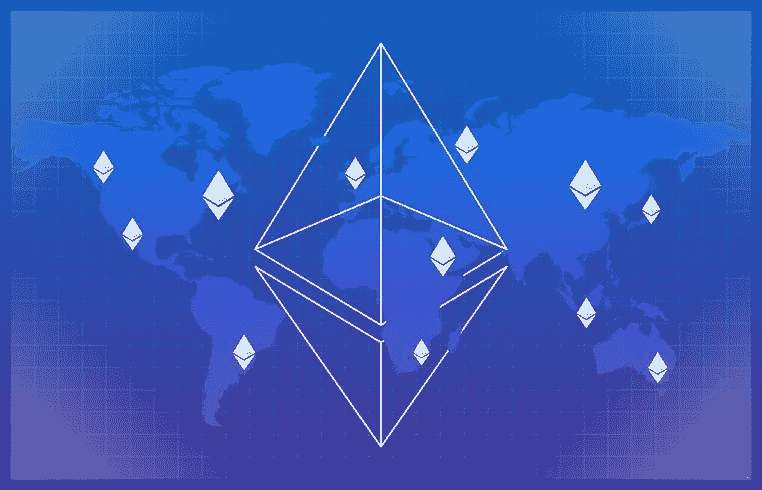

# 信标链的未来 ETH 2.0 何时启动？

> 原文：<https://medium.com/coinmonks/future-of-the-beacon-chain-when-does-eth-2-0-start-b174c3e4fbf3?source=collection_archive---------0----------------------->

以太坊很棒，但令人难以置信的堵塞。目前任何想用加密货币做任何事情的人都可以期待可怕的天然气价格——特别是如果涉及智能合同的话。现场希望趣味随着以太坊 2.0 回归。在被一再推迟之后，现在计划在 11 月开始。但是用户几年后才会感觉到轻松。

