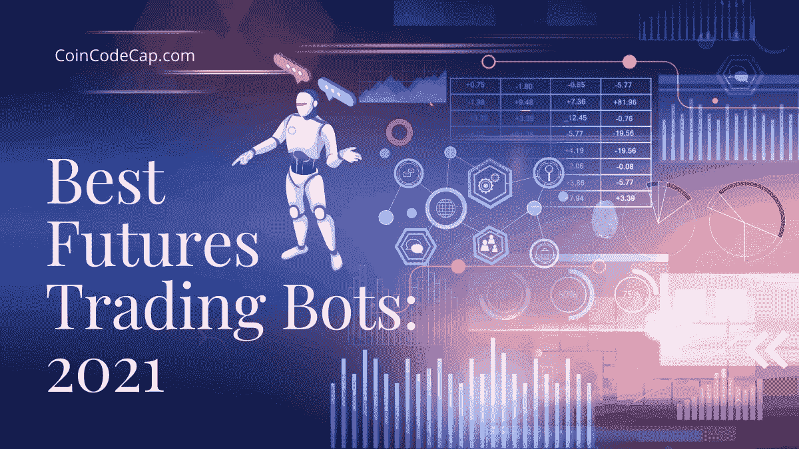
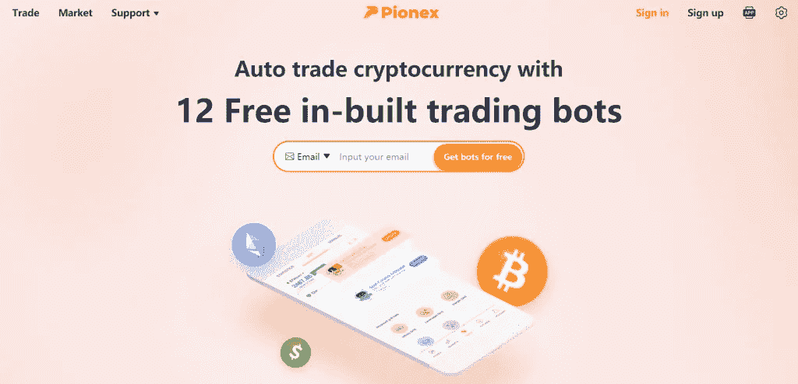
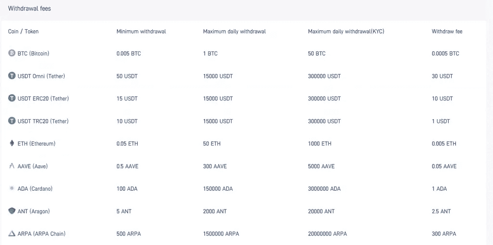
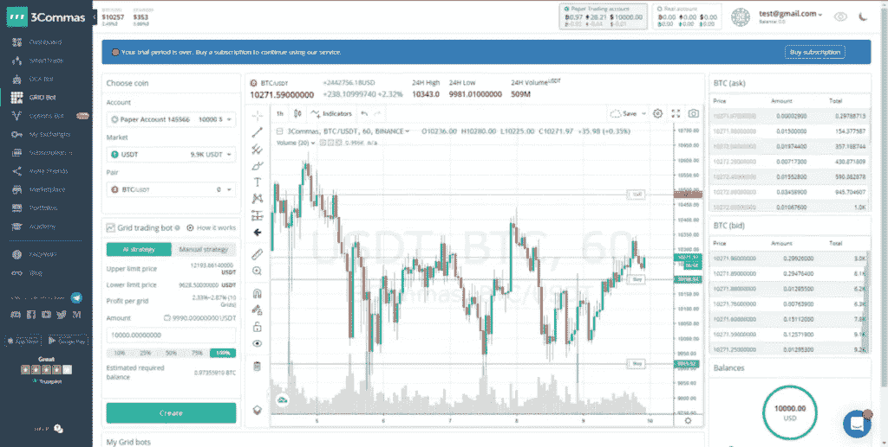
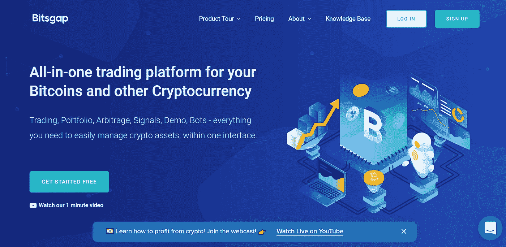
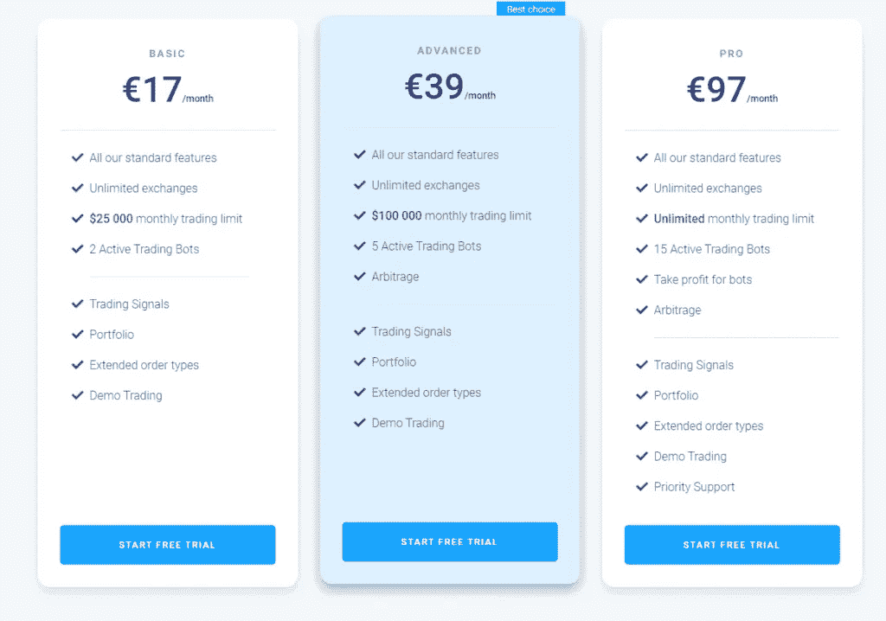

# 3 款最佳期货交易机器人|未来机器人(2022)

> 原文：<https://medium.com/coinmonks/futures-trading-bots-5a282ccee3f5?source=collection_archive---------1----------------------->

市场上有各种各样的期货交易机器人提供商，在这篇文章中，我们将看看其中最好的 3 个。

# 总结(TL；博士)

*   期货交易允许你在未来以一个固定的价格买入或卖出基础商品。
*   交易员需要在合约到期前平仓。
*   市场上有很多期货交易机器人提供商，其中最好的有 Pionex、Bitsgap、 [3Commas](https://blog.coincodecap.com/go/3commas) 。
*   [**Pionex**](https://blog.coincodecap.com/go/pionex) 自带[网格交易机器人](https://blog.coincodecap.com/grid-trading)和 [DCA 交易机器人](https://blog.coincodecap.com/pionex-dca-bot)让你的交易策略自动化。
*   Pionex 的现货期货套利机器人最近出来了。它提供了一种以最低风险赚取高达 50% APY 的方法。
*   [**3 commas**](https://coincodecap.com/go/free-futures-trading-bots-in-bear-markets)**向其用户提供 GRID、 [DCA](https://blog.coincodecap.com/go/dca) 和期权交易机器人。**
*   **你也可以使用[复制交易机器人](/coinmonks/top-10-crypto-copy-trading-platforms-for-beginners-d0c37c7d698c)选项在 [3Commas](https://coincodecap.com/go/free-futures-trading-bots-in-bear-markets) 复制一个已经存在的机器人。**
*   **[**Bitsgap**](https://blog.coincodecap.com/go/bitsgap) 是最好的交易 bot 提供商之一，支持多达 25 个主要交易平台。**
*   **平台最近推出了其 [Bitsgap 币安期货机器人](/coinmonks/bitsgap-ftx-and-binance-futures-trading-bot-5f7e3ea7044f)，该机器人利用一天内的数百个订单获得小额回报。**
*   **除了 Pionex 之外，这两家期货机器人提供商都使用 API 密钥与您的交易平台连接，并且永远无法从您的交易帐户中提取任何资金。**
*   **这些平台中的每一个都带有订阅计划，并具有指定的功能。**

**在继续之前，我们先了解一下期货交易的基础知识，这涉及到期货合约。**

# **什么是期货合约？**

**期货合约是在未来以特定价格购买或出售商品的法律协议。当期货合约到期时，买方有义务购买和接收基础商品。同时，卖方有义务在合同到期时出售和交付基础商品。**

# **什么是期货交易？**

**期货交易不是在合约到期时接收标的资产，因为投资经理和交易员不需要 1000 桶石油等物品。然而，他们对从石油价格波动中获利非常感兴趣。**

**交易员利用杠杆交易基础商品，以获取回报；然而，他们需要在合同到期前平仓。许多期货合约在每个月的第三个星期五到期；然而，它确实因合同而异。因此，在投资期货合约之前，要做适当的研究。**

# **期货交易是如何运作的？**

**交易者利用[币安](https://blog.coincodecap.com/go/binance)、 [BitMEX](https://blog.coincodecap.com/go/bitmex) 、 [Bybit](https://blog.coincodecap.com/go/bybit) 等交易平台投资期货合约。其中一些平台，如 [PrimeXBT](https://blog.coincodecap.com/go/primexbt) ，提供 1000 倍的杠杆，所以你不需要有大量的资本。投资者在合约到期前买卖标的商品。买价和卖价之间的差额就是他们的利润。**

# **什么是期货交易机器人？**

**因为你利用杠杆交易期货合约，即使市场价格的微小变化也会对你的资金产生重大影响。因此，你必须保持人类的情感，如恐惧、贪婪、愤怒等。，退出市场。**

**然而，作为一个初学者，很难控制自己对投资的情绪。这就是交易机器人的用武之地；他们让你的交易自动化，执行预先计划好的交易。**

# **最佳期货交易机器人**

**市场上有各种交易机器人提供商，下面是你得到的所有选项中最好的三个。**

# **Pionex 期货交易机器人**

## **什么是 Pionex？**

**[**Pionex**](https://blog.coincodecap.com/go/pionex)**是一家交易所和交易机器人提供商。他们的自动化机器人让你不用盯着屏幕 24*7 就能执行你的交易策略。****

****交易机器人对每个人都是完全免费的。要了解更多信息，请阅读 [Pionex 评论](https://blog.coincodecap.com/pionex-review-exchange-with-crypto-trading-bot)。****

********

## ****Pionex 特性****

****Pionex 提供九种不同的交易工具，最新的是 Pionex 现货-期货套利交易机器人。****

## ****现货期货套利机器人****

****Pionex 最近推出了现货期货套利交易机器人，提供高达 50%的年利率和极低的风险。机器人通过根据你选择的杠杆在现货和期货市场平均分配你的资本来获得回报。****

****现货期货套利机器人的风险最小。要了解更多信息，请阅读我们的 [Pionex 现货期货套利机器人](https://blog.coincodecap.com/pionex-arbitrage-bot)指南。****

## ****Pionex 上的网格机器人****

****Pionex 提供六种不同类型的[电网交易](https://blog.coincodecap.com/grid-trading)机器人。它是基于一个最基本的交易策略，低买高卖。你所要做的就是选择你希望机器人代表你执行交易的地区。****

****尽管如此，你必须确定你分配给机器人的区域。有了[网格交易](https://blog.coincodecap.com/go/grid-trading)，如果市场走向相反的方向，你的损失就变得平滑了。****

## ****Pionex DCA 交易机器人****

****[DCA 或美元成本平均法](https://blog.coincodecap.com/dca)是一种投资策略，涉及对一项资产的定期投资。假设你要投入 100 美元投资比特币。然后你不是一次投资 100 美元，而是每周一投资 10 美元。您可以相应地更改投资期限。****

****Pionex 提供了一个自动完成上述过程的 [DCA](https://blog.coincodecap.com/go/dca) 交易机器人。****

## ****Pionex 费用****

****Pionex 使用[币安](https://blog.coincodecap.com/go/binance)和[火币](https://blog.coincodecap.com/go/huobi)做市商，在这些平台享受微薄的交易费用。因此该平台向你收取 0.05%的交易费，这比大多数主要交易平台都低。如果你在 Pionex 拥有 10 万美元以上，你可以申请 [Pionex 做市商计划](https://pionex.zendesk.com/hc/en-us/articles/360041226753-Pionex-Market-Maker-Program)，享受 0%费用。****

****Pionex 的取款费用如下表所示，您也可以访问 [Pionex 费用](https://www.pionex.com/en-US/fees)页面了解更多详情。****

********

## ****Pionex 移动应用程序****

****[Pionex](https://blog.coincodecap.com/go/pionex) 为 [android](https://play.google.com/store/apps/details?id=com.pionex.client&hl=en_IN&gl=US) 和 [iOS](https://apps.apple.com/us/app/pionex/id1485348891) 用户提供了一款简单明了的互动手机应用。在所有加密交易机器人的移动应用程序中，该应用程序拥有最好的用户界面/ UX。你可以使用 Pionex 的移动应用程序跟踪市场和你所有的交易机器人。****

## ****Pionex 安全吗？****

****Pionex 是一个安全合法的平台。它是由[币安](https://blog.coincodecap.com/go/binance)和[火币](https://blog.coincodecap.com/go/huobi)汇总而成，因此你的资金被安全地存放在这些交易所里。该平台带有美国金融犯罪执法网的 MSB(货币服务业务)许可证。您还可以启用 2FA 为您的 Pionex 帐户增加一层安全保护。****

# ****3 商业期货交易机器人****

## ****什么是 3commas？****

****[**3Commas**](https://coincodecap.com/go/free-futures-trading-bots-in-bear-markets) 是一个在线平台，通过提供交易机器人来自动化其用户的交易策略，从而提供服务。这是一家总部位于迈阿密的公司，允许用户遵循预先设定的交易策略或自己的交易策略。您可以使用 API 密钥轻松地将您的交易平台连接到 [3Commas](https://coincodecap.com/go/free-futures-trading-bots-in-bear-markets) ，而无需授予机器人提现权。****

****要了解更多阅读信息，请查阅[3 commas](https://blog.coincodecap.com/3commas-review-an-excellent-crypto-trading-bot#h-what-is-3commas)。****

********

## ****网格交易机器人****

****3Commas 的[网格交易](https://blog.coincodecap.com/go/grid-trading)机器人允许你设置一个买入区和卖出区。机器人会自动遵循低买高卖的最基本策略。****

## ****DCA 机器人****

****3Commas 的机器人允许你在预设的固定时间间隔投资，自动平均你的购买价格。****

## ****选项机器人****

****学习期权可能是最具挑战性的任务之一。然而，这是因为他们提供了高回报的可能性。可以买看涨期权，看涨；否则，你可以购买看跌期权，看跌期权。3Commas 提供了一个期权交易机器人，要了解更多信息，请访问 [3Commas](https://coincodecap.com/go/free-futures-trading-bots-in-bear-markets) 。****

## ****在 3commas 复制交易机器人****

****您可以在 3Commas 上发现以前配置的机器人，并复制它们的设置来创建您的交易机器人。此外，您可以调整复制的 bot 的配置和设置。然而，在运行这个机器人之前，你应该考虑到你拥有的资金。****

## ****3 商品定价****

****[**3Commas**](https://coincodecap.com/go/free-futures-trading-bots-in-bear-markets) 向其用户提供四种订购计划，免费、初级、高级和专业。此外，通过选择长期计划，您可以在这些计划上获得折扣。这些计划的详情如下:****

********

****[3commas](https://blog.coincodecap.com/go/3commas) Pricing****

## ****3commas 安全吗？****

****[3Commas](https://coincodecap.com/go/free-futures-trading-bots-in-bear-markets) 不清楚他们的安全协议；但是，他们几乎把所有的资金都冷藏起来。此外，3Commas 的交易机器人无法从您的交易账户中提取任何资金，因为它们使用 API 密钥运行。3Commas 收集用户的交易数据，并使用它来增强其交易机器人。****

# ****Bitsgap 期货交易机器人****

## ****什么是 Bitsgap？****

****交易机器人帮助你自动化你的交易策略。 [**Bitsgap**](https://blog.coincodecap.com/go/bitsgap) 是市场上最好的交易机器人提供商之一。支持超过 25 个交易平台，包括[比特币基地](https://blog.coincodecap.com/go/coinbase)、[币安](https://blog.coincodecap.com/go/binance)、[波洛涅克斯](https://blog.coincodecap.com/go/poloniex)、[北海巨妖](https://blog.coincodecap.com/go/kraken)、 [Bitfinex](https://blog.coincodecap.com/go/bitfinex) 等。该平台为其用户提供了一个演示模式，让他们在将真金白银投入市场之前尝试这些机器人。****

****要了解更多阅读，请查看。****

********

## ****Bitsgap 期货机器人****

****[**Bitsgap**](https://blog.coincodecap.com/go/bitsgap) 期货交易机器人完全自动化你的期货交易。它能够从上涨和下跌的市场中获得回报。该机器人在一天内开仓和平仓数百个头寸，并获得较小的回报。该机器人与电网和 [DCA](https://blog.coincodecap.com/go/dca) 交易策略一起工作。然而，截至 2021 年 6 月，该机器人只能在[币安](https://blog.coincodecap.com/go/binance)上使用。****

****了解更多阅读，Bitsgap 币安期货机器人。****

## ****网格交易机器人****

****Bitsgap [网格交易](https://blog.coincodecap.com/go/grid-trading) bot 的工作方式略有不同，因为它计算每个网格的利润。这是通过从买卖的价格%中减去每格的交易费%来实现的。该平台建议将您的每级利润设置在 0.5-2%之间，它还允许您设置网格间距和数量。要了解更多阅读，三个[加密网格交易机器人](https://blog.coincodecap.com/grid-trading#h-bitsgap)。****

## ****回溯测试****

****Bitsgap 的回溯测试功能研究以前配置的机器人，并针对牛市或熊市进行测试。然后，它会给你一个市场列表，在这个列表中，交易机器人在固定的时间间隔内提供最大的回报。****

## ****Bitsgap 应用程序****

****Bitsgap 还没有通过移动应用程序提供服务。****

## ****Bitsgap 信号****

****该平台为其用户提供加密信号和从市场波动中获取回报的机会。这些信号有助于交易者尽早识别价格变动；但是，他们不能配置价格变动警报。****

****了解更多阅读，密码交易信号[电报频道](https://blog.coincodecap.com/best-crypto-signals-telegram)。****

## ****Bitsgap 定价****

****该平台为你提供 14 天的交易机器人免费试用。然而，免费期结束后，你需要获得一个订阅计划。Bitsgap 向其用户提供三种不同类型的订阅计划。您可以在下图中观察每个计划的定价和功能。****

********

## ****Bitsgap 安全吗？****

****你所有的资金在交易平台的钱包里都是安全的。由于交易机器人使用 API 密匙将您的交易平台与 [Bitsgap](https://blog.coincodecap.com/go/bitsgap) 连接，因此它无权代表您取款。Bitsgap 建议你使用 2FA，如果你经历了太多次不成功的登录尝试，你的账户将会锁定你的账户。****

# ****最佳期货交易机器人:结论****

****[**Bitsgap**](https://blog.coincodecap.com/go/bitsgap) 、Pionex、3Commas 是目前市场上最好的期货交易机器人。这些平台都有各自的规格。一方面， [**Pionex**](https://blog.coincodecap.com/go/pionex) 为现货期货套利交易机器人提供了高达 50%的 APY。Bitsgap 币安期货机器人每天开设数百个头寸，以获得较小的回报。同时，[**3 commas**](https://coincodecap.com/go/free-futures-trading-bots-in-bear-markets)**提供了根据 bot 提供的回报复制其他用户的交易 bot 的选项。******

******如果你在寻找更长期、更安全的投资和顶级性能，那么你可以选择 Pionex 或 Bitsgap。然而，如果你想要更多的变化，那么你可以选择 3Commas。******

# ******常见问题******

********什么是交易中的期货保证金？********

****保证金也可以被定义为你建立杠杆头寸的初始资本。由于大多数交易者在期货市场交易时使用杠杆，保证金是他们借入额外资金的抵押品。****

******如何连接 Bitsgap 和币安？******

****要连接币安和 Bitsgap，请转到我的交易所部分，点击添加新交易所。现在选择您希望连接的交换机。前往您的[币安](https://blog.coincodecap.com/go/binance) API 管理部分，将 API 密钥和秘密密钥复制粘贴到各自的字段中。****

******如何制作一个 3commas 交易机器人？******

****制作一个 [3Commas](https://blog.coincodecap.com/go/3commas) 交易机器人的第一步是注册该平台并选择订阅计划。然后进入主菜单，选择你想创建的机器人类型。我们假设它是一个电网交易机器人；之后，移动到高级部分来命名你的机器人和选择你的交易平台。最后，选择您的交易对，并根据您的交易策略定制您的机器人。****

*   ****[Bitsgap 期货机器人|币安期货交易机器人 2021](https://blog.coincodecap.com/bitsgap-futures-bot)****
*   ****[Bitsgap 评论 2021 |加密期货交易机器人和套利](https://blog.coincodecap.com/bitsgap-review)****
*   ****[Pionex vs 币安 2021 |交易、费用和机器人](https://blog.coincodecap.com/pionex-vs-binance)****
*   ****[3 款最佳加密网格交易机器人|网格机器人【2021】](https://blog.coincodecap.com/grid-trading)****

*******包含附属链接******

> ****加入 [Coinmonks 电报频道](https://t.me/coincodecap)，了解加密交易和投资****

## ****另外，阅读****

*   ****最好的[密码交易机器人](/coinmonks/crypto-trading-bot-c2ffce8acb2a)****
*   ****[尤霍德勒 vs 科恩洛 vs 霍德诺特](/coinmonks/youhodler-vs-coinloan-vs-hodlnaut-b1050acde55a) | [Cryptohopper vs 哈斯博特](https://blog.coincodecap.com/cryptohopper-vs-haasbot)****
*   ****[币安 vs 北海巨妖](https://blog.coincodecap.com/binance-vs-kraken) | [美元成本平均交易机器人](https://blog.coincodecap.com/pionex-dca-bot)****
*   ****[如何在印度购买比特币？](/coinmonks/buy-bitcoin-in-india-feb50ddfef94) | [WazirX 评论](/coinmonks/wazirx-review-5c811b074f5b) | [BitMEX 评论](https://blog.coincodecap.com/bitmex-review)****
*   ****[比特币主根](https://blog.coincodecap.com/bitcoin-taproot) | [Bitso 评论](https://blog.coincodecap.com/bitso-review) | [排名前 6 的比特币信用卡](/coinmonks/bitcoin-credit-card-bc8ab6f377c6)****
*   ****[双子座 vs 比特币基地](https://blog.coincodecap.com/gemini-vs-coinbase) | [比特币基地 vs 北海巨妖](https://blog.coincodecap.com/kraken-vs-coinbase) | [硬币罐 vs 硬币点](https://blog.coincodecap.com/coinspot-vs-coinjar)****
*   ****[印度比特币交易所](/coinmonks/bitcoin-exchange-in-india-7f1fe79715c9) | [比特币储蓄账户](/coinmonks/bitcoin-savings-account-e65b13f92451) | [Paxful 点评](/coinmonks/paxful-review-4daf2354ab70)****
*   ****[杠杆令牌](/coinmonks/leveraged-token-3f5257808b22) | [最佳密码交易所](/coinmonks/crypto-exchange-dd2f9d6f3769) | [密码交易机器人](https://blog.coincodecap.com/best-crypto-trading-bots)****
*   ****[Crypto.com 费用](/coinmonks/binance-fees-8588ec17965) | [僵尸加密审查](/coinmonks/botcrypto-review-2021-build-your-own-trading-bot-coincodecap-6b8332d736c7) | [替代品](https://blog.coincodecap.com/crypto-com-alternatives)****
*   ****[MXC 交易所评论](/coinmonks/mxc-exchange-review-3af0ec1cba8c) | [Pionex vs 币安](https://blog.coincodecap.com/pionex-vs-binance) | [Pionex 套利机器人](https://blog.coincodecap.com/pionex-arbitrage-bot)****
*   ****[我的加密副本交易经历](/coinmonks/my-experience-with-crypto-copy-trading-d6feb2ce3ac5) | [比特币基地评论](/coinmonks/coinbase-review-6ef4e0f56064)****
*   ****[加密货币储蓄账户](/coinmonks/cryptocurrency-savings-accounts-be3bc0feffbf) | [赌注加密](https://blog.coincodecap.com/staking-crypto) | [CEX。IO 审查](https://blog.coincodecap.com/cex-io-review)****
*   ****[最佳比特币保证金交易](/coinmonks/bitcoin-margin-trading-exchange-bcbfcbf7b8e3) | [比特币保证金交易](https://blog.coincodecap.com/bityard-margin-trading)****
*   ****[加密保证金交易交易所](/coinmonks/crypto-margin-trading-exchanges-428b1f7ad108) | [赚取比特币](/coinmonks/earn-bitcoin-6e8bd3c592d9) | [Mudrex 投资](https://blog.coincodecap.com/mudrex-invest-review-the-best-way-to-invest-in-crypto)****
*   ****[WazirX vs coin dcx vs bit bns](/coinmonks/wazirx-vs-coindcx-vs-bitbns-149f4f19a2f1)|[block fi vs coin loan vs Nexo](/coinmonks/blockfi-vs-coinloan-vs-nexo-cb624635230d)****
*   ****[BlockFi 信用卡](https://blog.coincodecap.com/blockfi-credit-card) | [如何在币安购买比特币](https://blog.coincodecap.com/buy-bitcoin-binance) | [网格交易机器人](https://blog.coincodecap.com/grid-trading)****
*   ****[加密副本交易平台](/coinmonks/top-10-crypto-copy-trading-platforms-for-beginners-d0c37c7d698c) | [五大 BlockFi 替代方案](https://blog.coincodecap.com/blockfi-alternatives)****
*   ****[CoinLoan 点评【Crypto.com】|](/coinmonks/coinloan-review-18128b9badc4)[coin loan 点评](/coinmonks/crypto-com-review-f143dca1f74c) | [火币保证金交易](/coinmonks/huobi-margin-trading-b3b06cdc1519)****
*   ****[顶级付费加密货币和区块链课程](https://blog.coincodecap.com/blockchain-courses) | [币安评论](/coinmonks/binance-review-ee10d3bf3b6e)****
*   ****[在美国如何使用 BitMEX？](https://blog.coincodecap.com/use-bitmex-in-usa) | [BitMEX 回顾](https://blog.coincodecap.com/bitmex-review) | [币安 vs Bittrex](https://blog.coincodecap.com/binance-vs-bittrex)****
*   ****[最佳免费加密信号](https://blog.coincodecap.com/free-crypto-signals) | [YoBit 评论](/coinmonks/yobit-review-175464162c62) | [Bitbns 评论](/coinmonks/bitbns-review-38256a07e161)****
*   ****[比特币基地跑马圈地](https://blog.coincodecap.com/coinbase-staking) | [Hotbit 点评](/coinmonks/hotbit-review-cd5bec41dafb) | [KuCoin 点评](https://blog.coincodecap.com/kucoin-review)****
*   ****[最佳加密交易信号电报](/coinmonks/best-crypto-signals-telegram-5785cdbc4b2b) | [MoonXBT 评论](/coinmonks/moonxbt-review-6e4ab26d037)****

*****原载于 2021 年 6 月 11 日 https://blog.coincodecap.com***。******