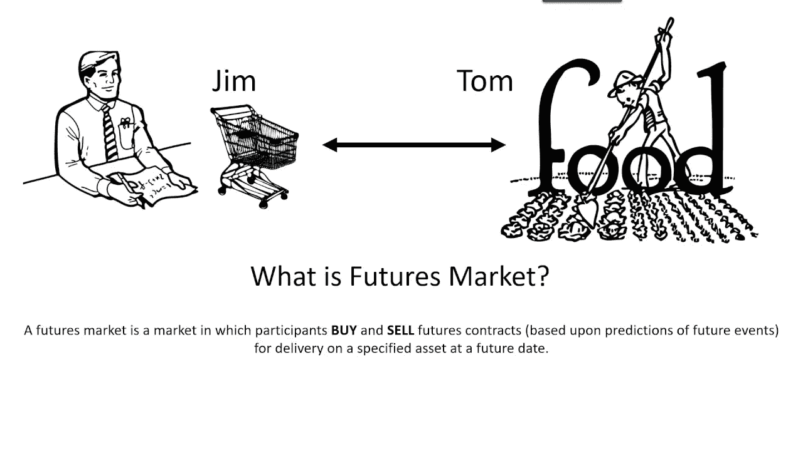

# 使用 Digitex 进行期货交易

> 原文：<https://medium.com/coinmonks/futures-trading-with-digitex-d8d521a21278?source=collection_archive---------0----------------------->

今天我们在我们的 [coinmonks slack 社区](https://goo.gl/3Ex81z)采访了 [Digitex](https://digitexfutures.com/) 的创始人 [**亚当·托德**](https://www.linkedin.com/in/adam-todd-digitex/) ， **Digitex 正在打造下一代密码期货交易平台。**看 [**这个**](https://www.youtube.com/watch?v=nwR5b6E0Xo4) 视频就知道什么是期货交易了。以下是采访的文字记录。

> **我——那么给我们讲讲 Digitex，它是什么？**
> 
> **亚当-** 简而言之，它是一个 ***免佣金期货交易所*** 它通过使用自己的本币而不是通过使用自己的本币 DGTX 令牌收取交易费来无限期地维持自己，它可以每年创造少量新的令牌来支付成本，这样，成本由所有令牌所有者分摊的小通货膨胀率来支付，而不是仅由活跃的交易者支付。这鼓励了活跃的交易。因此，digitex 的免佣金交易模式是可持续的，因为成本得到了覆盖，这是一种前所未有的革命性的期货交易所运营新方式。

Futures Trading

> 我-你为什么要建造它？背后的动机是什么？
> 
> 我一生都是期货交易者，所以我了解一些事情，我在 90 年代在伦敦公开叫价，当我发现 crypto 时，我知道可以做一些事情来消除交易费用，作为一个短线交易者，费用一直是我的主要问题，交易费用可能会扼杀边际利润的交易策略， 有了 digitex，交易者将能够进行高交易量的交易策略，并且仍然赚钱。事实上，你没有优势，没有理由应该输。当然，你也没有理由应该赢，但是如果你很好，很有纪律性，你就可以在一个交易所赚钱，不管你的交易是赢是输，这个交易所不会总是从你那里拿钱。
> 
> Me——它与芝加哥商品交易所或 CBOE 交易所等普通期货交易所有何不同？你可以超越除交易费以外的东西。
> 
> **Adam-** 这是因为成本的不同，在你提到的那些交易所交易非常昂贵，而且根据交易量有不同的收费等级，所以作为一个小交易者，你不可能得到专业交易者得到的同样的交易。这不是一个公平的竞争环境，那些交易所的专业交易者总是会打败你。
> 
> **Me-** **这种集中和分散组件的混合模式是什么？**
> 
> **Adam-** 是的， ***账户余额的持有方式也与 digitex 上的传统交易所非常不同，你不需要信任交易所持有你的账户余额。*** 我们将使用**国家渠道**立即给你利润并承担你的损失，但你永远不会把你的钱送到交易所，相反，你的交易银行被锁定在一个国家渠道，这非常类似于闪电网络，你的利润和损失被离线结算，直到你真的想停止，然后你可以解锁你最近的余额在任何时候你都不必相信 digitex
> digitex 或黑客不可能拿走你的交易银行。 ***有了状态通道，你就“锁定”了一笔你将要使用的资金，然后当你进行交易时，你的利润和亏损就会从这笔资金中增加/减少，但不是连锁的。*** 您可以随时停止交易并取回您的钱，只有最近的交易将被发送到区块链，您将拥有正确的余额。这节省了汽油成本，但更重要的是，使我们能够进行实时期货交易，而不必等待一切都到达区块链，这将带来时间延迟和额外的成本。我们可能会称它们为“交易渠道”,就像比特币的闪电网络一样。

## ***BTC/美元在 Digitex 期货交易所交易的例子***

*   鲍勃是一个短期的，趋势跟踪比特币交易者。他看到 BTC/美元的价格开始上涨，于是他轻点鼠标，买入了 500 份 BTC/美元的期货合约，价格为 10，700 美元。
*   价格快速上涨，然后开始下跌，因此 Bob 立即点击出价，只需点击一下鼠标，就可以以 10，720 美元的价格卖出 500 份合同。
*   BTC/美元期货合约的报价单位是 5 美元，所以 Bob 在 500 合约头寸上赚了 4 个报价单位，这是 2000 个报价单位的利润。1 tick 值 1 DGTX，所以他赚了 2,000 DGTX。
*   1 个 DGTX 令牌的当前市场价格为 0.10 美元，因此 Bob 的利润为 2，000 DGTX×$ 0.10 = 200 美元。
*   Bob 开始交易的初始保证金要求是 500 × 20 DGTX = 10，000 DGTX(1，000 美元)。他的账户里需要这么多钱来交易。他的账户余额由一个独立的智能合约持有，而不是由交易所持有。
*   所有交易都没有交易费，所以鲍勃的 200 美元的利润扣除佣金后就是 200 美元。

> 你在白皮书中提到，两年后你将开始铸造新硬币..承担运营成本。你将如何决定以一种最佳的方式运营，例如不要为某些东西(工资、合作关系)支付过高的费用？会有人监督它吗？
> 
> **Adam-** 是的，会有监督，因为 DGTX 令牌所有者的 ***群体将投票批准任何新令牌生成事件***
> 新令牌只能在大多数 DGTX 令牌所有者批准的情况下生成，所以如果我得出一个大数字，群体可以说不
> ，所以我们将公布我们需要在下一年运行交换的成本，只有在群体批准的情况下，新令牌的销售才会发生。
> 
> **Me-** **你能解释一下这个“交易者可以用 DGTX Peg 系统从他们的交易中消除 DGTX 价格风险”吗？(白皮书中提到)**
> 
> **Adam-** 是的，digitex 收入模式的缺点之一是交易者需要购买 DGTX 代币，这可能会给交易者带来额外的价格风险。许多交易者乐于接受这种风险，其他人则不会
> 因此，我们将引入钉住系统，让其他交易者通过 ***钉住系统从其他交易者那里承担价格风险，这基本上就是另一种期货合约。您可以通过在 peg 系统期货合约或您的 DGTX/ETH 价格上建立额外头寸来锁定您的 DGTX/BTC 价格。***
> 
> **Me- So 是不是就像 DGTX token 的期货交易？**
> 
> **Adam-** 没错，为了消除价格波动，交易者希望在不引入 DGTX 价格波动因素的情况下，纯粹根据 BTC/美元的价格进行交易。
> 
> 我-你们什么时候推出 Digitex 进行实时交易？
> 
> Adam -我们的内部软件开发团队现在正在工作，我们在都柏林有一个新的办公室，我们的目标是在第三季度推出期货交易所。事实上，我今晚要飞去都柏林，和开发团队再呆几个星期。
> 
> **Me-商业模式是否符合法律框架？是否存在任何监管挑战？**
> 
> **Adam-** DGTX 令牌只是一个实用令牌。它不提供股息，也不提供任何股票，它所做的只是让所有者能够无成本地交易期货。
> 
> 我-你的团队目前有多大，团队总部在哪里？
> 
> **Adam-** 包括开发团队以及支持和社交媒体人员在内，我们现在有 14 人，开发团队都在公司内部，必须在都柏林与我们合作，不会有远程软件开发人员，但其他人都在世界各地。

我们感谢， ***亚当来到我们的平台和我们分享见解，现在他也是我们的社区成员了。可以在这里*** ***阅读白皮书*** [***。*** 其详，助你给出更多见解。你可以在 facebook 和 twitter 上关注 Digitex。](https://www.digitexfutures.com/whitepaper/Digitex-Whitepaper.v.1.1.pdf)

***查看我们的最新采访，*** [**下一代监控系统使用区块链？。**](https://hackernoon.com/next-generation-surveillance-system-using-blockchain-be520137b3f1)

> 我们有一个活跃的社区，如果你想知道我们是如何建立的，请点击[这里](https://hackernoon.com/how-i-am-building-an-open-slack-community-to-help-myself-and-other-to-learn-about-crypto-971be905be0d)。
> 
> 点击订阅我们的时事通讯，分享访谈、交易观点和市场见解[。](https://www.getrevue.co/profile/CoinMonks)

***如果你是投资者、交易者、开发者或加密爱好者，或者对 heck crypto 如何工作有很多疑问，请加入我们的*** [***slack 社区***](https://goo.gl/3Ex81z) 。我们的 crypto 论坛 CoinMonks 也可以查看我们的网站，该网站根据他们的开发进度对 Crypto 进行排名[**CoinCodeCap**](http://www.coincodecap.com)**。**

> [直接在您的收件箱中获得最佳软件交易](https://coincodecap.com/?utm_source=coinmonks)

# ❤️喜欢，分享，留下你的评论

如果你喜欢这篇文章，不要忘记喜欢，与你的朋友和同事分享，并在下面留下你对这篇文章的评论。跟随我是因为…

Follow me