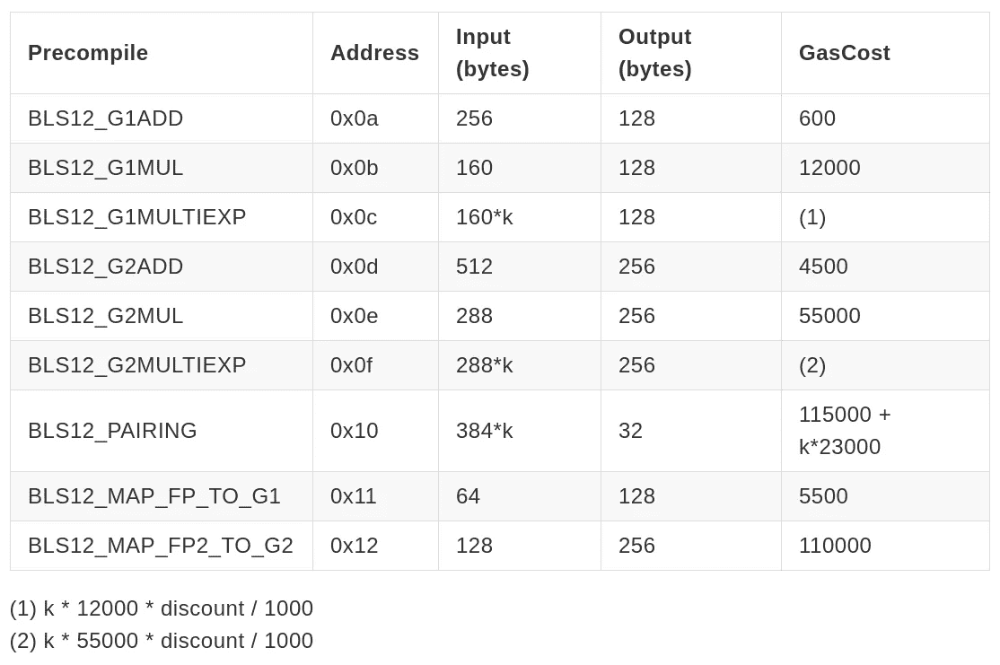
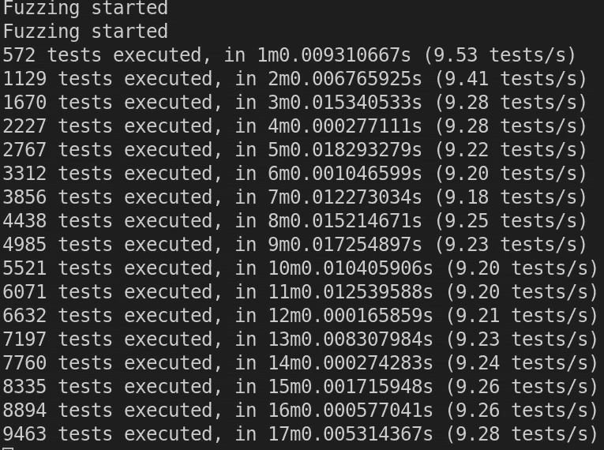

# 模糊 BLS-预编译

> 原文：<https://medium.com/coinmonks/fuzzing-the-bls-precompiles-ba3728dec622?source=collection_archive---------4----------------------->

以太坊即将推出的 hardfork Berlin 应该会引入很多新的原语。其中一个是 BLS 的签名。BLS 签名很有趣，因为它们允许签名聚合。它们是 ETH2 的存款合同所需要的。本文简要介绍了我们测试这些共识关键组件的工作。

[EIP-2537](https://eips.ethereum.org/EIPS/eip-2537) 将 9 个新的预编译引入以太坊。它们实现 bls 12–381 曲线的基本曲线操作。[这里有一个关于 bls 12–381 的简短解释。下表给出了预编译的快速概述。](https://hackmd.io/@benjaminion/bls12-381)

Overview of the 9 BLS-Precompiles

在 assembly 和 golang 中实现曲线函数的 [PR 附带了许多测试用例。然而，这些测试主要是测试加密功能，而不是集成到 go-ethereum 代码中(比如气体计算)。我创建了一个](https://github.com/ethereum/go-ethereum/pull/21018)[差分 fuzzer](https://github.com/MariusVanDerWijden/go-ethereum/tree/bls_fuzzer/tests/fuzzers/bls12381) 来测试汇编和 golang 版本之间的对比，以及与另一个 [BLS 库](https://github.com/matter-labs/eip1962)的对比。

这个基本 fuzzer 发现了一个问题，在 adx 关闭的情况下，gas 计算因指数越界错误和乘法代码中的进位错误而崩溃。他们很快被公关作者修复。我们决定合并 PR 来设置 YOLOv1，但是禁用汇编代码。

我们推出了一个名为 [yolov1](/ethereum-cat-herders/yolo-an-ephemeral-test-network-for-ethereum-356d43179b1a) 的短期测试网，以允许客户端之间更好的测试，而不仅仅是 BLS 图书馆之间。yolov1 出现了一些小问题，在一些初始测试之后，签名器用完了磁盘，然后被重置为没有启用 BLS 预编译的签名器，所以当我向它发送下一个正确的 BLS 调用时，签名器崩溃了。以太坊猫牧人在这里发布了一个很好的时间表[。](/ethereum-cat-herders/yolo-an-ephemeral-test-network-for-ethereum-356d43179b1a)

第一个 fuzzer 只创建了预编译的纯随机输入。然而，大多数操作需要非常特殊的结构，这些结构几乎不会被随机引信击中。我开始开发一个新的 fuzzer t,它可以生成预编译的有效输入，并将事务发送到测试网。因为所有主要的客户端，go-ethereum、OpenEthereum、Besu 和 Nethermind 都已经实现了 testnet 规范，所以我可以在我的本地机器上运行它们，看看它们是否会崩溃。

我在模糊化过程中发现了几次崩溃。OpenEthereum 以不同的方式计算了一个块(很可能是因为配置问题)，并在一个输入上完全崩溃，这在 devp2p 中被证明是一个开关问题。Besu 在 gas 计算过程中遇到了另一个[指数越界问题](https://github.com/hyperledger/besu/issues/1122)，与我们之前在 go-ethereum 中发现的一样。

但是在测试网上模糊是不可行的。我可以每 15 秒发送大约 100 笔交易，这确实限制了我们可以做的模糊处理的数量。所以我们创建了[另一个 fuzzer](https://github.com/holiman/goevmlab/tree/master/cmd/blsfuzz) ，它使用 [goevmlab](https://github.com/holiman/goevmlab) 创建状态测试(可以被所有客户端执行的测试)。

第三个 fuzzer 也可以生成以前的 fuzzer 不能生成的有效配对。它在尼瑟 minds 状态测试执行代码中发现了几个崩溃程序。第一个是尼瑟明实现 G1 多幂运算中的[气体计算问题](https://github.com/NethermindEth/nethermind/issues/2208#issuecomment-672881255)。第二个是地图 1 中的不速之客。Nethermind 没有在大于预期的输入上抛出错误。我们还在用于运行生成状态测试的工具中发现了两个不严重的错误。

另一个让我们花了很长时间调试的问题是 geth 和 OE 之间的气体差异。原来，OE 已经在他们的柏林配置中包含了另一个 EIP(我们用于 yolov1)， [EIP-2046](https://eips.ethereum.org/EIPS/eip-2046) ，这降低了 STATICCALL 操作码的成本，从而产生了不同的 gas 结果。

# 所有未发现的错误列表:

*   [geth 气体计算中的指数越界](https://github.com/ethereum/go-ethereum/pull/21018)
*   [geth 中 ADX 关闭时乘法运算中的进位错误](https://github.com/ethereum/go-ethereum/pull/21018)
*   [OpenEthereum 以不同方式计算区块](https://gist.github.com/MariusVanDerWijden/30110e3363c24e83cde934952099e59b)
*   [OpenEthereum 使用的 devp2p 崩溃](https://gist.github.com/MariusVanDerWijden/6bea984c7ab71a3f12c62480df147cd4)(非关键)
*   [Besu 气体计算中的指标越界](https://github.com/hyperledger/besu/issues/1122)
*   [气体报告器未在尼瑟迈德的状态测试工具](https://github.com/NethermindEth/nethermind/issues/2239)中实现(非关键)
*   [虚空思维状态测试工具](https://github.com/NethermindEth/nethermind/issues/2199)气体报告器中的 Bug(非关键)
*   [Nethermind 没有正确处理 MapToG1 中的错误](https://github.com/NethermindEth/nethermind/issues/2231)
*   [尼瑟明的 G1 多幂运算代码中的气体计算错误](https://github.com/NethermindEth/nethermind/issues/2208)

# 我们的 fuzzers 列表:

*   基本的 BLS 模糊器:直接对以太坊中使用的 BLS 库创建随机测试。对这个图书馆和另一个 BLS 图书馆进行不同的模糊处理。
*   [交易模糊器:](https://github.com/MariusVanDerWijden/go-snippets/tree/master/bls)创建可发送至网络的交易。实现更好的生成器以达到实现中更深的状态。
*   [状态测试模糊器:](https://github.com/holiman/goevmlab/tree/master/cmd/blsfuzz)创建可以在大多数客户端上执行的状态测试。它执行状态测试，收集执行跟踪并进行比较。

非常感谢 Martin Holst Swende 对 goevmlab 的持续工作，以及他为保存以太坊而捐赠的所有 CPU 周期！非常感谢 Alexander Vlasov 实现了这些库，并且一路帮助我们。非常感谢所有客户团队对 Martin 和我的 bug 报告做出的快速反应。

如果您对我们的模糊化工作有任何疑问，请联系我！Twitter 上的@ vdWijden 或 Linkedin 上的 Marius van der Wijden。

## 另外，阅读

*   最好的[密码交易机器人](/coinmonks/crypto-trading-bot-c2ffce8acb2a)
*   [密码本交易平台](/coinmonks/top-10-crypto-copy-trading-platforms-for-beginners-d0c37c7d698c)
*   最好的[加密税务软件](/coinmonks/best-crypto-tax-tool-for-my-money-72d4b430816b)
*   [最佳加密交易平台](/coinmonks/the-best-crypto-trading-platforms-in-2020-the-definitive-guide-updated-c72f8b874555)
*   最佳[加密贷款平台](/coinmonks/top-5-crypto-lending-platforms-in-2020-that-you-need-to-know-a1b675cec3fa)
*   [最佳区块链分析工具](https://bitquery.io/blog/best-blockchain-analysis-tools-and-software)
*   [加密套利](/coinmonks/crypto-arbitrage-guide-how-to-make-money-as-a-beginner-62bfe5c868f6)指南:新手如何赚钱
*   最佳[加密制图工具](/coinmonks/what-are-the-best-charting-platforms-for-cryptocurrency-trading-85aade584d80)
*   [莱杰 vs 特雷佐](/coinmonks/ledger-vs-trezor-best-hardware-wallet-to-secure-cryptocurrency-22c7a3fd391e)
*   了解比特币最好的[书籍有哪些？](/coinmonks/what-are-the-best-books-to-learn-bitcoin-409aeb9aff4b)
*   [3 商业评论](/coinmonks/3commas-review-an-excellent-crypto-trading-bot-2020-1313a58bec92)
*   [AAX 交易所评论](/coinmonks/aax-exchange-review-2021-67c5ea09330c) |推荐代码、交易费用、利弊
*   [Deribit 审查](/coinmonks/deribit-review-options-fees-apis-and-testnet-2ca16c4bbdb2) |选项、费用、API 和 Testnet
*   [FTX 密码交易所评论](/coinmonks/ftx-crypto-exchange-review-53664ac1198f)
*   [n 零审核](/coinmonks/ngrave-zero-review-c465cf8307fc)
*   [Bybit 交换审查](/coinmonks/bybit-exchange-review-dbd570019b71)
*   [3Commas vs Cryptohopper](/coinmonks/cryptohopper-vs-3commas-vs-shrimpy-a2c16095b8fe)
*   最好的比特币[硬件钱包](/coinmonks/the-best-cryptocurrency-hardware-wallets-of-2020-e28b1c124069?source=friends_link&sk=324dd9ff8556ab578d71e7ad7658ad7c)
*   最佳 [monero 钱包](https://blog.coincodecap.com/best-monero-wallets)
*   [莱杰 nano s vs x](https://blog.coincodecap.com/ledger-nano-s-vs-x)
*   [bits gap vs 3 commas vs quad ency](https://blog.coincodecap.com/bitsgap-3commas-quadency)
*   [莱杰纳米 S vs 特雷佐 1 vs 特雷佐 T vs 莱杰纳米 X](https://blog.coincodecap.com/ledger-nano-s-vs-trezor-one-ledger-nano-x-trezor-t)
*   [block fi vs Celsius](/coinmonks/blockfi-vs-celsius-vs-hodlnaut-8a1cc8c26630)vs Hodlnaut
*   Bitsgap 评论——一个轻松赚钱的加密交易机器人
*   为专业人士设计的加密交易机器人
*   [PrimeXBT 审查](/coinmonks/primexbt-review-88e0815be858) |杠杆交易、费用和交易
*   [埃利帕尔泰坦评论](/coinmonks/ellipal-titan-review-85e9071dd029)
*   [SecuX Stone 评论](https://blog.coincodecap.com/secux-stone-hardware-wallet-review)
*   [BlockFi 评论](/coinmonks/blockfi-review-53096053c097) |从您的密码中赚取高达 8.6%的利息