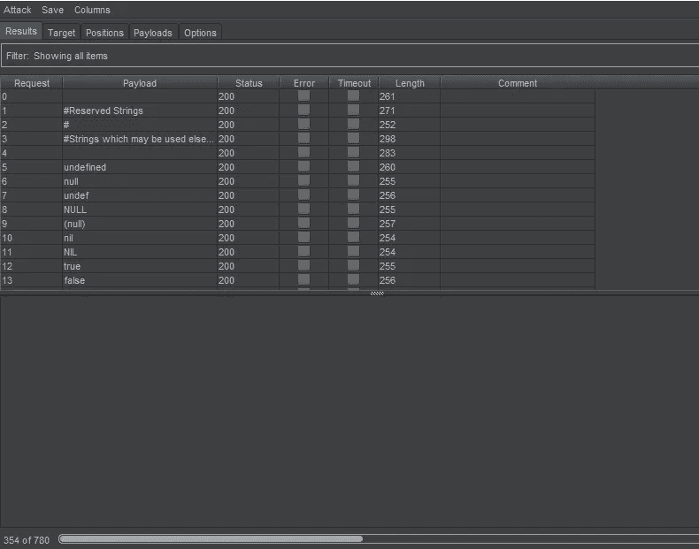

# Fuzzing Wasabi RPC

> 原文：<https://medium.com/coinmonks/fuzzing-wasabi-rpc-a7e07d75c142?source=collection_archive---------9----------------------->


**要求:**

1.  芥末
2.  打嗝组曲

**为什么起毛？**

*   查找 bug
*   乐趣

**如何模糊山葵 RPC？**

1.  按照这里提到的方式配置 RPC:[https://docs . wasabi wallet . io/using-wasabi/RPC . html # configure-RPC](https://docs.wasabiwallet.io/using-wasabi/RPC.html#configure-rpc)
2.  推出 Wasabi (1.0 或 2.0)
3.  在这篇文章中，我将使用[*select wallet*](https://docs.wasabiwallet.io/using-wasabi/RPC.html#selectwallet)RPC 命令，它可以用于任何有参数的东西。
4.  打开打嗝套件。进入入侵者->位置，粘贴下面的东西:

```
POST / HTTP/1.1
Host: 127.0.0.1:37128
Content-Type: text/plain
Content-Length: 66{"jsonrpc":"2.0","id":"fuzzing","method":"selectwallet","params":["walletname"]}
```

5.配置要插入钱包名称参数的有效负载。


6.选择用于模糊化的单词列表。你可以在 GitHub 上找到一些:

[https://github . com/danielmiessler/sec lists/tree/master/Fuzzing](https://github.com/danielmiessler/SecLists/tree/master/Fuzzing)

[https://github . com/1n 3/intruserpayloads/tree/master/FuzzLists](https://github.com/1N3/IntruderPayloads/tree/master/FuzzLists)


7.开始攻击



8.查看请求的详细信息，看看是否有什么有趣的发现。我在这个例子中找不到任何东西，但是这取决于你的单词表和代码中是否存在任何错误。


如果你发现任何有趣的事情，请在[*https://github.com/zkSNACKs/WalletWasabi/issues/new/choose*](https://github.com/zkSNACKs/WalletWasabi/issues/new/choose)和漏洞:[【https://github.com/zkSNACKs/WalletWasabi/security/policy】T21](https://github.com/zkSNACKs/WalletWasabi/security/policy)创建一个问题