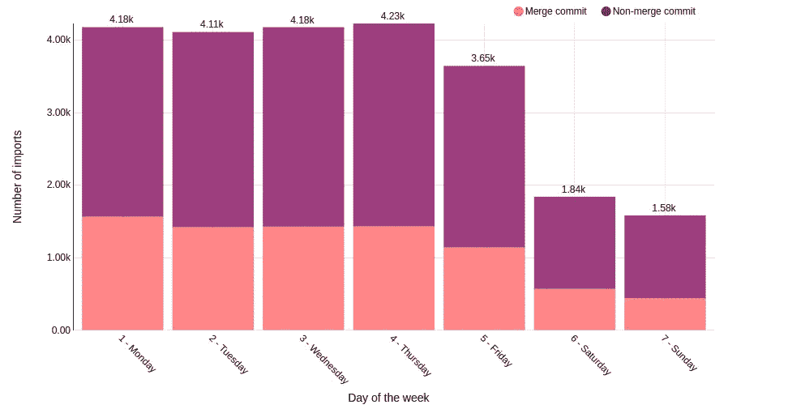
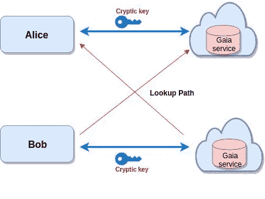

# Gaia(块堆栈存储)

> 原文：<https://medium.com/coinmonks/gaia-blockstack-storage-adccb6765da5?source=collection_archive---------1----------------------->

⚠️ 🚨下一次衰退敲门，**买比特币**(只记得BTC 没别的)。🚨 ⚠️

😠

**CoinCodeCap 更新**

我已经创建了一个单独的 [***CoinCodeCap 简讯***](https://coincodecap.substack.com/) ，如果你对密码开发感兴趣，请订阅。

你知道比特币开发者周末也推代码吗？在我们最新的博客文章中阅读更多关于比特币发展的统计数据。

**本周语录-**

> *“任何傻瓜都能知道。重点是要理解。”—阿尔伯特·爱因斯坦*

本周故事👇👇

## Gaia(块堆栈存储)

Gaia 是用户拥有的存储，用户决定谁可以看到、写入他们的存储。他们可以随时更换存储提供商。它是一个基于驱动程序模型构建的分散式高性能存储系统，可支持多种存储服务。只需很少的工作，开发者就可以通过 Gaia 为 Dropbox、azure、S3 bucket 实现一个存储提供商。

[.. ***此处阅读全文***](/coinmonks/gaia-df6b86a17d50)

由[西德拉](https://medium.com/u/5dcf04cea1cf?source=post_page-----adccb6765da5--------------------------------)

# 额外字节😘

*   [在区块链中实现 PBFT](/coinmonks/implementing-pbft-in-blockchain-12368c6c9548)Kashi sh khu llar
*   这是和解保证，笨蛋

> [直接在您的收件箱中获得最佳软件交易](https://coincodecap.com/?utm_source=coinmonks)

***想在 CoinCodeCap 上市？*** [***填写此表。*T50**](https://airtable.com/shrc4sXB70HPpuSM8)

给我发微博 [@coinmonks](https://twitter.com/coinmonks) 或者发邮件到 gaurav@coincodecap.com

> *“我们是一个非宣传性和非营利性的教育出版物，如果您喜欢阅读* [*【金和尚】*](https://medium.com/coinmonks)*[*您也可以捐助我们*](/coinmonks/monks-need-your-help-7440418d67ec) *。**

****暂时就这样吧，送我❤️，下次再说。****