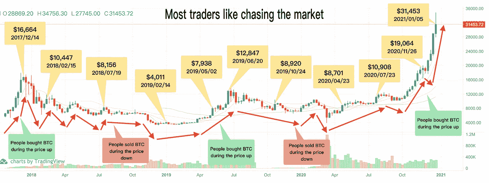
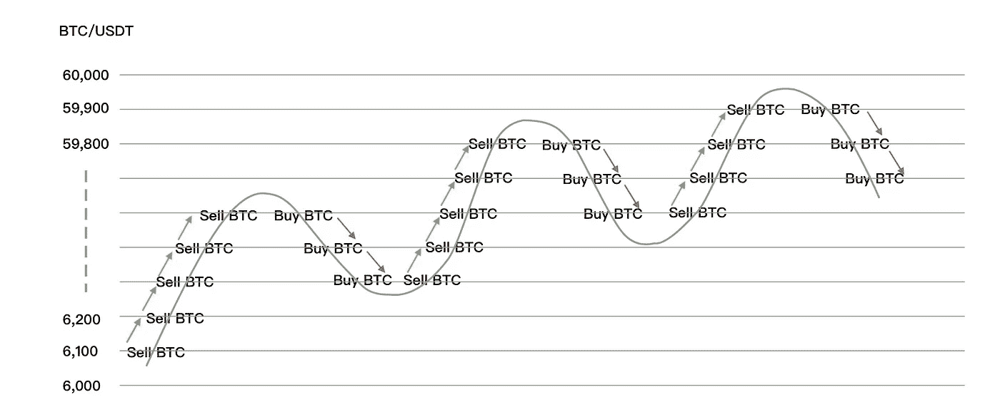
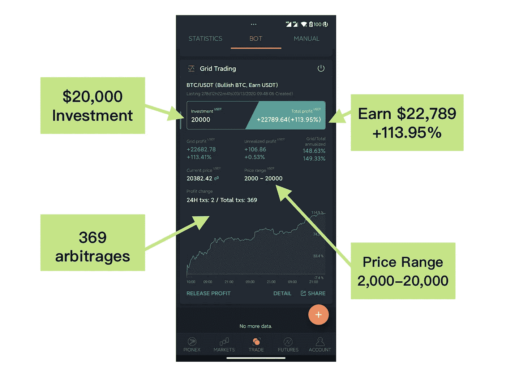
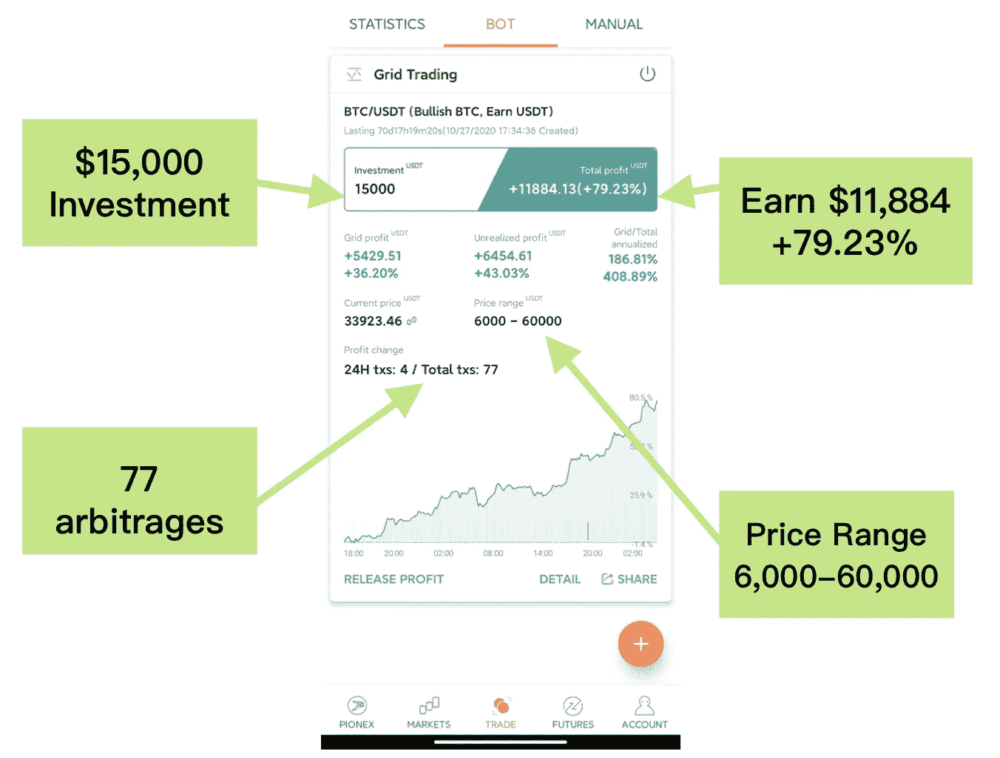
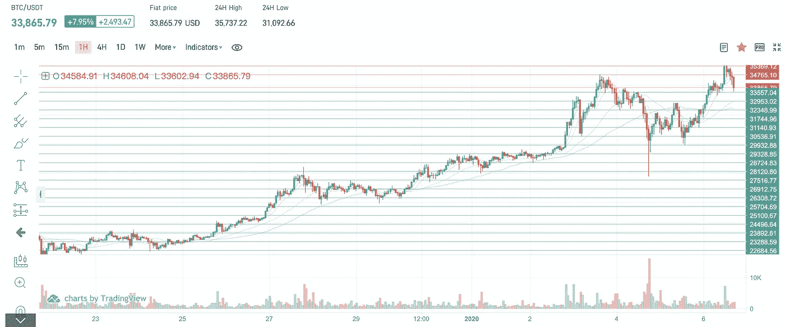
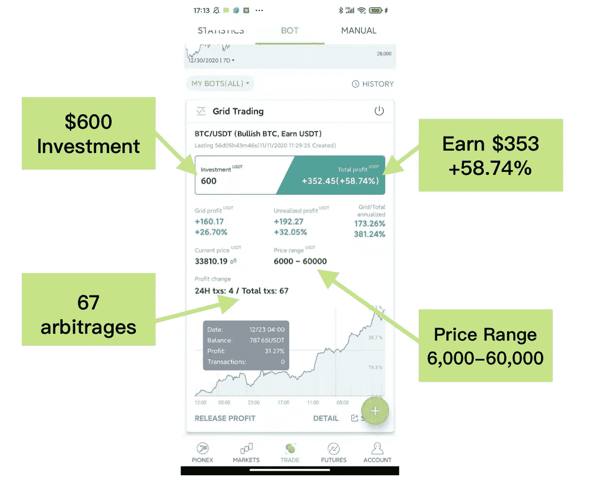

# 低风险利润|最佳比特币交易策略 2021

> 原文：<https://medium.com/coinmonks/gain-112-profits-the-best-btc-trading-strategy-helps-you-avoid-the-most-emotional-common-28046be31138?source=collection_archive---------2----------------------->

## 避免最常见的交易错误&将 BTC 的仓位控制在 60，000 美元！

> **“比特币破 3 万美元！你现在有比特币吗？”**我问过很多朋友。
> 
> **“不，我确实早就以更低的价格卖出去了”**大多数人都说

如上图所示，比特币之所以吸引人，是因为它的波动性造就了获利的潜力。是的，由于**的波动，大多数交易者不能长期持有 BTC。**

# 持有比特币很酷但是大多数人坚持不了！

持有 BTC 是一个非常酷的获利策略。然而，当 BTC 触及 20，000 美元时，我问我的许多朋友，他们是否会出售，但他们甚至不再持有 BTC。他们说他们确实比以前卖得更便宜。**为什么？为什么不把 BTC 的价格保持在 2 万美元甚至更高呢？**

> 交易成功的关键是情绪训练。如果智力是关键，会有更多的人通过交易赚钱——维克多·斯波郞迪

好吧，持有 BTC 并高价卖出比听起来更难，因为我们总是受我们的情绪影响，比如对短期利润的贪婪，或者对失去金钱的恐惧，所以我们怀疑自己的决定，这些情绪使得我们很难持有 BTC 并在正确的时间卖出。不要责怪自己，因为这是人类的弱点——总是受我们情绪的影响。

# 这里有 5 个常见的错误，让你很难将 BTC 保持在 30，000 甚至更高！

## 🗣Chasing 市场

波动性是加密货币的主要特征之一。因为加密货币的价格永远不会停止交易，它们总是在变动。价格每分钟都有小幅波动。很多人会因为恐惧，在一个硬币价格高的时候买入，价格降低的时候低价卖出，导致自己亏损。相反的应该是目标。

## 🗣害怕损失，贪图短期利润

恐惧和贪婪是人类非常普遍的情绪。有时，如果你持有的一枚硬币的价格下跌，你可能会以更低的价格出售这枚硬币，因为你害怕损失更多，即使它稍后会上涨。相反，如果价格上涨，你可能会卖得太早，因为你太贪婪，错过了真正的利润。所有这些情况都会影响你的交易表现，并可能导致你交易失败。

## 🗣Hesitating 自始至终都在观察

每个人都想在底部买入，在顶部卖出。但在现实中，交易者总是在观望和犹豫，导致他们做完全相反的事情。

## 🗣Watch 市场的所有时间和学习更多的指标

如果你想成为专业交易者，你需要花很多时间观察市场，学习如何使用各种指标(如 MACD、RSI 或任何你喜欢的指标),并找到一个盈利的策略。这将需要大量的时间、精力和技能，而且在你还在学习这些东西的时候，你也可能会有所损失。

## 🗣孤注一掷——只用一种加密货币？

没有什么比用太多的资金交易更让人恐惧了，但是很多人都想一夜暴富。因此，投资你所有的资金，选择一个可能上涨 1000%的小盘股，用所谓的“高 R/R”策略来赌博，如果你把你所有的都投入进去，你很有可能会失去任何东西。如果每个人打算在一张卡上放任何东西，他真的应该三思。

> 有什么方法可以交易并稳定持有 BTC 这个完美的投资目标呢？

# BTC 的阶梯买卖对每个人来说都是一个不错的选择！

没人能真正预测 BTC 价格。所以如果你“全在 BTC”，以目前的价格，它可能会更高。或者你可能会犹豫等待一个好时机购买 BTC，这可能会让你失去机会购买任何 BTC。

因此，在 BTC 进行阶梯式买卖是一个不错的选择。如下图所示，您可以下达许多 BTC 卖出指令和 BTC 买入指令。一旦价格上涨，你可以卖出一些 BTC 来赚取一些利润，一旦下跌，你可以买入一些 BTC 来降低平均成本。

这种交易想法很酷，但是手动下太多的订单，一直观察市场是非常困难的。**所以我用** [**上的网格交易机器人 Pionex**](/coinmonks/pionex-review-exchange-with-crypto-trading-bot-1e459d0191ea) **帮我在 BTC 上进行自动阶梯买卖！。**

> BTC 网格交易策略帮助我持有 BTC 到 20，000 美元，在 2020 年赚取超过 113%的利润！

我运行这个 BTC 网格交易机器人大约 278 天，迄今为止取得了 113.95%的利润——我称之为**【BTC 超宽网格交易策略】**因为我设定了一个非常大的价格范围(2000 美元到 20000 美元)。

> 为什么这个 BTC 网格交易策略可以帮助你交易并持有 BTC 到 20，000 美元？

## 🗣Avoid 最感性的错误

我的超宽 BTC 网格交易机器人将自动购买低吸和出售泵。因为机器人会按照你设定的参数为你自动交易，它可以帮助你避免最情绪化的行为，比如追逐市场，因为贪婪/恐惧而手动买入/卖出等等。

## 🗣No 需要每天检查价格或者使用复杂的指标

如果你创建了这个超宽的 BTC 网格交易机器人，它会自己完成所有的交易。只要价格在你的价格范围内，就会自动低买高卖，没必要整天看图表。

> 👀重要提示:只要价格在你的价格范围内，不要停止机器人，它会自动低买高卖！

## 🗣Bot 为您提供良好的仓位管理

根据你设置的参数，机器人会下多个买卖单。这降低了风险，确保你的交易有一个好的平均价格，这比全押风险要小得多。

> 新的 BTC 电网交易策略将在 2021 年交易并持有 BTC 高达 60，000 股！

我用更新的参数创建了一个新的超宽 BTC 网格交易机器人。到目前为止，它已经运行了 70 天，在这个过程中赚了 11，884 美元以上(79.23 %)。

该机器人已经自动下了总共 150 个 BTC 买卖订单，这些订单将在 BTC 进行低买高卖的阶梯式买卖，以获取利润。下图显示了机器人发出的 BTC 卖出&买入订单:

如果你想创造这种 BTC 策略，现在正是时候，这里是新的超宽 BTC 网格交易机器人的参数:
(1)交易对:BTC/USDT
(2)下限:6000
(3)上限:60000
(4)网格:150 网格
(5)间距:算术
(6)金额≥最小金额

**提示:**输入上述所有参数后，系统会自动计算出最低金额。

你可以用你资金的 10%(1000 USDT 左右)来试试这个策略。以下是我在 BTC 600 USDT 的交易策略:

## **BTC 超宽电网交易机器人 FQA**

**问:我能保持这种 BTC 超宽网格交易策略多久？** 答:这个超宽的 BTC 电网交易机器人是一个长期策略，BTC 在价格区间内波动的时间越长，你赚的利润就越多。

**问:如果价格下跌呢？我应该停止机器人吗？** 答:没有！一旦价格下跌，那就是机会！这意味着你的机器人现在可以购买便宜的 BTC，当价格再次上涨时，它将出售以获利。

**问:参数是如何计算出来的？**
对 Bot 进行了 AI 测试，这些参数表现出了最好的性能。但是你可以随意调整它们！

## 另外，阅读

*   [Pionex 评论](/coinmonks/pionex-review-exchange-with-crypto-trading-bot-1e459d0191ea)
*   最好的[密码交易机器人](/coinmonks/crypto-trading-bot-c2ffce8acb2a)
*   [3 商业评论](/coinmonks/3commas-review-an-excellent-crypto-trading-bot-2020-1313a58bec92)
*   [AAX 交易所评论](/coinmonks/aax-exchange-review-2021-67c5ea09330c) |推荐代码、交易费用、利弊
*   [Deribit 审查](/coinmonks/deribit-review-options-fees-apis-and-testnet-2ca16c4bbdb2) |选项、费用、API 和 Testnet
*   [FTX 密码交易所评论](/coinmonks/ftx-crypto-exchange-review-53664ac1198f)
*   [n 零审核](/coinmonks/ngrave-zero-review-c465cf8307fc)
*   [逐位交换审查](/coinmonks/bybit-exchange-review-dbd570019b71)
*   [3Commas vs Cryptohopper](/coinmonks/3commas-vs-pionex-vs-cryptohopper-best-crypto-bot-6a98d2baa203)
*   最好的比特币[硬件钱包](/coinmonks/the-best-cryptocurrency-hardware-wallets-of-2020-e28b1c124069?source=friends_link&sk=324dd9ff8556ab578d71e7ad7658ad7c)
*   [密码本交易平台](/coinmonks/top-10-crypto-copy-trading-platforms-for-beginners-d0c37c7d698c)
*   最佳 [monero 钱包](https://blog.coincodecap.com/best-monero-wallets)
*   [莱杰 nano s vs x](https://blog.coincodecap.com/ledger-nano-s-vs-x)
*   [bits gap vs 3 commas vs quad ency](https://blog.coincodecap.com/bitsgap-3commas-quadency)
*   最好的[加密税务软件](/coinmonks/best-crypto-tax-tool-for-my-money-72d4b430816b)
*   [最佳加密交易平台](/coinmonks/the-best-crypto-trading-platforms-in-2020-the-definitive-guide-updated-c72f8b874555)
*   最佳[加密贷款平台](/coinmonks/top-5-crypto-lending-platforms-in-2020-that-you-need-to-know-a1b675cec3fa)
*   [莱杰纳米 S vs 特雷佐 one vs 特雷佐 T vs 莱杰纳米 X](https://blog.coincodecap.com/ledger-nano-s-vs-trezor-one-ledger-nano-x-trezor-t)
*   [block fi vs Celsius](/coinmonks/blockfi-vs-celsius-vs-hodlnaut-8a1cc8c26630)vs Hodlnaut
*   Bitsgap 评论——一个轻松赚钱的加密交易机器人
*   为专业人士设计的加密交易机器人
*   [硬币追踪审查](/coinmonks/cointracking-review-a-reliable-cryptocurrency-tax-software-5114e3eb5737)
*   [优霍德勒评论](/coinmonks/youhodler-4-easy-ways-to-make-money-98969b9689f2)
*   [埃利帕尔泰坦评论](/coinmonks/ellipal-titan-review-85e9071dd029)
*   [SecuX Stone 评论](https://blog.coincodecap.com/secux-stone-hardware-wallet-review)
*   [BlockFi 评论](/coinmonks/blockfi-review-53096053c097) |从您的密码中赚取高达 8.6%的利息
*   [Coinrule 审查](https://blog.coincodecap.com/coinrule-review-a-perfect-trading-bot)
*   [最佳区块链分析工具](https://bitquery.io/blog/best-blockchain-analysis-tools-and-software)
*   [加密套利](/coinmonks/crypto-arbitrage-guide-how-to-make-money-as-a-beginner-62bfe5c868f6)指南:新手如何赚钱
*   最佳[加密制图工具](/coinmonks/what-are-the-best-charting-platforms-for-cryptocurrency-trading-85aade584d80)
*   了解比特币的[最佳书籍有哪些？](/coinmonks/what-are-the-best-books-to-learn-bitcoin-409aeb9aff4b)

> [直接在您的收件箱中获得最佳软件交易](/coinmonks/newsletters/coinmonks)

