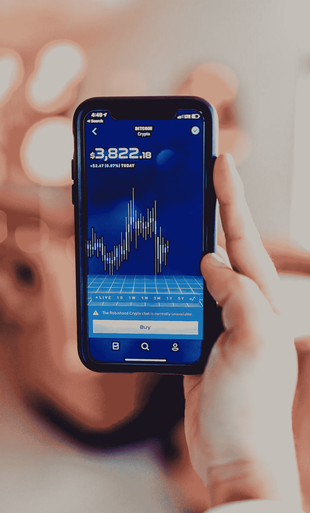
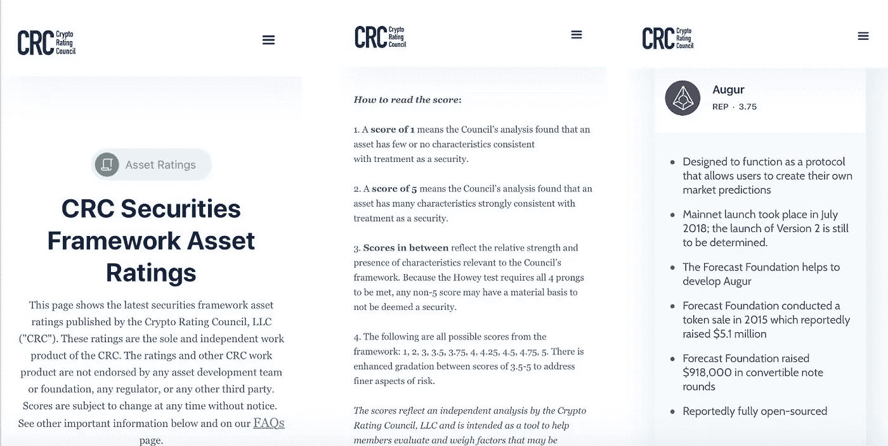
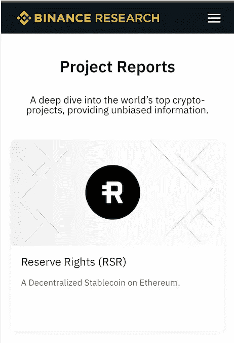
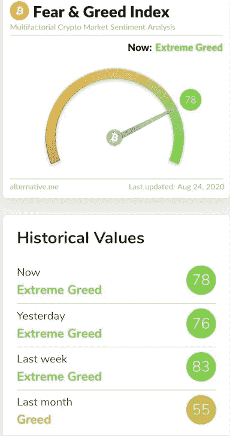

# 获得优势——如何投资加密货币市场而不失去你的衬衫…

> 原文：<https://medium.com/coinmonks/gaining-an-edge-how-to-invest-in-the-cryptocurrency-market-without-losing-your-shirt-2c3e8c90da10?source=collection_archive---------1----------------------->

Photo by [Austin Distel](https://unsplash.com/@austindistel?utm_source=unsplash&utm_medium=referral&utm_content=creditCopyText) on [Unsplash](https://unsplash.com/s/photos/bitcoin-trading?utm_source=unsplash&utm_medium=referral&utm_content=creditCopyText)

## **这篇文章是写给谁的？**

我们为那些对将脚趾浸入加密货币的水中感兴趣，但希望确保自己的整条腿不被鲨鱼吃掉的人写了这篇文章！我们这么说是因为加密市场充满了鲨鱼，因此我们相信这篇文章对新手投资者来说是有价值的。那么我们如何确保我们的脚趾是安全的呢？

## **处于起步阶段的加密货币市场**

作为一名前股票经纪人，我知道很多方法来获得关于购买、持有或出售股票的独立研究。研究报告由投资银行和经纪公司雇佣的经验丰富的合格分析师撰写，可在网上和各种投资出版物中查阅。

但是加密货币市场参与者无法获得相同的资源。理解其中的原因是显而易见的。市场相对较新。[比特币](https://blog.coincodecap.com/a-candid-explanation-of-bitcoin)(BTC)2008 年才被发明出来。莱特币等竞争对手的加密货币于 2011 年开始出现。按市值计算，以太是第二大硬币，直到 2015 年才推出。

以太坊平台(以太是其本地货币)的推出是真正行动的开始。这个市场确实还处于起步阶段。但是加密市场不同于其他任何市场。它以闪电般的速度移动。它被形容为投资界的狂野西部。我们将更进一步，把它描述为投资的狂野西部！现在在狂野的西部有超过 6000 种加密货币在交易。问题是你如何着手挑选一个？

## **我如何投资加密货币市场？**

我真的不喜欢下一个短语，但恐怕它也适用于上面的问题，“这要看情况而定……”

这完全取决于你的风险承受能力。你是做投机生意的吗？也就是说，赚快钱，然后转移到下一个机会，或者，你是做投资的吗？也就是说，你是加密货币的长期信徒，想要持有一枚或多枚硬币，因为你相信它们在长期内会增值(在加密领域称为 Hodler)。

让我们先处理后一个投资者——长期投资者。

在这里，选择风险小、价值高的硬币要简单得多。

接下来让我们检查“风险更小”这几个词。

## **风险和加密货币**

他们说，加密货币与股票市场不相关，因此当我们面临波动或熊市时，这是投资的一个很好的理由。然而，这并没有证明最近的情况。他们也说不会长久，但是别信！如果你是为了分散投资组合和降低风险而投资，请三思。

投资加密货币有什么风险？让我们以 BTC 为例，因为这是迄今为止市值最大的硬币，因此比其他“替代硬币”风险更低，假设你正在寻找中低风险的投资(尽管你永远不会将 BTC 描述为低风险)。

1.  **价格波动** —明显对？BTC 比任何标普成份股都更加不稳定。然而，一些有限的研究得出结论，如果你使用“风险调整回报”，那么 BTC 是一个优于黄金和标准普尔 500 指数的投资(在一项研究中，BTC 得分为 1.97，黄金为 1.06，标准普尔 500 指数为 0.25)。事实是，你真的想经历这种程度的波动吗？当你的投资像一个精神错乱的女朋友(或男朋友)的情绪波动一样起伏不定时，你晚上能睡得着吗？如果答案是否定的，那么[加密货币](https://blog.coincodecap.com/tag/cryptocurrency)不适合你！

# **什么是风险调整后的回报？**

> **这是一种衡量方法，允许您比较具有不同风险和回报的投资。它允许您调整每项投资的风险、回报和波动性，并将其与其他投资进行比较，以确定哪个投资机会更好。**

**2。选择合适的地方购买硬币—** 选择一个受监管的交易所——而不是一个没有住所、上周才成立的交易所。

**3。储存硬币—** 大多数人将硬币存放在他们购买的交易所。它既漂亮又简单。然而，它确实让这些交易所面临被黑客攻击的风险。不管他们告诉你什么，大多数交易所都曾被黑客攻击过。因此，在此基础上，你应该选择一个有保险并受到监管的交易所。一次大的黑客攻击可能会导致一个交易所的关闭。另一个解决办法是你自己储存新获得的硬币。但是在你仓促行事之前，花些时间考虑一下你的选择。你会把你的硬币存在 u 盘里吗？如果是的话，你会把它和那张写有你密码的纸一起藏在哪里，这样你就不会不小心把它扔掉了？据估计，20%的 BTC 永远消失了，因为人们丢失了东西！这是一个严肃且经常被忽视的考虑因素。

# **让我们看看 Robinhood Crypto 对存储有什么看法:**

> **'您在 Robinhood Crypto 上购买的加密货币存储在冷(离线)存储和热(在线)存储中。你的大部分硬币都被冷藏起来了……**
> 
> **我们还购买了犯罪保险，保护我们存储系统中的部分资产免受盗窃损失……’**
> 
> 如果你是一个长期投资者，我们建议这不是购买你的密码的最佳方式，但这是一个省事的方式。不幸的是，没有麻烦会导致以后的问题…

让我们更深入地了解一下影响加密货币投资价格波动的因素。原因可能包括:

1.  政府监管或干预
2.  全球和国内的经济因素
3.  软件错误
4.  团队携款潜逃——结果证明这是一个庞氏骗局
5.  竞争
6.  想法的执行不力
7.  缓慢采用或不采用

## **采取规避风险的投资策略**

考虑到上述风险因素，如果你希望将加密货币市场的风险敞口降至最低，最佳策略是投资 BTC 和瑞士联邦理工学院这两种货币中的一种或两种。

市场上的大部分价值都在这两种硬币中，占整个加密货币市场总价值的 71%。BTC 为 59%，乙醚为 12%。所有上市硬币的总市值为 3610 亿美元，前 5 名占其中的 80%。前 10 名，86%。所谓蓝筹股币在前五名。虽然有两个我们会从投资等式中剔除，当然要根据你自己的研究，XRP 和泰瑟。这两者都有他们的问题，作为一个有长期投资目标的投资者，避开任何有问题的东西。一些“专家”认为，你应该将分配给加密货币投资的至少 50%的资金投资到 BTC，其余部分应该分散在另外两到三个排名前十的硬币中。

## **这将我们带回可用的研究资源……**

在十大硬币上有丰富的独立和非独立的信息。然而，在我们继续前进之前，有一个很大的警告。

与高度监管的股票市场不同，密码市场有大量的交易在进行。你会看到阐述 BTC 优点的文章，以及它如何有望达到 10 万美元，我们甚至看到超过 100 万美元的预测。但如果你没有被这种繁荣蒙蔽双眼，你也会看穿迷雾，注意到空头在行动，预测 BTC 将出现重大调整，有些人甚至说这毫无价值。通过阅读各种观点，你应该能够形成自己的观点。但是你必须形成自己的观点，有太多的既得利益者被一个有偏见的帖子或“专家”所引导。

## **在哪里可以找到十大硬币的信息？**

没有独立的经纪公司提供公正的研究。反正还没有。明天这一切都可能改变。然而，信息是为了投资于加密市场，你必须得到你的手脏。你必须做你自己的跑腿工作，这意味着你自己的研究。这是我唯一害怕的方式。如果跑腿不适合你，那么这个市场可能不适合你。

但现在让我们假设，你不介意多走一步去寻找一个“可靠的”投资机会。我们在下面列出了一些有用的资源，可以帮助您实现这一目标:

社交媒体平台 —一个非常有价值的信息来源。主要是 Twitter 和 Reddit，还有一个叫 Discord。请记住，虽然这些通常包含来自既得利益者的偏见。但是你可以感受到正在发生的事情，有一些受人尊敬的人值得追随。再次记住，他们也有自己的既得利益，所以只用他们来感受市场，而不是投资于他们的建议。

**密码评估委员会(CRC)** —有一个有用的资源叫做 CRC。这是开始研究任何硬币的好方法。他们的真正目的是对某些硬币是否代表一种证券提供意见。为了做到这一点，他们对它们进行评级。例如，BTC 被评为 1 级，因为它不被视为安全，而 XRP 被评为 4 级，因为它可能被归类为安全。

参见下面的评分:

目前只公布了 28 个评级。那肯定是有帮助的。你不想投资/投机任何评级高于 a 2 的东西。但是这些评级仍然不能告诉你太多关于项目/硬币的前景，以及硬币是否代表一个好的购买机会或者是一个疯狂的抛售。

我们没有把 XRP 列为蓝筹股的原因是，CRC 将其评级为 4，这意味着它可能是一种证券。买了这枚硬币，你就冒着在某个时候这枚硬币可能一夜之间变得一文不值的风险。

**研究网站—** 有几个订阅网站向你收取研究 BTC 和一些替代币的月费，以及一般的加密市场新闻。我会避免这些。你可以从下面我提供给你的其他资源中收集同样的信息。

**加密货币新闻网站** —也有一些值得订阅的网站，它们每天都会发送免费的时事通讯，包括:

*   [硬币电报](https://cointelegraph.com)
*   [该块](https://www.theblockcrypto.com)
*   [梅萨里](https://messari.io)
*   [硬币零食](https://coinsnacks.com)

**币安**领先的加密货币交易所之一，在其网站上提供研究资源，涵盖大量项目，包括 deep dive。然而，它提供了自己的硬币，BNB，和其他既得利益者的研究，这种打破了所有的信誉规则。但这是一个寻找你感兴趣的大多数硬币的一般市场分析和背景信息的好地方。顺便说一下，这并不是建议你把币安作为交易所的选择。你将不得不在这方面做你自己的研究，足以说有利弊。

**硬币市值**——另一个无价的信息来源是 www.coinmarketcap.com。这提供了大多数加密货币的市场价格，包括交易量信息和项目摘要。经验法则是，如果你研究的硬币不在这个名单上，就不要投资。这项政策本可以避免在 OneCoin 等一些大型加密货币欺诈中遭受损失。

**Medium —** 这是另一个关于加密市场的重要信息资源。阅读大量文章需要付费订阅，但如果你对这个市场很认真的话，这是一笔小投资。[www.medium.com](http://www.medium.com)。

**其他几个…**

尽管是一个订阅网站，但它提供了 800 多种硬币的一些有价值的信息。此外，注册 cryptoresearch.report，了解加密市场的一般信息。此外，看看 [CoinCodeCap](https://coincodecap.com/coins) 了解硬币的开发活动。

最后，一个有价值的工具是加密的恐惧和贪婪指数——alternative . me。基本上，贪婪系数越高，市场风险越大。

以上内容将为您提供充足的信息，帮助您做出明智的投资决策。

**在狂野西部之外购买…**

除了直接购买/拥有 BTC 或瑞士联邦理工学院，还有其他选择。灰度是你可能会遇到的一种基金。它们为投资者提供了投资 BTC 和瑞士联邦信托的机会。我们不建议你通过市场购买这些信托的股票，因为它们的定价高于基础硬币，但这种情况会发生变化(BTC 信托的平均溢价为 39%，现在约为 22%)。目前没有受监管的 ETF(交易所交易基金)，但有大量的 etn(交易所交易票据)。etn 没有义务购买标的资产，因此你购买这些资产是在冒险。这一地区发生了几起诈骗案。

现在让我们看看更冒险的东西…

## **高风险机会**

我们如何找到真正的购买机会——宝石和未加工的钻石？

这是赚大钱的地方，也是你会失去投资的地方——百分之百。但问题是你有超过 6000 个硬币可以选择。

问题是这方面的研究很少。你可以找到前十名之外的硬币的基本信息，但信息的深度要少得多。你的主要信息来源将是项目网站和他们的白皮书(大多数项目产生一个概述他们的商业计划的白皮书。如果你还没有看过 BTC 白皮书，那就看看吧)。

那么，我们如何识别这种潜在的旋转货币加密货币呢？也许你在你的时事通讯或几条推文中读到了一个有趣的探测项目。也许你的灵感来自于你自己的思考，即哪些领域将从区块链的引入中受益最大，然后你进行了自己的研究，并发现了一些在该领域运作的有趣的硬币。无论你如何发掘这项投资都不重要，重要的是它是否通过了我们在下面提供给你的严格检查:

1.  这枚硬币是否在 www.coinmarketcap.com 的[上市——如果是，查看价格、数量和基本信息，然后进行第 2 步。如果没有，那就另找机会。](http://www.coinmarketcap.com/)
2.  查看项目/硬币白皮书。你应该在这个项目的网站上找到。
3.  白皮书是一份重要的文件，以下是一些需要考虑的关键领域:

*   错别字是不行的。如果有人制作了一个充满错别字和语法错误的文档，那么这对于未来是一个非常不好的信号。
*   是一家律师事务所为发行硬币的公司提供咨询吗？看看他们，他们有信誉吗？
*   谁是顾问？他们声誉好吗？随时给他们打电话。
*   看看这个团队，谷歌一下他们的个人资料和 LinkedIn 个人资料。它们叠加起来了吗？他们有这方面的经验吗？他们以前经营过成功的科技企业吗？
*   该项目是否获得了知名风投的风险投资？
*   他们是否如期推出他们的产品/硬币？如果产品错过了关键的发布日期，这是一个主要的警告信号。
*   管理层给自己发了多少币？太慷慨——避免。

4.查看在线评论——必不可少！

5.查看 CRC 是否对硬币进行了评级。如果他们没有，在网上查一下一般的评论。如果有疑问，避开。

6.看看 deadcoins.com 的硬币。这有一个名单，骗局硬币，休眠硬币和其他硬币，以避免。

下面是一些额外的资源，帮助你揭示潜在的隐藏宝石。

**硬币清单**

[www.coinlist.co](http://www.coinlist.co/)是一个宝贵的资源，检查即将到来的和当前的硬币产品。称为 ICOs 或 IEOs。这是关于每个项目的新问题和信息的有价值的指南，包括项目白皮书。

# **什么是 ICO 和 IEO？**

> ICO 是首次发行硬币，类似于首次公开募股，这是新硬币的发行。这些在几年前风靡一时，但现在已经销声匿迹，原因有三，一是市场崩溃，二是其中大部分是欺诈，三是其中许多被归类为证券。但仍有一些新兴市场可能为投资者提供买入机会。但你必须遵循上面的清单，以确保这些不是骗局或没有希望达到他们的目标。

**眼下的热点地区—** [**DeFi**](https://blog.coincodecap.com/the-ultimate-guide-to-defi-decentralized-finance)

[www.defipulse.com](http://www.defipulse.com)拥有[分散财务](https://blog.coincodecap.com/the-ultimate-guide-to-defi-decentralized-finance)中所有代币的列表。这是目前加密货币最热门的领域。许多参与者正在思考与许多 DeFi 应用程序相关的治理令牌。然而，在猜测这些代币之前，请阅读我们的后续文章。

# **什么是 DeFi？**

作为分散金融的简称，DeFi 目前最受欢迎的领域是借贷平台，人们在这里存款或出借加密货币以换取利息支付。资本通过智能合同(即，在没有人为干预的情况下，如果满足特定条件，则释放您的资本的法律合同)得到保护。风投和私人投资者正涌入这个 DeFi 领域。我们的下一篇文章将更详细地探索这个令人兴奋的快速发展的领域。这个领域的定义是要彻底改变密码市场，而不仅仅是为了消息灵通人士！

## 你的风险承受能力是多少——你应该投资多少？

最后，让我们回顾一下所有财务顾问在开始向你推销他们最新的投资策略之前应该问你的问题，但总是设法略读这个主题。

你对风险的容忍度是高、中还是低？这个问题的答案将决定你是否应该投资于狂野的西部。

根据本杰明·格拉哈姆(《聪明的投资者》的作者，沃伦·巴菲特的前导师)的说法，只有极小一部分投资者可以被归类为对风险有很高的容忍度。

如果你通过了所有这些测试，你就属于这一类:

*   留出至少一年的现金来支持你的家庭。
*   至少在未来 20 年内会稳定投资。
*   挺过了上次熊市。
*   在熊市期间没有卖出股票。
*   在熊市期间买了更多的股票。
*   任何在上一次熊市中恐慌的人都会在下一次熊市中恐慌。

还有其他因素需要考虑，包括你的年龄，你越年轻，你能承担的风险就越大。你的纳税情况。例如，养老金领取者是需要收入的低收入者，但需要像头上有个洞一样的损失。以及你的投资组合规模。在任何投资决策中，最重要的因素是你的风险承受能力。

让我们假设你有能力根据上述标准在加密货币市场下注，你会投资多少？

任何非主流投资都有一些规则(ETF 和指数跟踪基金是主流)。

1.  永远不要碰你的养老金罐——很多人都曾经后悔过。
2.  房子不要再抵押了！听起来很疯狂，但人们确实这么做了。
3.  只使用你能承受损失的钱。

谈到我的三点清单中的最后一点——你应该投资多少？

**在你的养老金和主要住所之外，你最多只能投资 5%的投资组合。而在这 5%中，这部分应该依次分散到其他投资类别中——至少 10%。**

这是保护你的养老金和房子的最安全的投资方式。如果你是一个 23 岁的有着花不完的钱的成功人士，尽一切办法去投机，但是同样的规则也适用。从差价合约到加密货币，从成长型股票到最新的海外房地产热点，有很多人在投机高风险投资时输得精光的故事！谨慎是应该的。

## **外卖**

我们能从这篇文章的精华中得到什么？

*   决定你是一个长期投资者还是想快速赚钱。
*   无论你的策略是什么，你都必须进行自己的研究，牢记市场中许多固有的偏见。
*   选择有监管的交易所，最好存放自己的硬币。
*   如果你决定持有自己的硬币，制定你的存储策略。
*   你的风险承受能力是多少？永远不要将超过你投资组合 5%的比例投资于高风险资产类别，这是显而易见的。

## **理财建议**

本文不以任何方式构成财务建议。这篇文章应该作为补充信息添加到您现有的知识库中。

## **下一篇文章**

**DeFi——加密货币最热的领域讲解。**

**关注我们的推特**[**@ fraud stamp**](https://twitter.com/fraudstamp?lang=en)

## 另外，阅读

*   最好的[密码交易机器人](/coinmonks/crypto-trading-bot-c2ffce8acb2a)
*   [密码本交易平台](/coinmonks/top-10-crypto-copy-trading-platforms-for-beginners-d0c37c7d698c)
*   最好的[加密税务软件](/coinmonks/best-crypto-tax-tool-for-my-money-72d4b430816b)
*   [最佳加密交易平台](/coinmonks/the-best-crypto-trading-platforms-in-2020-the-definitive-guide-updated-c72f8b874555)
*   最佳[加密贷款平台](/coinmonks/top-5-crypto-lending-platforms-in-2020-that-you-need-to-know-a1b675cec3fa)
*   [最佳区块链分析工具](https://bitquery.io/blog/best-blockchain-analysis-tools-and-software)
*   [加密套利](/coinmonks/crypto-arbitrage-guide-how-to-make-money-as-a-beginner-62bfe5c868f6)指南:新手如何赚钱
*   最佳[加密制图工具](/coinmonks/what-are-the-best-charting-platforms-for-cryptocurrency-trading-85aade584d80)
*   [莱杰 vs 特雷佐](/coinmonks/ledger-vs-trezor-best-hardware-wallet-to-secure-cryptocurrency-22c7a3fd391e)
*   了解比特币最好的[书籍有哪些？](/coinmonks/what-are-the-best-books-to-learn-bitcoin-409aeb9aff4b)
*   [3 商业评论](/coinmonks/3commas-review-an-excellent-crypto-trading-bot-2020-1313a58bec92)
*   [AAX 交易所评论](/coinmonks/aax-exchange-review-2021-67c5ea09330c) |推荐代码、交易费用、利弊
*   [Deribit 审查](/coinmonks/deribit-review-options-fees-apis-and-testnet-2ca16c4bbdb2) |选项、费用、API 和 Testnet
*   [FTX 密码交易所评论](/coinmonks/ftx-crypto-exchange-review-53664ac1198f)
*   [n 零审核](/coinmonks/ngrave-zero-review-c465cf8307fc)
*   [Bybit 交换审查](/coinmonks/bybit-exchange-review-dbd570019b71)
*   [3Commas vs Cryptohopper](/coinmonks/cryptohopper-vs-3commas-vs-shrimpy-a2c16095b8fe)
*   最好的比特币[硬件钱包](/coinmonks/the-best-cryptocurrency-hardware-wallets-of-2020-e28b1c124069?source=friends_link&sk=324dd9ff8556ab578d71e7ad7658ad7c)
*   最佳 [monero 钱包](https://blog.coincodecap.com/best-monero-wallets)
*   [莱杰 nano s vs x](https://blog.coincodecap.com/ledger-nano-s-vs-x)
*   [bits gap vs 3 commas vs 4 quantity](https://blog.coincodecap.com/bitsgap-3commas-quadency)
*   [莱杰纳米 S vs 特雷佐 1 vs 特雷佐 T vs 莱杰纳米 X](https://blog.coincodecap.com/ledger-nano-s-vs-trezor-one-ledger-nano-x-trezor-t)
*   [BlockFi vs 摄氏度](/coinmonks/blockfi-vs-celsius-vs-hodlnaut-8a1cc8c26630) vs 霍德诺
*   [Bitsgap 点评](/coinmonks/bitsgap-review-a-crypto-trading-bot-that-makes-easy-money-a5d88a336df2)——一款赚钱容易的密码交易机器人
*   [季度回顾](/coinmonks/quadency-review-a-crypto-trading-automation-platform-3068eaa374e1)——一款为专业人士打造的密码交易机器人
*   [PrimeXBT Review](/coinmonks/primexbt-review-88e0815be858) |杠杆交易、费用和契约
*   [埃利帕尔泰坦评论](/coinmonks/ellipal-titan-review-85e9071dd029)
*   [赛克斯石材回顾](https://blog.coincodecap.com/secux-stone-hardware-wallet-review)
*   [BlockFi Review](/coinmonks/blockfi-review-53096053c097) |获取高达 8.6%的加密利息