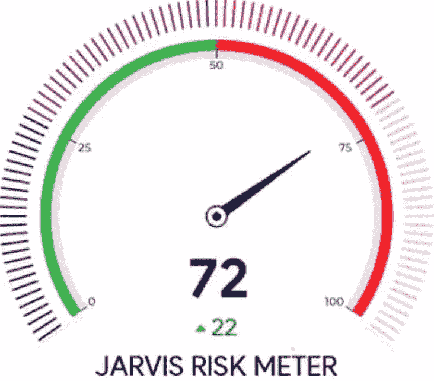
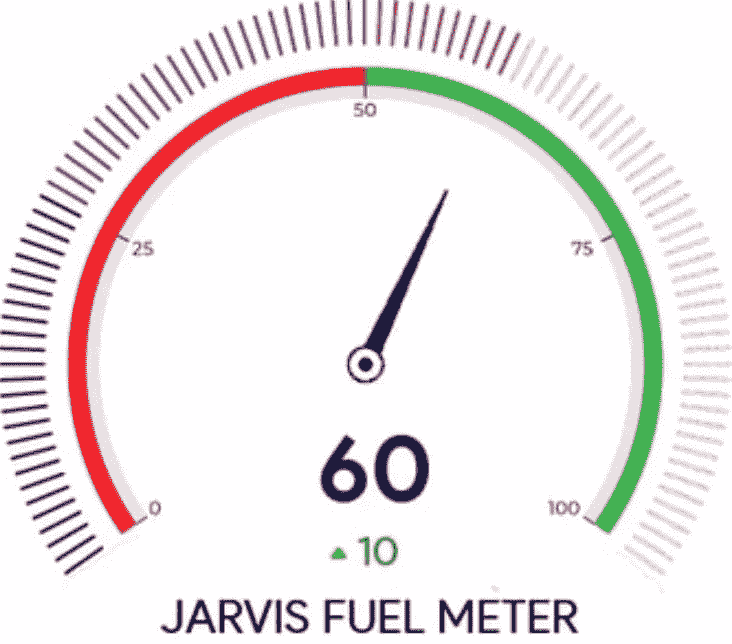
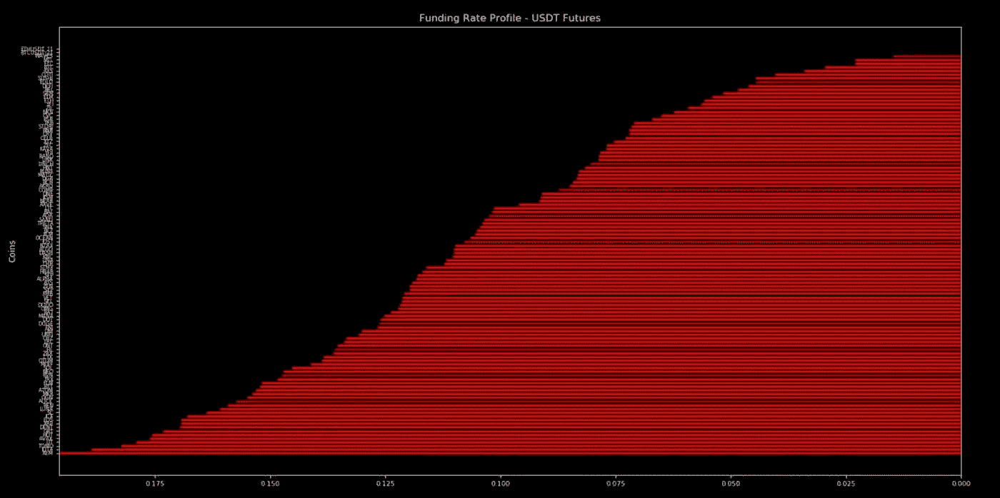
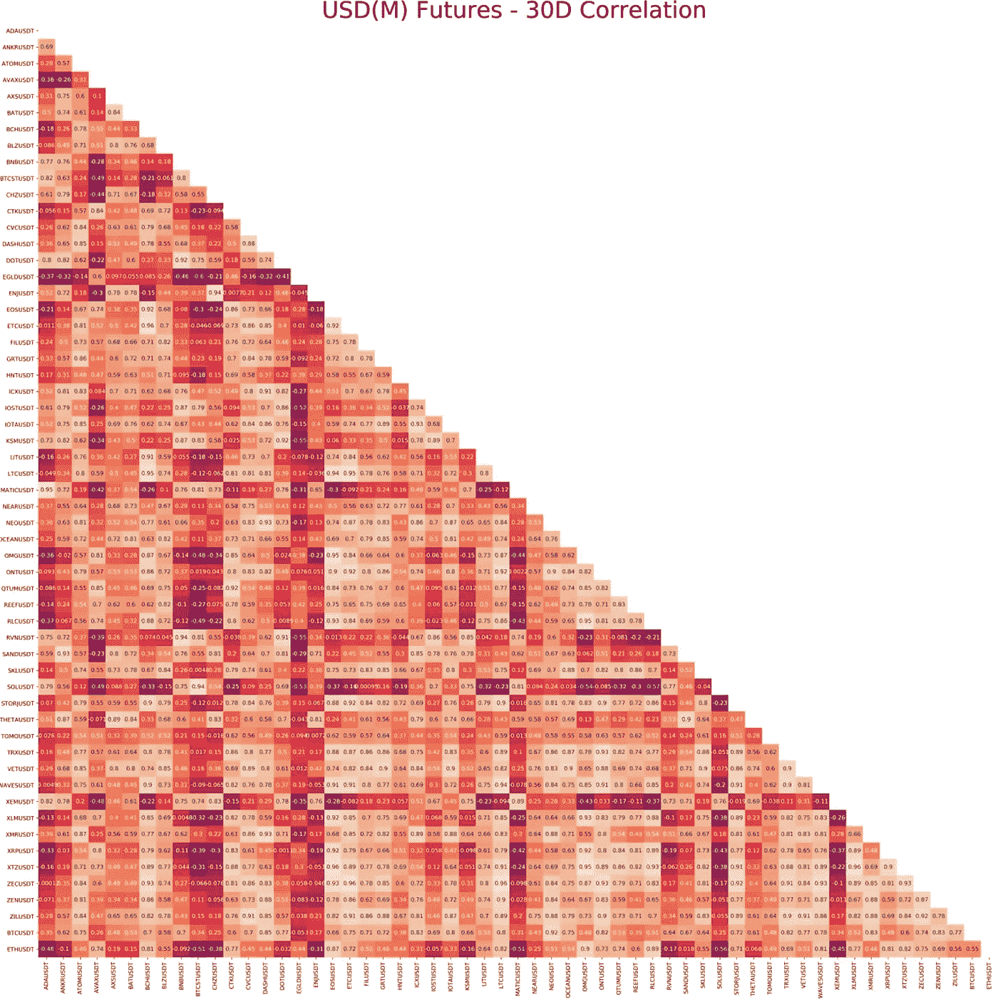
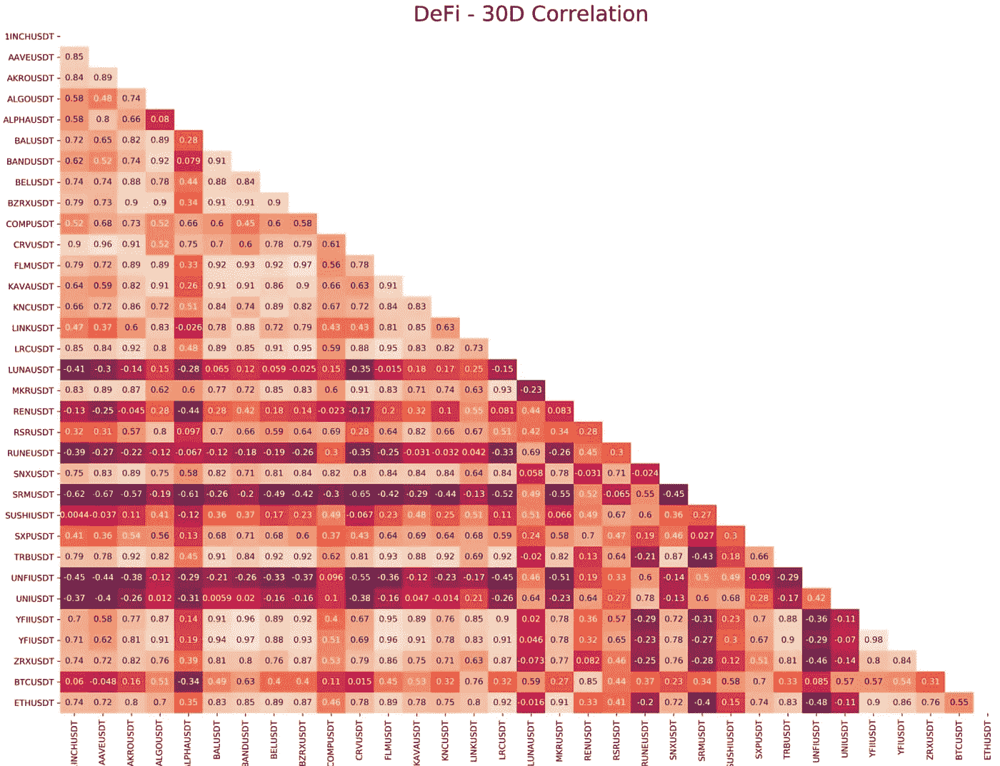
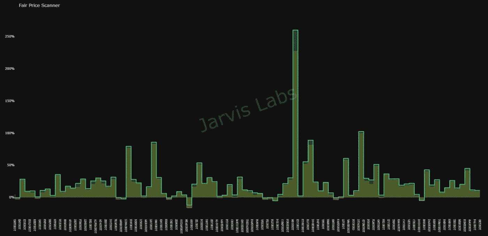
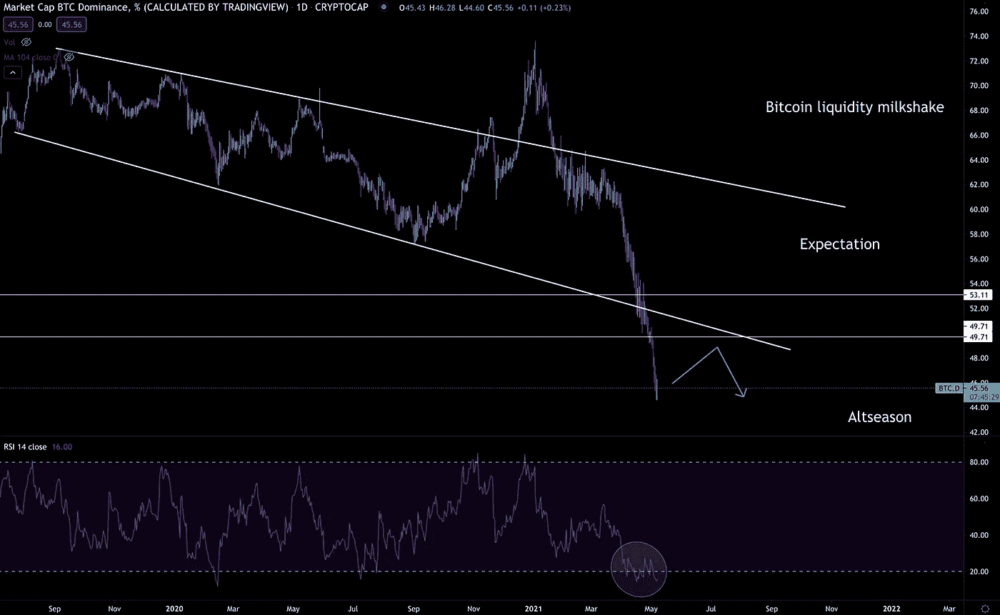
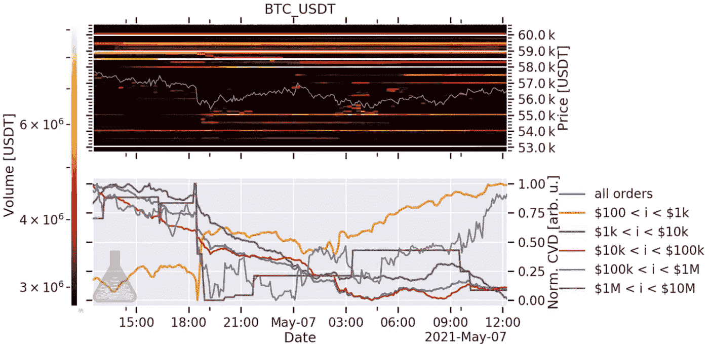
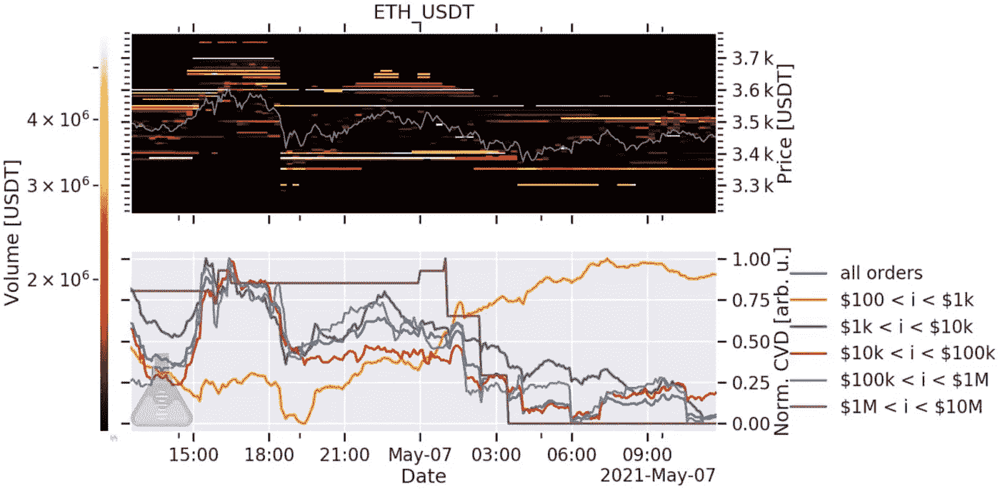

# 获得动力——BTC

> 原文：<https://medium.com/coinmonks/gaining-momentum-btc-47cae647ec6a?source=collection_archive---------2----------------------->

暴风雨过去了。过去两天海水汹涌……

你花了一上午检查你的帆的状态。

可操作。

你找到了自己的方向……在地平线上，你只能看到深蓝色的海水与苍白的天空相接。

没有地标。

你看了一眼你的指南针…

迎风也行。

你升起船帆，在舵轮前就位。

抬头看一眼曾经光秃秃的白色画布，你会发现风缺乏一致性。没有稳定的微风会让你受到洋流的影响，因为船会微妙地左右摇摆。

对抗自然毫无意义。

经过一夜的折腾，你来到船头休息，希望风能从初升的太阳那里获得动力…

因为没有动力，你哪里也去不了。

正如我今天将要解释的，缺乏动力是解释比特币和贾维斯实验室的最好方式。

让我们先来看看后者…

谢谢…正如你们许多人所知，我们上个月捉襟见肘。我们非常感谢读者和客户在这段时间里给予我们的支持。这真的意义重大。我们热爱这个社区。

事实上，我写了几页关于这一切意味着什么，但是我决定没人想看催人泪下的东西。至少我是这么告诉你的…毕竟，这让我看起来更坚忍，对吗？

因此，我不会喋喋不休地谈论这个更新，我会偶然发现我认为人们想听的两件事…

首先，本杰明做得更好。他和他的家人在过去的五周里一直在与冠状病毒做斗争，我们非常感谢每个人都做得更好。我们希望在接下来的一周里，本杰明能够完全康复，并且能够戒掉他正在服用的药物。

第二，在五天没有出版 Espresso 之后，我们又回来了。是时候获得动力了。没有比现在更好的开始了…

这就是我们正在做的。没有长篇大论，只是一个高效的周末前的市场更新。

现在是获得我们失去的势头的最佳时机。

至于比特币……

# 市场更新

有人看涨，有人看跌。土豆，再见。

根据你所处的位置，你可以为两者都建立一个案例。所以，让我们今天就这样做吧…并以我们需要关注的每一个案例结尾。

但首先，让我们看看一些 ChainPulse 指标，看看市场结构，因为我们将在下面的熊市和牛市案例中依靠它。

*连锁脉冲*

我们的风险指数开始攀升，昨天为 55。今天坐在 72。指标越高，市场就越容易快速抛售。

我们的燃油表读数是 60。这与昨天没有变化。

燃料价格越高，市场上的流动性就越多，推动我们上涨。这也是在任何特定时刻市场健康程度的标志。读数越低，升高所需的燃料越少，降低所需的燃料也越少。

这些数据意味着我们可以开始考虑在适当的时候减少一些风险。

至于融资利率，还没有太多需要担心的。

融资利率越高，交易者为保持头寸支付的费用就越多。如果柱线是红色的，这意味着多头在支付空头。绿色则相反。

按年率计算，0.1 的读数接近 110%。这是目前市场上的热门商品。

在这个市场中，某些情况下读数超过 0.4 并不罕见。

就目前的资本流动而言…

我们正目睹资本比以往任何时候都更多地通过硬币进行周转。当比特币长期横向波动时，往往会出现这种情况。这种旋转的结果是硬币之间的相关性非常低。

这是好事。这意味着市场是健康的，因为它并不一致。我们欢迎多样性。不幸的是，对于加密技术来说，这往往会以某种方式引领比特币的大趋势。

这是 DeFi…

如你所见，很好的解读。有很多机会分散你的头寸。UNI 的 v3 发行疲软，这意味着你可以在做空 UNI 的同时渴望 1INCH，因为它有-0.37。

如果你喜欢的话，这是一个不错的 DEX 部门对冲策略。

最后，这是我们上个月一直在做的一个新模型。这是我们的“公平价值”指标。我们稍后会解释更多。但现在，只要知道硬币越接近 0，它就越有价值。

它的读数越高，就越贵。如果你想找一个还没打气的硬币，这是你的手册。

好了，继续讨论这两种情况…

*熊案*

BTC。在较低的时间框架上(1 小时和 4 小时图),有一个主要的看涨形态。这也将会出现在日报上。

我们开始在几周前的 CoinTelegraph 采访中提到的 alt 中出现泡沫。这是更新后的图表，显示了相对强弱指标即将形成的分化。

如果我们得到一个逆转，我们可以预计比特币将吸收大量进入替代硬币的新资本。

我暗暗希望这一点，因为它将设置市场的最后一腿更高。

CVD 是我们喜欢从材料指标来看的一个指标。它让我们知道，散户或巨鲸是通过市场买入推高市场，还是通过市场卖出拉低市场。它告诉我们谁在买卖。

现在鲸鱼是中立的。他们没有向任何方向推动市场，这意味着价格在任何方向都没有动力。

比特币

以太币

这还不足以让我们决定是涨还是跌。因此，由于我们处于高位，而且似乎没有人会站出来，我倾向于认为这有点看跌。尤其是当我们将 CVD 与我们在链上看到的内容配对时…

就在矿价下跌之前，巴勃罗前几天刚刚将 2k BTC 送到交易所。

当比特币进入交易所时，我们不一定知道它们是否马上被出售。有时价格需要一天左右的时间才会有所变动。像这样的流量更多的是关于后面时间段的相关性。

直觉告诉我们他还没卖。

你应该思考这些类型的警告的方式类似于你如何追踪一个罪犯。如果罪犯倾向于以某种方式犯罪，这是一个指标。

对于交易，我们可以把它想象成一个交易者总是倾向于在给定的条件下卖出，然后根据他们的“成交”率，你可以选择跟随他们…或者忽略他。

巴勃罗是下一个目标。他的“MO”正在销售到一个软市场。

当我们将这一点与过去两周比特币的连锁获利回吐联系起来时，我们可以描绘出一个非常强劲的下跌熊市。

这不是一种“顶部进入”类型的熊市，而是更像是一种下跌，替代币下跌 30%至 50%，而比特币下跌 10%至 15%。

然后比特币领涨市场后不久。

BTC。d、CVD 流和链上流暗示了即将到来的抛售。如果发生这种情况，替代硬币将经历更大的损失。

但随之而来的必将是非常强劲的价格上涨。大多数大反弹往往始于怀疑。

在我们重整旗鼓之前打破备用硬币的膝盖是一个产生怀疑的好方法。

*牛案*

灰度解锁已经开始。

事实上，我们刚刚看到 12k 块 BTC 离开比特币基地。这通常与灰度流相关。然而，由于灰度不接受比特币和以太坊产品的新投资者，我们需要假设它是一种不同类型的机构——除非灰度在未来一两周内开放。

全线环比指标看起来都不错。但这并不意味着价格会因此而上涨。这更像是我们衡量价格是否有上涨空间的一种方式。

现在他们发出的信号是，还有上涨的空间。

市场上也有很大的流动性。随着资本在替代货币中循环流动，我们看到越来越多的资本创造正在发生。

*看什么*

显而易见的是，市场目前缺乏确定性。

希望我们用上面描述的两个场景解释了这个观点。在决定是牛市还是熊市更有分量之前，我们确实在关注两件事…

首先是更多的链上活动，如我们刚刚目睹的 12k BTC 的比特币基地流出。这是一个利好消息，因为它减轻了交易所的抛售压力。

其次是持续获利回吐。贾维斯·艾因此一直相当谨慎。坦率地说，我们倾向于在未来一两个星期有点看跌…你可能在读了上面的两个案例后猜到了。

我们希望看到获利回吐在未来几周内消退。否则，看跌的理由会更有分量。在这些获利者耗尽之前，我们不会实现更高的高点。

所以我们现在的立场是市场看起来不错。巴勃罗制造了一点悬置……如果你需要做些什么，考虑削减利润并谨慎行事，因为并非一切都像看起来那样清晰。

暂时就这样了。

我知道我说过会很快，但我想我们有很多要讨论的。在接下来的一周里，随着我们在思考过程中再次获得动力，预计我们将对市场形成更强的看法。

我们希望在 Espresso 建立这样的观点。所以，请关注、分享，并请在下面留下你所看到的评论。

这是一次谈话。我们向你们学习，就像你们向我们学习一样。我们看不到一切，但作为一个群体，我们获得了更大的优势。

很高兴回来。

爱你们，

本·莉莉

> 加入 [Coinmonks Telegram group](https://t.me/joinchat/uiLERCQL1fQ5ZjA1) 并了解加密交易和投资

## 另外，阅读

*   [什么是保证金交易](https://blog.coincodecap.com/margin-trading) | [美元成本平均法](https://blog.coincodecap.com/dca)
*   最好的[密码交易机器人](/coinmonks/crypto-trading-bot-c2ffce8acb2a) | [网格交易机器人](https://blog.coincodecap.com/grid-trading)
*   [3 商业评论](/coinmonks/3commas-review-an-excellent-crypto-trading-bot-2020-1313a58bec92) | [Pionex 评论](/coinmonks/pionex-review-exchange-with-crypto-trading-bot-1e459d0191ea) | [Coinrule 评论](/coinmonks/coinrule-review-2021-a-beginner-friendly-crypto-trading-bot-daf0504848ba)
*   [比特币基地评论](/coinmonks/coinbase-review-6ef4e0f56064) | [德里比特评论](/coinmonks/deribit-review-options-fees-apis-and-testnet-2ca16c4bbdb2) | [FTX 交易所评论](/coinmonks/ftx-crypto-exchange-review-53664ac1198f)
*   [n ave 零点回顾](/coinmonks/ngrave-zero-review-c465cf8307fc) | [Phemex 回顾](/coinmonks/phemex-review-4cfba0b49e28) | [PrimeXBT 回顾](/coinmonks/primexbt-review-88e0815be858)
*   [Bybit Exchange 审查](/coinmonks/bybit-exchange-review-dbd570019b71) | [Bityard 审查](/coinmonks/bityard-review-7d104239be35) | [CoinSpot 审查](https://blog.coincodecap.com/coinspot-review)
*   [3 commas vs crypto hopper](/coinmonks/3commas-vs-pionex-vs-cryptohopper-best-crypto-bot-6a98d2baa203)|[赚取加密利息](/coinmonks/earn-crypto-interest-b10b810fdda3)
*   最好的比特币[硬件钱包](/coinmonks/the-best-cryptocurrency-hardware-wallets-of-2020-e28b1c124069?source=friends_link&sk=324dd9ff8556ab578d71e7ad7658ad7c) | [BitBox02 回顾](/coinmonks/bitbox02-review-your-swiss-bitcoin-hardware-wallet-c36c88fff29)
*   [莱杰 vs Ngrave](/coinmonks/ledger-vs-ngrave-zero-7e40f0c1d694) | [莱杰 nano s vs x](/coinmonks/ledger-nano-s-vs-x-battery-hardware-price-storage-59a6663fe3b0) | [币安评论](/coinmonks/binance-review-ee10d3bf3b6e)
*   [加密复制交易平台](/coinmonks/top-10-crypto-copy-trading-platforms-for-beginners-d0c37c7d698c) | [Coinmama 审核](/coinmonks/coinmama-review-ace5641bde6e)
*   [CoinLoan 审查](/coinmonks/coinloan-review-18128b9badc4) | [YouHodler 审查](/coinmonks/youhodler-4-easy-ways-to-make-money-98969b9689f2) | [BlockFi 审查](/coinmonks/blockfi-review-53096053c097)
*   最好的[加密税务软件](/coinmonks/best-crypto-tax-tool-for-my-money-72d4b430816b) | [硬币追踪评论](/coinmonks/cointracking-review-a-reliable-cryptocurrency-tax-software-5114e3eb5737)
*   最佳[加密借贷平台](/coinmonks/top-5-crypto-lending-platforms-in-2020-that-you-need-to-know-a1b675cec3fa) | [杠杆代币](/coinmonks/leveraged-token-3f5257808b22)
*   [BlockFi vs 摄氏度](/coinmonks/blockfi-vs-celsius-vs-hodlnaut-8a1cc8c26630) | [Hodlnaut 审核](/coinmonks/hodlnaut-review-best-way-to-hodl-is-to-earn-interest-on-your-bitcoin-6658a8c19edf) | [KuCoin 审核](https://blog.coincodecap.com/kucoin-review)
*   [Bitsgap 审查](/coinmonks/bitsgap-review-a-crypto-trading-bot-that-makes-easy-money-a5d88a336df2) | [Quadency 审查](/coinmonks/quadency-review-a-crypto-trading-automation-platform-3068eaa374e1) | [Bitbns 审查](/coinmonks/bitbns-review-38256a07e161)
*   [埃利帕尔泰坦评论](/coinmonks/ellipal-titan-review-85e9071dd029) | [塞克斯斯通评论](/coinmonks/secux-stone-hardware-wallet-review-15-discount-coupon-2020-7577032faa6e)
*   [本地比特币审核](/coinmonks/localbitcoins-review-6cc001c6ed56) | [加密货币储蓄账户](https://blog.coincodecap.com/cryptocurrency-savings-accounts)
*   最佳[区块链分析](https://bitquery.io/blog/best-blockchain-analysis-tools-and-software)工具| [赚比特币](/coinmonks/earn-bitcoin-6e8bd3c592d9)
*   [加密套利](/coinmonks/crypto-arbitrage-guide-how-to-make-money-as-a-beginner-62bfe5c868f6)指南| [如何做空比特币](/coinmonks/how-to-short-bitcoin-568a2d0b4ae5)
*   最佳[加密制图工具](/coinmonks/what-are-the-best-charting-platforms-for-cryptocurrency-trading-85aade584d80) | [最佳加密交易所](/coinmonks/crypto-exchange-dd2f9d6f3769)
*   [如何在印度购买比特币？](/coinmonks/buy-bitcoin-in-india-feb50ddfef94) | [瓦济克斯审查](/coinmonks/wazirx-review-5c811b074f5b)
*   [印度比特币交易所](/coinmonks/bitcoin-exchange-in-india-7f1fe79715c9) | [比特币储蓄账户](/coinmonks/bitcoin-savings-account-e65b13f92451)
*   [CoinDCX 评论](/coinmonks/coindcx-review-8444db3621a2) | [加密保证金交易交易所](https://blog.coincodecap.com/crypto-margin-trading-exchanges)