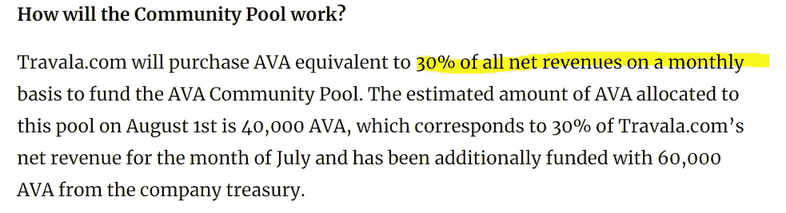
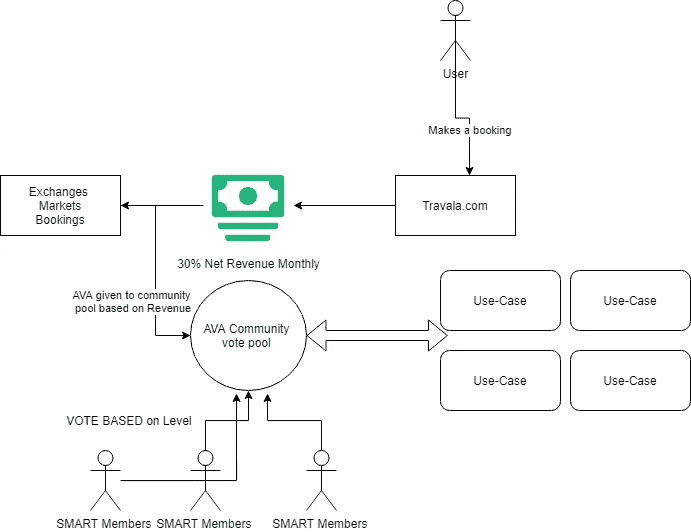
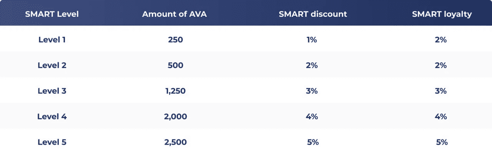
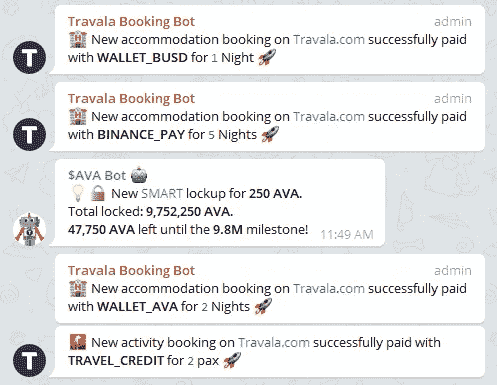
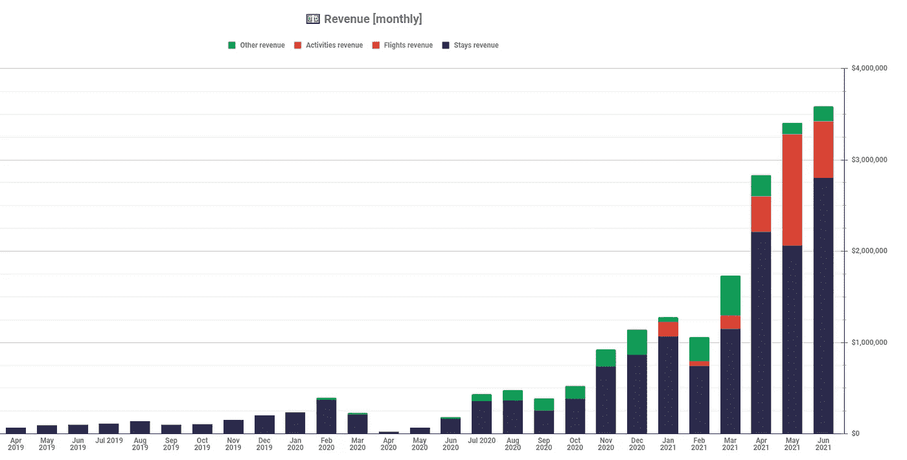

# AVA 引入了改变游戏规则的治理和基于收入的社区池！

> 原文：<https://medium.com/coinmonks/game-changer-for-ava-that-could-set-the-next-run-in-motion-governance-pools-revenue-buys-f2aa146a5aa4?source=collection_archive---------1----------------------->

所表达的观点和看法仅代表我个人。始终对包括当地法规在内的所有主题进行自己的研究。不是财务建议。声明:我持有本文中提到的一些令牌。

# **快速详情:**

Travala.com 在 AVA 引入了基于月收入的社区投票池。每个月将购买/转换(从市场/预订)AVA 来为该池提供资金。进一步增加需求。

[https://blog.travala.com/travala-com-governance/](https://blog.travala.com/travala-com-governance/)

**关于机构群体池的一些提案包括:**

*   创建 ERC-20 版本的 AVA，使我们能够扩大 AVA 的使用案例，接触新的用户群，并增加 AVA 令牌持有者的数量
*   在不同的 dex 上创建流动性池，如 Uniswap、煎饼掉期、寿司掉期和平衡器
*   加入 DeFi 和 CeFi 合作伙伴关系
*   Travala 智能卡，可使用全球机场候机室
*   AVA 农场的非功能性食物，等等

# 以下几点说明了我为何如此看好这一举措:

## 社区游泳池:

我们不知道我们需要的改变。

下面是我个人对流程的解读。简而言之，净预订收入的 30%转化为 AVA，我们作为聪明的会员可以投票决定它的用途。

目前的 APY/燃烧方法将很快改变这种感觉，有点像“浪费钱”，不会真正去任何地方，所以这真的会让事情进入正轨。

有了新的方法，每一次预订都将转化为一部分资金，我们作为一个社区将对我们的支出有直接的发言权，并能真正推动一些需求和令牌的使用案例。

这不仅为我们提供了增强的用例，还分散了治理。

我们将从净收入转换和我们选择的使用案例中获得对 AVA 令牌的额外需求。

对我个人来说，我希望看到 Uniswap 上的 ERC20 (AVA)和 Pancake swap 上的 BEP20 (AVA)。我认为仅仅这两项就能让 AVA 更上一层楼。

我从不猜测交易所，但你可以快速谷歌一下 T1 交易所如何支持 BEP2 vs ERC20 (ETH)。很多大的像北海巨妖，比特币基地等..不支持 BEP2，而只支持 ERC20，因此仅此一项就打开了这么多的大门。

## 聪明的 APY:

首先，房间里的大象；SMART 成员的 APY 已被删除。对大多数人来说，这没什么大不了的，因为一个月只有 0.6%(APY 是 8%)。我的意思是，如果你进入加密领域，那么这是一个相当低的 APY，任何简单地追逐 APY 回报的人都会看看其他 1000 倍的 Defi 池中的任何一个(AVA 可能很快就会有一个)。
此外许多人拥有 2500 多辆 AVA，因此从未真正为此烦恼过。

目前，大约有 900 万 AVA 锁定在 SMART 上，0.6%的用户每月获得大约 54，000 AVA。
在那里，用户有几个选择:

*   卖掉它(对市场造成压力，对网站没有真正的好处)
*   拿着它或者用它。

在过去的几个月里，我们已经看到了令牌的价格逐渐“出血”,根据社区聊天和回应，看起来像是大量的持有者只是持有 APY 来快速赚钱。

因此，现在资金将直接用于购买 AVA，并将其放入新用例的社区池中，而不是面向 1000 名用户的小 APY。

当然，奖金始终只是“奖金”。SMART 计划的真正核心是折扣和回馈:

[https://blog.travala.com/save-up-to-13-with-travala-coms-smart-program/](https://blog.travala.com/save-up-to-13-with-travala-coms-smart-program/)

对于聪明的会员来说，很可能会有很多很酷的功能，包括 NFTS 和标准投票+折扣和回馈之外的其他奖励。另一个提议的社区功能是“**智能会员旅行贵宾卡**”。

对于经常持有 AVA 以获得折扣的人来说，很快就能收回成本。

## 假设性问题:

*   你是愿意看到你的 2500 以 2 美元的价格上涨 0.6%，还是愿意把你那个月的 16 AVA 放在 PancakeSwap 的上市和流动性池中，让你的 2500 整体的象征性价格上涨？

对我个人来说，我无法对 2500 年的一个小 APY 感到恼火。为我的全部股份*(超过 2500 股)提供交易所、Defi、列表和爆炸性用例。Pancake 目前在许多泳池上看到接近 50%的年利率。(给我 2500 AVA，每天 10 美元，利率 0.6%，每天 2 美元)

## 烧伤:

季度烧伤只是不够快，迄今为止收效甚微。一个 3 个月的周期真的不能让社区兴奋起来，事实上甚至需要几年才能产生效果。
以最近一次燃烧为例，那是迄今为止最大的一次，用了 3 个月的时间烧掉了 10 万 AVA。这只是供应量的 0.1%。

通过比较一些大型流动性池，我们可以看到 10%以上的供应在推出后几个小时内轻松锁定。很明显，这纯粹是基于我的猜测，我对此持保留态度，但对我来说，如果在流通供应减少后，像流动性池和锁定这样的事情会更快地分发令牌。

从法律合规的角度来看，至少在美国，烧伤是一个“灰色区域”,并不是说这是或不是一个问题，但它肯定是要考虑的事情。

# 总结:

*   八月份将开始 100，000+AVA。按照目前的价格，第一个机械师的报酬是 20 万美元。
*   可能通过其他链桥扩大到巨大的风险敞口。ERC20 + UNISWAP？
*   资金用于公用事业的发展，而不是被“浪费”在小小的 APY。
*   完全“绿色”合规。
*   走向权力下放，并给予 AVA 持有者权力和选择。
*   潜在的大规模锁定 APY 池，Defi 等
*   社区情绪+参与度的巨大提升。

这可能是连接收入和用例扩展的拼图中**缺失的一块。现在，预订收入将与使用案例和效用的扩展直接挂钩，并再次让它变得“性感”。**

在我看来，这也将是一种催化剂，为预订和投票带来许多兴奋。我们通过预订机器人看到的每一个预订，我们现在都可以直接连接到新用例的资金，我们可以对其进行投票。

每笔预订净收入的 30%将贡献给资金池！

毫无疑问，有些人会对这一举措感到不高兴，但很明显，这是一个对所有相关人员都有利的举措，并使每个 AVA 持有者受益，即使他们没有将 AVA 锁定在 SMART 计划中，因为他们将看到一整套用例的出现，更多的收入=更多的用例。

另一个好消息是，如果 AVA 估值上升，那么社区资产池的价值也会大幅上升。

在 2 美元的情况下，当前池有 20 万美元的价值，如果 AVA 是 15 美元，那将有 300 万美元进入社区池，所以这就像一个雪球效应。

更多的收入=更多的 AVA。
更多的 AVA 池=更多的用例
更多的用例=需求(？)
需求+用例+增加池价值…

它发展得越多，社区得到的资金就越多，作为回报，它可以进一步发展。准备爆炸的连锁反应(？).

# 交还:

同样重要的是要指出，非聪明会员的 2%回馈没有任何变化。

每一个在网站上预订的用户，无论使用信用卡等支付方式，都可以获得预订价值 2%的 AVA 代币返还。

因此，有人预订了 100 美元的房间，在 AVA 从市场上获得了 2 美元的回报。再次拉动效用+需求。

# 不仅仅是一份白皮书:

对于那些不熟悉[Travala.com](https://www.travala.com/?ref=hoteldiscount)或$AVA 的人来说，应该注意的是，预订平台是实时的，其收入趋势非常明显。

下面是来自[https://tiny.cc/TravalaGrowth](https://tiny.cc/TravalaGrowth)的月度收入图表

上个季度从真正的付费客户那里获得了将近 10，000，000 美元的收入。

所以我们都可以“忽略噪音/Fud”。当你有数据的时候，真实的收入和真实的需求，观点是不相关的。

**完整官方文章在此+来源:** -[https://blog.travala.com/travala-com-governance/](https://blog.travala.com/travala-com-governance/)

** *提醒一下。这篇文章是我个人对这篇博文的解读和思考。我不是团队的正式成员，但确实持有 AVA。***自作主张，不建议****

*图片+来源；*

*[https://coinmarketcap.com/](https://coinmarketcap.com/)*

*[https://www . pexels . com/photo/person-holding-a-vote-sign-4669103/](https://www.pexels.com/photo/person-holding-a-vote-sign-4669103/)*

*[https://www . pexels . com/photo/orange-and-white-rocket-ship-hold-by-a-man-3697813/](https://www.pexels.com/photo/orange-and-white-rocket-ship-held-by-a-man-3697813/)*

> *加入 [Coinmonks 电报频道](https://t.me/coincodecap)，了解加密交易和投资*

## *另外，阅读*

*   *[尤霍德勒 vs 科恩洛 vs 霍德诺特](/coinmonks/youhodler-vs-coinloan-vs-hodlnaut-b1050acde55a) | [Cryptohopper vs 哈斯博特](https://blog.coincodecap.com/cryptohopper-vs-haasbot)*
*   *[我的密码交易经验](/coinmonks/my-experience-with-crypto-copy-trading-d6feb2ce3ac5) | [比特币基地评论](/coinmonks/coinbase-review-6ef4e0f56064)*
*   *[CoinFLEX 评论](https://blog.coincodecap.com/coinflex-review) | [AEX 交易所评论](https://blog.coincodecap.com/aex-exchange-review) | [UPbit 评论](https://blog.coincodecap.com/upbit-review)*
*   *[AscendEx 保证金交易](https://blog.coincodecap.com/ascendex-margin-trading) | [Bitfinex 赌注](https://blog.coincodecap.com/bitfinex-staking) | [bitFlyer 审核](https://blog.coincodecap.com/bitflyer-review)*
*   *[麻雀交易所评论](https://blog.coincodecap.com/sparrow-exchange-review) | [纳什交易所评论](https://blog.coincodecap.com/nash-exchange-review) | [菜鸟评论](https://blog.coincodecap.com/probit-review)*
*   *[加密货币储蓄账户](/coinmonks/cryptocurrency-savings-accounts-be3bc0feffbf) | [赌注加密](https://blog.coincodecap.com/staking-crypto) | [StealthEX 评论](/coinmonks/stealthex-review-396c67309988)*
*   *[BigONE 交易所评论](/coinmonks/bigone-exchange-review-64705d85a1d4) | [CEX。IO 审查](https://blog.coincodecap.com/cex-io-review) | [交换区审查](/coinmonks/swapzone-review-crypto-exchange-data-aggregator-e0ad78e55ed7)*
*   *[最佳比特币保证金交易](/coinmonks/bitcoin-margin-trading-exchange-bcbfcbf7b8e3) | [Bityard 保证金交易](https://blog.coincodecap.com/bityard-margin-trading) | [Prokey 点评](/coinmonks/prokey-review-26611173c13c)*
*   *[加密保证金交易交易所](/coinmonks/crypto-margin-trading-exchanges-428b1f7ad108) | [赚取比特币](/coinmonks/earn-bitcoin-6e8bd3c592d9) | [Mudrex 投资](https://blog.coincodecap.com/mudrex-invest-review-the-best-way-to-invest-in-crypto)*
*   *[WazirX vs CoinDCX vs bit bns](/coinmonks/wazirx-vs-coindcx-vs-bitbns-149f4f19a2f1)|[block fi vs coin loan vs Nexo](/coinmonks/blockfi-vs-coinloan-vs-nexo-cb624635230d)*
*   *[BlockFi 信用卡](https://blog.coincodecap.com/blockfi-credit-card) | [如何在币安购买比特币](https://blog.coincodecap.com/buy-bitcoin-binance)*
*   *[火币交易机器人](https://blog.coincodecap.com/huobi-trading-bot) | [如何购买 ADA](https://blog.coincodecap.com/buy-ada-cardano) | [Geco？一次审查](https://blog.coincodecap.com/geco-one-review)*
*   *[加密副本交易平台](/coinmonks/top-10-crypto-copy-trading-platforms-for-beginners-d0c37c7d698c) | [五大 BlockFi 替代方案](https://blog.coincodecap.com/blockfi-alternatives)*
*   *[CoinLoan 点评](https://blog.coincodecap.com/coinloan-review)|【Crypto.com】点评 | [火币保证金交易](/coinmonks/huobi-margin-trading-b3b06cdc1519)*
*   *[顶级付费加密货币和区块链课程](https://blog.coincodecap.com/blockchain-courses) | [币安评论](/coinmonks/binance-review-ee10d3bf3b6e)*
*   *[在美国如何使用 BitMEX？](https://blog.coincodecap.com/use-bitmex-in-usa) | [BitMEX 审查](https://blog.coincodecap.com/bitmex-review)*
*   *[最佳免费加密信号](https://blog.coincodecap.com/free-crypto-signals) | [YoBit 评论](/coinmonks/yobit-review-175464162c62) | [Bitbns 评论](/coinmonks/bitbns-review-38256a07e161)*
*   *[OKEx 评论](/coinmonks/okex-review-6b369304110f) | [Kucoin 交易机器人](/coinmonks/kucoin-trading-bot-automate-your-trades-8cf0ca2138e0) | [期货交易机器人](/coinmonks/futures-trading-bots-5a282ccee3f5)*
*   *[AscendEx Staking](https://blog.coincodecap.com/ascendex-staking)|[Bot Ocean Review](https://blog.coincodecap.com/bot-ocean-review)|[最佳比特币钱包](https://blog.coincodecap.com/bitcoin-wallets-india)*
*   *[霍比审核](https://blog.coincodecap.com/huobi-review) | [OKEx 保证金交易](https://blog.coincodecap.com/okex-margin-trading) | [期货交易](https://blog.coincodecap.com/futures-trading)*
*   *[比特币基地赌注](https://blog.coincodecap.com/coinbase-staking) | [Hotbit 评论](/coinmonks/hotbit-review-cd5bec41dafb) | [KuCoin 评论](https://blog.coincodecap.com/kucoin-review)*
*   *[如何购买 Ripple (XRP)](https://blog.coincodecap.com/buy-ripple-india) | [非洲最好的加密交易所](https://blog.coincodecap.com/crypto-exchange-africa)*
*   *[非洲最佳密码交易所](https://blog.coincodecap.com/crypto-exchange-africa) | [胡交易所评论](https://blog.coincodecap.com/hoo-exchange-review)*
*   *[eToro vs robin hood](https://blog.coincodecap.com/etoro-robinhood)|[MoonXBT vs Bybit vs Bityard](https://blog.coincodecap.com/bybit-bityard-moonxbt)*
*   *[Stormgain 回顾](https://blog.coincodecap.com/stormgain-review) | [Bexplus 回顾](https://blog.coincodecap.com/bexplus-review) | [币安 vs Bittrex](https://blog.coincodecap.com/binance-vs-bittrex)*