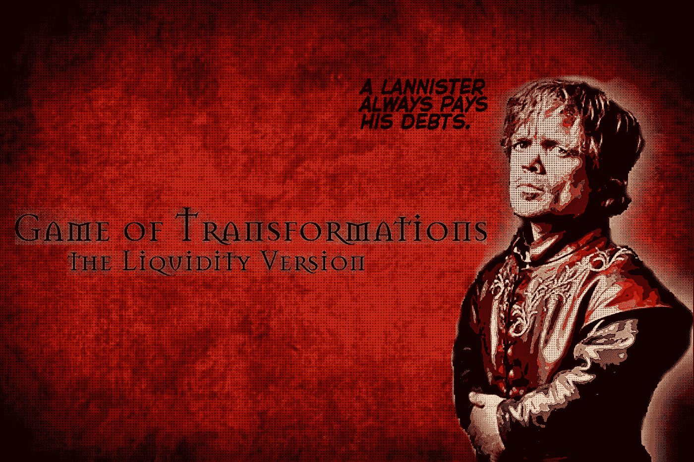
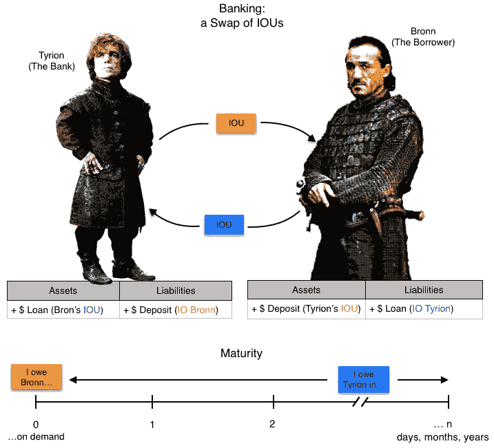
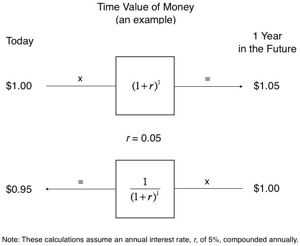
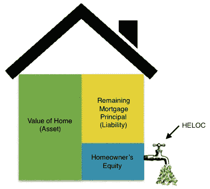
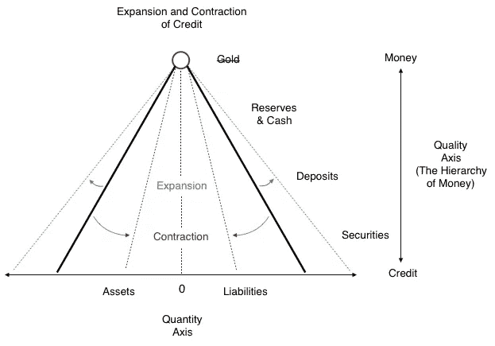

# 转型游戏:流动性版本

> 原文：<https://medium.com/coinmonks/game-of-transformations-the-liquidity-version-b6960e43c950?source=collection_archive---------4----------------------->

一个经济体的非流动性实物资产——工厂、资本设备、房屋和办公室——可以突然转化为货币或流动性，这种假象是当前体系炼金术的精髓

–英国央行前行长默文金( [2016](https://books.google.ca/books?id=b_V1CQAAQBAJ&printsec=frontcover&dq=mervyn+king&hl=en&sa=X&ved=0ahUKEwi1zd6_nrraAhUkw1kKHUdWDQwQ6AEIJzAA#v=snippet&q=The%20pretence%20that%20the%20illiquid%20real%20assets%20of%20an%20economy&f=false) )

D 货币有基本的分子物质或结构吗？虽然有些人可能会争辩说，它是从无到有创造出来的，但这种断言并不能帮助我们理解货币是在什么条件、什么星座或什么过程下形成的。在这一点上，我们可以说的是，银行似乎已经成功地实现了这部 [*巨著*](https://books.google.ca/books?id=2rD9r0kFY20C&pg=PA80&lpg=PA80&dq=alchemy+magnum+opus&source=bl&ots=_rHe6fl8PS&sig=h5p4LQlTn9hXgW9dqnsEkjt3lJA&hl=en&sa=X&ved=0ahUKEwi8lf-erb_aAhXrhOAKHceICFY4ChDoAQhJMAQ#v=onepage&q=alchemy%20magnum%20opus&f=false) ，这是一种货币产生并开始流动的转变。

但这项转型工作不是白做的。它包含银行要求回报的风险。哪里有奖励，哪里就有竞争者，只有那些遵守规则的人才能继续游戏。这是转变的游戏。

**玩家:**银行

**目标(即奖励):**利润

让我们从贷款的基础开始，贷款是银行利润的主要来源之一…

提利昂·兰尼斯特的这一简单解释是一个良好的开端。但是，为了确保我们不会出师不利，我们应该记住，银行贷款的特定方式通常与个人之间的贷款方式有很大不同(这一点我已经在这里讨论过了)。后一种情况通常涉及贷款人向借款人提供现金以换取借款人的借据(口头或书面)；从本质上说，现金换借据，或者从借款人的角度来看，借据换现金。相比之下，在银行借贷中没有现金交易——这只是一种白条的 T2 互换。

银行把自己的短期负债(即存款)换成更长期的资产(即贷款)，但那些资产是别人的负债；因此，借条互换。这种互换隐含着一种转变:我们可以称之为*到期转变*，这里的“到期”一词只是一种花哨的说法，“约定的一段时间”，在这段时间结束时，贷款必须偿还。通过进行这种互换，银行获得了借款人对未来支付能力的承诺，并通过某种金融炼金术将这种承诺转化为当前的购买力。

为了进行这种炼金术的转化，银行收取一定的费用，称为利率。简单的理解，利率就是现在和未来的一个汇率。用明天的货币来表示今天的货币价格，或者用今天的货币来表示明天的货币价格，两者都是用货币时间价值的概念来表示的。只要利率是正的，它就体现了人们对当前货币的偏好，而不是未来货币。

银行家们很清楚，并非所有人都是兰尼斯特家的人。借款人有可能违背诺言，不偿还债务，这意味着银行家把了解借款人的信誉作为他们业务的一部分。他们必须能够区分世界上的兰尼斯特家和世界上的波隆家。处于一个国家支付系统的中心，使得银行特别适合这项任务，能够以警惕的眼光观察谁在偿还债务，谁没有偿还债务。(当然，观察从来都不是完全客观的功能；它总是受条件限制的，在这种情况下，它受利润动机的限制。

基于这些观察，银行家根据借款人各自支付承诺的可信度对借款人进行排名，然后收取反映这些排名的溢价。对信誉度排名高的借款人收取较低的保费，对信誉度排名低的借款人收取较高的保费。

如果银行要限制其损失并最大化其利润，准确区分高信誉借款人和低信誉借款人是很重要的。他们必须在过高和过低的利率之间保持微妙的平衡。收取过高的利率，今天的资金需求将转向竞争对手或被完全扼杀。利率定得太低，预期回报将无法补偿银行所承担的风险。

低估这些风险，银行可能会以低价抢走竞争对手。但如果对风险的精算评估物有所值，那么让这种行为持续足够长时间，大数定律就会强有力地发挥作用，违约率将超过削弱竞争带来的任何额外好处。话说回来，除了低估信贷风险，我们还生活在一个充满极端不确定性的世界里，与这些不确定性共存的还有 T2 黑天鹅和其他野人。

A couple of wildlings navigating a world of radical uncertainty.

**玩游戏——流动性转型**

除了信用风险，银行还承担着与他们进行的另一种炼金术转化相关的风险。这种风险被称为流动性风险，因为它与流动性转换有关。要理解流动性转变，举几个例子会有所帮助。

**例如 1 —将非流动性有形资产转化为流动性货币**

让我们假设波隆有一套房子，但在做销售工作期间，他手头缺钱。他不想卖掉他的房子，此外，他现在需要现金，很可能无法及时卖掉他的房子来满足他的现金需求，除非他以 5 美元左右的价格卖掉它。波隆的问题在于，他有流动性需求，但却没有流动性资产。

银行可以通过运用炼金术将波隆家中凝结的价值转化为流动资金来解决这个问题。银行将房屋净值作为抵押品，发放波隆信贷，他可以根据需要利用这些信贷进行支付或兑换成现金。在现代的说法中，这种转换通常被称为房屋净值信用额度或 HELOC，允许房主“利用”他们房屋的净值。正如水是 H2O 的液化形式一样，货币代表了实物资产中积累的过去价值的液化形式。

在这种情况下，银行不太担心违约风险，因为如果波隆决定不偿还贷款，它总是对抵押品(即波隆的房子)有追索权。然而，通过这种转型，该行暴露了流动性风险。它增加了流动负债，同时增加了贷款资产，如果银行需要的话，这些资产可能不容易变现。(如果波隆拖欠债务，银行将很难清算这笔资产，如果波隆的房价下跌……嗯，有人说‘次贷危机’了吗？)

例如。2 —无形信贷转化为流动资金

现在，假设波隆不够幸运，既没有房子，也没有任何其他有形资产，他还有另一种方法可以获得银行的炼金术力量:他可以提供自己的非流动信贷，以换取银行的流动信贷。你看，银行已经解决了基本的炼金术问题，正如明斯基的[提出的](http://digamo.free.fr/minsky86.pdf):“每个人都可以创造货币；问题是让它被接受。”记住，银行业务只是借条的互换；然而，不同的是，银行的借条被当作钱，而你的和我的却不是。

为了换取一条面包，波隆可以在当地面包店拿出自己的借据。但是，即使面包师认识并信任波隆，接受他的付款承诺，她也可能无法将借条转给第三方。波隆的信用是个人的，由面包师对他的声誉的看法作担保，并以握手来盖章。它缺乏银行信贷所具有的一般可转让性，因而缺乏银行信贷所具有的*市场* *流动性*。

然而，如果波隆在他的银行的声誉，正如他的信用评分所证明的，是值得信赖的，那么波隆就有*资金* *流动性*。如果面包师更喜欢银行信贷的流动性，而不是波隆的个人借据，银行可以利用自己的声誉为波隆的声誉担保，延长他的贷款合同，这是法律规定的。波隆用银行的可转让信用支付，而不是他自己的欠条，满足了面包师对流动性的偏好。

Accounting for Bronn’s worthiness: “*Credit is the economic judgment on the morality of a man” (Marx,* [*1844*](https://www.marxists.org/archive/marx/works/1844/james-mill/)*).*

通过保持履行付款承诺的声誉，波隆提供了未来愿意付款的证据。结合未来*支付能力*的证据，波隆已经为自己建立了一项无形资产，他可以用它来支持自己获得一些未来价值的承诺，他可以抵押这笔资产，以获得银行将非流动个人借据转化为其流动信贷的炼金术力量。毫无疑问，这一承诺将要求波隆回到他的卖剑工作岗位上，以偿还他的债务，这份工作很可能会让他付出[字面](https://books.google.ca/books?id=RAcJAAAAQAAJ&pg=PA60&dq=pound+of+flesh+merchant+of+venice&hl=en&sa=X&ved=0ahUKEwiw9oSuvL3aAhXJx1kKHWJHAZIQ6AEIPzAE#v=onepage&q=pound%20of%20flesh%20merchant%20of%20venice&f=false)“一磅肉”的代价

在一个货币流通的主要形式是银行债务的社会中，也许波隆的口袋里并没有多少他的社会权力和与社会的联系，而是他的银行对他信用价值的看法。根据银行对他价值的评估，波隆获得了他的日常面包。我想银行家们终究真的在做上帝的工作。

**规则**

流动性转换是一项高风险的业务。通过提供自己的流动性借据来换取借款人的非流动性借据，银行增加了短期支付义务，但不一定能获得履行这些义务所必需的储备——现金和央行存款。

正如你所看到的，银行通过向借款人发放越来越多的信贷来扩大其资产负债表，银行的支付手段(即现金和储备)在任何特定时刻可能被要求兑现的总负债中所占的比例越来越小。因此，无法支付的风险增加了，如果银行无法支付，它就出局了。如果你不能支付，你就不能玩。

如果不是因为银行不仅在为新商业企业和经济发展融资方面，而且在支付系统的平稳运行方面发挥着具有系统重要性的作用，政府就不会如此担心银行参与的固有风险业务。但由于银行确实扮演着如此关键的角色，政府喜欢扮演裁判的角色，让参与者保持一致，同时尽可能保持游戏的连续性。

**a)让参与者保持一致(货币纪律)**

一些政府实施的一个简单规则是存款准备金率。例如，在美国，存款负债超过 1.223 亿美元的银行被[要求](https://www.federalreserve.gov/monetarypolicy/reservereq.htm)在 14 天[维持期](https://www.federalreserve.gov/monetarypolicy/reserve-maintenance-manual-maintenance-of-reserve-balance-requirements.htm)内维持 10%的准备金率。换句话说，银行必须持有相当于其存款 10%的现金和央行准备金。维持期允许银行在任何一天跌破 10%的水平，只要它们在两周内保持 10%的平均水平。

维持期所允许的灵活性给了银行额外的时间来处理支付行为中的任何异常波动，这种异常波动会导致任何给定日期的大量现金和储备流出(我已经在这里讨论过)。在这种情况下，银行的第一道防线是货币市场。储备不足的银行转向在这些市场借款，通常是隔夜借款，以满足储备要求。

如果我们从银行体系作为一个整体持有大量超额准备金的假设出发，那么为任何一家特定银行获取更多准备金应该相对不成问题。也就是说，如果整个银行业的准备金与存款负债的当前比率约为 15%，那么任何低于 10%准备金要求的银行都应该能够在货币市场获得必要的准备金。

然而，鉴于银行体系的绝对储备水平是固定的，如果银行继续放贷，导致信贷普遍扩张，那么相对于存款的储备水平将开始下降。随着该比率接近 10%的水平，系统中的超额准备金将越来越少，单个银行越来越难以吸引必要的准备金。

这种稀缺性将开始对货币市场利率施加上行压力，由寻求法定准备金的银行推高。随着这些利率的上升，银行的借贷成本也在上升，侵蚀着它们的利润。为了维持利润率，银行将不得不提高向借款人收取的利率。如前所述，银行收取的利率上升会抑制当今的货币需求。但是，这整个情景假设银行系统的总储备水平是固定的。实际上，他们通常不是。

**b)保持游戏的连续性(货币弹性)**

**i)公开市场操作**

现代央行已经发现，它们各自货币政策的目标通常最好通过瞄准利率水平而不是储备的绝对水平来实现。因此，给定银行间货币市场关键隔夜拆借利率的具体目标，央行将提供实现该目标所需的任何准备金。如果由于信贷普遍扩张，利率面临上行压力，那么央行将向银行系统注入准备金。

在联邦基金利率面临上行压力的情况下，美联储将通过公开市场操作( [OMO](https://www.federalreserve.gov/monetarypolicy/bst_openmarketops.htm) )进行干预，注入准备金。为了进行注入，美联储利用其无底洞的储备从一级交易商(即充当美联储交易对手和美国国债做市商的银行)购买政府国债(即政府债券)。

通过这种方式，美联储通过允许银行将一些流动性较差的资产转移到自己的资产负债表上以换取流动性储备来稳定利率——就像私人银行为客户进行流动性转换一样，美联储为银行进行流动性转换。银行将个人债务货币化，而央行将政府债务货币化。(我们是否越来越接近理解货币的基本分子物质和结构？或者至少是它的一个基本属性？)

准备金注入缓解了利率的上行压力。美联储还可以通过反向 OMO 交易出售证券来缓解下行压力，甚至提高利率。

Open Market Operations (and you thought government debt was only good for paving roads, building bridges, dams and fighter jets).

然而，要记住的重要一点是，如果美联储决定加息以试图减缓信贷扩张，加息并不是对银行放贷量的直接限制。它是间接的，主要通过需求渠道而不是供给渠道发挥作用。通过加息，美联储向银行施加压力，要求它们也提高利率，这可能会抑制贷款需求，而不是直接限制银行的供应。无论利率是多少，银行都会尽其所能提供贷款来满足需求，当然，要记住需求方的信誉。

因此，美联储扮演了一个宽松的角色，当信贷扩张时向银行系统注入储备，当信贷收缩时又将储备吸出，赋予货币系统弹性的特征。就像热胀冷缩的物质一样，信用处于不断变化的状态，根据特定的经济环境不断膨胀和收缩。事实上，正如佩里·梅尔林教授在他的*货币和银行* [讲座](http://www.perrymehrling.com/2-the-natural-hierarchy-of-money/)中解释的那样，这种信贷收缩和扩张每天都在发生，在商业周期中，伴随着国家的兴衰。

My rendition of a diagram I first came across in Perry Mehrling’s money and banking lectures.

**ii)最后贷款人**

在很大程度上，银行通过在货币市场借款、向其他市场参与者出售部分资产或通过美联储维持利率目标的宽松行动来满足其流动性需求。然而，如果个别银行发现自己暂时缺乏流动性，为了避免金融系统的普遍恐慌，美联储随时准备扮演许多现代央行扮演的角色——最后贷款人。

英国央行前副行长保罗·塔克(Paul Tucker)在这里对“白芝浩原则”做了最好的总结，“为了避免恐慌，央行应该尽早、自由地(即无限制地)贷款给有偿付能力的公司，以良好的抵押品和‘高利率’进行贷款。”

这一原则背后的逻辑是，央行应该只愿意贷款给遭遇暂时流动性危机的银行，以防止金融系统内出现普遍恐慌，但要避免贷款给资不抵债的银行，以对银行的贷款行为施加一些约束(我曾在这里写道流动性不足和资不抵债的区别)。

**平衡弹性和纪律性**

弹性和纪律是两个对立的极端，其中小心翼翼的[平衡](https://books.google.ca/books?id=iYJw5I_SSAUC&pg=PA9&dq=balance+between+elasticity+and+discipline+perry+mehrling+the+new+lombard+street&hl=en&sa=X&ved=0ahUKEwiG16LauKTaAhXM5IMKHR_MBo4Q6AEIJzAA#v=onepage&q=balance%20between%20elasticity%20and%20discipline%20perry%20mehrling%20the%20new%20lombard%20street&f=false)是货币体系运行和稳定的关键。央行允许弹性货币供应根据贸易需求扩张和收缩，但希望保持权力，在银行开始享受太多乐趣而忘记自己的职责以确保自己借款人的信誉时实施纪律。

这种平衡行为触及了货币的本质和结构，以及货币作用的问题的核心。在货币的潜在功能中，一个是作为稳定的价值储存手段，另一个是作为交换媒介。然而，在试图平衡货币弹性和纪律的过程中，这两种功能之间存在着一种紧张关系，这种紧张关系既是经济的，也是社会的和政治的。

一方面是硬通货的拥护者，他们认为私人银行和政府创造货币的能力，看似无中生有，是对货币作为价值储存手段的稳定性的威胁。如果它可以简单地被创造 *ex nihilo，*那么它的价值就毫无意义。这些倡导者强调保持货币稀缺的必要性；所以，纪律的重要性。他们渴望回归金本位制，在金本位制下，货币供应与数量有限的某种真正的有形商品挂钩，或者期待比特币的未来，在比特币的未来，货币供应由某种预先确定的算法监管，不受银行和政府的控制。

但是，如果货币变得过于稀缺，它就不再作为交换媒介发挥作用——人们宁愿囤积它，也不愿交换它。另一方面是软货币或宽松货币的倡导者，他们强调需要灵活或有弹性的货币供应来应对企业和私人家庭的流动性需求。当货币过于稀缺时，人们自然会寻找替代品，无论当时硬通货如何运作，整个信用体系都会随之演变。

资产以货币记账单位计价的债权人采取硬通货立场来保护他们的价值储备，而债务人渴望宽松货币的流动性来履行他们的义务。政府试图管理这些相互冲突的立场，让银行有能力扩大信贷，同时要求它们保持一定程度的纪律。

如果系统中没有足够的纪律，那么作为稳定价值储存手段的货币就会面临风险，其程度不亚于国家的经济和政治稳定。因此，政府给予银行创造货币的特权也伴随着实施纪律的责任。由最终被证明是可疑的偿付承诺支持的信贷普遍扩张，不仅对单个银行是危险的，对它们从中获利的整个金融和货币体系也是危险的。

如前所述，班克斯必须能够区分世界上的兰尼斯特家和世界上的波隆家，以及野人、[次子、](https://www.amazon.com/Subprimes-Novel-Karl-Taro-Greenfeld/dp/0062132431)，甚至坦格利安女孩…

但即使是可疑资产也不总是足以让其失宠，尤其是对那些被认为具有系统重要性的银行而言。正如查尔斯·古德哈特[所写的](http://citeseerx.ist.psu.edu/viewdoc/download?doi=10.1.1.360.6737&rep=rep1&type=pdf)，“正如上帝的使命是怜悯罪人，无论罪行多么令人发指，央行的使命也是向系统性金融机构提供流动性，无论它们资产负债表上的资产多么可疑。”系统性金融机构是商业车轮的关键，商业车轮由它们发行的信贷资金润滑。让他们失败，然后玩什么游戏？

"*因此，我否认道德，就像我否认炼金术一样，也就是说，我否认他们的预设*"

–弗里德里希·尼采( [1881](https://rosswolfe.files.wordpress.com/2015/01/friedrich-nietzsche-daybreak-thoughts-on-the-prejudices-of-morality.pdf) )