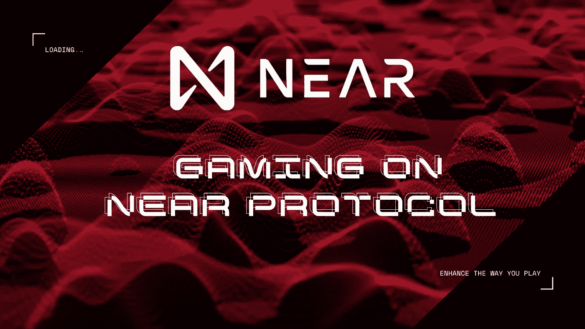

# 近距离协议上的游戏

> 原文：<https://medium.com/coinmonks/gaming-on-near-protocol-1669716af1b6?source=collection_archive---------5----------------------->

## 本文旨在让您了解利用近协议的游戏平台。

区块链是一项颠覆性技术，它证明了加密货币不是唯一的用例，但区块链可以在游戏领域发挥决定性作用。区块链技术具有许多独特的优势，如透明性、安全性、防篡改性、自动化、可信赖性、去中心化等，这使得它非常适合游戏{ [Reference](https://coingeek.com/why-gaming-needs-blockchain/) }。

但问题是，并非每个区块链都适合游戏，因为每个区块链都有一套独立的目标和有限的游戏资源，最终由游戏平台的创造者实现，例如:大多数游戏平台都是在区块链以太坊上创建的，但在面临可扩展性和汽油费问题后，他们正在离开以太坊。

这里，附近的[是下一代利益相关证明区块链协议，它通过提供可扩展性和低运营成本对所有游戏平台起着决定性的作用，这导致许多游戏平台将其平台切换到](https://near.org/)附近的[，在本文中，我们将讨论一些现在利用](https://near.org/)[附近的](https://near.org/)协议的平台。

## 哈希拉什

这是一个即时战略游戏，你可以在游戏中赚取加密货币和其他奖励，在这个游戏中，玩家可以交易有价值的物品和资源。因此，HASH RUSH 使用区块链{ [Reference](/vz-games/why-we-use-blockchain-in-hash-rush-3d1abfe823a0) }。之前在以太坊上创建了 HASH RUSH，但是繁琐的操作和昂贵的交易导致创作者重新考虑底层区块链，切换到附近的[{](https://near.org/)[参考](https://4irelabs.com/articles/near-protocol-vs-ethereum/) }。

## z 字母

ZED 是一个稳定和纯种马经理，总部设在区块链，任何人都可以购买，繁殖，销售和比赛数字纯种马。每匹赛马都是通过以太坊网络上的智能合同唯一创建的，该合同使用加密技术链接性能数据。你的纯种马比赛越多，繁殖越多，你的赛马遗产就越优越。

ZED 创建于以太坊区块链，但随着时间的推移，当用户数量增长时，ZED 平台面临着可扩展性、高额燃气费问题以及该平台用户对这些问题的抱怨，最终 ZED 的创建者在附近切换成[{](https://near.org/)[参考](https://near.org/zed-reduced-gas-fees-and-transaction-times-on-near/) }。

## 风味

这是第一个在协议附近的[上的游戏 DApp，这是一个由 ZED 的创造者创建的](https://near.org/)[虚拟人类工作室](https://www.vhslab.com/) (VHS)初创公司。[附近的](https://near.org/)协议被认为是开发像 ZEST 这样的 VHS 的最佳地方，因为附近的[具有动态分片的区块链设计，比以太坊低 10000 倍的燃气费，类似于 AWS 和其他云服务提供商的工作方式，](https://near.org/)附近的[允许开发人员为其用户支付燃气费用，使新区块链用户的登录体验明显更容易。](https://near.org/)

## OPGames

这是一个游戏盈利平台，无法获得市场份额的中小型游戏开发商可以参与其中，将他们的单人技能游戏改造成多人锦标赛，以赚取一些加密奖金。

## Stake.gg

它是一个由 NEAR 和 Flux 协议支持的分散式应用程序，任何用户都可以在游戏生态系统中创建和参与分散式和无许可的预测市场、锦标赛和社区活动。Stake.gg 基本上是为幻想游戏爱好者创建的，在那里你不会将你的资金控制权交给第三方公司来下注任何锦标赛、电子竞技比赛或 streamer，而没有高额的汽油费、赌注登记费或房屋费。{ [参考](https://gitcoin.co/grants/2149/stakegg-open-markets-for-gamers-by-gamers) }。

## Somnium 空间

这是一个开放的、社会的和持久的虚拟现实世界，你可以在 Somnium 空间购买、建造和进口任何物品来赚钱。附近的协议通过与他们合作在 Somnium 空间创造了一个永久的虚拟现实存在{ [参考](https://somniumspace.medium.com/announcing-somnium-worlds-somnium-web-blockchain-avatars-slo-details-prices-81ec741e2d3a) }。

## 关于近似协议

附近的[是一个开源的去中心化应用平台，通过提供无限的可伸缩性、强大的安全性和可以忽略的油费来加速去中心化应用的开发。](https://www.coinbureau.com/review/near-protocol/)

## 结论:

这篇文章的目标是区块链游戏的创作者和用户，他们仍然使用不可扩展的区块链作为他们的游戏平台，并为汽油费和可扩展性问题而挣扎，可以考虑在区块链附近的[转换他们的平台，如果一个游戏玩家阅读这篇文章，可以请求他们最喜欢的游戏创作者在](https://near.org/)[附近的](https://near.org/)区块链上创建他们的下一个游戏，这可以提供更多样化的游戏体验。

> 加入 coin monks[Telegram group](https://t.me/joinchat/EPmjKpNYwRMsBI4p)学习加密交易和投资

## 另外，阅读

*   [什么是融资融券交易](https://blog.coincodecap.com/margin-trading)
*   最好的[密码交易机器人](/coinmonks/crypto-trading-bot-c2ffce8acb2a) | [网格交易](https://blog.coincodecap.com/grid-trading)
*   [3 商业评论](/coinmonks/3commas-review-an-excellent-crypto-trading-bot-2020-1313a58bec92) | [Pionex 评论](/coinmonks/pionex-review-exchange-with-crypto-trading-bot-1e459d0191ea) | [Coinrule 评论](/coinmonks/coinrule-review-2021-a-beginner-friendly-crypto-trading-bot-daf0504848ba)
*   [AAX 交易所评论](/coinmonks/aax-exchange-review-2021-67c5ea09330c) | [德里比特评论](/coinmonks/deribit-review-options-fees-apis-and-testnet-2ca16c4bbdb2) | [FTX 交易所评论](/coinmonks/ftx-crypto-exchange-review-53664ac1198f)
*   [n rave 零点回顾](/coinmonks/ngrave-zero-review-c465cf8307fc) | [Phemex 回顾](/coinmonks/phemex-review-4cfba0b49e28) | [PrimeXBT 回顾](/coinmonks/primexbt-review-88e0815be858)
*   [Bybit Exchange 审查](/coinmonks/bybit-exchange-review-dbd570019b71) | [Bityard 审查](/coinmonks/bityard-review-7d104239be35) | [CoinSpot 审查](https://blog.coincodecap.com/coinspot-review)
*   [3 commas vs crypto hopper](/coinmonks/3commas-vs-pionex-vs-cryptohopper-best-crypto-bot-6a98d2baa203)|[赚取加密利息](/coinmonks/earn-crypto-interest-b10b810fdda3)
*   最好的比特币[硬件钱包](/coinmonks/the-best-cryptocurrency-hardware-wallets-of-2020-e28b1c124069?source=friends_link&sk=324dd9ff8556ab578d71e7ad7658ad7c) | [BitBox02 回顾](/coinmonks/bitbox02-review-your-swiss-bitcoin-hardware-wallet-c36c88fff29)
*   [莱杰 vs n 格拉夫](/coinmonks/ledger-vs-ngrave-zero-7e40f0c1d694) | [莱杰纳米 s vs x](/coinmonks/ledger-nano-s-vs-x-battery-hardware-price-storage-59a6663fe3b0)
*   [密码本交易平台](/coinmonks/top-10-crypto-copy-trading-platforms-for-beginners-d0c37c7d698c)
*   [CoinLoan 评论](/coinmonks/coinloan-review-18128b9badc4) | [YouHodler 评论](/coinmonks/youhodler-4-easy-ways-to-make-money-98969b9689f2) | [BlockFi 评论](/coinmonks/blockfi-review-53096053c097)
*   最好的[加密税务软件](/coinmonks/best-crypto-tax-tool-for-my-money-72d4b430816b) | [硬币追踪评论](/coinmonks/cointracking-review-a-reliable-cryptocurrency-tax-software-5114e3eb5737)
*   最佳[加密借贷平台](/coinmonks/top-5-crypto-lending-platforms-in-2020-that-you-need-to-know-a1b675cec3fa) | [杠杆令牌](/coinmonks/leveraged-token-3f5257808b22)
*   [block fi vs Celsius](/coinmonks/blockfi-vs-celsius-vs-hodlnaut-8a1cc8c26630)|[Hodlnaut 评论](/coinmonks/hodlnaut-review-best-way-to-hodl-is-to-earn-interest-on-your-bitcoin-6658a8c19edf)
*   [Bitsgap 评审](/coinmonks/bitsgap-review-a-crypto-trading-bot-that-makes-easy-money-a5d88a336df2) | [Quadency 评审](/coinmonks/quadency-review-a-crypto-trading-automation-platform-3068eaa374e1) | [Bitbns 评审](/coinmonks/bitbns-review-38256a07e161)
*   [埃利帕尔泰坦评论](/coinmonks/ellipal-titan-review-85e9071dd029) | [赛克斯斯通评论](/coinmonks/secux-stone-hardware-wallet-review-15-discount-coupon-2020-7577032faa6e)
*   [本地比特币评论](/coinmonks/localbitcoins-review-6cc001c6ed56) | [加密货币储蓄账户](https://blog.coincodecap.com/cryptocurrency-savings-accounts)
*   最佳[区块链分析](https://bitquery.io/blog/best-blockchain-analysis-tools-and-software)工具| [赚比特币](/coinmonks/earn-bitcoin-6e8bd3c592d9)
*   [加密套利](/coinmonks/crypto-arbitrage-guide-how-to-make-money-as-a-beginner-62bfe5c868f6)指南| [如何做空比特币](/coinmonks/how-to-short-bitcoin-568a2d0b4ae5)
*   最佳[加密制图工具](/coinmonks/what-are-the-best-charting-platforms-for-cryptocurrency-trading-85aade584d80) | [最佳加密交易所](/coinmonks/crypto-exchange-dd2f9d6f3769)
*   [如何在印度购买比特币？](/coinmonks/buy-bitcoin-in-india-feb50ddfef94) | [瓦济克斯审查](/coinmonks/wazirx-review-5c811b074f5b)
*   [印度比特币交易所](/coinmonks/bitcoin-exchange-in-india-7f1fe79715c9) | [比特币储蓄账户](/coinmonks/bitcoin-savings-account-e65b13f92451)
*   [CoinDCX 评论](/coinmonks/coindcx-review-8444db3621a2) | [加密保证金交易交易所](https://blog.coincodecap.com/crypto-margin-trading-exchanges)

> [直接在您的收件箱中获得最佳软件交易](/coinmonks/newsletters/coinmonks)

