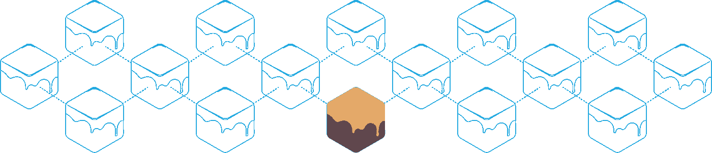
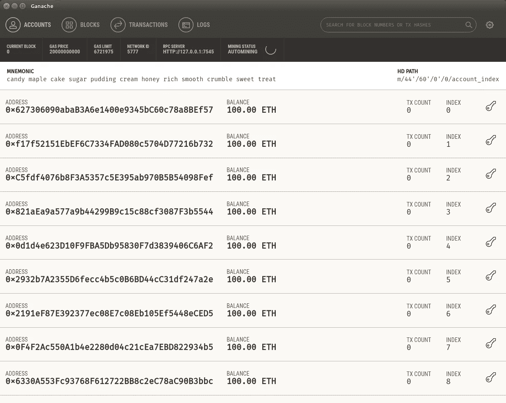
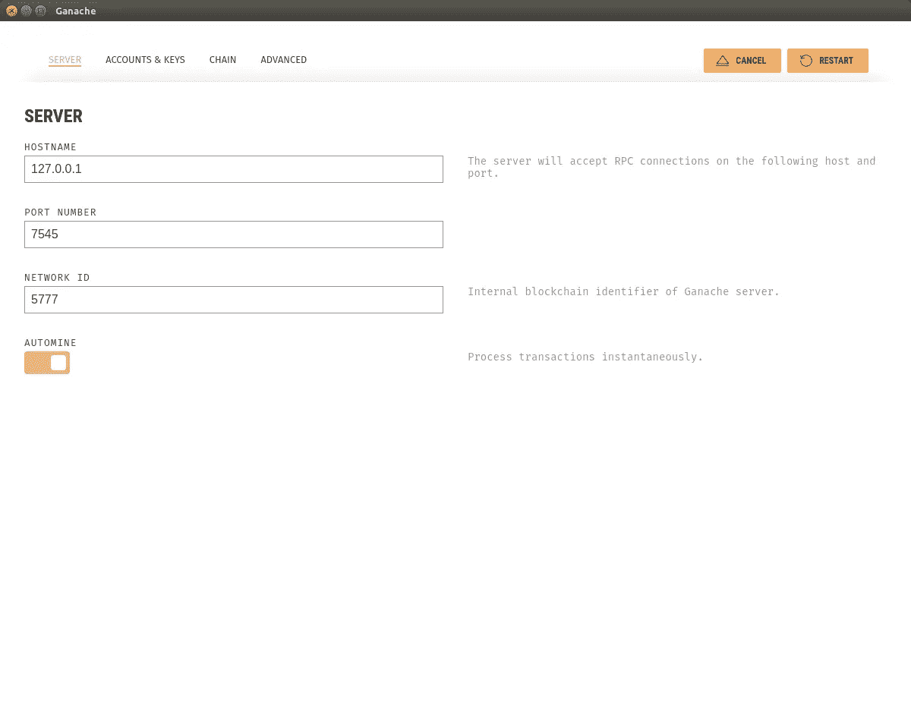

# 加纳切——块菌结构

> 原文：<https://medium.com/coinmonks/ganache-truffle-framework-64b01f4ca200?source=collection_archive---------0----------------------->

这是一篇致力于回顾基本功能 [Ganache](http://truffleframework.com/ganache/) 的文章——这是 Consensys 在其 [Truffle Framework](http://truffleframework.com/) 套件中推出的新工具。这个工具是开源的，源代码可以在[这里](https://github.com/trufflesuite/ganache)找到。

# 设置

Ganache 工具可以在这里[下载](http://truffleframework.com/ganache/)，你可以在这里获得完整的发布列表[。对于 Linux 用户来说，要下载的包有一点小变化，因为它是以](https://github.com/trufflesuite/ganache/releases) [AppImage 格式](https://en.wikipedia.org/wiki/AppImage)下载的。除了它是一种相对较新的格式之外，启动它非常容易。

涉及的步骤如下:

1.  下载完 Ganache 文件后，通过执行“chmod u+x ganache-1.0.1-x86_64”为其提供可执行权限。AppImage `(或您拥有的相应版本)。
2.  通过执行``./` ganache-1.0.1-x86_64 启动应用程序。app image ` 1

# 用户界面

Ganache welcome screen

一旦 Ganache 启动，它将显示一个包含 10 个地址的列表，默认余额为 100.00 ETH。该界面允许您查看和使用以下部分:

1.  帐户—显示可在以太坊区块链实例中使用的地址列表。您可以单击 key 图标来显示该地址的私钥(请记住，在 mainnet 中，您需要保持该密钥的私密性，因此得名)。
2.  区块-区块链上的区块列表。单击该块将打开有关所单击块的更多详细信息，包括挖掘日期和块哈希。
3.  事务-事务选项卡将提供区块链实例中所有事务的列表。
4.  日志—此选项卡为我们提供了与私有区块链上的操作相关的日志的描述性列表。
5.  设置—单击右上角的设置图标将打开设置视图，允许您更改配置，包括主机名、端口号、网络 ID、设置要创建的帐户/密钥数量的默认值、气体限制和气体价格。进行任何更改后，您可以重新启动实例。

Settings page for Ganache

# 结论

Ganache 似乎是一个非常好的工具，可以设置一个以太坊节点来开始区块链开发。不需要设置 geth 客户端，设置依赖关系等等。下载安装这个工具就足够入门以太坊开发了，对于刚开始学习区块链或者以太坊开发的人来说非常不错。当我开始用 [Codevigor](http://www.codevigor.com/) 在以太坊上工作，在 [**StoragePlus.io**](https://www.storageplus.io/) 上开发一个用于文档认证的[防篡改系统](http://blog.storageplus.io/the-first-blockchain-app-in-mauritius/)时，这有点令人生畏。对于其他开发人员来说，拥有这样的工具肯定会容易得多。

玩得开心！！

*请随意发表您的问题。我很乐意回答他们。*

> [直接在您的收件箱中获得最佳软件交易](https://coincodecap.com/?utm_source=coinmonks)

