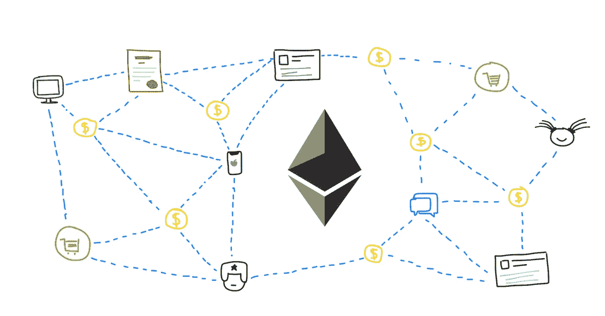
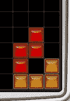
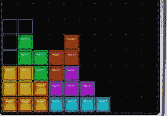

# 固体中的气体优化:可变包装

> 原文：<https://medium.com/coinmonks/gas-optimization-in-solidity-variable-packaging-cae85154f38?source=collection_archive---------3----------------------->


Smarts 合同旨在实现经济自动化，它改变了我们的采购方式，并将继续普及，有朝一日将像智能手机一样普及。我真的相信这项技术，我对它的应用感到非常兴奋。

在过去的一个月里，我越来越多地学习如何在 solidity 中编写智能合约。现在我想分享一些学习材料，我觉得每个 solidity 开发者都需要成为 defi 项目的重要资产。在本讲座中，您不需要对这种语言非常精通，但是，您可以开始应用我在这里介绍的知识。您需要对这种语言有基本的了解，并能够编写基本的 smarts 合同。

**但是什么是气体优化，为什么如此重要？**

每次我们部署、签署或与智能合同互动时，我们都要花费大量精力。智能合同是一个自动化的过程，由于区块链是一个分散的系统，由许多不同角色的用户维护，该系统的一个很大的特点是为他们提供奖励。这种激励是这项技术吸引很多人的原因之一。

智能合约一旦部署在区块链上，就不能更改(是一段不可变的代码)，确保消耗尽可能少的汽油非常重要。由于这个软件运行在以太坊虚拟机上，我们必须知道后台是如何处理事情的。



在 solidity 中，当我们编写智能合同时，我们有不同的数据保存位置，我们将讨论的是存储。存储:这是所有契约状态变量驻留的地方。每次我们初始化、声明或重新赋值一个状态变量时，我们都要消耗汽油。所以我们必须小心处理状态变量以及如何处理它们。但更重要的是，我们必须注意 var 是如何打包的。

**那么……为什么 var 包装如此重要？**

我们在存储槽中逐个槽地保存状态变量，每个槽有一个 32 字节等于 256 位的空间。当我们在存储上声明了一个 uint 8(8 位无符号整数)和一个 uint 256(256 位无符号整数)时，由于 8 和 256 uint 不能一起放在一个 256 位的槽上，我们的约定将占用 2 个槽，其中一个槽仅用于 8 位。最终，我们将消耗 64 位的空间。

但更糟糕的是:当你有一个完整的插槽时，由于缺乏正确的 var 打包，你只有一个单元 8**以太坊虚拟机必须首先将其转换为 uint256 才能工作，这种转换需要更多的时间！**我们可以把这个过程看成一个俄罗斯方块游戏来避免！让我解释一下:


这就像编码一样:

```
contract badPackaging {
 uint192 a;
 uint256 b;
}
```



这就像编码一样:

```
contract badPackaging {
 uint248 c;
 uint256 d;
}
```



这就像编码一样:

```
contract GoodPackaging {
    uint8 a;
    uint16 b;
    uint88 c;
    uint64 d;
    uint40 e;
    uint40 f;
}
```

我很高兴你已经看到了我的文章的结尾，我希望我个人的抽象可以帮助你编写节能智能合同。如果你喜欢这些内容，我邀请你关注我并继续学习！

> 加入 Coinmonks [电报频道](https://t.me/coincodecap)和 [Youtube 频道](https://www.youtube.com/c/coinmonks/videos)了解加密交易和投资

## 也阅读

[](/coinmonks/leveraged-token-3f5257808b22) [## 杠杆代币[多头代币]终极指南

### 杠杆化令牌是具有杠杆化风险敞口的 ERC20 令牌，不考虑保证金、要求、管理…

medium.com](/coinmonks/leveraged-token-3f5257808b22) [](https://blog.coincodecap.com/crypto-exchange) [## 最佳加密交易所| 2021 年十大加密货币交易所

### 编辑描述

blog.coincodecap.com](https://blog.coincodecap.com/crypto-exchange) [](/coinmonks/top-5-crypto-lending-platforms-in-2020-that-you-need-to-know-a1b675cec3fa) [## 2021 年最佳加密借贷平台| 6 大比特币借贷平台

### 获得比特币和其他加密货币的最佳贷款利率

medium.com](/coinmonks/top-5-crypto-lending-platforms-in-2020-that-you-need-to-know-a1b675cec3fa) [](/coinmonks/crypto-trading-bot-c2ffce8acb2a) [## 2021 年最佳免费加密交易机器人

### 2021 年币安、比特币基地、库币和其他密码交易所的最佳密码交易机器人。四进制，位间隙…

medium.com](/coinmonks/crypto-trading-bot-c2ffce8acb2a) [](/coinmonks/best-crypto-signals-telegram-5785cdbc4b2b) [## 最佳 4 个加密交易信号电报通道

### 这是乏味的找到正确的加密交易信号提供商。因此，在本文中，我们将讨论最好的…

medium.com](/coinmonks/best-crypto-signals-telegram-5785cdbc4b2b)  [## 5 个最佳社交交易平台[2021] | CoinCodeCap

### 编辑描述

blog.coincodecap.com](https://blog.coincodecap.com/best-social-trading-platforms) [](https://blog.coincodecap.com/blockfi-review) [## BlockFi 评论 2021:利弊和利率| CoinCodeCap

### 编辑描述

blog.coincodecap.com](https://blog.coincodecap.com/blockfi-review) [](/coinmonks/buy-bitcoin-in-india-feb50ddfef94) [## 如何在印度购买比特币？2021 年购买比特币的 7 款最佳应用[手机版]

### 如何使用移动应用程序购买比特币印度

medium.com](/coinmonks/buy-bitcoin-in-india-feb50ddfef94) [](/coinmonks/best-crypto-tax-tool-for-my-money-72d4b430816b) [## 加密税务软件——五大最佳比特币税务计算器[2021]

### 不管你是刚接触加密还是已经在这个领域呆了一段时间，你都需要交税。

medium.com](/coinmonks/best-crypto-tax-tool-for-my-money-72d4b430816b) [](https://blog.coincodecap.com/best-hardware-wallet-bitcoin) [## 存储比特币的最佳加密硬件钱包[2021] | CoinCodeCap

### 编辑描述

blog.coincodecap.com](https://blog.coincodecap.com/best-hardware-wallet-bitcoin) [](/coinmonks/pionex-review-exchange-with-crypto-trading-bot-1e459d0191ea) [## Pionex 评论 2021 |免费加密交易机器人和交换

### Pionex 是为交易自动化提供工具的后起之秀。Pionex 上提供了 9 个加密交易机器人…

medium.com](/coinmonks/pionex-review-exchange-with-crypto-trading-bot-1e459d0191ea)