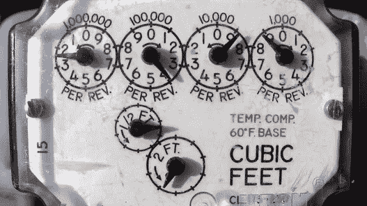
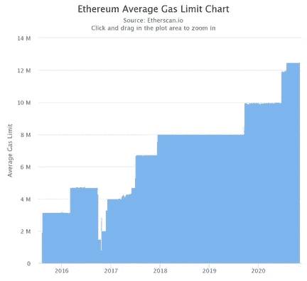

# 加斯托肯:或者说我是如何学会停止担忧，爱上油价飙升的

> 原文：<https://medium.com/coinmonks/gastoken-or-how-i-learned-to-stop-worrying-and-love-gas-price-surges-6aaee9fb0ba3?source=collection_archive---------1----------------------->

编辑(2021 年 8 月): [EIP-3529](https://eips.ethereum.org/EIPS/eip-3529) 已被列入伦敦 hardfork，认为 GasTokens 背后的经济学不可行。该职位仍为历史洞察力。

这篇文章旨在探索 EVM 气体动力学，尤其是 GasToken 的气体动力学。这篇文章要求对技术有一个入门到中等水平的理解——对于那些不关心底层机制的人来说,“有趣的实现细节”部分可以跳过。

Running one of these in reverse is definitely a bad idea — not so with the EVM.

# **气体基础知识简介**

以太坊引入了一个气体计算系统，主要是为了防止停机问题和帮助避免再入攻击。这个会计系统似乎是最简单的，因此也是最稳健的(尽管还有其他系统，如[EOS](https://github.com/EOSIO/Documentation/blob/master/TechnicalWhitePaper.md#token-model-and-resource-usage)的系统)。每个 EVM 操作码都有一个特定的固定价格，在黄皮书中定义，将指令分为多层气体成本:零层(0 气体)、基本层(2 气体)、极低层(3 气体)、低层(5 气体)、高层(10 气体)和特殊层，其中成本需要更复杂的规则。

例如，在 EVM 烟囱上推动/弹出某物需要 3 点汽油。这些操作码中的一些已经在各种 hardforks 中重新定价，例如 calldata(EVM 中的一个只读内存区域，总共有 4 种内存类型)已经从每字节 68 gas 重新定价为每字节 18 gas，经过分析，这似乎主要是为了促进需要在线数据可用性的 L2 可伸缩性解决方案。也有证据表明操作码的[原始定价](https://github.com/LeastAuthority/ethereum-analyses/blob/master/GasEcon.md)未得到充分分析，并且仍然存在[进一步的](https://arxiv.org/abs/1909.07220)错误定价。此外，改变操作码天然气价格可能会有问题:

*   降低指令成本可能会使重入路径变得可行
*   提高指令的成本可能会导致调用失败，因为硬连线到指令的 gas 数量现在不足以执行调用

交易使用的操作码数量累计为总用气量，并乘以 gasPrice，这是以太坊交易中用户设置的字段。这个数额然后被翻译成魏，因此以太，以太坊的本地货币(咄)。有关交易基础的更多信息，请参见本文。

## 阻止气体限制

据推测，街区[的](https://ethresear.ch/t/mev-auction-auctioning-transaction-ordering-rights-as-a-solution-to-miner-extractable-value/6788)挤满了矿商以第一价格拍卖的交易。备受期待的 [EIP-1559](https://github.com/ethereum/EIPs/blob/master/EIPS/eip-1559.md) 旨在将这种动态转变为一种更有效的结构，其额外的副作用是将以太奉为必须支付交易费用的货币。然而，这不是一个关于 EIP-1559 的帖子，这个话题本身具有潜在的深远影响，在这里，我们将专注于促进 GasToken 的气体机制/经济学。

每个区块都有一个相关的天然气限额，目前(2020 年 11 月)为 1250 万天然气，这就产生了一个有限的产能和一个竞争性的“区块空间市场”来填充这些区块。尽管目前验证到阻止到达的比率小于 1%，但是这种限制的存在维持了网络中的安全性。将块 gas 限制设置得太高，在网络产生另一个块之前，节点可能很难执行该块内的所有事务(或者可能跳过——参见 Verifiers Dilema)。设置太低的气体阻塞限制，我们得到拥挤和缺乏效用。这里的[很好地解释了这种权衡。](https://arxiv.org/pdf/2005.11791.pdf)

有趣的是，矿工可以用[节点 cli 标记](https://ethereum.stackexchange.com/questions/59669/explanation-of-geths-command-line-option-targetgaslimit/59673#59673)来标记他们想要的区块气体限制，但主要是这个限制的变化，例如最近的变化(从 8M 到 12.5M)似乎发生在“社交层”(Twitter)。矿工增加/减少每个区块的区块气体限制的机制解释了下图的粗略峰值:

Block gas limit size over time. Note the only sizeable decrease in late 2016 was a response to the Shanghai attacks: [https://blog.ethereum.org/2016/09/22/ethereum-network-currently-undergoing-dos-attack/](https://blog.ethereum.org/2016/09/22/ethereum-network-currently-undergoing-dos-attack/)

围绕块空间拍卖的动力学被认为是经济/机制设计空间中的新领域，因为传统的拍卖理论是在自由投标价格/开销的假设下进行的，而以太坊交易不是这种情况，以太坊交易必须支付最小的基本交易费用，并且一旦交易被广播到 p2p 网络，它们实际上是难以处理的。

## **前同步码够了**

可以说最有趣的操作码是那些更昂贵的:`SSTORE`、`CREATE`、`CREATE2`和`SELFDESTRUCT`。这些操作码有一些共同点，它们都接触状态，从而接触磁盘(以太坊中的固态驱动器)。它们更昂贵，因为它们影响持久存储和世界状态 trie。

# 输入 GasToken

GasToken 是天然气定价系统的一个巧妙的诡计/经济利用。它利用收到的 gas 退款来清除状态、清除存储槽和删除带有自毁操作码的契约，这两者都减少了世界状态 trie。这两种操作都可以被认为具有负的天然气价格。

*   清算/自毁合约是-24，000 气
*   清除/删除存储是-15，000 气体

当 EVM 执行这样的操作时，它被记录在**单独的交易范围退款计数器**中。汽油退款仅在交易结束时提供。此外，最大退款等于交易消耗的一半汽油。

高级思想是当网络`gasPrice`为低时写入状态，当`gasPrice`为高时删除状态。由于以 Wei/Ether 表示的总费用是`gasUsed` * `gasPrice`的倍数，当`gasPrice`为高时，减少`gasUsed`会导致总费用降低。

GasToken 的[原始/规范实现](https://etherscan.io/address/0x0000000000b3f879cb30fe243b4dfee438691c04#code)也符合其名称的“令牌”部分，因为它是一个类似 ERC 20 的令牌，带有`approve`和`transferFrom`，并且可以作为多步事务的一部分被调用。GasToken 最初有两种变体，每种都有不同的设计权衡:GST1 和 GST2。前者使用存储成本和退款，而 GST2 使用`CREATE`和自毁方法。这些变体具有不同的节省特征，取决于汽油价格差异比率(铸造时的汽油价格与自由时的汽油价格)，GST2 在汽油价格比率较大的情况下提供更大的节省。

挖掘或“铸造”该令牌是写入存储/创建合同，而烧录或“释放”是指减少用户对 GasToken 的所有权，并移除状态存储槽。虽然 canonical GasToken 很受欢迎，但许多开发人员选择克隆功能并在他们自己的系统合同中使用，以减少开销和设计复杂性。

# 有趣的实施细节

## GST1 —基于存储

那么，在智能合约级别，这看起来像什么呢？让我们先看看`mint()`函数:

非常简单——我们有一个存储起点常数来标记 EVM 存储的开始，它还包含我们已经写入了多少个片段的值。要了解 EVM 中持久存储布局的更多信息，请阅读此处的。我们在第 12 行和第 13 行计算要写入的新范围，并在第 17 行的 for 循环中使用`SSTORE`操作码写入这些范围，存储值 1，该值可以用任何**非零**值替换。然后，我们在第 22 行和第 24 行更新已经存储的槽数和 ERC 20 式余额。

自由函数稍微有趣一点，功能范围:`freeFromUpTo(uint value)`、`freeFrom(uint value)`、`freeUpTo(uint value)`和`free(uint value)`，以下简称`free*()`函数，调用内部函数`freeStorage()`:

正如你所看到的，这个函数与上面讨论的`mint()`函数几乎相同，主要区别出现在第 13 行，向存储器写入 0 值，这使得 EVM 释放存储槽。这一行触发气体退款，气体退款计数器增加 15，000。更新 ERC20-esque 余额由调用`free*()`函数完成。

## GST2 —基于合同

GST2 中等效的`mint()`函数被称为`makeChild()`，这是一个内部函数，它使用 EVM 程序集来创建一个简单的“子”契约，只能由这个“父”契约来析构:

仔细研究这段汇编代码是更好地理解 EVM 的好机会。我个人的看法是，聪明的契约开发者一般应该避免使用汇编，但也有例外，一般是设计极简，要求极高的效率，比如 here 和 [EIP-1167](https://eips.ethereum.org/EIPS/eip-1167) 。

## 在 EVM 杂草中度过的时光

我们希望在子契约的 fallback 函数的第 4 行和第 5 行构造伪代码——fallback，因为我们在子契约中只需要一个函数，这是最简单的实现。

从`PUSH15`开始:地址[是 20 个字节](https://solidity.readthedocs.io/en/v0.5.3/types.html#address)，但在这种情况下，我们将 15 个字节推到堆栈上，这是一种优化，因为由于使用了虚位地址类型的技巧，前 5 个字节都是 0，重复散列直到找到所需的地址。其余所需的 5 个零将作为缺省填充的一部分被添加，以构成 32 字节，即 EVM 字长。优化在这里很重要，因为用于创建子合同的天然气可视为整个 GasToken 方案的开销。

接下来，`CALLER`将协定调用方的地址推送到堆栈上。`XOR`从堆栈中弹出两个项目，并将这两个值的按位- `XOR`结果推送到堆栈上。如果这两个值相等，0 将被推到堆栈的顶部，否则是其他非零数字。`PC`获取该指令对应的增量之前的程序计数器的值，并将其推送到堆栈上。`JUMPI`，一个条件跳转，取栈顶两个值，一个条件和一个目的地，如果条件为真则跳转到目的地，否则跳转失败。

如果`JUMPI`的结果不在`JUMPDEST`操作码上，EVM 将恢复，从而确保调用方是父契约(满足“`!=`”条件)。fall through 路径然后将父合同的地址推送到堆栈上，因为下一个`SELFDESTRUCT`操作码将堆栈的顶部字弹出作为退款的目的地(合同具有的任何值加上 gas)。

`free*()`函数调用下面的`destroyChildren()`实现:

这里我们遍历子契约并调用它们的回退函数。正如 GST2 文件指出的那样；当释放令牌时，契约必须计算出创建子节点的地址(将这些地址保存在存储器中会非常昂贵，所以我们会动态地重新计算它们)。幸运的是，这是可能的，因为使用`CREATE`生成的合同地址是根据地址/账户已经创建的合同数量确定性地[生成的](https://ethereum.stackexchange.com/questions/760/how-is-the-address-of-an-ethereum-contract-computed)(nonce)。这些合同地址是在`mk_contract_address`函数中计算出来的，并被不带参数或值地简单调用，调用回退函数，天然气退款被发送到父合同，正如在相应的`mint()`函数中硬编码的那样。

## **新上榜:池·加斯托肯**

向前滚动近 3 年，池[加斯托肯登场。CHI 是由一个流行的 DEX 聚合器 inch.exchange 开发的。该令牌的前提与传统 GasToken 相似，但 mint 的效率提高了 1 %, free 的效率提高了 10%,并利用了 new-ish](https://github.com/CryptoManiacsZone/chi/blob/master/contracts/ChiToken.sol) `[CREATE2](https://blog.openzeppelin.com/getting-the-most-out-of-create2/)`操作码，该操作码允许提前确定性链上契约地址创建，主要用于基于[反事实](https://blog.openzeppelin.com/getting-the-most-out-of-create2/)的 L2 解决方案。

`CREATE2`操作码接受 4 个堆栈参数:禀赋、内存 _ 开始、内存 _ 长度和一个 salt。生成的地址等于`keccak256( 0xff ++ address ++ salt ++ keccak256(init_code))[12:]`，而不是通常的 sender-and-nonce-hash。当用户控制盐时，可以提前知道地址。

这里的一般流程是将固定的子字节码存储在内存中(第 4 行)，然后在一个 for 循环中反复调用`CREATE2`，直到达到对应的值。`CREATE2`返回子契约已经被部署的地址，我们不关心它，所以我们只是`POP`它离开堆栈。维护一个偏移计数器，以便说明所创建的子契约的数量，并且这被持久地存储在第 33 行上。

相应的`free*()`功能调用`_destoryChildren()`:

为了简洁起见，`destroyChildren()`字节码的反汇编留给了读者，但一般流程与 GST2 类似，只是考虑到更简单的`CREATE2`目的地址查找进行了修改——这就是 10%更高效率的来源。

# 我为什么要关心？

似乎没有人真正(公开地)关心 GasToken 1，2 或 CHI，直到 DeFi 引发了 2020 年的“气体战争”，看到了令人头晕目眩的 500+ GWei hit 和默认 Geth 设置[内存池溢出](https://www.blocknative.com/blog/mempool-forensics)——导致“丢失”以太坊交易！

具有讽刺意味的是，这个卑微的以太坊修补匠意识到，在 Uniswap 等指数上，以美元计价的 GasToken 的[价格通常在网络最拥挤时达到峰值，因此作为投资出售以获利并不符合与拥挤的 GWei 费用相关的心灵之光，对于较小的金额，存在容易错过局部最大值的情况。注意:这绝对不是投资建议。](https://info.uniswap.org/pair/0x27C64bDCA05D79F6Ee32c3e981dC5153d9D794CD)

根据某些定义，GasToken 无疑是最“实用”的令牌，因为它直接充当网络交易工具。有些人建议应该普遍地作为一种按合同的公共产品融资来实施。也许这比[接近协议](https://insights.deribit.com/market-research/transaction-fee-economics-in-near/)强制智能合同开发者费用占总基础交易天然气成本的 30%更有效(这有其自身的问题——例如鼓励低效的智能合同设计)。

## 野外的加斯顿龙

[DefiSaver](https://defisaver.com/) ，一个旨在创造一种更加用户友好的方式来与各种 Defi 协议交互的工具，在他们的[契约](https://github.com/DecenterApps/defisaver-contracts/blob/master/contracts/utils/GasBurner.sol)中通过函数修饰符的方式使用 GasToken。该修饰符使用规范的 GST2 协定，并且目前在几乎所有 DefiSaver 包装的协议函数调用中使用硬编码值进行调用。一个有趣的分析是，随着时间的推移，这种做法节省了多少交易费用。较新的以太坊工具，如[温柔地](https://tenderly.co/)用他们优秀的气体分析器和模拟模式使这成为可能。

虽然这种硬编码模式肯定是有效的，但一种进化的设计会考虑到当前的油价——像 chainlink 的这样的预言开始使这成为可能；需要仔细设计，因为这可能非常昂贵(`[lastestAnswer](https://github.com/smartcontractkit/chainlink/blob/develop/evm-contracts/src/v0.6/AggregatorProxy.sol#L38)()`花费约 15，000 天然气)。

其他值得注意的用例/设计包括 [GasToken 工厂](https://blog.polymath.network/turning-smart-contracts-into-gastoken-factories-3e947f664e8b)和一个[提案](https://forum.makerdao.com/t/chi-chi-gastoken-collateral-onboarding-application/3126/28)增加 CHI GasToken 作为 MakerDAO 的抵押品。

## 薄荷加士多肯..到处都是？

那么为什么更多的合同不用 GasToken 呢？状态膨胀(又名:老兄，我的节点有多大)正在成为现实，也许 GasToken 被认为是对状态的有害操纵，因为这种欺骗——一些纯粹的比特币创造者[拒绝使用`OP_RETURN`比特币脚本操作码(？)在比特币区块链上存储/刻录任意数据，声称这是不必要的国家膨胀。](https://news.bitcoin.com/veriblock-captured-close-to-60-of-btcs-op-return-transactions-in-2019/)

[状态租金](https://ethresear.ch/t/ethereum-state-rent-for-eth-1-x-pre-eip-document/4378)作为一个概念，似乎已经因为过度复杂、无状态客户端的出现以及对 Eth2.0 引入的不同状态存储架构的期望而被搁置。虽然不太可能，但 Eth1.0 矿工可能会反抗状态膨胀，并选择开始审查包括 GasToken 类机制在内的事务，因为这直接增加了运行完整节点的成本，尽管只是少量增加——256 位存储槽的实际成本几乎不值得计算。

另一个更实际的因素是，GasToken 涉及中长期操作码重新定价的风险。

## **被认为不危险的拟议变更**

随着伊斯坦布尔硬盘引入 [EIP-2200](https://eips.ethereum.org/EIPS/eip-2200) ,存储操作码已经经历了相当大的重组，尽管这些变化涉及在特定情况下发生的记账/计量方式；汽油价格上涨，但没有上涨。

[EIP-2929](https://eips.ethereum.org/EIPS/eip-2929) 最近提议的变更源于之前引用的同一篇伦敦帝国理工学院[论文](https://arxiv.org/abs/1909.07220)，该论文详细分析了天然气(低价)定价。该 EIP 提议增加`SLOAD`、`*CALL`、`BALANCE`、`EXT*`和`SELFDESTRUCT`在交易中首次使用时的燃气成本，因为考虑到这些操作码读取的状态量和访问这些状态的时间，发现这些操作码定价过低。

特别地，该 EIP 提出添加事务上下文范围的`addresses_accessed`和`accessed_storage_keys`集合，以便区分“冷”和“热”状态访问，对冷账户/状态访问收取额外的 2600 gas，并将热状态存储访问的成本降低到 100 gas。

由于`COLD_SLOAD_COST`现在要对`SSTORE_RESET_GAS`、**收费，基于存储的 GasToken1 的经济性现在没那么有吸引力了。**由于 GasToken 1 似乎并不常用，因为它的节约仅在更小的气价比范围内更有效，所以这并不是什么大不了的事情，RIP GasToken1，并强调 GasToken 经济学的脆弱性。

提议的对`SELFDESTRUCT`的更改不会影响 GST2 或 CHI 的`free*()`部分，因为被退款的 ETH(母合同)的接收者已经在`addresses_accessed`集合中，但是如果该机制被不同地设计(例如退款地址不在`addresses_accessed`集合中)。但这并不是说 GasToken 的经济状况可能会改变，使它变得不那么有效/不可行。

## 2020 年天然气还会发生什么？

Eth1.x 社区中有一个[提议](https://ethresear.ch/t/oil-adding-a-second-fuel-source-to-the-evm-pre-eip-v1-1/7425)添加第二个用于计算的单元——恰当地命名为 Oil，它与 Gas 并行操作(相同的操作码成本、启动限制等),但有以下主要区别:

*   如果事务在执行过程中的任何时候用完了 oil，事务就会恢复。与 gas 不同，out-of-gas 只恢复当前帧，并让调用者检查结果，out-of-oil 总是恢复整个事务(所有帧)。
*   与天然气不同，调用者合同不能限制被调用者合同可以使用多少石油。
*   交易的 ETH 退款金额现在是根据剩余的石油而不是剩余的天然气来计算的。

这里的术语“框架”与契约上下文的概念是可互换的，也就是说，在执行契约时所讨论的内存/状态区域。这当然是一个有趣的提议，可能会增加复杂性，但在最初的方法中，至少不会立即打破规范的 GasToken 合同机制，注意这是 Oil 的目标，即保持大多数合同的向后兼容性。关于石油作为一个概念/机制的进一步讨论超出了本文的范围，但是注意到这个领域的活动是很有趣的。

# 迷因时间

**爆料**:支付拥堵的管网气价

**唤醒**:网络安静时释放 GasToken，拥塞时释放 GasToken

**Bespoke** :将 GasToken dynamics 整合到您的合同设计中，使用一个在线天然气价格 oracle 在经济上可行时触发。

Very tricky to find interesting gas meter pics. Here’s one.

关于 GasToken 和相关的动力学还有很多要说的；给想出这个主意的[人](https://gastoken.io/)的小道具，它很有娱乐性(至少),鼓励对 EVM 更深入的了解，提出了围绕国家维护、合同设计和天然气市场动态的重要问题。

如果你知道 GasToken 更酷的应用/用例，或者如果我在 twitter 或评论中说错了(多么尴尬), hmu。

## 另外，阅读

*   最好的[密码交易机器人](/coinmonks/crypto-trading-bot-c2ffce8acb2a)
*   [密码本交易平台](/coinmonks/top-10-crypto-copy-trading-platforms-for-beginners-d0c37c7d698c)
*   最好的[加密税务软件](/coinmonks/best-crypto-tax-tool-for-my-money-72d4b430816b)
*   [最佳加密交易平台](/coinmonks/the-best-crypto-trading-platforms-in-2020-the-definitive-guide-updated-c72f8b874555)
*   最佳[加密借贷平台](/coinmonks/top-5-crypto-lending-platforms-in-2020-that-you-need-to-know-a1b675cec3fa)
*   [最佳区块链分析工具](https://bitquery.io/blog/best-blockchain-analysis-tools-and-software)
*   [加密套利](/coinmonks/crypto-arbitrage-guide-how-to-make-money-as-a-beginner-62bfe5c868f6)指南:新手如何赚钱
*   最佳[加密制图工具](/coinmonks/what-are-the-best-charting-platforms-for-cryptocurrency-trading-85aade584d80)
*   [莱杰 vs 特雷佐](/coinmonks/ledger-vs-trezor-best-hardware-wallet-to-secure-cryptocurrency-22c7a3fd391e)
*   了解比特币的[最佳书籍有哪些？](/coinmonks/what-are-the-best-books-to-learn-bitcoin-409aeb9aff4b)
*   [3 商业评论](/coinmonks/3commas-review-an-excellent-crypto-trading-bot-2020-1313a58bec92)
*   [AAX 交易所评论](/coinmonks/aax-exchange-review-2021-67c5ea09330c) |推荐代码、交易费用、利弊
*   [Deribit 审查](/coinmonks/deribit-review-options-fees-apis-and-testnet-2ca16c4bbdb2) |选项、费用、API 和 Testnet
*   [FTX 密码交易所评论](/coinmonks/ftx-crypto-exchange-review-53664ac1198f)
*   [n 零审核](/coinmonks/ngrave-zero-review-c465cf8307fc)
*   [Bybit 交换审查](/coinmonks/bybit-exchange-review-dbd570019b71)
*   [3Commas vs Cryptohopper](/coinmonks/cryptohopper-vs-3commas-vs-shrimpy-a2c16095b8fe)
*   最好的比特币[硬件钱包](/coinmonks/the-best-cryptocurrency-hardware-wallets-of-2020-e28b1c124069?source=friends_link&sk=324dd9ff8556ab578d71e7ad7658ad7c)
*   最佳 [monero 钱包](https://blog.coincodecap.com/best-monero-wallets)
*   [莱杰 nano s vs x](https://blog.coincodecap.com/ledger-nano-s-vs-x)
*   [Bitsgap vs 3 commas vs quad ency](https://blog.coincodecap.com/bitsgap-3commas-quadency)
*   [莱杰 Nano S vs 特雷佐 one vs 特雷佐 T vs 莱杰 Nano X](https://blog.coincodecap.com/ledger-nano-s-vs-trezor-one-ledger-nano-x-trezor-t)
*   [block fi vs Celsius](/coinmonks/blockfi-vs-celsius-vs-hodlnaut-8a1cc8c26630)vs Hodlnaut
*   [bits gap review](/coinmonks/bitsgap-review-a-crypto-trading-bot-that-makes-easy-money-a5d88a336df2)——一个轻松赚钱的加密交易机器人
*   为专业人士设计的加密交易机器人
*   [PrimeXBT 审查](/coinmonks/primexbt-review-88e0815be858) |杠杆交易、费用和交易
*   [埃利帕尔泰坦评论](/coinmonks/ellipal-titan-review-85e9071dd029)
*   [SecuX Stone 评论](https://blog.coincodecap.com/secux-stone-hardware-wallet-review)
*   区块链评论 |从你的密码中赚取高达 8.6%的利息