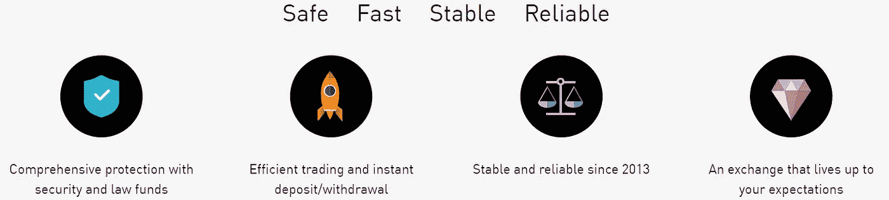

# Gate.io 回顾 2021 |是否安全&合法？

> 原文：<https://medium.com/coinmonks/gate-io-exchange-review-61bf87b7078f?source=collection_archive---------0----------------------->

今天我们将回顾一下 [**Gate.io**](https://blog.coincodecap.com/go/gate) ，这是一个[加密货币交易所](https://blog.coincodecap.com/go/crypto-exchange)，几乎可以在全球所有国家使用。

# gate.io 是什么？

[**Gate.io**](https://blog.coincodecap.com/go/gate) 大概是最早的 crypto-[密码交易所](https://blog.coincodecap.com/go/crypto-exchange)来自中国。这个平台在 2017 年振兴为 [Gate.io](https://blog.coincodecap.com/go/gate) 。目前，它与中国没有关联，似乎总部设在美国，注册地址在弗吉尼亚州。据信，这个未经许可的平台是 Gate Technology Incorporated 的一部分。

它为超过 367 个市场的密码社区提供服务，包括像 USDT、CNYX、BTC、ETH 和限时市场这样的主要市场。

不知道 [**Gate.io**](https://blog.coincodecap.com/go/gate) 背后的团队，这个[密码交换](https://blog.coincodecap.com/go/crypto-exchange)平台也不是授权的。除了华盛顿州、纽约州(美国)、古巴、伊朗、朝鲜、苏丹、叙利亚、巴基斯坦、委内瑞拉和克里米亚等少数几个国家之外，它几乎在全球范围内都可以使用。

# Gate.io 回顾:总结(TL；博士)

*   [**Gate.io**](https://blog.coincodecap.com/go/gate) 支持超过 180 种加密货币。
*   Gate.io 还有[电网交易机器人](https://blog.coincodecap.com/grid-trading)。
*   还支持现货和[保证金交易](https://blog.coincodecap.com/go/margin-trading)。
*   平台的不同功能，如保证金借出或借入资金、定期投资计划、通过启动平台投资于 I.E.O.、永久互换合同等。
*   低交易费系统 **:** 支持 0.20%的交易费，相对低于全球平均水平 0.25%。
*   对专业人士来说更重要，对初学者来说稍微复杂一些。
*   KYC 不是强制性的，很少受到限制。

# Gate.io 怎么用？

下面是 [Gate.io](https://blog.coincodecap.com/go/gate) 的入门步骤。

## 第一步:Gate.io 注册

访问官网，即 [**Gate.io**](https://blog.coincodecap.com/go/gate) ，在首页右上角，登录旁边，点击[报名](https://www.gate.io/signup)选项，进入报名登录页面。

开始填写您的个人信息，如用户名、电子邮件和密码。选择您选择的地区，勾选用户协议，然后单击“下一步”获取进一步说明。

请注意，稍后您需要创建一个不同于您的登录密码的基金密码。

注册后，出于确认目的，您将收到 gate.io 自动生成的邮件。单击邮件中的确认链接以完成注册过程。

## 第二步:验证

通过验证的账户，您可以享受更快、更顺畅的存取款体验。最重要的是，这将提高你的帐户的安全性。

严格按照给定的步骤完成您的 KYC 验证过程。

1.  登录你的 [**Gate.io**](https://blog.coincodecap.com/go/gate) 账号 **:** 访问他们的网站，点击他们网站主页右上角的登录按钮。填写您的电子邮件 id 和密码，然后点击登录。
2.  用政府颁发的身份证来验证你的账户，比如护照**、**驾照或身份证。没有过期的文档，为了更清楚起见，请参考侧面显示的示例文档。
3.  姓名必须与提交的身份证件上的姓名相同。
4.  您的验证过程可能需要半小时到 12 小时。

# Gate.io 审查:安全性

以前是安全原因 [**Gate.io**](https://blog.coincodecap.com/go/gate) 在 2017 年关闭。现在，它再次增强了用户及其服务器的安全性。为用户提供了许多 **Gate.io 安全**技巧来保护他们的资金，例如:

*   使用 Google Authenticator 的双因素身份验证(2FA)。
*   短信 2FA。
*   登录验证。
*   附加提款密码。
*   防钓鱼代码。
*   盲目的 IP 登录。

也许他们可以通过使用**通用第二因子(U2F)** 保护来增加他们的安全性，这是最安全的方法，但不幸的是，它没有采用这种方法。在内部，用户资金通过利用冷热钱包结合其他安全措施来保护。

即使有了 gate.io KYC 的验证，它仍然是一个不受监管的交易所，尽管它的法律地位仍然模糊不清。但同样值得一提的是，2019 年 gate.io 系统被攻破，但不知何故，基金以一种未知的方法返回。它的前身 Bter.com 也有黑客攻击的历史，导致 7000 BTC 损失，所以它解散了。

尽管有这些众所周知的历史，它仍然是最安全的[加密交换](https://blog.coincodecap.com/go/crypto-exchange)平台之一，并且它还在继续努力在安全领域做得更好。

# Gate.io 审查:设计和可用性

是的，我们都知道界面和简单的重要性。几乎所有的用户都更喜欢使用一个可以理解且易于使用的平台来进行这种多方面的交流。所以， [**Gate.io**](https://blog.coincodecap.com/go/gate) 提供的界面，相对来说，还是比较容易导航的。有时它提供的各种功能会让你不知所措，但它们也有自己的优势。

用户可以从主菜单轻松访问各种选项，如加密货币市场、[保证金交易](https://blog.coincodecap.com/margin-trading)、[借贷](https://blog.coincodecap.com/top-5-crypto-lending-platforms)、借款、永久合同交易、金融服务(即 o .平台)或钱包概述。

搜索功能是为了探索不同的市场，从一个市场切换到另一个市场只需简单地滚动即可。[交易图表](/coinmonks/what-are-the-best-charting-platforms-for-cryptocurrency-trading-85aade584d80)出现在屏幕中间，右边屏幕下单，最下面屏幕下单。用户可以在专业和简单( [TradingView](https://blog.coincodecap.com/go/tradingview) )的图表界面之间进行选择。

总的来说，这么多的功能，视图有时似乎杂乱，但在积极的一端，它有三种不同的夜间模式作为背景。Startup I.E.O .平台被公认为 2019 年最赚钱的 I.E.O .平台，让你高效投资最热门的加密货币项目。

# Gate.io 费用

## 现货和保证金交易费用

[**Gate.io**](https://blog.coincodecap.com/go/gate) 提供的现货和[融资融券交易](https://blog.coincodecap.com/go/margin-trading)市场，费用结构不同。现货交易是每笔 0.2%，随着交易量的增加而降低。从竞争的角度来看，其竞争对手如[币安](https://blog.coincodecap.com/go/binance)和 KuCoin 提供的汇率略低，即 0.1%。如果用户使用 Gate.io 令牌(G.T .)付费，gate.io 还提供 25%的折扣。未来市场费用采用制造商和接受者模型，分别为-0.025%和 0.075%。

## Gate.io 押金费用

在 **Gate.io exchange** 存入资金不收交易费。它是完全免费的。

## Gate.io 提现费用

当用户从[**gate . io exchange**](https://blog.coincodecap.com/go/gate)提取加密货币资产时，它会启动标准的区块链网络费用，并根据市场自动调整。用户可以在下表中找到每项资产的提取费用。要找到 Gate.io 提现限额，可以访问这个[页面](https://www.gate.io/en/fee)。

# Gate.io HODL 和欧恩

[**Gate.io**](https://blog.coincodecap.com/go/gate) 如果满足特定条件，也会提供奖励。将他们的资金转移到交易平台赚取加密 T21 是交易数字资产的低风险替代方案。Gate.io [HODL & Earn](https://www.gate.io/en/hodl) 为交易者提供固定期限、灵活安排等多种金融产品。这有助于用户对其加密货币资产产生一定的兴趣。这个奖励赚取过程不会立即完成，但可能需要 7 到 28 天，这些奖励包括像 USDG，T.R.X .，E.O.S .，ATOM，ALGO 和 Tezos 这样的硬币。

Gate.io Review

# Gate.io 的保证金交易

这就是 [**Gate.io**](https://blog.coincodecap.com/go/gate) 的风险与回报特性，在他们的交易平台上借助[杠杆交易](https://blog.coincodecap.com/margin-trading)。杠杆意味着 gate.io 会借给你一些钱，让你下注更多。

让我们看看下面的例子。考虑一个用户，他的交易账户上有 5000 美元，在 BTC 上押了 200 美元。如果 BTC 上涨了 10%，你的利润是 20 美元，但是通过使用 100 倍的杠杆，你的利润可以变成 2000 美元。

Gate.io Review

# Gate.io 审查:支持

Gate.io 的支持系统是高效的，他们提供不同的设施来帮助用户，比如实时聊天。[帮助中心](https://www.gate.io/en/help)有许多文章解释解决其他问题的方法。用户也可以通过 F.A.Q .板块或者通过[**gate . io**](https://blog.coincodecap.com/go/gate)**email**id 直接联系。根据他们的网站，这些设施是全天候可用的，所以用户不必担心时区。

# Gate.io 奖励

[**Gate.io**](https://blog.coincodecap.com/go/gate) 为用户提供了多种获取积分的方式，用户可以通过兑换来免除费用。你必须做的任务，如验证你的帐户，菲亚特交易，许多其他的。[工作](https://www.gate.io/en/rewards/task)根据难度进行划分，包括新手任务、经验任务、交易量任务、成长任务。你必须在网站上注册才能享受这种优势。你可以用硬币换下列东西:

*   支付现货和合约交易费用。
*   参加 USDT 的特别活动。

这些积分是不可转让的，用户不能提取。另外注意，VIP11 的 Gate.io 用户不能参与交易量任务。以下是您需要完成的任务列表，以赢取积分:

Gate.io Review

# Gate.io 审查:应用程序

喜欢使用智能手机进行交易的用户可以依赖神奇的 [**Gate.io**](https://blog.coincodecap.com/go/gate) 应用。这个交易所已经付出了足够的努力，使它成为最受用户欢迎的应用程序。该应用程序适用于 Android 和 iOS 设备。他们有超过 50K 的下载者，平均评分在 3.1 到 5 星之间。您可以轻松下载[安卓](https://play.google.com/store/apps/details?id=com.gateio.gateio)和 [iOS](https://www.gate.io/en/mobileapp) 版本，随时随地访问交易平台。

# Gate.io 评论:利弊

## 赞成的意见

*   [**Gate.io**](https://blog.coincodecap.com/go/gate) 给你 180 种货币，400 多个市场的多种选择。
*   除了 0.2%的低交易费外，没有存款或取款费用。
*   有许多功能和工具，如 10 倍杠杆的[保证金交易](https://blog.coincodecap.com/binance-margin-trading)。
*   它提供的平台 I.E.O .是你能得到的最好的平台之一，并带有一个移动应用程序的工作平台。
*   增强的 gate.io 安全性保护用户数据免受任何威胁。

## 骗局

*   [**Gate.io**](https://blog.coincodecap.com/go/gate) 没有法定存款。
*   对交易所的监管不是由某个特定的公司来完成的，它也没有执照。
*   这个交流平台背后的团队缺乏透明度，加之其被黑的历史；它缺乏信任。
*   exchange 界面有些混乱，而且大多数情况下，它对初学者来说意义不大。

# Gate.io 审查:结论

在结束我们的 Gate.io 审查之前，我希望您已经掌握了必要的信息。 [**Gate.io**](https://blog.coincodecap.com/go/gate) 是一个全球性的交易平台，主要面向稍有经验的交易者，但初学者也可以使用，但没那么友好。拥有各种加密货币和市场以及不同的金融产品，是交易的有力工具。尽管它缺乏信任和透明度，但它的历史告诉我们，它并非完全不可靠。总而言之，它有它的优点和缺点，每个交易者都有他们的要求。所以不管 gate.io 是否满足你的必需品，它都是一个很好的密码交换平台。

# 常见问题

**存款时必须进行身份验证(KYC)吗？**

存款可以在 KYC 之前进行，但必须在取款之前进行。其风险管理机制将这些标记为可疑，并将对此次提款进行人工审查。这将导致高级 KYC 验证。

**如何正确上传文档图像？**

这可能有很多原因。我们会给你更一般的。
–仅接受 jpg 或 png 格式，尺寸不超过 4 MB。
–如果您的图片符合要求的格式，请验证您的姓名。检查您的姓名中是否有任何独特的字符。如果有，那么删除它，然后再试一次。
–如果仍然显示错误，则在不同的域上尝试 KYC 验证。

**我可以交易的最小金额是多少？**

[**Gate.io**](https://blog.coincodecap.com/go/gate) 允许最小订单金额至少为 10 美元。

**谁可以在 Gate.io 创建子账户？**

子账户是辅助账户，用于促进投资和资产管理策略。VIP5- V.I.P. 9 主账户最多可创建 20 个子账户，VIP10-VIP 16 主账户最多可创建 100 个子账户。

**美国公民可以使用 Gate.io 吗？**

[**Gate.io**](https://blog.coincodecap.com/go/gate) 允许除华盛顿和纽约以外的美国 49 个州的所有用户。居住在华盛顿和纽约的用户必须找到一个替代的加密交换平台。

**gate . io 位于哪里？**

目前，它与中国没有关联，似乎总部设在美国，注册地址在弗吉尼亚州。

**gate . io 安全吗？**

即使有了 gate.io KYC 的验证，它仍然是一个不受监管的交易所，尽管它的法律地位仍然模糊不清。但同样值得一提的是，2019 年 gate.io 系统被攻破，但不知何故，基金以一种未知的方法返回。它的前身 Bter.com 也有黑客攻击的历史，导致 7000 BTC 损失，所以它解散了。然而，交易所在 2019 年再次推出，因此，请小心尝试，千万不要在交易所留下大量的密码。

> 加入 Coinmonks [电报频道](https://t.me/coincodecap)和 [Youtube 频道](https://www.youtube.com/c/coinmonks/videos)获取每日[加密新闻](http://coincodecap.com/)

## 另外，阅读

*   [密码电报信号](http://Top 4 Telegram Channels for Crypto Traders) | [密码交易机器人](/coinmonks/crypto-trading-bot-c2ffce8acb2a)
*   [复制交易](/coinmonks/top-10-crypto-copy-trading-platforms-for-beginners-d0c37c7d698c) | [加密税务软件](/coinmonks/crypto-tax-software-ed4b4810e338)
*   [网格交易](https://coincodecap.com/grid-trading) | [加密硬件钱包](/coinmonks/the-best-cryptocurrency-hardware-wallets-of-2020-e28b1c124069)
*   [印度的加密交易所](/coinmonks/crypto-exchange-dd2f9d6f3769) | [加密应用](/coinmonks/buy-bitcoin-in-india-feb50ddfef94)
*   面向开发者的最佳加密 API
*   最佳[密码借贷平台](/coinmonks/top-5-crypto-lending-platforms-in-2020-that-you-need-to-know-a1b675cec3fa)

*原载于 2021 年 3 月 30 日 https://blog.coincodecap.com***。**