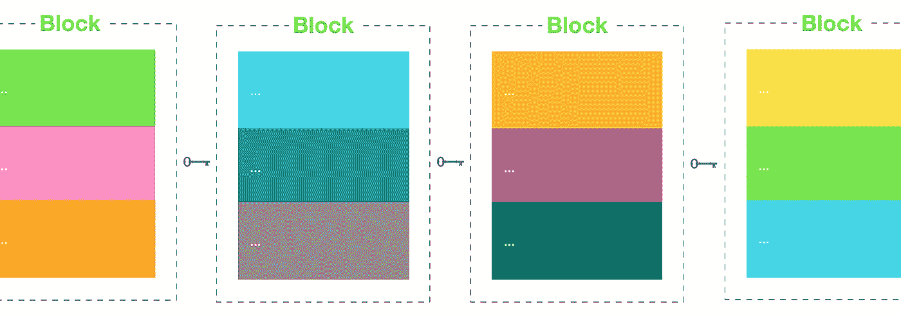
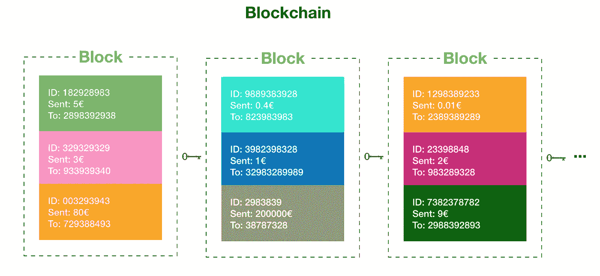
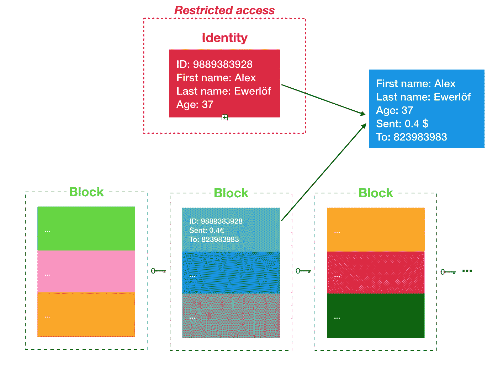

# GDPR 代表区块链

> 原文：<https://medium.com/coinmonks/gdpr-for-blockchain-f73744b9be34?source=collection_archive---------5----------------------->

这篇文章基于我上一篇关于假名化技术的文章中的术语。你可能还想用简单的英语来检查一下 [GDPR。](https://medium.freecodecamp.org/gdpr-terminology-in-plain-english-6087535e6adf)

*在我们开始之前，先声明一下:我的个人博客不代表我现在/以前的雇主。这里提供的信息纯粹基于我自己的研究。我很幸运在一家重视 GDPR 的欧洲跨国公司工作，我有幸向一位隐私律师提问，但这篇文章不一定反映我公司的政策、战略或 GDPR 的实施。*

区块链使用加密和哈希。区块链在保护人们的个人信息方面做得很好，只为交易存储了他们身份的哈希。因此，仅仅通过检查区块链，很难(也不可能)将一段数据或交易与一个真实的人的身份联系起来。

Blockchains usually don’t include any personally identifiable information

但是，区块链贸易服务可能会将一些个人身份信息与区块链中的 id 相关联。例如，如果你在 coinbase 上创建了一个账户，你至少给出了一个电子邮件地址和可能的支付信息。这就是为什么国税局可以要求该公司披露通过网站交易比特币的人的身份。

区块链的原始数据基本上是匿名的。但是如果服务具有一条用户可识别信息(姓名、id、支付信息等)。)他们可以将匿名数据与真实的人相关联，因此，对他们来说，数据是假名的。

Centralized blockchain interaction services who store user identities can deanonymize the data

当涉及到此类服务时，有趣的地方就在这里:

> 如果数据是“可识别的”(包括假名数据)，那么它仍然是个人的。只有在数据真正匿名的情况下，它才在法律范围之外。

我必须向律师核实这一点:如果个人身份之间的联系被**不可逆转地删除**，那么数据就不是个人的，可以留在区块链上(《GDPR 公约》第 4.1 条和序言第 26–29 节)。

如果公司试图从匿名数据中识别个人身份，根据 GDPR，这是“个人数据的处理”，公司将需要数据主体(拥有个人数据的用户)的**法律依据、** **合法目的**和**同意**。关于这些术语的更多信息，请参见 [GDPR 简明英语](https://medium.freecodecamp.org/gdpr-terminology-in-plain-english-6087535e6adf)。

不赘述，区块链使用的是非对称加密，安全性更高。区块链上的每个块都以某种方式加密，将它链接到以前的块，这使得很难(不可能)篡改数据。

然而，这与 GDPR 保证的用户权利中的[相冲突:](https://medium.freecodecamp.org/gdpr-terminology-in-plain-english-6087535e6adf)

1.  [数据擦除](https://gdpr-info.eu/art-17-gdpr/):从系统中擦除数据的能力。区块链记录不可追溯篡改。
2.  [数据修正](https://gdpr-info.eu/art-16-gdpr/):改变系统中数据的能力。区块链几乎是不可改变的。

不幸的是，当谈到区块链时，围绕 GDPR 的这两个方面仍然有一点混乱。例如[这篇文章](/wearetheledger/the-blockchain-gdpr-paradox-fc51e663d047)总结道:

> 这是一个悖论:GPDR 的目标是“让公民重新控制他们的个人数据，同时对世界任何地方的托管和‘处理’这些数据的人实施严格的规则。”此外，GDPR 指出的一件事是数据“应该是可擦除的”。由于丢弃您的加密密钥并不等同于“删除数据”，GDPR 禁止我们在区块链级别存储个人数据。

这根本不是真的！

**数据擦除**在区块链是可能的:通过从系统中删除您的个人身份信息，如您的电子邮件地址、电话号码、支付信息、ip 地址等。以及它与区块链数据的关联，你实际上从这些数据中抹去了一个真实的人，并把它变成匿名数据，这不在 GDPR 的范围之内。但是，如果您在区块链保留任何与记录相关联的数据，那么区块链的数据将被视为假名数据，并且在 GDPR 的范围内。

**数据校正**却是另一回事。正如你不能打电话给你的银行，要求他们改变你的余额，也不可能以更正的名义要求一家公司改变你的数据。区块链的关键特征之一是其可验证性，这意味着区块链中的记录可以由独立的机器来验证。改变某个记录的唯一方法是在其上添加新记录，这在技术上不是纠正，而仅仅是向区块链添加新记录。但是，在与存储用户身份信息的公司打交道时，可能会更新姓名、电子邮件地址、电话号码等个人数据。

如果你想了解最新的文章，一定要关注我。