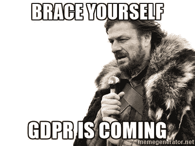

# 区块链世界中的 GDPR

> 原文：<https://medium.com/coinmonks/gdpr-in-a-blockchain-world-4c8067d7388f?source=collection_archive---------10----------------------->

"*2018 年 5 月 25 日之后，区块链的数据会发生什么变化？*
[第十七条前后的语境，以及“被遗忘的权利”](http://www.privacy-regulation.eu/en/article-17-right-to-erasure-'right-to-be-forgotten'-GDPR.htm)。
答案，当然是“*很棘手*”、“*看情况*”和“*很复杂*”的某种组合。

目前，我将忽略实际放在公共区块链上的个人身份信息(PII)。如果你已经这样做了，或者正在这样做，那么，祝你好运——你会需要它的。

在私有/许可的区块链方面，有几个选项(*注意:这里的“私有/许可”是指区块链部署在内部/受控环境中*

1.  **将 PII 存储在其他地方**:这是最显而易见的方法，你将 PII 存储在一个单独的数据库/存储器/无论什么地方，当你做区块链的事情时，你可以有效地连接这个数据。
    好处是，当你收到第 17 条请求时，你可以在这个单独的存储中销毁数据，这样就完成了。
    不好的一面是，嗯
    ——你的鸡蛋现在在一个 PII 篮子里(尽管你可以通过使*变得*多余来处理这个问题，等等。)
    —你已经失去了一些去中心化的好处，但是嘿，这是你必须付出的代价
    —性能现在可以成为一个因素，因为你*每次都要*去做 PII 查找/加入
2.  扔掉密钥:又名“加密垃圾”。基本上，你把 PII 以加密的形式保存在区块链上。当您收到第 17 条请求时，您会丢弃加密密钥，实际上使其无法访问。好的一面是，假设你有一个好的密钥管理系统(KMS ),这很容易做到。然而，不利的一面是——加密是，而且一直是，棘手的。你真的需要确保你的 KMS 是正确的，没有可利用的漏洞，等等。
    —随着时间的推移，加密数据变得易受攻击(加密方案被破解，计算机变得更强大，密钥被泄露，等等)。这也是*键旋转*如此重要的原因之一！).扔掉密钥会取消更新加密的选项，这意味着你可能会陷入比以前更大的麻烦中！
3.  **丢弃数据**:如果区块链是私有的，*理论上*，你可以删除有问题的数据来重建它。好的一面是，这无疑是可行的。不利的一面是，这将是所有皮塔饼之母。想象一下，每当您收到第 17 条请求时，都必须重做万亿字节的散列？
4.  **主张例外** : *第 17 条第 3 款(d)项*有这样一个有趣的说法，即当数据是为了按照第 89 条第(1)款的规定为“*公共利益、科学或历史研究目的或统计目的而存档时，只要第 1 款中提到的权利有可能使这种处理不可能或严重损害目标的实现；*
    【Sooo】***如果*** 你的区块链提供了不变性，而 ***如果*** 你可以振振有词地声称，这种不变性对于“*公共利益、科学或历史研究目的或统计目的****来说是必要的，那么*** 你可能就可以走了。
5.  **声明一个例外 v2** :提醒你一下，如果你存储的 PII 是法规要求的(你是一家银行，这是贷款数据，你不能销毁贷款的证据)，那么嘿，你有一个不能删除数据的理由。哦，如果你在区块链上存储某人的浏览行为…

这里的底线是，你最好的选择是要么**声明一个例外**(如果你可以的话。你最好确定你能做到。咨询律师。求你了。)，或者**把 PII 存放在别处** …

*(* [*这篇文章也出现在我的博客上*](http://dieswaytoofast.blogspot.com/2018/04/gdpr-in-blockchain-world.html) *)*