# 双子座评论:美国最好的密码交易所？

> 原文：<https://medium.com/coinmonks/gemini-review-561f717d2141?source=collection_archive---------0----------------------->

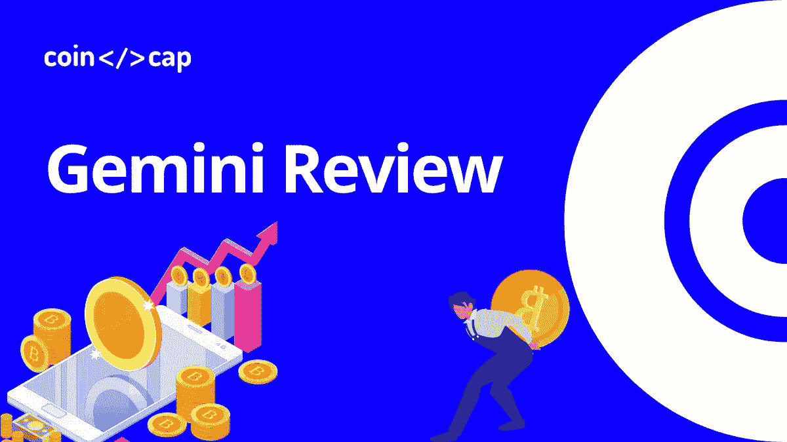

Gemini Review

[**双子座**](https://gemini.sjv.io/gbP2q2) 是美国[最受欢迎的密码交易所](https://coincodecap.com/crypto-exchange-usa)之一。因此，这份 Gemini 综述将介绍所有平台特性，并深入探讨其费用结构。我们还将学习如何通过[双子座获得](https://gemini.sjv.io/6bbqzb)的被动收入。

# 摘要

*   它适用于所有州的美国居民。
*   用户可以通过网站和手机应用程序购买、出售、存储和消费他们的加密货币。
*   [**Gemini**](https://gemini.sjv.io/gbP2q2) 的主要卖点是其安全易用的界面。
*   这个交易平台支持 30 多种加密货币。
*   用户可以使用借记卡在 Gemini 上交易。
*   它支持美元，澳元，加拿大元，欧元，英镑，新加坡元，和 HKD 法定货币。
*   他们还为高级水平的交易者提供产品“积极交易者”，为初级水平的交易者提供双子交易。
*   除此之外，它还支持其他产品，包括双子托管，双子钱包，双子支付，双子清算。
*   与双子赚取功能，用户可以赚取高达 7.4 %的加密利息。
*   双子座密码交易所也有自己的硬币“双子座美元”
*   用户可以通过提交请求或通过实时聊天来获得问题的答案。
*   它高度关注安全性，是最安全的平台之一。

[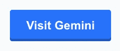](https://gemini.sjv.io/gbP2q2)

Visit Gemini

# 什么是双子座交流？

**Gemini** 是一家总部位于纽约的加密货币交易所，由[文克莱沃斯双胞胎](https://en.wikipedia.org/wiki/Cameron_Winklevoss)于 2014 年创立。双子座的创始人也因 ConnectU(脸书的前身)而闻名。它属于美国监管的少数几个加密货币交易所

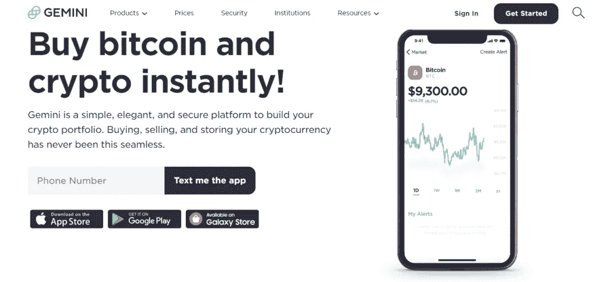

Gemini

该交易所提供大约 30 多种加密货币，具有最高的安全性和安全措施。他们支持初级和高级交易者的产品。

# 双子座评论:帐户注册

*   首先，访问双子座的网站，点击右上角的“开始”。
*   现在，填写详细信息，并点击下一步。
*   他们会要求你输入你的电话号码，填好并点击“下一步”
*   输入您在手机上收到的 OTP，您的帐户已注册。
*   使用 Gemini 应用程序注册的步骤类似于 Gemini web。

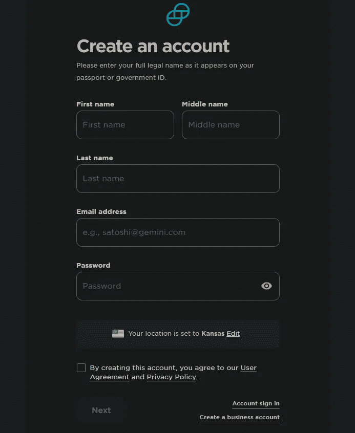

Gemini review: Account Registration

# 双子座评论:验证

[**双子交换**](https://gemini.sjv.io/gbP2q2) 的验证过程是强制性的。没有验证，用户将无法开始交易。美国居民需要的文件:

*   他们可以提交国家颁发的身份证、驾照、护照、护照卡或永久居民卡。
*   对于国际用户:用户护照从他们的国籍或国民身份证和/或驾驶执照。

## 开始验证的步骤

*   首先，登录双子星交易所。
*   现在，在右侧的“完成您的帐户”部分，点击“上传 Id 购买和提取。”
*   现在，输入正确的地址，上传文件。

# 双子座怎么用？

一旦您完成了注册和验证过程，您需要设置您的银行帐户。之后，你就可以开始交易了。

## 如何给双子座存资金？

Gemini 支持三种支付方式

## 双子座评论:通过格子立即链接银行

*   有了[格子](https://plaid.com/)就可以存取你的金额了。
*   用户可以即时购买比特币(仅适用于美国居民)。
*   用户必须提交他们的联系信息、账户交易信息，最后是账户信息。
*   像 [BOA](https://www.bankofamerica.com/) (美银) [BBVA](https://www.bbva.com/) 、 [EVO Banco](https://www.evobanco.com/) 等银行都有。

## 用 Gemini 手动链接银行

*   如果你在前面的方法中没有找到你的银行，那么你可以使用这个。
*   用户可以存入和提取他们的金额。
*   核实有存款的银行账户大约需要五个工作日。

## 用借记卡方法给双子座加钱

[**双子**](https://blog.coincodecap.com/go/gemini) 平台允许其用户链接自己的借记卡。有了这个:

*   用户可以立即购买密码。
*   他们可以在两个工作日内通过微交易验证他们的卡。
*   用户只能链接那些本国货币是 Gemini 支持的法定货币之一的借记卡。

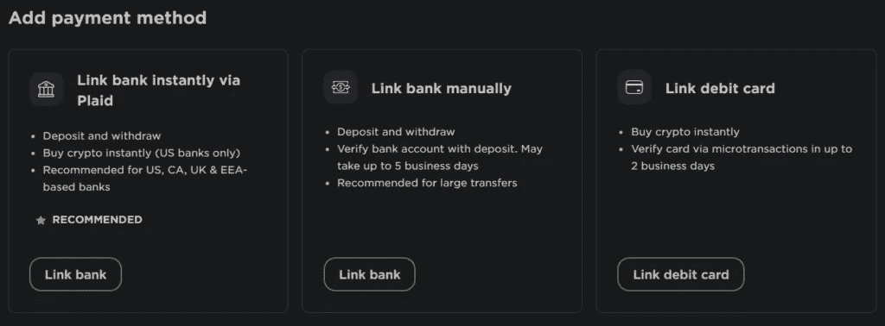

Gemini review: Deposit funds

# 如何在双子座上购买比特币？

*   登录您的 **Gemini** 账户。
*   从你的仪表盘中搜索你想要购买的加密(在这种情况下是比特币)并点击它。
*   在右边，你会看到“进行交易”部分。
*   点击“购买”，选择频率，输入金额，然后点击继续。
*   点击“查看订单”,进入确认屏幕。
*   审核后，点击“下订单”并立即执行您的订单。

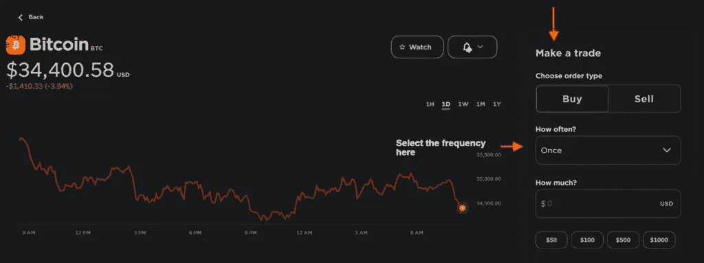

Buy Bitcoin on Gemini

# 双子费用

双子座加密费分为五个部分:手机费，网络费，活跃交易费，托管费，和转移费。

## 双子座评论:移动和网站费用

尽管该平台对移动和网页浏览费用有所区别，但两者的 [**双子**](https://blog.coincodecap.com/go/gemini) 市场订单费用是相同的。然而，与便利费不同，双子交易费取决于用户的订单金额和法定货币。例如，对于 10 美元的订单，交易金额将是 0.99 美元。您可以在平台上查看[移动](https://www.gemini.com/fees/mobile-fee-schedule#section-fee-examples)和 [web](https://www.gemini.com/fees/web-fee-schedule) 交易费用。

## 双子座交易所费用

像所有其他平台一样， **Gemini** 也利用庄家收取费用的模式来确定所有订单的交易费用。Gemini 交易费用取决于用户以国家美元计算的总交易量。此外，30 天交易量越高，双子座交易费用率越低。因此，对于 0 交易量，最高的接受者和做市商手续费率分别为 0.35%和 0.25%。对于 500，000，000 美元及以上的交易量，最低的收单和成交费率分别为 0.03%和 0%。请注意，这些费用细节仅适用于 active traders(Gemini 的产品)。

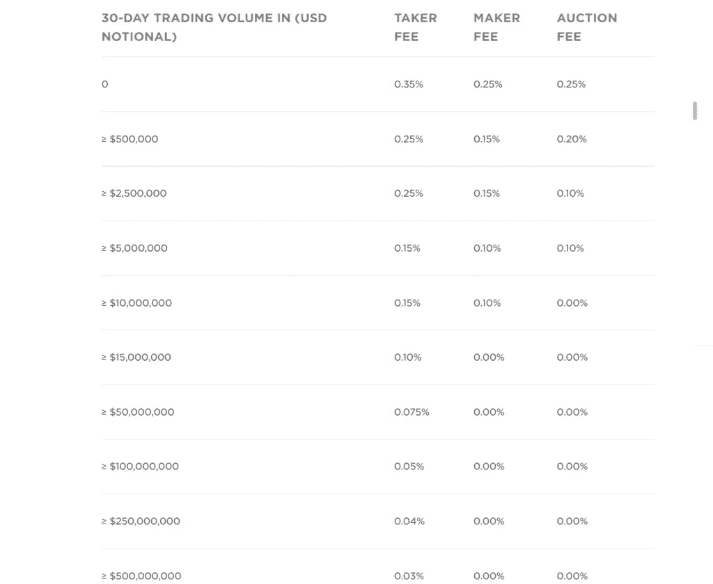

Gemini Exchange Fees

## 双子座托管费

[**双子星**](https://gemini.sjv.io/gbP2q2) 产品“托管”费用相差很多。不同的因素，如用户/投资者和机构的要求，活动量，资产组合和规模控股发挥着重要作用，在决定最终的费用。因此，双子座总是给他们的顾客一个特别的价格。

## Gemini 提款费

[**Gemini**](https://blog.coincodecap.com/go/gemini) 通过电汇存入支持的加密货币和法币不收取任何费用。然而，当用户通过借记卡存款时，它要求收取 3.49%的费用。个人客户的双子座提现费用全免，每月限额 10 笔。如果超过这些限额，他们必须根据取款类型支付单独的费用。机构客户的情况也类似，限额为每月 50 次提款。此外，双子座比特币的费用约为每比特币 0.001 BTC。访问[双子费用](https://www.gemini.com/fees/transfer-fee-schedule#section-deposit-fees)部分，查看关于双子提款费用的更多详情。

Visit Gemini

# 双子座评论:产品

## 双子座密码交易所

*   它最适合初学者，因为它的界面简单，易于交互。
*   用户可以查看排名靠前的公司、交易量最高的公司、最近推出的公司以及 [DeFi](https://blog.coincodecap.com/the-ultimate-guide-to-defi-decentralized-finance) cryptos。
*   Gemini exchange 还允许用户将硬币添加到他们的观察列表中。
*   你可以交易资产，设定定期买入，管理你的持有量。
*   在投资组合部分，用户可以检查他们的完整交易，经常性购买，价格警报和未决订单。

## Gemini ActiveTrader

*   Gemini ActiveTrader 是一个高级交易界面，提供高级图表、附加订单类型、交易对和更深入的订单簿可见性。
*   它支持八种订单类型:市价、限价、立即或取消(IOC)、成交或取消(FOK)、做市商或取消(MOC)、仅拍卖限价(AO)、兴趣指示(IOI)和止损限价。
*   Gemini exchange 的 ActiveTrader 可以在微秒内执行交易。
*   它还有一个中央限价订单簿，遵循价格-时间优先模型。
*   用户可以执行多种订单类型，包括大宗交易。
*   每天还会针对特定的交易对进行拍卖，包括周末和节假日。

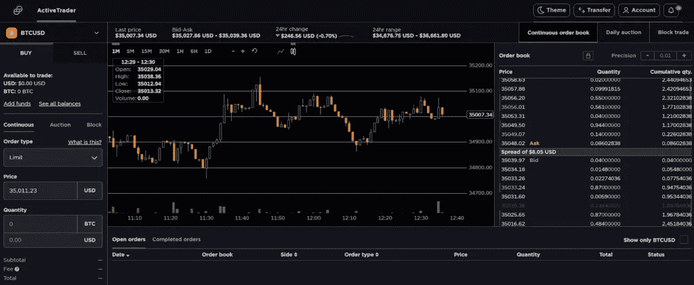

Gemini ActiveTrader Reviews

## 如何在 ActiveTrader 上下单？

*   从 [Gemini 设置](https://exchange.gemini.com/settings/profile)页面切换到 ActiveTrader。
*   从左上角的下拉菜单中选择您喜欢的交易对。
*   选择购买->市场(订单类型)。
*   在“数量”部分输入数量。
*   确认订单详情，然后按“购买”完成您的订单。

# 双子座收入

*   [**Gemini Earn**](https://gemini.sjv.io/6bbqzb) 是一个借贷程序，用户可以将其密码借给机构借款人，并赚取每日利息。
*   你可以赚取高达 7.4% APY 的每日复利。
*   但是，Gemini Earn 仅适用于美国和新加坡居民。
*   对于赎回您的资产，没有隐藏的费用，提款，或转移费用。
*   密码的价格根据特定硬币的供给和需求而变化。

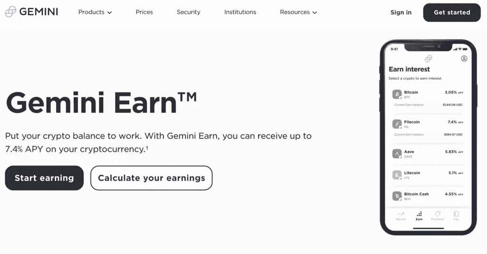

Gemini Earn Review

## Gemini Earn 入门

*   登录您的 Gemini 帐户。
*   点击导航栏中的 Gemini Earn 选项卡。
*   选择您偏好的加密，并输入您要存放的加密数量。
*   查看并同意条款和授权协议，并同意主贷款协议(如果这是您的第一笔存款)。
*   现在，查看确认页面，并单击“确认”
*   一旦你的密码被转移，你将开始每天赚取利息。

# 双子座评论:清除

*   在这个 Gemini exchange 产品的帮助下，用户可以解决连续订单簿的权衡问题。
*   [Gemini clearing](https://www.gemini.com/clearing) 不要求任何最小交易规模，并提供具有竞争力的市场价格。
*   交易细节保持匿名，没有数据在 Gemini market data feed 上发布。

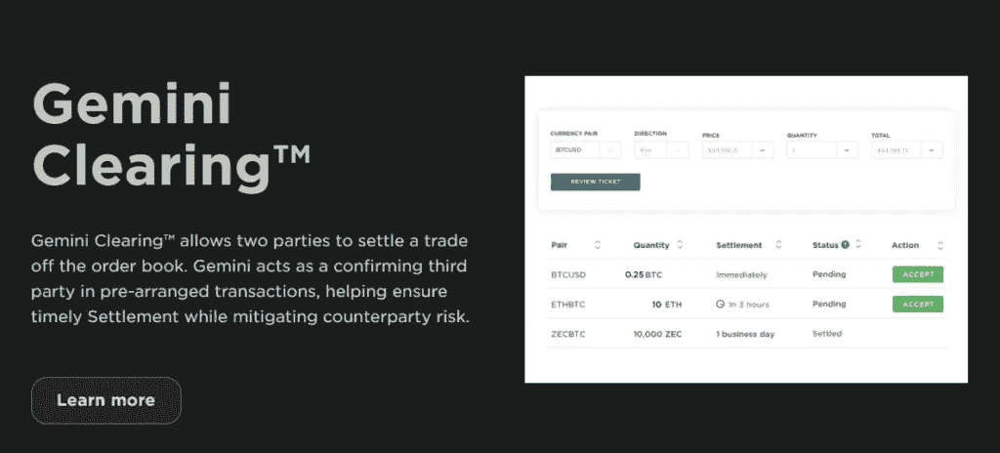

Gemini Clearing review

# 双子座监护权

*   [**双子座**](https://blog.coincodecap.com/go/gemini) 托管用于以安全、规范、合规的方式存储用户的数字资产。
*   该产品受纽约州信托公司监管。
*   这是第二个离线的专有冷藏系统。
*   这是想要最高安全级别的用户的首选。
*   用户可以在当天提取资产，并在 Gemini 平台上进行交易。
*   客户还可以获得专门的客户代表和 24/7 专家客户支持。
*   Gemini 保管公司存储其支持的所有资产。

# 双子座薪酬

*   有了 Gemini Pay，用户现在可以用密码在零售店购物。
*   Gemini Pay 可让您与全美 30，000 多家零售点建立联系。
*   客户进行的交易将是保密和安全的，而且不收取任何费用。
*   Gemini Pay 是与 Flexa 合作开发的，Flexa 是一个使用加密货币将买家和卖家联系在一起的支付网络。
*   您可以从Gemini app 访问 Gemini Pay。

# 双子座钱包

*   Gemini 允许其客户使用 Gemini 存款地址将他们的资产存储在热钱包或冷存储系统中。
*   用户从 Gemini 的 hot wallet 获得防止数字资产被盗的保险，由世界一流的保险商提供支持。

# 双子座美元

*   [双子座币](https://www.gemini.com/dollar)双子座稳定币，是建立在以太坊网络上的代币，与美元 1:1 挂钩。
*   双子座的美元也可以在以太坊网络上转移。
*   用户可以用它来放贷，赚取利息。
*   你也可以用 GUSD 来交易和投资 DeFi。
*   除了 Gemini Pay，客户还可以使用它。
*   这个平台不为 GUSD 提供任何买卖费用。

# 双子座手机应用

**Gemini 应用**可供 [Android](https://play.google.com/store/apps/details?id=com.gemini.android.app&hl=en_IN&gl=US) 和 [iOS](https://apps.apple.com/us/app/gemini-buy-sell-crypto/id1408914447) 用户使用。用户界面时尚且易于使用。例如，使用移动应用程序，用户可以:

*   安全地购买、销售和存储 Gemini 支持的密码。
*   创建价格提醒。
*   设定重复购买。
*   最大化他们的交易策略。
*   把自己的资产投入双子座赚取，可以赚取高达 7.4%的利息。
*   完成他们的验证。
*   使用支持系统。
*   通过 Gemini pay 买东西。

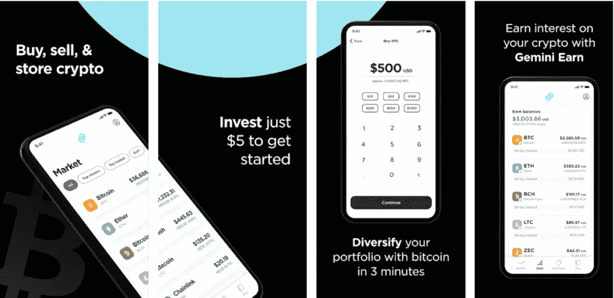

Gemini app

# Gemini Exchange 客户支持

[**双子座**](https://gemini.sjv.io/gbP2q2) 客户支持有一个深入的常见问题解答部分，涵盖从注册到产品的所有信息。用户可以通过电子邮件支持服务提出他们的问题。而且，他们还支持实时聊天，但不支持与双子客服的实时聊天。根据他们的说法，如果用户的查询在联系支持部门后仍未得到解决，他们可以向纽约州金融服务局投诉(针对居住在纽约的用户)。你可以获得更多关于[双子座支持](https://support.gemini.com/hc/en-us/articles/204732835-Contact-us)的信息。

# 双子座安全评论

Gemini 计算机化安全系统围绕这三点展开:

*   保护系统和用户资产免受外部威胁。
*   防止人为错误。
*   最后，防范内部访问的滥用。

他们将大部分用户的密码保存在离线的、有空隙的冷藏系统中。同时，一小部分存在在线热门钱包中。此外，双子座 KYC 是有涵盖第三点，即通过 KYC，他们试图消除欺诈行为。

为了帐户安全，Gemini 支持双因素身份验证(2FA ),当用户登录他们的帐户或进行加密取款时，需要使用这种身份验证。

# 双子座评论:利弊

## 赞成的意见

*   **Gemini** 提供 30 多种加密货币。
*   高度安全。
*   大约八种不同的产品来赚取更多的利润。
*   最适合初学者和高级交易者。
*   适用于美国居民。
*   良好的客户支持。
*   注册过程是可访问的，没有任何忙乱的过程。
*   移动应用程序可用。

## 骗局

*   费用相比其他平台有点高。
*   另外，平台是受监管的，不支持保证金交易。

# 双子座评论:结论

最后，我们可以说，无论用户是初学者还是高级水平的交易者，双子都适合。从简单直观的网络平台到先进的 ActiveTrader 平台， **Gemini** 提供了可以支持每个用户的功能。它为用户提供了 30 多种高安全性的加密货币。费用相对于其他平台来说有点高。然而，它的产品和安全性掩盖了这一点。他们还支持专门的常见问题解答部分，以帮助他们的客户通过电子邮件联系 Gemini 进行进一步的查询。

Visit Gemini

# 常见问题

**双子座交易所安全吗？**

Gemini 属于那些以用户数据和资产安全为第一座右铭的特许交易所之一。而且，到现在为止，双子座从来没有被黑过。此外，用户存储在其 **Gemini** 账户中的美元是 FDIC 保险的。该平台通过符合 SOC 1 类型 1、SOC 2 类型 1 和类型 2 来利用安全性。

**双子座交易所在哪里？**

Gemini 加密货币交易平台总部位于美国纽约州纽约市

**你一天能给双子座交易所增加多少资金？**

如果存款方式是电汇，个人和机构账户没有存款限制。加密资产存款也是如此。然而，借记卡每天的购买限额是 1000 美元。

**如何退出双子座交易所？**

**–**登录你的[双子](https://blog.coincodecap.com/go/gemini)账号。
**–**选择导航工具栏中的转移图标，然后选择“退出 Gemini”
**–**从下拉菜单中选择“货币”和银行账户。
**–**输入您想要提取的金额。
**–**查看您的提款并按下“请求提款”

双子座有推荐计划吗？

是的，[双子座](https://blog.coincodecap.com/go/gemini)交易平台已经向用户开放了推荐程序。如果推荐的用户在帐户创建后的 30 天内购买或出售任何价值 100 美元的密码，他们会向双方提供 10 美元。

> 加入 Coinmonks 电报频道，了解加密交易和投资

## 另外，阅读

*   [币安 vs 比特邮票](https://coincodecap.com/binance-vs-bitstamp) | [比特熊猫 vs 比特币基地 vs Coinsbit](https://coincodecap.com/bitpanda-coinbase-coinsbit)
*   [如何购买 Ripple (XRP)](https://coincodecap.com/buy-ripple-india) | [非洲最好的加密交易所](https://coincodecap.com/crypto-exchange-africa)
*   [非洲最佳加密交易所](https://coincodecap.com/crypto-exchange-africa) | [胡交易所评论](https://coincodecap.com/hoo-exchange-review)
*   [eToro vs robin hood](https://coincodecap.com/etoro-robinhood)|[MoonXBT vs Bybit vs Bityard](https://coincodecap.com/bybit-bityard-moonxbt)
*   [Stormgain 评论](https://coincodecap.com/stormgain-review) | [Probit 评论](https://coincodecap.com/probit-review) | [北海巨妖评论](/coinmonks/kraken-review-6165fc1056ac)
*   [如何在势不可挡的域名上购买域名？](https://coincodecap.com/buy-domain-on-unstoppable-domains)
*   [印度的秘密税](https://coincodecap.com/crypto-tax-india) | [altFINS 审查](https://coincodecap.com/altfins-review) | [Prokey 审查](/coinmonks/prokey-review-26611173c13c)
*   [Blockfi vs 比特币基地](https://coincodecap.com/blockfi-vs-coinbase) | [BitKan 评论](https://coincodecap.com/bitkan-review) | [期货交易机器人](/coinmonks/futures-trading-bots-5a282ccee3f5)
*   [南非的加密交易所](https://coincodecap.com/crypto-exchanges-in-south-africa) | [BitMEX 加密信号](https://coincodecap.com/bitmex-crypto-signals)
*   如何在 WazirX 上购买柴犬(SHIB)硬币？
*   [MoonXBT 副本交易](https://coincodecap.com/moonxbt-copy-trading) | [阿联酋的加密钱包](https://coincodecap.com/crypto-wallets-in-uae)
*   [MoonXBT vs Bybit vs 币安](https://coincodecap.com/bybit-binance-moonxbt) | [硬件钱包](/coinmonks/hardware-wallets-dfa1211730c6)