# 双子座 vs 比特币基地|美国最好的密码交易所是哪家？

> 原文：<https://medium.com/coinmonks/gemini-vs-coinbase-aed155eacf89?source=collection_archive---------3----------------------->

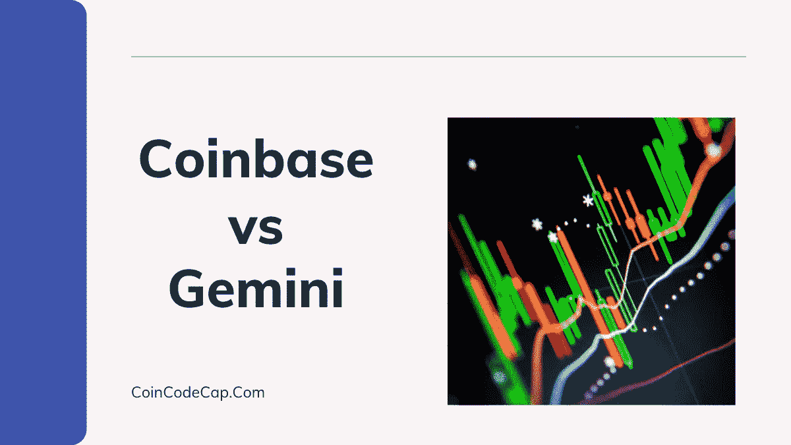

在这篇文章中，我们将比较在美国运行的两个最著名和受监管的[加密交易所](https://blog.coincodecap.com/go/crypto-exchange)。 [**双子座**](https://blog.coincodecap.com/go/Gemini) 和 [**比特币基地**](https://blog.coincodecap.com/go/coinbase) 都为你提供了购买、出售和交易加密资产的直观平台。然而，让我们试着找出哪一个更适合你的交易之旅。

# 总结(TL；博士)

*   双子座和比特币基地都在美国提供合法的加密交易服务。
*   [双子星](https://blog.coincodecap.com/go/gemini)提供[双子星主动交易者](https://gemini.sjv.io/kj06Pn)、[双子星支付](https://gemini.sjv.io/LPX6Yj)、[双子星托管](https://gemini.sjv.io/DVKoMj)等产品。
*   [比特币基地](https://blog.coincodecap.com/go/coinbase)也有种类繁多的产品，如[比特币基地 Prime](https://prime.coinbase.com/)[比特币基地 Pro](https://pro.coinbase.com/)[赚学](https://coinbase-consumer.sjv.io/7m5Pag)等。
*   与双子星相比，比特币基地提供了更好的用户界面。
*   你可以使用 [Gemini wallet](https://gemini.sjv.io/P0yxvz) 在全美 30，000 多家零售商处付款。
*   根据 Gemini 的说法，在他们的平台上，你可以在不到 3 分钟的时间内设置你的账户并购买比特币。
*   双子座和比特币基地的费用都很高；然而，与双子座相比，比特币基地收取更高的费用。
*   安全特征是两个交易所的优先事项；然而，Gemini 提供业界领先的安全服务。
*   如果出现安全漏洞，你可以通过电话锁定你在比特币基地的账户。

# 双子座是什么？

[**双子座**](https://blog.coincodecap.com/go/gemini) 是由[文克莱沃斯双胞胎](https://en.wikipedia.org/wiki/Winklevoss_twins)创立的持牌纽约信托公司。是的，兄弟们奠定了脸书的想法。该交易所提供了一个直观的[加密交易平台](https://blog.coincodecap.com/crypto-exchange)。它是世界上第一个认证的 SOC 1 Type 1 和 SOC 2 Type 2 [密码交易所](https://blog.coincodecap.com/go/crypto-exchange)托管机构。

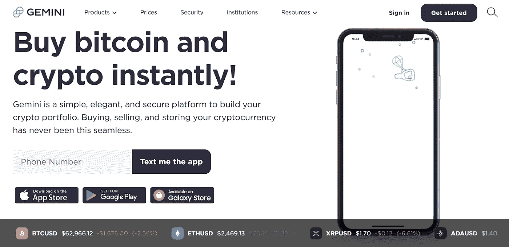

Gemini 向个人和机构提供购买、出售和存储加密资产的服务。交易所提供[主动交易者](https://gemini.sjv.io/XxYkvo)、[双子托管、](https://gemini.sjv.io/DVKoMj) [双子清算](https://gemini.sjv.io/zaNM5O)、[双子钱包](https://gemini.sjv.io/P0yxvz)、[双子赚](https://gemini.sjv.io/6bbqzb)等产品。

# 什么是比特币基地？

[**比特币基地**](https://blog.coincodecap.com/go/coinbase) 是美国最早的合法[加密交易平台](https://blog.coincodecap.com/go/crypto-exchange)之一。它提供了一个直观和有益的交易平台。交易所通过三个不同的部分提供服务。

比特币基地负责买卖加密资产。比特币基地专业版用于交易加密资产，比特币基地高级版用于金融直觉和经纪业务。

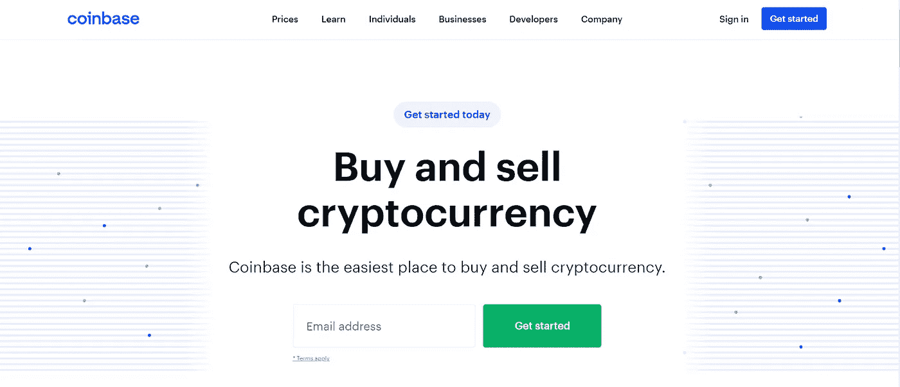

# 双子座 vs 比特币基地:交易选择

在比较美国两个最受欢迎的交易所时，我们不能忽略如何在这两个平台上获得回报。

# 双子座交易期权

[**双子**](https://blog.coincodecap.com/go/gemini) 提供双子清算、托管等一系列功能。，我们将在下面讨论它们:

## 双子座活跃交易者

[双子活跃交易员](https://gemini.sjv.io/XxYkvo)是双子为其用户提供的交易平台。日内交易者主要喜欢主动交易者，它可以在微秒内执行交易。

您可以在 Gemini active trader 中使用限价、市价或取消、立即或取消、填充或取消来执行您的订单。也有三种模式来购买或出售加密:连续，拍卖，和块。

## 双子座监护权

[**双子座**](https://blog.coincodecap.com/go/gemini) 众所周知在加密市场拥有最好的安全服务，因此它提供双子座托管。这个特别的选项允许您将您的资产存储在高度安全的机构级加密存储库中。

要了解更多关于在 Gemini 存储资产的信息，你可以从这里下载 Gemini 加密保管指南[。](https://gemini.sjv.io/x9kMjA)

## 双子座空地

[Gemini clearing](https://gemini.sjv.io/zaNM5O) 帮助您从保持交易指令簿的个人手中购买/出售加密资产。Gemini 在点对点结算中充当第三方，确保预先安排交易、及时结算并降低风险。

P2P 和解的双方都需要完成他们的 KYC。交易方也保持匿名，因为 Gemini 不在其市场数据馈送中公布他们的交易细节。

## 双子座薪酬

[**Gemini**](https://blog.coincodecap.com/go/gemini) 为您提供在全美 30，000 多家零售店使用您的加密资产进行支付的选项。你只需下载 [Google Play](https://play.google.com/store/apps/details?id=com.gemini.android.app) 、 [Apple app](https://itunes.apple.com/us/app/gemini-buy-sell-crypto/id1408914447) 或 [galaxy store](http://apps.samsung.com/appquery/appDetail.as?appId=com.gemini.android.app) 上的 Gemini 应用程序，并使用支付选项扫描二维码，就可以做到这一点。

## 双子座收入

双子座允许你赚取高达 7.4% APY 的加密资产利息。你可以在 Gemini 购买或存放任何你想购买的加密资产，然后注册 [Gemini Earn](https://gemini.sjv.io/6bbqzb) 来获得你资产的权益。您也可以随时将您的资产(您的原始密码+利息)转移回您的交易账户。

# 比特币基地交易期权

该交易所提供一系列服务，有时甚至提供免费的加密资产。让我们一个一个来看:

## 买卖密码

在 [**【比特币基地】**](https://blog.coincodecap.com/go/coinbase) 的官方网站，你可以买卖海量的加密资产。但是，在开始买卖之前，您需要将加密资产存入您的帐户。该平台还为你提供 10 美元，用于建立 50 美元的定期购买。

## 比特币基地专业

比特币基地专业版为您提供了一个安全交易多个加密资产的平台。该平台通过其先进的交易选项和图表，为专业交易者提供卓越的控制。[比特币基地专业版](https://pro.coinbase.com/)也为其交易员提供保险，但与比特币基地相比，它的用户界面更复杂。

## 比特币基地总理

比特币基地 Prime 是希望投资和交易加密资产的机构、高净值个人和企业投资者的首选。比特币基地 Prime 提供各种机构工具，如算法订单、场外交易等。

## 比特币基地学习并获得加密

学习和获得加密是比特币基地为其用户提供的一项独特服务。该平台向您传授一些关于特定加密资产的经验。它免费给你一定数量的资产来获得经验，并在密码市场进行交易。

# 双子座 vs 比特币基地:用户界面

我们的思维最有可能被设计干净有创意的东西所吸引，而不是沉闷的布局。这就是用户界面发挥作用的地方；它是一个平台最关键的部分。双子星座**和比特币基地**都为他们的用户提供了一个简洁明了的用户界面。****

****在一端，比特币基地有一个直观的，丰富多彩的，有吸引力的用户界面。另一方面，Gemini 提供了一个干净易用的界面。在当今世界，比特币基地可以被认为是一个有更好的用户界面。****

# ****双子座 vs 比特币基地:钱包****

****[加密钱包](https://blog.coincodecap.com/best-crypto-wallets-app)对于您在交易所存储和使用您的加密资产是必不可少的。因此，很明显，我们必须了解这两个平台上的钱包。****

## ****双子座钱包****

****[**双子座**](https://blog.coincodecap.com/go/gemini) 提供即时存取款的热门钱包。但是，如果您希望存储许多加密资产，您可以使用机构级冷存储系统。世界级的保险承保人确保你在[双子钱包](https://www.gemini.com/wallet)中的所有资产在违约时不会遭受损失。你可以从这里了解更多关于双子座[的保险政策。](https://www.gemini.com/legal/user-agreement#section-fdic-insurance)****

****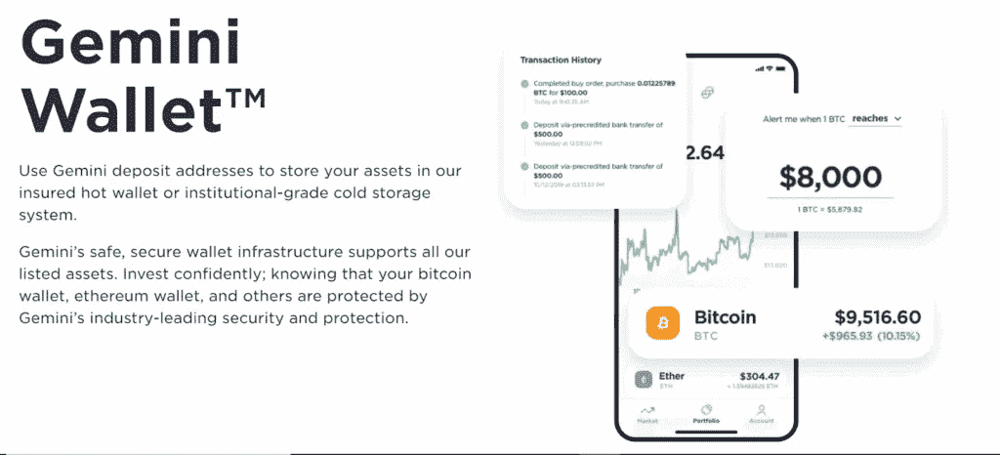****

## ****比特币基地钱包****

****[比特币基地钱包](https://blog.coincodecap.com/coinbase-wallet-review-the-best-bitcoin-wallet)让您将所有数字资产存放在一个地方。在比特币基地钱包，你所有的钥匙都受到生物认证和安全飞地的保护。钱包可以让你在 [**比特币基地**](https://blog.coincodecap.com/go/coinbase) 上支付给你的其他朋友，你可以从[比特币基地钱包手机 app](https://play.google.com/store/apps/details?id=org.toshi&hl=en_IN&gl=US) 轻松完成。****

# ****双子座 vs 比特币基地:移动应用****

****在当今世界，远程就是一切，我们都希望通过口袋里的设备访问所有服务。因此，在这一部分，我们将涵盖两个平台的移动应用程序。****

# ****双子座手机应用****

****[Gemini 应用](https://play.google.com/store/apps/details?id=com.gemini.android.app&hl=en_IN&gl=US)让你可以直接从智能手机上交易和管理你的资产。你可以为市场波动创建警报，并在适当的时候建仓。交易所声称你可以在 3 分钟内创建一个账户并购买你的第一个密码。****

# ****比特币基地手机应用****

****[比特币基地手机应用](https://play.google.com/store/apps/details?id=com.coinbase.android&hl=en_IN&gl=US)通过在你的设备上提供几乎所有必要的选项，让交易变得更简单。该应用程序提供了一个干净直观的用户界面。然而，由于用户经常面临延迟，人们对该应用的稳定性有所猜测。****

****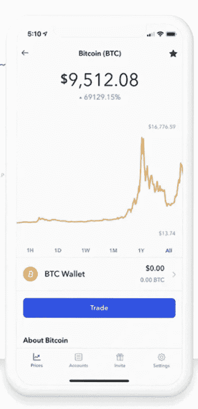****

# ****双子座 vs 比特币基地:如何购买比特币？****

****[比特币](https://blog.coincodecap.com/a-candid-explanation-of-bitcoin)是当今世界最有价值的资产之一。它的价值一直在上升，而且似乎不会很快放缓。所以我们不得不讨论在任一交易所购买比特币的步骤。****

## ****如何在双子座购买比特币？****

****[**双子座**](https://blog.coincodecap.com/go/gemini) 提供了一个简单的购买比特币的流程，你可以按照下面的步骤来做同样的事情:****

1.  ****首先，访问双子座的官方网站，并登录您的帐户。****
2.  ****其次，如果你在 Gemini 上没有帐户，那么创建一个，并完成验证过程。****
3.  ****第三，如果你已经有资金在你的帐户，访问标题的购买标签；如果你没有，通过基金部分存入一些资金。****
4.  ****最后，从资产列表中选择比特币，输入所有细节，然后点击购买按钮。****
5.  ****一旦市场满足你的订单要求，交易所就会满足你的订单。****

## ****如何在比特币基地购买比特币？****

****在 [**比特币基地**](https://blog.coincodecap.com/go/coinbase) ，购买比特币，你需要的只是一个账户和账户里的一些资金。但是，您仍然可以按照以下步骤来完成:****

1.  ****首先，访问比特币基地的官方网站。****
2.  ****现在，如果您没有帐户，请创建一个。如果你有一个，然后登录你的帐户。****
3.  ****下一步是在你的账户中存入一些资金。****
4.  ****因此，请转到“投资组合”选项卡，然后单击“存款资金”按钮。****
5.  ****现在回到仪表板，点击标题中的买入/卖出。****
6.  ****然后选择比特币作为购买选项，输入你希望购买的金额，然后点击按钮。****

# ****双子座 vs 比特币基地:费用****

****进行交易时，你必须记住的最重要的一点是你为交易支付的费用。因此，在本节中，我们将比较两家交易所的费用。****

# ****双子费用****

****[**Gemini**](https://blog.coincodecap.com/go/gemini) 提供一系列服务，并根据您所使用的服务提供多种收费结构。****

## ****双子座存款和取款费****

****Gemini 的所有电汇和加密存款都是免费的，除了通过借记卡存款，费用为购买总额的 3.49%。交易所对每笔 BTC 取款收取 0.001 BTC 的手续费。要了解各种资产的提款费用，您可以[点击此处](https://www.gemini.com/fees/transfer-fee-schedule#section-withdrawal-fees-individual-customers)。****

## ****Gemini ActiveTrader 费用表****

****交易所根据你所有订单的总交易量来决定你的净交易费。你可以根据你的 30 日交易量，在下表的帮助下，计算出你的庄家、买家和拍卖费。****

****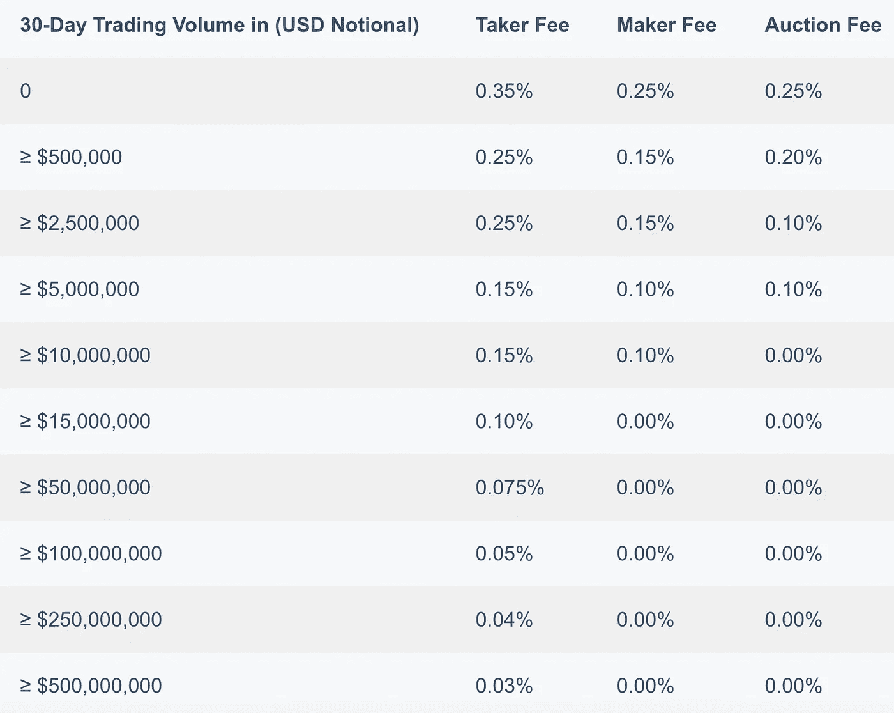****

****了解 Gemini 其他类型的费用，如[托管费用表](https://www.gemini.com/fees/custody-fee-schedule)、 [API 费用表](https://www.gemini.com/fees/api-fee-schedule)、[网络费用表](https://www.gemini.com/fees/web-fee-schedule)等。，可以[点击这里](https://www.gemini.com/fees)。****

# ****比特币基地费用****

****[**比特币基地**](https://blog.coincodecap.com/go/coinbase) 允许你用各种方法购买加密资产，如借记卡、Paypal 等。然而，该平台也会根据你的位置和支付方式收取高额费用。您可以在下表中查看美国贸易商的费用:****

****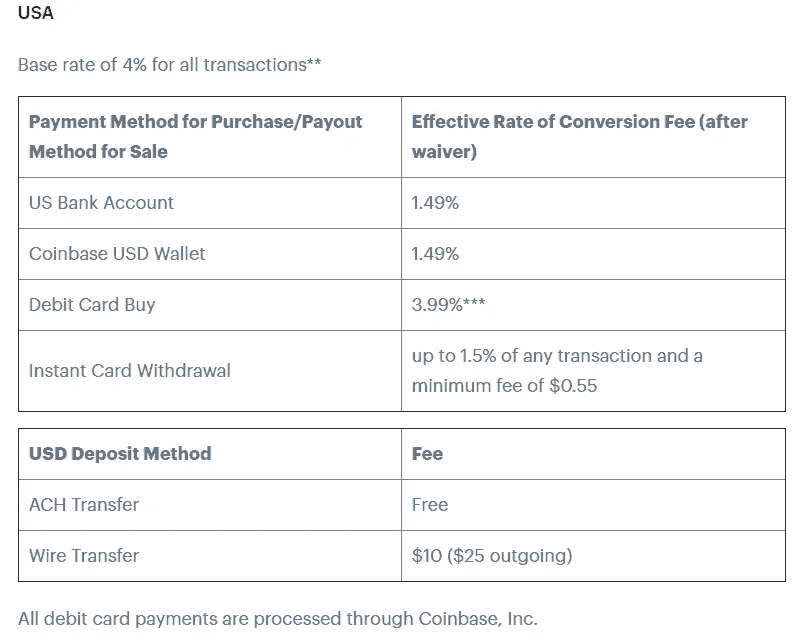****

****在[比特币基地专业版](https://pro.coinbase.com/)，当订单完成时，你必须支付 0.04%到 0.5%的佣金，这取决于一个分级系统。您可以在下表中观察不同层级的接受者和制造者费用:****

****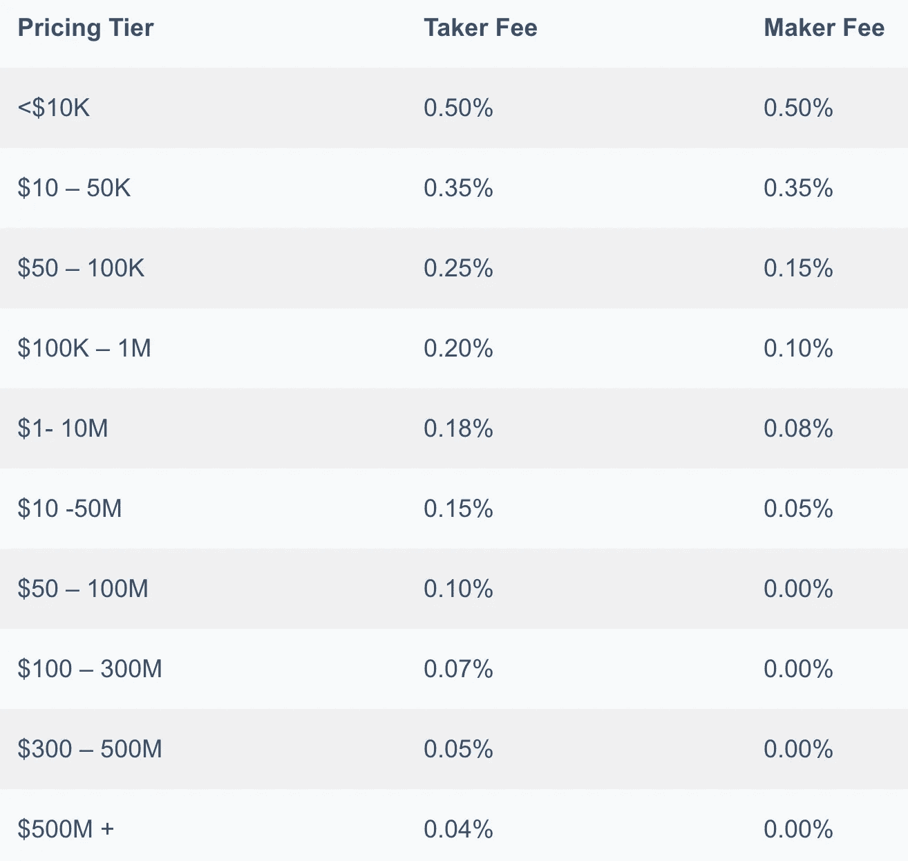****

# ****双子座 vs 比特币基地:安全****

****我们都希望我们的资产处于世界级的安全状态。这两种交换都为您提供了最佳的安全选项；然而，让我们来看看哪个更好？****

## ****双子座安全公司****

****[**Gemini**](https://blog.coincodecap.com/go/gemini) 以提供加密市场上最好的安全选项而闻名。交易所主要遵循三个安全原则:****

*   ******抵御外部威胁**:双子座使用等级为[FIPS 140–2 三级](https://en.wikipedia.org/wiki/FIPS_140-2#Level_3)或更高等级的冷库。所有私钥都在 HSMs 上生成、存储和管理。****
*   ****防止人为错误:每当你试图登录或取款时，交易所使用双因素认证。交易所加密您的密码和所有其他个人信息在静态和传输中。****
*   ******防止内部访问被滥用:**从 Gemini 的冷库转移资金需要不同个人的多次验证。即使双子座的首席执行官和总裁在一起，也没有从冷库中提款的许可。****

****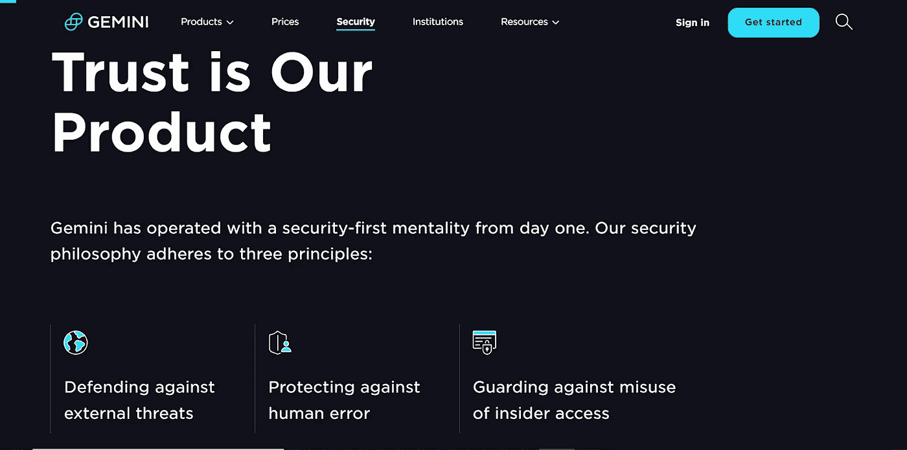****

## ****比特币基地安全****

****您可以将[比特币基地证券](https://help.coinbase.com/en/coinbase/privacy-and-security/data-privacy/how-can-i-make-my-account-more-secure)分为以下几个部分:****

*   ******线下冷库:**交易所将近 98%的资产都存放在线下冷库里。如果出现安全漏洞，交易所会为用户确保在线存储的资产。****
*   ******两步认证:**比特币基地在其所有平台上使用双因素认证。交换还从数据库中单独存储您的应用程序凭据。****
*   ****[**比特币基地 bug 赏金计划:**](https://www.coinbase.com/whitehat) 比特币基地通过 [Hackerone](https://hackerone.com/coinbase?type=team) 提供 Bug 赏金计划。向平台报告一个 bug，最高可以获得 5 万美元。****

****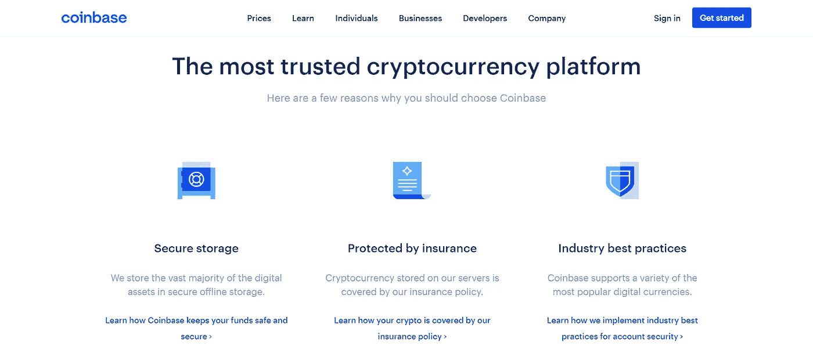****

# ****双子座 vs 比特币基地:客户支持****

****如果你遇到服务提供商的任何问题，你可以向他们的客户服务寻求更多的帮助。 [**双子座**](https://blog.coincodecap.com/go/gemini) 和 [**比特币基地**](https://blog.coincodecap.com/go/coinbase) 提供专属客户支持服务。让我们了解他们如何帮助你。****

## ****双子座支持****

****您可以通过任何窗口底部的“给我们发电子邮件”选项联系到 [Gemini 的客户支持](https://support.gemini.com/hc/en-us)团队。您也可以通过“向我们发送电子邮件”选项下方的帮助台选项提出请求。该平台还为您提供了大量常见问题。****

## ****比特币基地支持****

****在比特币基地，你可以通过每个窗口底部的[联系我们](https://help.coinbase.com/en/contact-us)按钮提出你的问题。在下一个窗口中，您可以选择您遇到问题的比特币基地产品，然后从下拉列表中选择所有适当的选项。最后，在底部的框中输入您的电子邮件和信息，然后点击提交按钮。****

****如果你认为你的账户被盗，你也可以打电话给比特币基地客户支持部门。您可以拨打以下号码锁定您的帐户:****

****+1 888 908–7930(美国/国际)****

****0808 168 4635(英国)****

****1800 200 355(爱尔兰)****

# ****双子座 vs 比特币基地:结论****

****美国政府对加密资产有严格的规定。然而， [**双子座**](https://blog.coincodecap.com/go/gemini) 和 [**比特币基地**](https://blog.coincodecap.com/go/coinbase) 都在美国提供他们的加密交易服务。当我们比较这两个平台时，很明显，一个平台不可能在每个方面都是最好的。一方面，Gemini 提供了更好的移动应用程序、安全性和更低的费用。另一方面，比特币基地提供了更好的用户界面、免费加密和更好的支持。****

****根据您的需求选择平台完全由您决定。然而，如果你是一个初学者，你可以选择[比特币基地](https://blog.coincodecap.com/go/coinbase)，因为它提供了更好的用户界面。如果你想深入交易，你可以选择双子座，因为他们的费用较低。****

****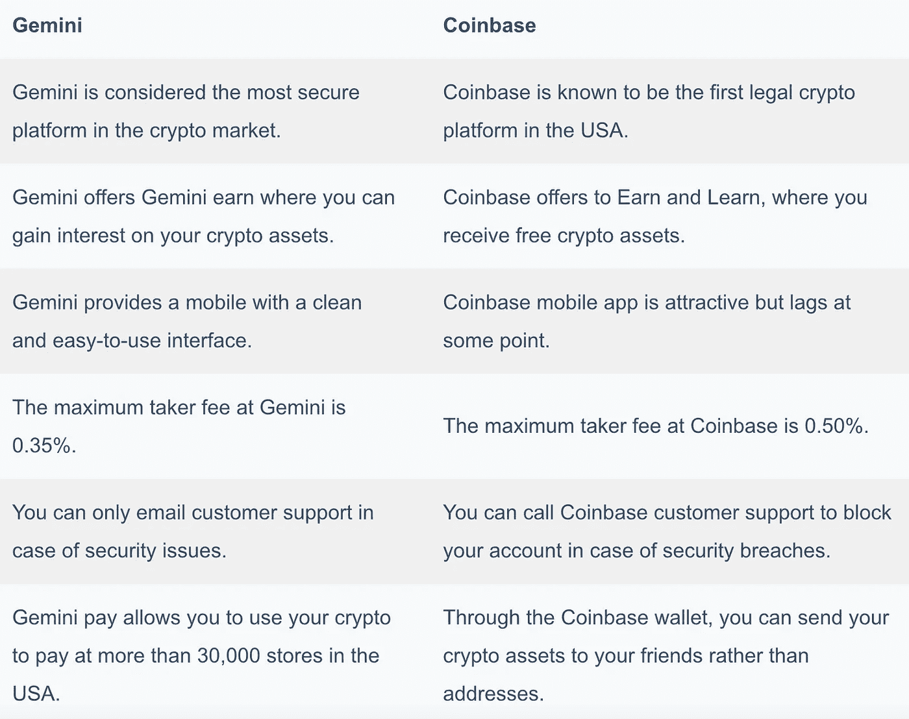****

# ****常见问题****

******双子座比比特币基地强吗？******

****当我们比较两个交易所时，双子座在某些方面更好，而在某些方面则不是。Gemini 在安全性、移动应用程序和低费用方面表现更好。相比之下，比特币基地有更好的用户界面和支持系统。****

******如何将比特币从比特币基地转移到** [**北海巨妖**](https://blog.coincodecap.com/go/kraken) **？******

****您可以登录您的比特币基地帐户，然后访问标题中的发送或接收部分。然后，您可以选择发送选项，并输入接收帐户的钱包地址。最后，只需点击发送按钮。****

****如何删除比特币基地账户？****

****您可以转到您的个人资料，然后继续前进到设置部分。现在，单击顶部的活动，然后滚动到底部。现在你可以看到一个关闭账户的选项。在删除之前，请确保您的比特币基地帐户中没有任何资金，否则您可能会失去您的资产。****

******双子座是买比特币的好地方吗？******

****Gemini 是一个可信的纽约加密交换平台。它在寻求投资加密货币的金融机构中尤其受欢迎。因此，我们可以说双子座是在美国合法购买比特币的绝佳地点。****

*   ****[最佳加密交易所| 2021 年十大加密货币交易所](https://blog.coincodecap.com/crypto-exchange)****
*   ****[7 大加密货币储蓄账户|赚取加密利息【2021】](https://blog.coincodecap.com/cryptocurrency-savings-accounts)****
*   ****[比特币基地 vs 北海巨妖|美国最好的密码交易所是哪家？](https://blog.coincodecap.com/kraken-vs-coinbase)****
*   ****[比特币基地钱包评论【你需要知道的一切】](https://blog.coincodecap.com/coinbase-wallet-review-the-best-bitcoin-wallet)****
*   ****[比特币基地 vs 罗宾汉|哪个最适合你？【2021】](https://blog.coincodecap.com/coinbase-vs-robinhood)****

> ****加入 Coinmonks [Telegram group](https://t.me/joinchat/PmKOYQ9NNKZlZGNl) 并了解加密交易和投资****

## ****另外，阅读****

*   ****[什么是融资融券交易](https://blog.coincodecap.com/margin-trading) | [成本平均法](https://blog.coincodecap.com/dca)****
*   ****最好的[加密交易机器人](/coinmonks/crypto-trading-bot-c2ffce8acb2a) | [网格交易机器人](https://blog.coincodecap.com/grid-trading)****
*   ****[3 商业评论](/coinmonks/3commas-review-an-excellent-crypto-trading-bot-2020-1313a58bec92) | [Pionex 评论](/coinmonks/pionex-review-exchange-with-crypto-trading-bot-1e459d0191ea) | [Coinrule 评论](/coinmonks/coinrule-review-2021-a-beginner-friendly-crypto-trading-bot-daf0504848ba)****
*   ****[AAX 交易所评论](/coinmonks/aax-exchange-review-2021-67c5ea09330c) | [德里比特评论](/coinmonks/deribit-review-options-fees-apis-and-testnet-2ca16c4bbdb2) | [FTX 交易所评论](/coinmonks/ftx-crypto-exchange-review-53664ac1198f)****
*   ****[n 零审核](/coinmonks/ngrave-zero-review-c465cf8307fc) | [Phemex 审核](/coinmonks/phemex-review-4cfba0b49e28) | [PrimeXBT 审核](/coinmonks/primexbt-review-88e0815be858)****
*   ****[Bybit Exchange 审查](/coinmonks/bybit-exchange-review-dbd570019b71) | [Bityard 审查](/coinmonks/bityard-review-7d104239be35) | [CoinSpot 审查](https://blog.coincodecap.com/coinspot-review)****
*   ****[3 commas vs Cryptohopper](/coinmonks/3commas-vs-pionex-vs-cryptohopper-best-crypto-bot-6a98d2baa203)|[赚取加密利息](/coinmonks/earn-crypto-interest-b10b810fdda3)****
*   ****最好的比特币[硬件钱包](/coinmonks/the-best-cryptocurrency-hardware-wallets-of-2020-e28b1c124069?source=friends_link&sk=324dd9ff8556ab578d71e7ad7658ad7c) | [BitBox02 回顾](/coinmonks/bitbox02-review-your-swiss-bitcoin-hardware-wallet-c36c88fff29)****
*   ****[莱杰 vs n rave](/coinmonks/ledger-vs-ngrave-zero-7e40f0c1d694)|[莱杰 nano s vs x](/coinmonks/ledger-nano-s-vs-x-battery-hardware-price-storage-59a6663fe3b0) | [币安评论](/coinmonks/binance-review-ee10d3bf3b6e)****
*   ****[密码本交易平台](/coinmonks/top-10-crypto-copy-trading-platforms-for-beginners-d0c37c7d698c) | [Coinmama 审核](/coinmonks/coinmama-review-ace5641bde6e)****
*   ****[CoinLoan 评论](/coinmonks/coinloan-review-18128b9badc4) | [YouHodler 评论](/coinmonks/youhodler-4-easy-ways-to-make-money-98969b9689f2) | [BlockFi 评论](/coinmonks/blockfi-review-53096053c097)****
*   ****最好的[加密税务软件](/coinmonks/best-crypto-tax-tool-for-my-money-72d4b430816b) | [硬币追踪评论](/coinmonks/cointracking-review-a-reliable-cryptocurrency-tax-software-5114e3eb5737)****
*   ****最佳[加密借贷平台](/coinmonks/top-5-crypto-lending-platforms-in-2020-that-you-need-to-know-a1b675cec3fa) | [杠杆令牌](/coinmonks/leveraged-token-3f5257808b22)****
*   ****[block fi vs Celsius](/coinmonks/blockfi-vs-celsius-vs-hodlnaut-8a1cc8c26630)|[Hodlnaut 审核](/coinmonks/hodlnaut-review-best-way-to-hodl-is-to-earn-interest-on-your-bitcoin-6658a8c19edf) | [KuCoin 审核](https://blog.coincodecap.com/kucoin-review)****
*   ****[Bitsgap 审查](/coinmonks/bitsgap-review-a-crypto-trading-bot-that-makes-easy-money-a5d88a336df2) | [Quadency 审查](/coinmonks/quadency-review-a-crypto-trading-automation-platform-3068eaa374e1) | [Bitbns 审查](/coinmonks/bitbns-review-38256a07e161)****
*   ****[埃利帕尔泰坦评论](/coinmonks/ellipal-titan-review-85e9071dd029) | [赛克斯斯通评论](/coinmonks/secux-stone-hardware-wallet-review-15-discount-coupon-2020-7577032faa6e)****
*   ****[本地比特币审核](/coinmonks/localbitcoins-review-6cc001c6ed56) | [加密货币储蓄账户](https://blog.coincodecap.com/cryptocurrency-savings-accounts)****
*   ****最佳[区块链分析](https://bitquery.io/blog/best-blockchain-analysis-tools-and-software)工具| [赚比特币](/coinmonks/earn-bitcoin-6e8bd3c592d9)****
*   ****[加密套利](/coinmonks/crypto-arbitrage-guide-how-to-make-money-as-a-beginner-62bfe5c868f6)指南| [如何做空比特币](/coinmonks/how-to-short-bitcoin-568a2d0b4ae5)****
*   ****最佳[加密制图工具](/coinmonks/what-are-the-best-charting-platforms-for-cryptocurrency-trading-85aade584d80) | [最佳加密交易所](/coinmonks/crypto-exchange-dd2f9d6f3769)****
*   ****[如何在印度购买比特币？](/coinmonks/buy-bitcoin-in-india-feb50ddfef94) | [瓦济克斯评论](/coinmonks/wazirx-review-5c811b074f5b)****
*   ****[印度比特币交易所](/coinmonks/bitcoin-exchange-in-india-7f1fe79715c9) | [比特币储蓄账户](/coinmonks/bitcoin-savings-account-e65b13f92451)****
*   ****[CoinDCX 评论](/coinmonks/coindcx-review-8444db3621a2) | [加密保证金交易交易所](https://blog.coincodecap.com/crypto-margin-trading-exchanges)****

*****原载于 2021 年 4 月 20 日 https://blog.coincodecap.com***。******