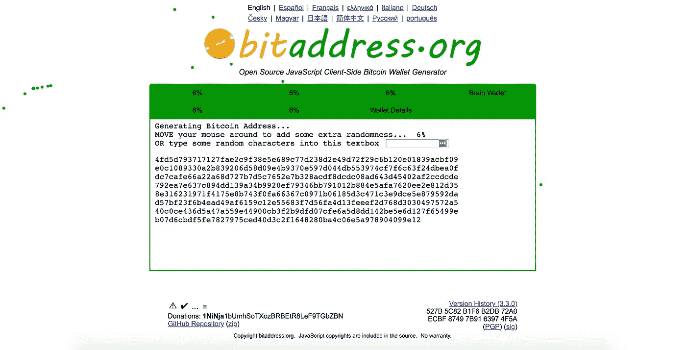
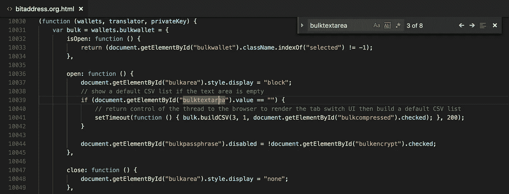
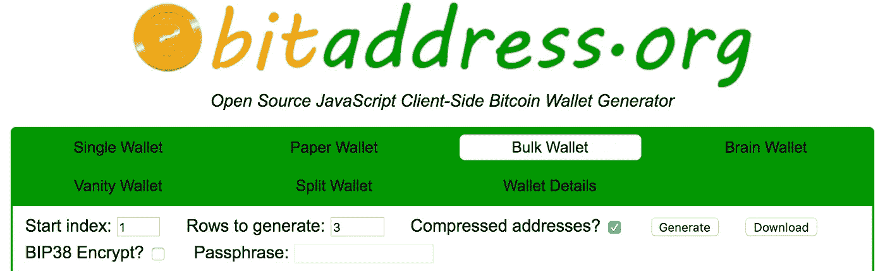

# 在一两分钟内生成并下载数千个比特币钱包

> 原文：<https://medium.com/coinmonks/generate-and-download-thousands-of-bitcoin-wallets-in-a-minute-or-two-d42ce73d77d8?source=collection_archive---------0----------------------->

## 一个微妙的脚本扭曲创造了 bitaddress.org 的“下载”功能


Image credit to [cryptorecorder.com](https://cryptorecorder.com/2018/04/12/cloakcoin-cloak-declines-further-after-the-launch-of-new-wallet/)

这篇研讨会文章将带你了解将[bitaddress.org](https://www.bitaddress.org)的代码扭曲为**黑入一个下载按钮**的过程，这简化了你批量生成[比特币钱包](https://blog.coincodecap.com/tag/bitcoin-wallet/)地址的生活。本文仅用于教育目的，并承认 bitaddress.org 是比特币开发者社区的一个很好的资源。

> 声明:作者在写这篇文章的同一天遇到了 bitaddress.org。不是广告 lol。:)

> 如果你想逃课，直接去知识库(这里是)；p

# 第一步:参观 bitaddress.org

去访问 bitaddress.org，你会看到类似的屏幕如下。



该网站允许您创建单个(或批量)钱包地址，并且还提供围绕[比特币钱包](https://blog.coincodecap.com/tag/bitcoin-wallet/)创建的各种功能。你现在可以在你的光标周围摆动来填充随机播种度(例如截图上的 6%)。

当**批量钱包**出现在绿色条上时，点击它。现在，您可以在**行中填入任意数字以生成**部分，作为要生成的钱包数量。点击**生成**按钮，明文 csv 以如下格式输出:

```
*(index, public address, private key)*
```

会出现在空白区域。然而，你没有办法直接下载 csv 输出。**打印**按钮可能没问题，但遗憾的是它无法打印索引大于 20 的地址。 **:(**

> 另请阅读:[最佳硬件钱包](/coinmonks/the-best-cryptocurrency-hardware-wallets-of-2020-e28b1c124069)

# 第二步:下载 bitaddress.org 代码

右击网站，选择**另存为**。现在您已经将代码脚本保存在了桌面上。应该包括两个文件:

*   bitaddress.org.html
*   bitaddress.org_files/ (folder)

# 第三步:开始黑！

用你最喜欢的编辑器打开 bitaddress.org.html 的文件。可爱的记事本也可以工作！

提示:我们正在“批量钱包”区域修改物品，所以我们应该开始寻找**批量**周围的物品。如果你在 bitaddress.org.html 搜索“ **bulktextarea** ”，你可以很容易地在 10030 行左右找到处理批量钱包的函数(如 wallets.bulkwallet)。



让我们在“**关闭**函数下面添加一个新函数，命名为“**下载**”。这个下载函数应该包含关于下载 csv 输出的代码。该功能的实现如下:

该功能有三个主要部分:

*   ***csvContent*** 在“ **bulktextarea** ”中捕获 csv 输出，并将它们附加到 csv 文件头。
*   ***link*** 创建一个< a >，可下载文件名为“ **BitcoinKeys.csv** ”，内容为 **encodedURI(csvContent)** ，并将其自身附加到 html 中。
*   ***链接*** 点击自身触发下载。

确保“**下载**功能正确放置在“**关闭**功能和“**构建 CSV** 功能之间。

# 第四步:挂上下载按钮

搜索“ **buildCSV** ”，看看在 html 的哪个部分调用了这个函数。你将在下一个<跨度>到达 6708 线:

```
<span><input type="button" id="bulkgenerate" value="Generate" onclick="ninja.wallets.bulkwallet.buildCSV(document.getElementById(&#39;bulklimit&#39;).value * 1, document.getElementById(&#39;bulkstartindex&#39;).value * 1, document.getElementById(&#39;bulkcompressed&#39;).checked, document.getElementById(&#39;bulkpassphrase&#39;).value);"> </span>
```

如果你向下滚动到第 6709 行，有**打印**按钮，看起来像这样:

```
<span class="print"><input type="button" name="print" id="bulkprint" value="Print" onclick="window.print();"></span>
```

现在轮到您添加一个新的“**下载**按钮，代码如下:

```
<span><input type="button" name="download" id="bulkdownload" value="Download" onclick="ninja.wallets.bulkwallet.download();"></span>
```

该功能与**打印**按钮几乎相同。略有不同的是名称、id、值、onclick 函数，指向我们新创建的“**下载**函数！

> 提示:如果你不喜欢**打印**按钮代码，你可以将其注释掉。:)

# 第五步:测试

现在保存一切，并刷新**bitaddress.org.html**文件。你会看到右上角的下载按钮闪亮！！❤



去生成 3 个钱包，然后点击“**下载**”按钮，看看魔法是如何发生的！

# 包裹

在这篇 super-swift 文章中，您已经了解了批量生成比特币地址的基础知识，以及以下内容:

*   侵入并创建一个定制的下载功能
*   用一个额外的下载按钮连接该功能

本教程的主要思想是向您展示“您可以随时升级任何您觉得不那么得心应手的工具！”试着做点改变，随时为社区做点贡献。

> [**结账最好的安卓 BTC 钱包**](https://blog.coincodecap.com/best-btc-wallets-for-android/)

**我希望你喜欢这个简短的教程。**请随时让我知道你想如何在 bitaddress.org 创造许多其他新功能！:)

> 懒人的代码仓库([此处](https://github.com/yhuag/bitaddress-downloadable))

> 加入 Coinmonks [电报频道](https://t.me/coincodecap)和 [Youtube 频道](https://www.youtube.com/c/coinmonks/videos)获取每日[加密新闻](http://coincodecap.com/)

## 另外，阅读

*   [密码电报信号](http://Top 4 Telegram Channels for Crypto Traders) | [密码交易机器人](/coinmonks/crypto-trading-bot-c2ffce8acb2a)
*   [复制交易](/coinmonks/top-10-crypto-copy-trading-platforms-for-beginners-d0c37c7d698c) | [加密税务软件](/coinmonks/crypto-tax-software-ed4b4810e338)
*   [网格交易](https://coincodecap.com/grid-trading) | [加密硬件钱包](/coinmonks/the-best-cryptocurrency-hardware-wallets-of-2020-e28b1c124069)
*   [最佳加密交易所](/coinmonks/crypto-exchange-dd2f9d6f3769) | [印度最佳加密交易所](/coinmonks/bitcoin-exchange-in-india-7f1fe79715c9)
*   [面向开发人员的最佳加密 API](/coinmonks/best-crypto-apis-for-developers-5efe3a597a9f)
*   最佳[密码借贷平台](/coinmonks/top-5-crypto-lending-platforms-in-2020-that-you-need-to-know-a1b675cec3fa)
*   [杠杆代币的终极指南](/coinmonks/leveraged-token-3f5257808b22)
*   [加密交易的最佳 VPN](https://coincodecap.com/best-vpns-for-crypto-trading)
*   [最佳加密分析或链上数据](https://coincodecap.com/blockchain-analytics) | [Bexplus 评论](https://coincodecap.com/bexplus-review)
*   [NFT 十大市场造币集锦](https://coincodecap.com/nft-marketplaces)
*   [AscendEx Staking](https://coincodecap.com/ascendex-staking)|[Bot Ocean Review](https://coincodecap.com/bot-ocean-review)|[最佳比特币钱包](https://coincodecap.com/bitcoin-wallets-india)
*   [Bitget 回顾](https://coincodecap.com/bitget-review)|[Gemini vs block fi](https://coincodecap.com/gemini-vs-blockfi)|[OKEx 期货交易](https://coincodecap.com/okex-futures-trading)