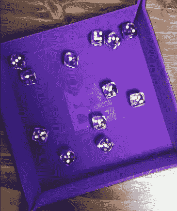
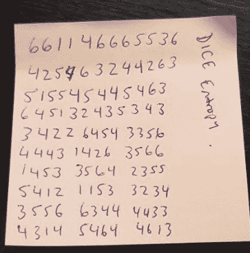
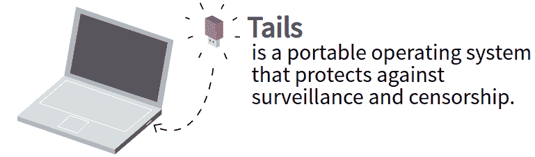
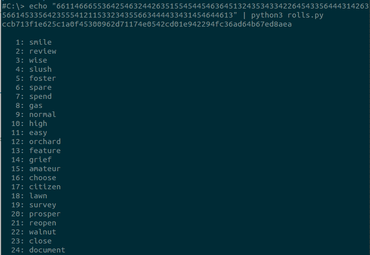
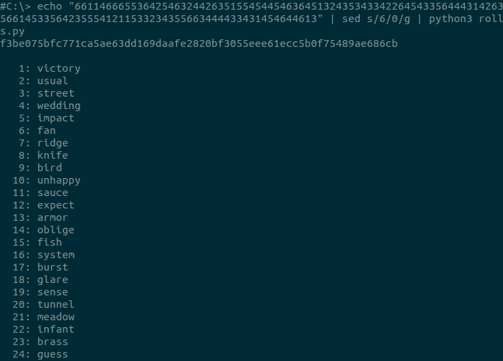
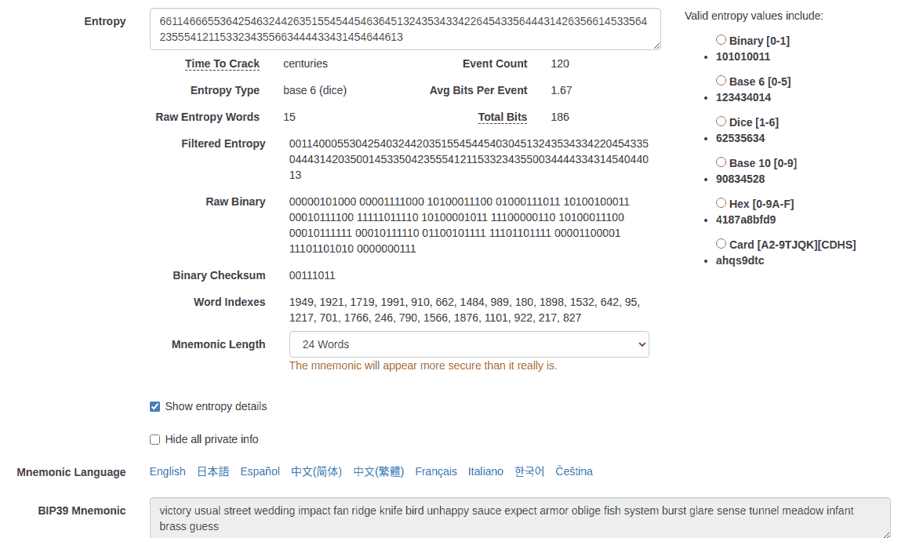
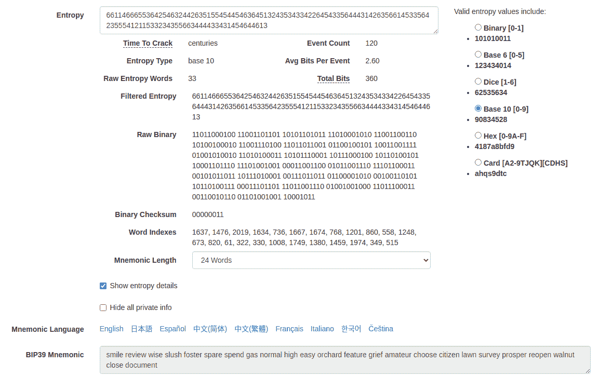

# 使用骰子生成设备种子

> 原文：<https://medium.com/coinmonks/generating-device-seeds-using-dice-894082d43aea?source=collection_archive---------2----------------------->

## 交叉引用 Coldcard，Cobo Vault 和 Rolls。用于种子生成的 Py

作者@ vicariousdrama

662650–662806

# 摘要

在过去，通常的做法是允许软件或硬件钱包根据其随机数生成器为您生成新的钱包。会产生一组种子词，你依次写下来。这些字与钱包类型和派生路径一起作为备份，可以在任何支持 BIP39 标准的钱包中恢复。但是，依靠软件或硬件钱包来产生随机性会带来一些风险，因为没有好的方法来确定它是否是真正随机的，或者是否会受到供应链攻击。另一种方法是使用您自己的随机来源，并从中生成种子词。本文介绍了如何使用骰子作为熵，从结果中导出种子词，以及如何使用免费提供的各种工具来得出相同的结果。

# 收集你的骰子用品

让我们从你需要什么开始

*   高质量的 6 面骰子(最好不止一个)
*   记录你的卷的纸和书写工具
*   可选的骰子托盘
*   可选的骰子塔

你需要赌场质量的骰子与严格的规格？我要说“不”。但是如果你真的想要，你可以从杰夫·贝索斯这里得到一套

我个人使用一套 16 毫米大小的[切塞克斯骰子，一包 12 个](https://www.amazon.com/Chessex-Dice-d6-Sets-Nebula/dp/B0011WKL3M)。我喜欢这些，因为它们是半透明的，在检查偏差时表现良好，12 是一个很好的数字，可以一次滚动许多，而不会被淹没。

你也可以从你可能有的任何棋盘游戏中收集各种各样的六面骰子。

如果你想掷骰子一次并有足够的熵，考虑一下 Coinkite 提供的 [100 包非常小的骰子](https://store.coinkite.com/store/dice-100)。如果你想要更大更半透明的东西，亚马逊网站上有一套。

除了骰子本身，我喜欢用骰子托盘来限制滚动(并抑制声音)。我最常用的托盘是金属骰子游戏的[这个。](https://www.amazon.com/Metallic-Dice-Games-Tray-Black/dp/B07MKLPSPN)

不用时可以收藏起来，很方便。你也可以考虑[做一个骰子托盘](https://www.youtube.com/watch?v=M4tywHNeK0A)。

骰子塔作为一种娱乐形式是可选的，但并没有真正增加随机性。但是如果你还没有，并且正在考虑，我会推荐一个有透明边的，这样你就可以验证被扔进去的骰子得到了很好的反弹，而不是简单的滑落。[这个有 5 个桨斜面，每一个都有天鹅绒衬里](https://www.amazon.com/C4Labs-Tall-Velvet-Lined-Tower/dp/B08L8BJWDQ)来帮助减弱声音

如果你想要一个更加模块化的系统，并且不介意或者实际上更喜欢噪音，可以考虑买几个[这样的](https://www.amazon.com/Broken-Token-Modular-Dice-Tumbler/dp/B07B8TF4C3)。

# 掷色子

掷骰子将会部分乏味，部分有趣，部分令人讨厌。虽然这需要一些时间，但很容易理解为什么这适用于随机性。

最重要的是，你的骰子和你的记录方法应该存在于没有数字附件的物理世界中。不要在手机或电脑上使用 Dice 应用程序。同样，不要用手机或电脑记录结果。坚持纸和笔，你可以事后燃烧的东西。

带上你的骰子，滚吧。记录结果。重复，直到你得到至少 100 个骰子滚动。如果你有打印机，你可以打印出这一页，并使用网格记录你的结果与骰子滚动在每个方块

如果你一次掷出多个骰子，那么你需要一个客观的方法来“排序”这些掷出的结果。绝对不要从最小到最大的数字排序。取而代之的是，使用您的空间表示，并使用直边将它们全部排成一行。然后从左往右读。

如果使用骰子塔，一次扔一个进去，并按出来的顺序记录。对于骰子托盘，您可以倾斜托盘，依靠重力在底部排列骰子。

在为本文做样本时，我没有网格，只是记录在便利贴上。这里有一个例子。

这里有 120 个数字而不是 100 个。那很好。越多越好，尽管 99 对于 256 比特的熵来说已经足够了。

不要用这个例子作为真实钱包的熵的来源。这只是在这里提供的，因此您可以使用下面的预期输出来测试它

为了复制粘贴方便测试，顺序是

661146665536425463244263515545445463645132435343342264543356444314263566145335642355541211533234355663444433431454644613

# 准备您的硬件钱包

现在你有你的骰子滚动，你可以用它们来创建你的钱包。在撰写本文时，Coldcard 和 Cobo Vault 等硬件钱包支持在导入钱包时输入骰子点数。下面概述了实现这一点的步骤，但是这种方法仍然信任这些钱包的固件中的代码来进行转换。

**如果使用新的 Coldcard** ，则在首次设置设备时执行此操作。

1.  执行正常的快速入门指南，以验证设备包装、通电、接受服务条款并建立您的 pin。[https://coldcardwallet.com/docs/quick](https://coldcardwallet.com/docs/quick)
2.  为您的设备下载最新发布的固件，并按照这里的说明进行升级【https://coldcardwallet.com/docs/upgrade。在编写其 2020–08–06t 1722-v 3 . 1 . 9-cold card . dfu 时，解压缩并验证 dfu 文件的 SHA-256 校验和，并存储在 MicroSD 卡上。
    AC 756 E8 f 90 D7 CDC 706 FB 24 a 1358585780 c 0105329 e 95d 0095d 91d 48579 caa5a 1
3.  从“高级”、“升级”菜单升级固件，然后按照说明进行操作。此过程结束时，设备将重新启动。
4.  在主菜单上，选择导入现有的并向下滚动菜单到骰子滚动。然后一边滚动一边输入数字。请小心，因为错误的条目没有退格键。
5.  完成后，按勾号按钮。
6.  一旦完成，24 个助记种子单词将呈现在你面前。记下这些，继续下一步，从为每个插槽提供的单词集中选择匹配的单词进行验证。
7.  你的钱包已经用你创建的熵初始化了。

YouTube 上有一个演示输入过程的视频

**在新的 Cobo Vault** 上，您需要执行这些步骤来浏览固件版本以获得最新版本。这有点复杂，因为您需要更新固件三次才能获得最新版本。下载页面在这里[https://cobo.com/hardware-wallet/downloads](https://cobo.com/hardware-wallet/downloads)

1.  **从网站**下载 1.0.5 固件，解压缩，验证 update.zip 的 SHA-256 校验和，并将 update.zip 存储在 MicroSD 卡上。将它插入 Cobo 保险库设备并通电。
    71e 5b 1 e 04 EC 88d 89 c 90 c 300 B4 c 14 abbc 71 E0 cc 55 EC 737 e 1565 a 7279 def 1b 8393
2.  出现提示时，将固件升级到 1.0.5
3.  重启并初始化设备，创建钱包。这将是一个临时钱包，但您必须在继续之前完全设置。为方便起见，您可以导入一个现有的 12 字种子(放弃放弃放弃放弃放弃放弃放弃放弃放弃大约)
4.  关闭电源，取出电池组和 MicroSD 卡
5.  **从网站**下载 1.2.1 仅限 BTC 的固件，解压缩，验证 update.zip 的 SHA-256 校验和，并将 update.zip 存储在 MicroSD 卡上。插入 Cobo 保险库并通电。
    AFB 82 Abe 013373 c 262 CBD 518 EBD 9 bbcf 7156 b 713270 b 776 a 4c 3d 3a 15d 69 bb0f 0
6.  使用您的正常登录密码，并在出现提示时升级固件。
7.  重启后，再次关机，取出电池组和 MicroSD 卡。
8.  **从网站**下载 2.3.1 仅限 BTC 的固件，解压缩，验证 update.zip 的 SHA-256 校验和，并将 update.zip 存储在 MicroSD 卡上。插入 Cobo 保险库并通电。
    1210 f73d 012226 f 69579339 cfec 7911 e 7 eafb 8395 e 252 e 8 f 4 ed 5 e 16 b 91531210
9.  使用您的正常登录密码，并在出现提示时升级固件。
10.  从菜单中选择“设置”，然后选择“创建/导入保管库”，并提供您的密码
11.  单击“我已经阅读并同意服务条款”单选按钮，然后单击“创建保管库”
12.  在生成恢复短语的说明屏幕上，点击 cobo-tablet 的图像三次。这将进入隐藏骰子滚动过程
13.  单击“开始”按钮，并按掷骰子的相同顺序点击与掷骰子结果相对应的数字。完成后，按完成。
14.  这 24 个助记种子单词将会呈现给你。记下这些，继续并通过重新输入来验证下一步。
15.  你的钱包已经用你创建的熵初始化了。

如果你同时拥有 Coldcard 和 Cobo Vault 来尝试上述方法，你很快就会意识到它们会产生一组不同的种子词。让我们来看看这是为什么。

# 验证助记符生成

你需要什么

*   没有连接到互联网的笔记本电脑。最好是能关闭 wifi、蓝牙、移除硬盘和电池的老款手机。
*   最新的 Tails 操作系统可启动 u 盘
*   存储 rolls.py 脚本的另一个 u 盘

如果你还没有最新版本的 Tails 可引导 u 盘，现在就开始创建吧。虽然设置超出了本文的范围，但是您应该从这里[https://tails.boum.org/](https://tails.boum.org/)开始，准备一个至少 8GB 的 u 盘来写入镜像。

Coldcard 为验证掷骰子和这里生成的助记符提供了有用的指导。

[https://coldcardwallet.com/docs/verifying-dice-roll-math](https://coldcardwallet.com/docs/verifying-dice-roll-math)。

你需要一份最新的 rolls.py 脚本，可从这里获得[https://github . com/cold card/firmware/blob/master/docs/rolls . py](https://github.com/Coldcard/firmware/blob/master/docs/rolls.py)

将该文件复制到您的第二个 u 盘

使用 Tails OS 盘启动断开连接的笔记本电脑。

打开终端窗口

用 rolls.py 插入你的 u 盘

导航到包含该脚本的目录。一般来说，这应该是/media/健忘症下的子文件夹

现在运行您的掷骰子作为输入如下

## echo“66146665364254632426351545454545463454343434343434434354354354354543543543543543544544444343434343543434344444444444444446446464613”| python 3 .

输出如下。

如果使用与输入到 Coldcard 中相同的掷骰子来输入钱包，则这与种子单词相匹配。

这是否意味着科博金库是错的？不。Cobo Vault 遵循 Ian Coleman BIP39 助记法，采用掷骰子并转换为基数 6。我们可以使用 rolls.py 脚本通过使用 sed 替换值来完成同样的工作，如下所示

## echo " 661466655364254632426351545454546364426353643434343443435353545454354543545435435643543564454544444444343434343544454444444646464613。

现在，将每个 6 更改为 0 后的结果如下

这与 Cobo 跳马通过掷骰子产生的结果相符。

你可以使用伊恩科尔曼 BIP39 工具与上面的样品卷进行交叉检查，该工具可从这里[https://iancoleman.io/bip39/](https://iancoleman.io/bip39/)获得。在页面上，选中显示熵详细信息复选框，然后粘贴我们示例中的序列

661146665536425463244263515545445463645132435343342264543356444314263566145335642355541211533234355663444433431454644613

请注意，熵类型会自动检测并选择基数为 6(骰子)。

对于助记符长度，选择 24 个单词。显示的单词将反映 Cobo Vault 的单词。过滤熵显示每 6 个变化为 0。

在右边，选择基数 10。现在，单词将更改为与 Coldcard 相同的集合，过滤后的熵显示与我们提供的熵相同的值。

我亲自验证过，并且对使用 rolls.py 实现的简单性和优雅性非常满意。单个下载文件中的单词列表与 bip39 英文单词列表匹配，此处[https://github . com/bitcoin/bips/blob/master/bip-0039/English . txt](https://github.com/bitcoin/bips/blob/master/bip-0039/english.txt)。

我强烈建议使用 rolls.py 脚本从 dice 生成种子词。最简单的方法是安全地离线使用尾巴。

值得注意的是，无论您掷骰子并转换为基数 6 还是基数 10 都无关紧要，因为这两种方法产生的熵都足以生成种子。

*   使用您自己的骰子滚动和使用脚本生成您的种子词。
*   然后记录那些种子词。
*   接下来，在你选择的硬件钱包中，导入你的种子词。

# 备份您的种子单词

把种子的话，并把它们永久地记录在金属上，以获得对火和洪水的耐久性和弹性。就个人而言，我喜欢的金属板可从

*   硬币播种板:【http://bitcoinseedbackup.com/ 
*   细木工板:[https://www.blockplate.com/collections/frontpage](https://www.blockplate.com/collections/frontpage)
*   科宝平板打孔机:[https://shop.cobo.com/products/cobo-tablet-punch](https://shop.cobo.com/products/cobo-tablet-punch)

有很多好的选择来备份到不同价位的各种形式的金属。我强烈建议你在这里通读 Jameson Lopp 的测试[https://blog . Lopp . net/metal-bit coin-seed-storage-stress-test-iv/](https://blog.lopp.net/metal-bitcoin-seed-storage-stress-test-iv/)

# 销毁证据

收集所有你写下掷骰子和种子单词时用过的纸片。

如果你有一个烧木头的炉子，请随意把它扔进火里。室外火坑也很有用。确保所有的纸都烧掉。如果两者都没有，就在远离建筑物和其他易燃物的地方燃烧。水泥天井适合少量使用。一旦燃烧，将灰烬浸在水中并涂抹。晾干，扫去灰烬，然后处理掉。

总的来说，请按照您当地的法律法规进行焚烧。

## 另外，阅读

*   [了解以太坊和网络 3](https://blog.coincodecap.com/go/learn)
*   [密码交易机器人](/coinmonks/crypto-trading-bot-c2ffce8acb2a)
*   [3 商业评论](/coinmonks/3commas-review-an-excellent-crypto-trading-bot-2020-1313a58bec92)
*   [AAX 交易所评论](/coinmonks/aax-exchange-review-2021-67c5ea09330c) |推荐代码、交易费用、利弊
*   [Deribit 审查](/coinmonks/deribit-review-options-fees-apis-and-testnet-2ca16c4bbdb2) |选项、费用、API 和 Testnet
*   [FTX 密码交易所评论](/coinmonks/ftx-crypto-exchange-review-53664ac1198f)
*   [n 零审核](/coinmonks/ngrave-zero-review-c465cf8307fc)
*   [Bybit 交换审查](/coinmonks/bybit-exchange-review-dbd570019b71)
*   3Commas vs Cryptohopper
*   最好的比特币[硬件钱包](/coinmonks/the-best-cryptocurrency-hardware-wallets-of-2020-e28b1c124069?source=friends_link&sk=324dd9ff8556ab578d71e7ad7658ad7c)
*   [密码本交易平台](/coinmonks/top-10-crypto-copy-trading-platforms-for-beginners-d0c37c7d698c)
*   最佳 [monero 钱包](https://blog.coincodecap.com/best-monero-wallets)
*   [莱杰纳米 s vs x](https://blog.coincodecap.com/ledger-nano-s-vs-x)
*   [bits gap vs 3 commas vs quad ency](https://blog.coincodecap.com/bitsgap-3commas-quadency)
*   最好的[加密税务软件](/coinmonks/best-crypto-tax-tool-for-my-money-72d4b430816b)
*   [最佳加密交易平台](/coinmonks/the-best-crypto-trading-platforms-in-2020-the-definitive-guide-updated-c72f8b874555)
*   最佳[密码借贷平台](/coinmonks/top-5-crypto-lending-platforms-in-2020-that-you-need-to-know-a1b675cec3fa)
*   [莱杰 Nano S vs 特雷佐 one vs 特雷佐 T vs 莱杰 Nano X](https://blog.coincodecap.com/ledger-nano-s-vs-trezor-one-ledger-nano-x-trezor-t)
*   [block fi vs Celsius](/coinmonks/blockfi-vs-celsius-vs-hodlnaut-8a1cc8c26630)vs Hodlnaut
*   [bits gap review](/coinmonks/bitsgap-review-a-crypto-trading-bot-that-makes-easy-money-a5d88a336df2)——一个轻松赚钱的加密交易机器人
*   为专业人士设计的加密交易机器人
*   [PrimeXBT 审查](/coinmonks/primexbt-review-88e0815be858) |杠杆交易、费用和交易
*   [其他准备评审](https://blog.coincodecap.com/altrady-reivew)
*   [埃利帕尔泰坦评论](/coinmonks/ellipal-titan-review-85e9071dd029)
*   [赛克斯石评论](https://blog.coincodecap.com/secux-stone-hardware-wallet-review)
*   [BlockFi 评论](/coinmonks/blockfi-review-53096053c097) |从您的密码中赚取高达 8.6%的利息
*   [Coinrule 评论](https://blog.coincodecap.com/coinrule-review-a-perfect-trading-bot)
*   [最佳区块链分析工具](https://bitquery.io/blog/best-blockchain-analysis-tools-and-software)
*   [加密套利](/coinmonks/crypto-arbitrage-guide-how-to-make-money-as-a-beginner-62bfe5c868f6)指南:新手如何赚钱
*   最佳[加密制图工具](/coinmonks/what-are-the-best-charting-platforms-for-cryptocurrency-trading-85aade584d80)
*   了解比特币最好的[书籍有哪些？](/coinmonks/what-are-the-best-books-to-learn-bitcoin-409aeb9aff4b)

> [直接在您的收件箱中获得最佳软件交易](/coinmonks/newsletters/coinmonks)

