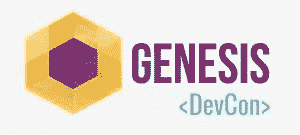

# 创世纪开发者大会

> 原文：<https://medium.com/coinmonks/genesis-devcon-4dd73b57c7a6?source=collection_archive---------1----------------------->

## 班加罗尔区块链大会

嘿伙计们，

这个周末我会参加[创世纪开发者大会](https://theibc.events/)。希望我能见到你们中的一些人。

印度最大的区块链开发者大会 Genesis DevCon 将于 2019 年 11 月 24 日至 25 日在班加罗尔 IISc NSSC 举行，以纪念 Genesis 开发者计划的
结束篇章。由 IBC 媒体主办——新兴技术公司的成长和咨询公司。

> [预订您的座位](https://theibc.events/)

Genesis DevCon 旨在为初露头角的区块链开发者创造一个学习环境，将来自工业界、
社区和学术界的最优秀的演讲者聚集在一起。该活动还将启动 Aeternity 全球星际舰队计划，这是一个区块链企业加速器计划，并宣布 Genesis 开发者计划的获胜者。

发现印度缺乏丰富的区块链开发者资源，Genesis Developers program 在过去的 8 个月里一直在积极工作，以在印度创建一个充满活力的区块链开发者社区。作为项目的总结，Genesis DevCon 将邀请区块链领域的一些最大的领导者，包括

*   雅尼斯拉夫·马拉霍夫
*   陈爱龙·克里希纳瓦米，信实国际组织
*   Loi Luu，KyberNetwork
*   马尼什·巴蒂亚，亚马逊印度
*   约翰·德瓦多斯，尼奥
*   微软 Satya Lokam

为期两天的会议旨在将领导者、创新者和开发者聚集在一个屋檐下，分享他们的专业知识和创新，创造一个协作环境，并建立一个强大的社区。它还为与会者提供了一个机会，通过多次互动会议、小组讨论和 B2B 参与机会，获得专业知识，学习和了解
创意和战略的工具、新挑战和解决方案

预计将有超过 5 场小组讨论、30 多位演讲人和与会者参加，此次活动将见证开发人员、研究人员、行业领袖和创业创新者之间的积极互动。

欲了解更多信息，请访问 [Genesis DevCon 网站](https://theibc.events/)。

> [直接在您的收件箱中获得最佳软件交易](https://coincodecap.com/?utm_source=coinmonks)

